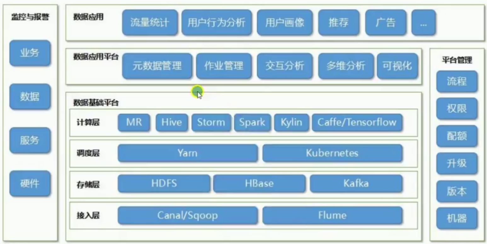

# wukong-bd

大数据相关，在学习与使用之前，建议先去官网看一边文档，然后再去看国内的文章或者视频教程。

> 目录

* 基础
  * [虚拟机安装](doc/virtualbox.md)
  * [Linxu基本操作](doc/linux.md)
  * [Linxu常用命令](doc/linux-mini.md)
  * [java安装](doc/java.md)
* 接入层
  * [Sqoop](doc/sqoop.md)
  * [flume](doc/flume.md)
* 存储层
  * Hadoop
    * [Hadoop简介](doc/hadoop-overview.md)
    * [Hadoop使用](doc/hadoop.md)
    * [Hadoop完全分布层安装](doc/hadoop-ha.md)
  * [Hbase](doc/hbase.md)
* 计算层
  * [Spark](doc/spark.md)
  * MapReduce
    * [MapReduce文档](doc/hadoop.md#编写MapReduce)
    * [MapReduce例子代码](examples/mapreduce/)
  * [Hive](doc/hive.md)
  * [phoenix](doc/hbase-phoenix.md)
* 辅助工具
  * 明星产品
    * [zookeeper](doc/zookeeper.md)
    * [kafka](doc/kafka.md)
  * 其他产品
    * [oozie](doc/oozie.md)
    * [hue](doc/hue.md)
    * [zeppelin](doc/zeppelin.md)
* 开发语言
  * [scala](doc/scala.md)

**MapReduce可以被Spark Core替换？**

是的，它会随着时间的推移被替代，而且这种替代是合理的。

**Hive可以被Spark SQL替换？**

是的，这又是对的。

**Storm可以被Spark Streaming替换？** 

是的，可以替换。只不过平心而论storm并不是Hadoop生态系统中的一员，因为它是完全独立的工具。他们的计算模型并不太形同，所以我不认为storm会消失，反而仍会作为一个商业产品。

**Mahout可以被MLib替换？**

公平的讲，Machout已经失去了市场，而且从过去的几年来看它正在快速失去市场。对于这个工具，我们可以说这里是Spark真正可以替换Hadoop生态系统中的地方。 因此，总的来说，这篇文章的结论是：

**不要被大数据供应商的包装所愚弄。**

他们大量推进的是市场而不是最终的真理。Hadoop最开始是被设计为可扩展的框架，而且其中很多部分是可替换的：可以将HDFS替换为Tachyon，可以将YARN替换为Mesos，可以将MapReduce替换为Tez并且在Tez之上可以运行Hive。这将会是Hadoop技术栈的可选方案或者完全替代方案？倘若我们放弃的MR（MapReduce）而使用Tez,那么它还会是Hadoop吗？
