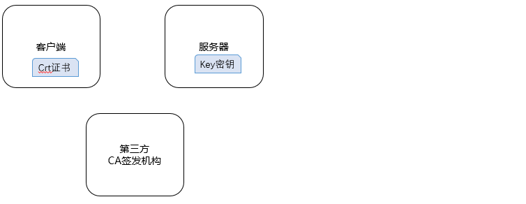

# 证书管理


# 1.  基本概念

x509证书一般会用到三类文件

| 文件 | 用途                                                         |
| ---- | ------------------------------------------------------------ |
| key  | Key是私用密钥（这个要保密），通常是rsa算法。用来给其他文件签署凭证 |
| csr  | Csr是证书请求文件，用于申请证书。在制作csr文件的时，必须使用自己的私钥来签署申。 |
| crt  | Crt是CA认证后的证书文，签署人用自己的key给你签署的凭证。     |


# 2. 应用场景

参考文档：[CA证书（数字证书的原理）](https://www.cnblogs.co：m/JeffreySun/archive/2010/06/24/1627247.html)




如图在整个证书验证过程中，有三个角色。下面分别介绍一下他们的来龙去脉。

**安全隐患解决第一步**：

* 客户端--->服务器时，服务器怎么知道这个客户端不是黑客模拟的？
* 服务器--->客服端，客户端怎么知道不是黑客模拟的？


解决方法：服务器有一个私钥，给客户端一个证书。 服务器可以用私钥来加密信息传给客户端，客户端用公钥来解密，得到正确的数据。然后用公钥给服务器发送信息。


```
“客户”->“服务器”：你好

“服务器”->“客户”：你好，我是服务器

“客户”->“服务器”：向我证明你就是服务器

“服务器”->“客户”：你好，我是服务器 {你好，我是服务器}[私钥|RSA]

“客户”->“服务器”：{我们后面的通信过程，用对称加密来进行，这里是对称加密算法和密钥}[公钥|RSA] 

“服务器”->“客户”：{OK，收到！}[密钥|对称加密算法]

“客户”->“服务器”：{我的帐号是aaa，密码是123，把我的余额的信息发给我看看}[密钥|对称加密算法]

“服务器”->“客户”：{你的余额是100元}[密钥|对称加密算法]
```


**安全隐患第二步：**

在服务器发送公钥给客户端时，被黑客拦截下来，自己做了一个公钥怎么处理呢？

这需要第三方证书发放机构，这个机构可以发送证书，然后由系统去认证。


# 3. 基本流程


首先有两个基本的证书文件，用来签发其他证书：

* ca.key：密钥

* ca.crt：证书 

  

其次为具体用户生成密钥与证书

*  做一个私钥 user001.key
* 做一个证书请求 user001.crs
* 然后用ca来签证：user001.crt


# 4. 应用案例

可以通过具体应用案例来理解证书的使用

* 阿里云申请证书与使用
* 自己做一个Https证书
  * 例如K8s-Dashboard的例子。

* K8s手工安装中，各个证书的制作过程
* K8s增加新用户时，证书的追加。