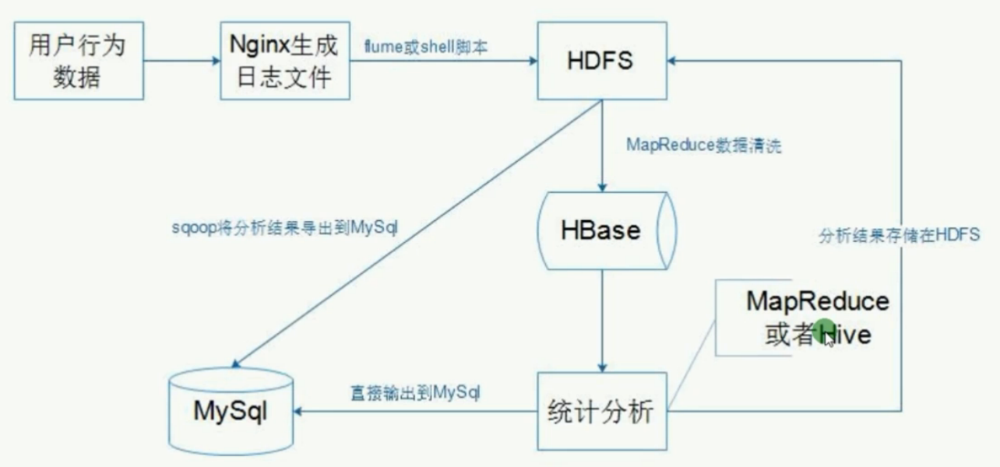
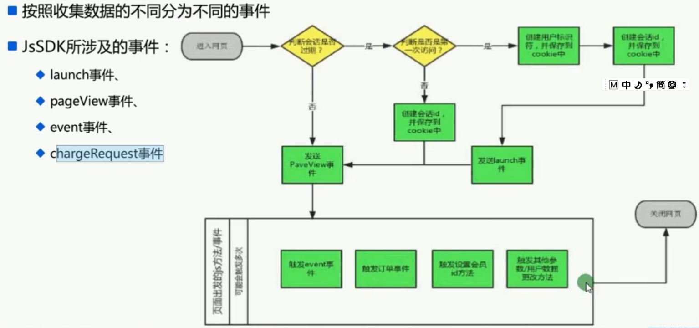
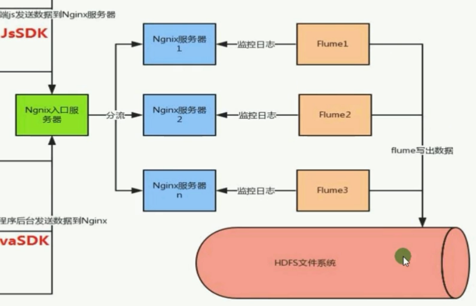
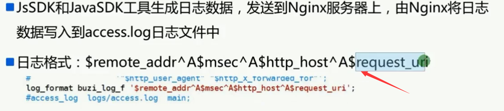

# 驴妈妈案例分析

## 项目背景

### 功能需求

* 用户数据基本分析
  * 访客分析（当用户第一次访问，生成一个UUID，放入cookie）
    * 时间维度：每天、每小时
    * 用户类别：
      * 活跃用户分布
      * 新用户
      * 老用户
    * 会话维度：
      * 会话个数
      * 会话时间长度
* 浏览器分析
* 地域分析
* 外链分析
* 用户浏览深度分析
* 事件分析
* 订单分析

### 数据来源

* 系统日志
  * 例如Nginx日志，服务器日志
* 业务日志
  * 根据业务需求，专门收集用户行为

淘宝IP地址库：http://ip.taobao.com/

### 数据分析维度

数据只有在相应的维度下才有意义

* 时间维度
* 平台来源维度
* 浏览器维度
* 地域维度

### 选用技术框架

* JavaScript：将日志发送到后台一个接口中
* Java后台	
* Nginx
* Flume
* Sqoop
* HDFS：存储原始的日志
* MapReduce
* Hive：统计分析
* HBase
* Mysql
* EChart

### 技术分层

* 日志生成与收集
  * 日志生成工具可插拔，不影响业务js 
* 数据分析层
  * Spark
* 数据展示层

其中有些部分，可以使用spark来替换

#### JS 开发工具

#### 配置Nginx服务器

[Nginx服务器集群搭建](https://www.cnblogs.com/wzq806341010/p/3571513.html)，Nginx需要编译

[NGINX 负载均衡](https://www.jianshu.com/p/923fdfbdd913)

可以重新配置nginx的log日志形式

#### ETL设计

* LoggerUtil 工具类
* 浏览器信息解析，User-AGENT提取浏览器名称以及版本
* IP地址解析。使用纯真IP数据库或者淘宝IP库
* 

