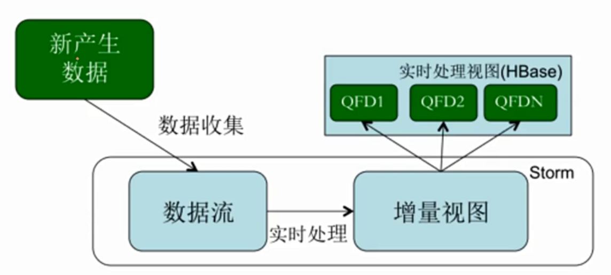
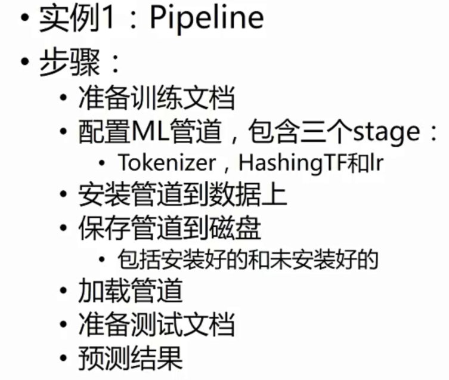

主要解决的问题：

* 用户行为分析
  * pv uv
* 大并发存储
* 人工智能
  * 智能推荐


# 驴妈妈案例分析


项目背景


## 功能需求

* 用户数据基本分析
  * 访客分析（当用户第一次访问，生成一个UUID，放入cookie）
    * 时间维度：每天、每小时
    * 用户类别：
      * 活跃用户分布
      * 新用户
      * 老用户
    * 会话维度：
      * 会话个数
      * 会话时间长度
* 浏览器分析
* 地域分析
* 外链分析
* 用户浏览深度分析
* 事件分析
* 订单分析


## 数据来源

* 系统日志
  * 例如Nginx日志，服务器日志
* 业务日志
  * 根据业务需求，专门收集用户行为


淘宝IP地址库：http://ip.taobao.com/


## 数据分析维度

数据只有在相应的维度下才有意义

* 时间维度
* 平台来源维度
* 浏览器维度
* 地域维度


## 选用技术框架

* JavaScript：将日志发送到后台一个接口中
* Java后台	
* Nginx
* Flume
* Sqoop
* HDFS：存储原始的日志
* MapReduce
* Hive：统计分析
* HBase
* Mysql
* EChart


## 技术分层

* 日志生成与收集
  * 日志生成工具可插拔，不影响业务js 
* 数据分析层
  * Spark
* 数据展示层


其中有些部分，可以使用spark来替换


### JS 开发工具


### 配置Nginx服务器


[Nginx服务器集群搭建](https://www.cnblogs.com/wzq806341010/p/3571513.html)，Nginx需要编译

[NGINX 负载均衡](https://www.jianshu.com/p/923fdfbdd913)


可以重新配置nginx的log日志形式


### ETL设计

* LoggerUtil 工具类
* 浏览器信息解析，User-AGENT提取浏览器名称以及版本
* IP地址解析。使用纯真IP数据库或者淘宝IP库
* 


# 法律咨询网站推荐项目

根据用户点击网页信息，为用户推荐相关的服务


# 广东医疗保险系统

主要解决了数据存储的问题，原先需要每年进行分库，现在不用了。


# 智能推荐系统


## 认识推荐系统


> 什么是推荐系统

如果用户有明确需求，那么可以使用搜索引擎。

如果用户没有明确需求，那么分析用户的历史行为，给出用户感兴趣的建模。


>  推荐系统的应用

排行榜


## 推荐系统设计

* 需求分析
* 功能设计
* 界面设计
* 架构设计
* 算法设计
* 系统评测


###  需求分析

* 用户角度
  * 新用户
  * 老用户
  * 主流用户
  * 小众用户
* 推荐什么
  * 价格一致，用户经常购买
  * 价格不一致，用户经常购买
  * 用户很少购买
  * 促销，清库。 要推荐相关的新品搭配促销
* 何时推荐
* 何地推荐


### 功能设计

* 个性化首页
* Item页面
  * 关联商品
  * 基于浏览历史推荐
  * 基于购买历史推荐
* user页面
* 购物车页面
* email推荐
* 优惠券推荐


### 界面设计

如何将推荐结果显示给用户

如果收集用户信息及反馈

目的：

​	提高用户满意度，达到推荐目的

​	更好的收集用户反馈

​	准备评估推荐算法评测


### 架构设计

* 硬件规划

* 用户数，商品数的评估，并发度，响应速度评估

  

### 算法设计

* 优化准则

* 数据预测处理

* 离线算法

* 在线算法

* 功能实现策略

* 推荐解释

  

### 如何评测算法

* 用户反馈
  * 点击率 转换率 单次使用时长
* A/B 测试


## 大数据Lambada架构


> 总共分为三层

* Batch Layer


```
大数据存储层，批处理查询，查询时间比较长几分钟或几小时

批处理会用到flume，用来收集数据。 sqoop使用进行数据库的转换
```


* Speed Layer 



```
流式处理，持续计算。 有些算法很难实时计算，可采用估算值即可。

```


* Serving Layer


```
服务层需要在很短的时间内返回相关的数据。
```


### 架构例子


## 模块分析


### 用户画像系统

如何通过系统将人描述出来，使计算机能读懂这个人。

对现实中的用户进行**数学建模**.


#### 给用户打上标签


#### 用户标签要解决的问题

* 记录与存储用户标签
* 支持不断增加的维度与偏好
* 毫秒级的更新
* 支撑个人化推荐、广告投放、精细化营销等产品


#### 用户画像处理流程


 


[ROC曲线TPR和FPR](https://www.jianshu.com/p/135e412d43fa)


## 用户标记方法


### 基本概念

* DataFrame
* TransFormers
* Estimators
  * 在DF上生成一个转换器算法


### 实例1


> 步骤

* 准备带标签和特征值的数据
* 创建逻辑回归的评估器
* 设用setter方法


> spark-shell使用技巧

```
1:设置不输出太多文件
2:只连接本地  spark-shell --master local[2]
```


```scala
import org.apache.spark.ml.classification.LogisticRegression
import org.apache.spark.ml.param.ParamMap
import org.apache.spark.mllib.linalg.{Vector,Vectors}
import org.apache.spark.sql.Row

//准备带标签和特征值的数据
val training = sqlContext.createDataFrame(Seq(
 (1.0, Vectors.dense(0.0,1.1,0.1)),
 (0.0, Vectors.dense(2.0,1.0,-1.0)),
 (0.0, Vectors.dense(2.0,1.3,1.0)),
 (1.0, Vectors.dense(0.0,1.2,-0.5))
)).toDF("label","features")


//创建逻辑回归的评估器，也可以通过ParamMap来设置，见下面代码
val lr = new LogisticRegression()
println(lr.explainParams())

//设置最大迭代器以及
lr.setMaxIter(10).setRegParam(0.01)

//创建一个模型
val model1 = lr.fit(training)
model1.parent.extractParamMap

//通过另外一种方式来设置参数 maxIter最大迭代次数   regParam  threshold
val paramMap = ParamMap(lr.maxIter -> 20).
put(lr.maxIter,30).
put(lr.regParam -> 0.1, lr.threshold -> 0.55)

//可以组合两个参数
val paramMap2 = ParamMap(lr.probabilityCol -> "myProbability")
val paramMapCombined = paramMap ++ paramMap2

//可以设置两外一个模型
val model2 = lr.fit(training, paramMapCombined)
model2.parent.extractParamMap

//准备测试数据 
val test = sqlContext.createDataFrame(Seq(
 (1.0, Vectors.dense(-1.0,1.5,1.3)),
 (0.0, Vectors.dense(3.0,2.0,-0.1)),
 (1.0, Vectors.dense(0.0,2.2,-1.5))
)).toDF("label","features")

// 
model1.transform(test).select("label","features","probability","prediction").collect().foreach{case Row(label: Double, features: Vector, probability: Vector, prediction: Double) => println(s"($features, $label) -> probability=$probability, prediction=$prediction")}


```


### 实例2




### 实例3

实例二中指定了一些参数，例如`hashingTF.numFeatures`与`lr.regParam`，我也不知道那个比较好。所以我让系统自动挑选一个好用的。


基于管道的调优，让整个管道跑不同的参数组合，来得到最优的。


### 实例4

实例3是按照交叉验证的方式。

实例4是在数据量非常大的情况下来做的。同样用线性回归来预测。 

让数据中的，90%用来训练，10%用来校验。


## 实际案例


## 推荐算法


* 基于内容过滤
  * 基于某个用户的搜索浏览记录，来进行推荐
* 协同过滤
  * 基于其他用户行为推荐给这个用户

