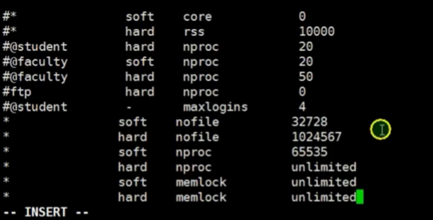
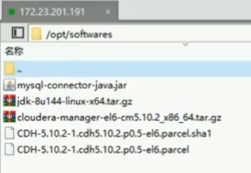
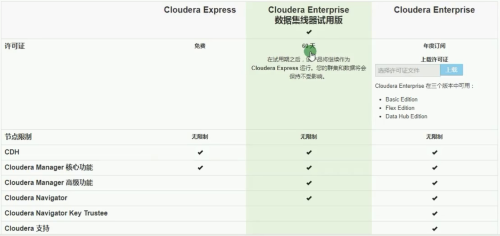

# CDH

[CDH-5.10.2集群的搭建【史上最全，不全不要钱】（已经实现，但是非预期效果，可能是由于内存不足）](https://blog.csdn.net/jenrey/article/details/80802052)


## 1. 安装

可以有多种安装方式，可以yum方式，也可以是jar包方式，这里选择了jar包方式。

假设有5台机器。n


### 1.1. 下载

官方地址：https://archive.cloudera.com/cm6/

* 选择要安装的版本
* 选择要安装的操作系统
* 选择要安装的类型


### 1.2. 服务器配置

每台机器都要配置


#### 第一步、设置IP地址

设置静态iP地址，设置后，ping 百度看是否可以ping通。

[修改IP地址](https://blog.csdn.net/chianing_han/article/details/81635602)


#### 第二步、修改host主机名

```
hostnamectl set-hostname "主机名"
#或者
vi /etc/sysconfig/network
```


#### 第三步、修改IP映射

 ```
vi /etc/hosts
 ```


#### 第四步、禁用IPV6

为了安全，也为了解析快一点。

[CentOS7彻底关闭IPV6](https://blog.csdn.net/sinat_43090776/article/details/83009302)


#### 第五步、禁用防火墙

[centOS7永久关闭防火墙(防火墙的基本使用)](https://blog.csdn.net/ViJayThresh/article/details/81284007)


#### 第六步、配置SSH免密登录

- 通过`hostname`查看每台机器的名字

- 每台都生成密钥，直接输入：`ssh-keygen`，不带任何参
- ssh-copy-id 服务器名字


> 中间遇到要输入密码时，可以输入一个密码：

```shell
# 可以使用xshell 在所有机器上执行这一个命令
$ hostname

# 可以使用xshell 在所有机器上执行这一个命令
$ ssh-keygen

# 可以使用xshell 在所有机器上执行这一个命令,下面的命令，如果有几台机器，就要执行几次。
$ ssh-copy-id hostname1

# 分别在每台机器上做测试
$ ssh hostname1
```

[Centos7 通过SSH使用密钥实现免密登录](https://blog.csdn.net/axing2015/article/details/83754785)


#### 第七步、做时间同步


```
yum install ntp -y
timedatectl set-ntp true
```

[centos7之关于时间和日期以及时间同步的应用](https://www.cnblogs.com/lei0213/p/8723106.html)


#### 第八步、安装JDK

- [安装JDK](https://github.com/fanhualei/wukong-bd/blob/master/doc/java.md)
- 配置JAVA_HOME，并刷新环境变量
- 测试是否成功
- 将安装目录与JAVA_HOME变量文件通过`scp`复制到其他机器上
- 在每台机器上查看`java -version`


#### 第九步、修改系统限制

修改系统最大打开文件数，进程数，使用内存数

在每个文件中配置，修改 `/etc/security/limits.conf`

```
#<domain>      <type>  <item>         <value>
#

#*               soft    core            0
#*               hard    rss             10000
#@student        hard    nproc           20
#@faculty        soft    nproc           20
#@faculty        hard    nproc           50
#ftp             hard    nproc           0
#@student        -       maxlogins       4
```



将`limits.conf`复制到其他的机器上，然后使用，`ulimit -a `使其生效

```
soft nofile 32728
hard nofile 1029345
soft nproc 65536
hard nproc unlimited
soft memlock unlimited
hard memlock unlimited
```


### 1.3 CM安装

可以将基础文件上传到服务上例如(版本可以自己选择)：




#### 第一步、部署规划

假设有5台机器

| 服务器 | CM相关       | Hadoop                   | spark   | HBase        | ZooKeeper | Hive |
| ------ | ------------ | ------------------------ | ------------ | --------- | ---- | ---- |
| 01     | server,mysql | NameNode,ResourceManager |        | master       | zkserver  | hiveserver |
| 02     | agent        | DataNode,NodeManager，ResourceManager(热备) |  | regionserver | zkserver  | hiveserver |
| 03     | agent        | DataNode,NodeManager,NameNode(热备) |  | regionserver | zkserver  | hiveserver |
| 04     | agent        | DataNode,NodeManager,SecondaryNameNode, |  | regionserver | zkserver  | hiveserver |
| 05     | agent        | DataNode,NodeManager     |  | regionserver | zkserver  | hiveserver |


#### 第二步、安装MySql

[安装MySql详细步骤](mysql.md)


#### 第三步、安装CDH

* [官方文档入口](https://www.cloudera.com/documentation/enterprise/6/6.3.html)
* [官方安装说明](https://www.cloudera.com/documentation/enterprise/6/6.3/topics/installation.html)

> 软硬件要求

* [需求总览](https://www.cloudera.com/documentation/enterprise/6/release-notes/topics/rg_requirements_supported_versions.html)

* [硬件要求](https://www.cloudera.com/documentation/enterprise/6/release-notes/topics/rg_hardware_requirements.html)
* [操作系统要求](https://www.cloudera.com/documentation/enterprise/6/release-notes/topics/rg_os_requirements.html)

> 简要安装步骤

```
1：安装依赖
   要在所有的机器上都安装
   
2：安装cm
  2.1:下载cm
  2.2:一定要安装在默认的目录中，/opt/cloudera-manager
  2.3:修改config.int
      修改server_host,指定serve名称
  2.4:将cloudera-manager 目录发送给其他机器 opt目录下。
  2.5:在所有机器上创建一个用户cloudera-scm用户
  2.6:在mysql中新增加一个用户，并授权
  2.7:初始化mysql,执行scm_prepare_database.sh mysql -h hostName -u用户名 -p密码 --scm-host hostName scm scm scm 。 后面三个scm ,分别是用户名 密码 数据库名 
      要执行这个目录前，应该把mysql驱动包，放到/usr/share/java目录下。
  2.8:在主server上创建一个cloudear/parcel-repo目录，将镜像文件parcel，重命名后，放到目录下，并修改权限
      在从节点创建cloudear/parcels目录，将镜像文件parcel，重命名后，放到目录下，并修改权限
  2.9:在主节点启动server,第一要等一段时间后，因为第一次启动要花费很多时间
      jps:可以看到main
      在主节点也启动cloudera-scm-agent start，这样能管理5台机器
  2.10：cloudera-scm-agent start 启动agent , agent是用python来维护的。
      ps -ef|grep agent
  2.11 从外边登录，可以修改外边的hosts，来获取域名
      http://01:7180 可以访问 ，用户名 与密码是admin admin
      然后进行按照操作
  2.12 安装hadoop
      选择：NameNode主机
      选择：DataNode主机

```



学习过程中，可以选择适用60天这个版本


##### 安装之前


##### 安装Cloudera Manager和CDH


##### 安装Navigator数据管理


##### 安装Navigator加密


##### 安装完成后


##### 解决安装问题


##### 卸载Cloudera Software


##  参考文档

* [CDH6.1 版本发布：新功能详细介绍](http://www.aboutyun.com/thread-26524-1-1.html)

