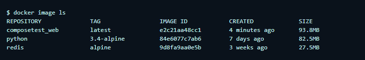
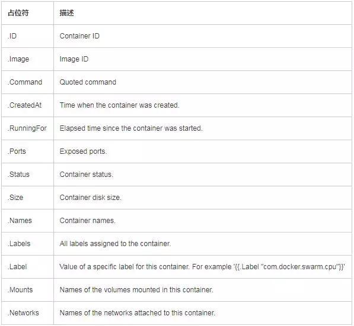

# Docker-Compse

# 1. 简介

参考文档:[Docker-Compose简介及常用命令](https://www.cnblogs.com/beyang/p/11416646.html)


## 1.1 基本命令

docker-compose --help你会看到如下这么多命令

```
build               Build or rebuild services
bundle              Generate a Docker bundle ``from` `the Compose file
config              Validate and view the Compose file
create              Create services
down                Stop and remove containers, networks, images, and volumes
events              Receive real time events ``from` `containers
exec                Execute a command ``in` `a running container
help                Get help ``on` `a command
images              List images
kill                Kill containers
logs                View output ``from` `containers
pause               Pause services
port                Print the ``public` `port ``for` `a port binding
ps                  List containers
pull                Pull service images
push                Push service images
restart             Restart services
rm                  Remove stopped containers
run                 Run a one-off command
scale               Set number of containers ``for` `a service
start               Start services
stop                Stop services
top                 Display the running processes
unpause             Unpause services
up                  Create and start containers
version             Show the Docker-Compose version information
```


## 1.2 命令格式

```
docker-compose [-f <arg>...] [options] [COMMAND] [ARGS...]
```

命令选项如下：
-f，–file FILE指定Compose模板文件，默认为docker-compose.yml，可以多次指定。
-p，–project-name NAME指定项目名称，默认将使用所在目录名称作为项目名。
-x-network-driver 使用Docker的可拔插网络后端特性（需要Docker 1.9+版本）
-x-network-driver DRIVER指定网络后端的驱动，默认为bridge（需要Docker 1.9+版本）
-verbose输出更多调试信息
-v，–version打印版本并退出


# 2. 安装

[官方文档](https://docs.docker.com/compose/install/)

```shell
#运行以下命令以下载Docker Compose的当前稳定版本
sudo curl -L "https://github.com/docker/compose/releases/download/1.24.1/docker-compose-$(uname -s)-$(uname -m)" -o /usr/local/bin/docker-compose

#将可执行权限应用于二进制文件
chmod +x /usr/local/bin/docker-compose

#测试安装
docker-compose --version
```


# 3. 入门案例

简单Python Web应用程序。该应用程序使用Flask框架，并在Redis中维护一个计数器。

①②③④⑤⑥⑦⑧⑨

## 步骤1：初始化环境

### ① 创建目录

```shell
mkdir composetest
cd composetest
```


### ② 模拟一个应用程序

```shell
#创建app.py，并将其粘贴到：
vi app.py
```


> app.py

```python
import time

import redis
from flask import Flask

app = Flask(__name__)
cache = redis.Redis(host='redis', port=6379)


def get_hit_count():
    retries = 5
    while True:
        try:
            return cache.incr('hits')
        except redis.exceptions.ConnectionError as exc:
            if retries == 0:
                raise exc
            retries -= 1
            time.sleep(0.5)


@app.route('/')
def hello():
    count = get_hit_count()
    return 'Hello World! I have been seen {} times.\n'.format(count)
```


### ③ 创建配置文件

创建一个配置文件，可以通过这个来安装相应的应用程序

```shell
vi requirements.txt
```


> requirements.txt

```
flask
redis
```


## 步骤2：建立Dockerfile文件

```shell
vi Dockerfile
```


> Dockerfile 文件

```dockerfile
FROM python:3.7-alpine
WORKDIR /code
ENV FLASK_APP app.py
ENV FLASK_RUN_HOST 0.0.0.0
RUN apk add --no-cache gcc musl-dev linux-headers
COPY requirements.txt requirements.txt
RUN pip install -r requirements.txt
COPY . .
CMD ["flask", "run"]
```


> Dockerfile 解释

- 从Python 3.7映像开始构建映像。
- 将工作目录设置为`/code`。
- 设置`flask`命令使用的环境变量。
- 安装gcc，以便诸如MarkupSafe和SQLAlchemy之类的Python包可以编译加速。
- 复制`requirements.txt`并安装Python依赖项。
- 将`.`项目中的当前目录复制到`.`映像中的工作目录。
- 将容器的默认命令设置为`flask run`。

有关如何编写Dockerfile的更多信息，请参阅《[Docker用户指南》](https://docs.docker.com/engine/tutorials/dockerimages/#building-an-image-from-a-dockerfile) 和《[Dockerfile参考》](https://docs.docker.com/engine/reference/builder/)。


## 步骤3：建立Compose文件

```shell
vi docker-compose.yml
```


> docker-compose.yml

```yaml
version: '3'
services:
  web:
    build: .
    ports:
      - "5000:5000"
  redis:
    image: "redis:alpine"
```

该Compose文件定义了两个服务：`web`和`redis`。

**Web应用**

该`web`服务使用从`Dockerfile`当前目录中构建的映像。然后，它将容器和主机绑定到暴露的端口`5000`。此示例服务使用Flask Web服务器的默认端口`5000`。

**Redis应用**

该`redis`服务使用 从Docker Hub注册表中提取的公共[Redis](https://registry.hub.docker.com/_/redis/)映像。


## 步骤4：运行应用


### ① 启动

在项目目录中，运行来启动应用程序`docker-compose up`。

```shell
docker-compose up
```

Compose提取一个Redis Image，为您的代码构建一个映像，然后启动您定义的服务。在这种情况下，代码会在构建时静态复制到映像中。


### ② 测试服务

* 在浏览器中输入http：// localhost：5000 /以查看应用程序正在运行。

* 刷新页面 该数字应递增。


### ③ 查看相关镜像

切换到另一个终端窗口，然后键入`docker image ls`以列出本地镜像。

此时列出的图片应返回`redis`和`web`。



您可以使用检查图像`docker inspect <tag or id>`。


### ④ 删除应用

通过`docker-compose down` 从第二个终端的项目目录中运行，或在启动该应用的原始终端中按CTRL + C来停止该应用。

```shell
docker-compose down
```


## 步骤5：外挂目录

编辑`docker-compose.yml`，实现在宿主机修改应用程序，并执行。

```shell
vi docker-compose.yml
```


> docker-compose.yml

```yaml
version: '3'
services:
  web:
    build: .
    ports:
      - "5000:5000"
    # 绑定到容器的/code目录中
    volumes:
      - .:/code
    # 设置Flask的环境变量，可以热部署  
    environment:
      FLASK_ENV: development
  redis:
    image: "redis:alpine"
```

`volumes`将主机上的项目目录（当前目录）`/code`安装到容器内部，使您可以即时修改代码，而不必重建映像。

该`environment`键设置了 `FLASK_ENV`环境变量，该变量指示`flask run`要在开发模式下运行并在更改时重新加载代码。此模式仅应在开发中使用。


## 步骤6：重建应用

在项目目录中，运行来启动应用程序`docker-compose up`。由于redis没有持久化，这样计数从0开始。

```shell
docker-compose up
```


## 步骤7：更新程序

由于现在使用卷将应用程序代码安装到了容器中，因此您可以对其代码进行更改并立即查看更改，而无需重建映像。

### ① 更新程序

更改问候语`app.py`并保存。例如，将`Hello World!`消息更改为`Hello from Docker!`：

```shell
vi app.py
```


### ② 测试

在浏览器中刷新应用。问候语应更新，并且计数器应仍在增加。


## 步骤8：尝试其他命令

①②③④⑤⑥⑦⑧⑨

### ① Compose后台执行

```shell
docker-compose up -d
```

如果要在后台运行服务，则可以将`-d`标志（用于“分离”模式）传递给`docker-compose up`并用于`docker-compose ps`查看当前正在运行什么


### ② 执行容器命令

```shell
docker-compose run web env
```

该`docker-compose run`命令允许您为服务运行一次性命令。例如，查看哪些环境变量可用于 `web`服务


### ③ 停止

一定要在当前目录

```shell
docker-compose stop
```


### ④ 删除

```shell
docker-compose up -d
```


### ⑤ 查询容器


```shell
docker ps -a --format "table {{.ID}}\t{{.Status}}\t{{.Networks}}\t{{.Mounts}}\t{{.Names}}"
```





# 4. CTL详解


## 4.1 CLI概述

您也可以通过`docker-compose --help`从命令行运行来查看此信息。

```none
Define and run multi-container applications with Docker.

Usage:
  docker-compose [-f <arg>...] [options] [COMMAND] [ARGS...]
  docker-compose -h|--help

Options:
  -f, --file FILE             Specify an alternate compose file
                              (default: docker-compose.yml)
  -p, --project-name NAME     Specify an alternate project name
                              (default: directory name)
  --verbose                   Show more output
  --log-level LEVEL           Set log level (DEBUG, INFO, WARNING, ERROR, CRITICAL)
  --no-ansi                   Do not print ANSI control characters
  -v, --version               Print version and exit
  -H, --host HOST             Daemon socket to connect to

  --tls                       Use TLS; implied by --tlsverify
  --tlscacert CA_PATH         Trust certs signed only by this CA
  --tlscert CLIENT_CERT_PATH  Path to TLS certificate file
  --tlskey TLS_KEY_PATH       Path to TLS key file
  --tlsverify                 Use TLS and verify the remote
  --skip-hostname-check       Don't check the daemon's hostname against the
                              name specified in the client certificate
  --project-directory PATH    Specify an alternate working directory
                              (default: the path of the Compose file)
  --compatibility             If set, Compose will attempt to convert deploy
                              keys in v3 files to their non-Swarm equivalent

Commands:
  build              Build or rebuild services
  bundle             Generate a Docker bundle from the Compose file
  config             Validate and view the Compose file
  create             Create services
  down               Stop and remove containers, networks, images, and volumes
  events             Receive real time events from containers
  exec               Execute a command in a running container
  help               Get help on a command
  images             List images
  kill               Kill containers
  logs               View output from containers
  pause              Pause services
  port               Print the public port for a port binding
  ps                 List containers
  pull               Pull service images
  push               Push service images
  restart            Restart services
  rm                 Remove stopped containers
  run                Run a one-off command
  scale              Set number of containers for a service
  start              Start services
  stop               Stop services
  top                Display the running processes
  unpause            Unpause services
  up                 Create and start containers
  version            Show the Docker-Compose version information
```

您可以使用Docker Compose二进制文件，`docker-compose [-f <arg>...] [options] [COMMAND] [ARGS...]`在Docker容器中构建和管理多个服务。


### 使用`-f`指定一个或多个文件

使用该`-f`标志可以指定Compose配置文件的位置。

您可以提供多个`-f`配置文件。提供多个文件时，Compose会将它们组合为一个配置。Compose按照您提供文件的顺序构建配置。后续文件将覆盖并添加到其前身。


### 使用`-p`指定项目名称

每个配置都有一个项目名称。如果提供`-p`标志，则可以指定项目名称。如果未指定该标志，则Compose使用当前目录名称。另请参见[COMPOSE_PROJECT_NAME环境变量](https://docs.docker.com/compose/reference/envvars/#compose_project_name)。


## 4.2 环境变量

可以使用几个环境变量来配置Docker Compose命令行行为。

**注意**：也可以使用[环境文件](https://docs.docker.com/compose/env-file/)来提供其中的一些变量 。


详情见官方网址：https://docs.docker.com/compose/reference/envvars/

下面只列出可能常用的。


### 设置项目名称

COMPOSE_PROJECT_NAME

设置项目名称。启动时，此值与服务名称一起添加到容器中。例如，如果您的项目名称为`myapp`，并且包含两个服务`db`和`web`，则Compose 分别启动名为`myapp_db_1`和的容器 `myapp_web_1`。

设置为可选。如果未设置，则`COMPOSE_PROJECT_NAME` 默认为`basename`项目目录的。另请参阅`-p` [命令行选项](https://docs.docker.com/compose/reference/overview/)。


### 指定Compose文件

COMPOSE_FILE

如果未提供，则Compose会先`docker-compose.yml`在当前目录中查找一个文件，然后依次查找 每个父目录，直到找到具有该名称的文件。

此变量支持由路径分隔符分隔的多个Compose文件（在Linux和macOS上，路径分隔符为`:`，在Windows上为`;`）。例如：`COMPOSE_FILE=docker-compose.yml:docker-compose.prod.yml`。路径分隔符也可以使用进行自定义`COMPOSE_PATH_SEPARATOR`。

另请参阅`-f` [命令行选项](https://docs.docker.com/compose/reference/overview/)。


### 设定API版本

COMPOSE_API_VERSION

Docker API仅支持来自报告特定版本的客户端的请求。如果`client and server don't have same version`使用收到错误 `docker-compose`，则可以通过设置此环境变量来解决此错误。设置版本值以匹配服务器版本。


### 设置windows与linux路径转换

COMPOSE_CONVERT_WINDOWS_PATHS

在卷定义中启用从Windows样式到Unix样式的路径转换。Windows上的Docker Machine和Docker Toolbox的用户应始终对此进行设置。默认为`0`。支持的值：`true`或`1`启用`false`或`0`禁用。


# 5. Compose文件详解


## 5.1 版本说明

这些主题描述了Compose文件格式的版本3。这是最新版本。

指定与docker对应的版本，看这个网址，有具体的对应关系：https://docs.docker.com/compose/compose-file/


```
version: "3.7"
services:
  webapp:
    build: ./dir
```


## 5.2 V3版本的主要功能


详细内容见：https://docs.docker.com/compose/compose-file/


## 5.3 常见问题


>  我可以控制服务启动顺序吗？

是-请参阅[控制启动顺序](https://docs.docker.com/compose/startup-order/)。


> 如何在同一主机上运行Compose文件的多个副本？

Compose使用项目名称为项目的所有容器和其他资源创建唯一的标识符。要运行一个项目的多个副本，请使用[`-p`命令行选项](https://docs.docker.com/compose/reference/overview/)或[`COMPOSE_PROJECT_NAME` 环境变量](https://docs.docker.com/compose/reference/envvars/#compose-project-name)来设置自定义项目名称。


> `up`，`run`以及`start`区别？

通常，您需要`docker-compose up`。使用`up`启动或重新启动在定义的所有服务`docker-compose.yml`。在默认的“附加”模式下，您会看到来自所有容器的所有日志。在“分离”模式（`-d`）中，启动容器后Compose退出，但是容器继续在后台运行。

该`docker-compose run`命令用于运行“一次性”或“临时”任务。它需要您要运行的服务名称，并且仅启动正在运行的服务所依赖的服务的容器。使用`run`运行测试或执行管理任务，如删除或添加数据的数据量的容器。该`run`命令的行为类似于`docker run -ti`，它打开了容器的交互式终端，并返回与容器中进程的退出状态匹配的退出状态。

该`docker-compose start`命令仅对重新启动先前创建但已停止的容器有用。它永远不会创建新的容器。


> 我应该在代码中包含COPY/ ADD还是在卷中？

您可以在中使用`COPY`或`ADD`指令将代码添加到图像中 `Dockerfile`。如果您需要将代码与Docker映像一起重定位，例如在将代码发送到另一个环境（生产，CI等）时，这很有用。

`volume`如果要更改代码并立即看到更改，则应使用a ，例如在开发代码且服务器支持热代码重载或实时重载时。

在某些情况下，您可能要同时使用两者。您可以使用来使图像包含代码`COPY`，并`volume`在开发过程中在Compose文件中使用来包含来自主机的代码。该卷将覆盖映像的目录内容。


> 在哪里可以找到示例撰写文件？

[github上](https://github.com/search?q=in%3Apath+docker-compose.yml+extension%3Ayml&type=Code)有[很多Compose文件的示例](https://github.com/search?q=in%3Apath+docker-compose.yml+extension%3Ayml&type=Code)。


# 6. 环境变量文件

可以定义一个环境变量文件，来指定compose的环境变量。 详情见：https://docs.docker.com/compose/env-file/


#  7. 环境变量的使用

环境变量的定义有多个，他们的优先级是：

1. Compose file
2. Shell environment variables
3. Environment file
4. Dockerfile
5. Variable is not defined


详细内容参看文档：https://docs.docker.com/compose/environment-variables/


## 7.1 The “.env” file

```shell
$ cat .env
TAG=v1.5

$ cat docker-compose.yml
version: '3'
services:
  web:
    image: "webapp:${TAG}"
```


## 7.2 定义环境变量

 just like with：`docker run -e VARIABLE=VALUE ...`

```
web:
  environment:
    - DEBUG=1
```


从shell中获取， just like with： `docker run -e VARIABLE ...`:

```
web:
  environment:
    - DEBUG
```


just like with： `docker run --env-file=FILE ...`:

```
web:
  env_file:
    - web-variables.env
```


直接运行

```
docker-compose run -e DEBUG=1 web python console.py
```


## 7.3 优先级示例

```shell
$ cat ./Docker/api/api.env
NODE_ENV=test

$ cat docker-compose.yml
version: '3'
services:
  api:
    image: 'node:6-alpine'
    env_file:
     - ./Docker/api/api.env
    environment:
     - NODE_ENV=production
```

显示结果

```shell
$ docker-compose exec api node

> process.env.NODE_ENV
'production'
```


# 8. 扩展Compose

在文件和项目之间共享撰写配置

Compose支持两种共享通用配置的方法：

1. 通过[使用多个Compose文件](https://docs.docker.com/compose/extends/#multiple-compose-files)扩展整个 [Compose文件](https://docs.docker.com/compose/extends/#multiple-compose-files)
2. 使用[该`extends`字段](https://docs.docker.com/compose/extends/#extending-services)扩展单个服务（适用于2.1或更高版本的撰写文件）-不推荐


## 8.1 了解多个撰写文件

默认情况下，Compose读取两个文件，一个`docker-compose.yml`和一个可选 `docker-compose.override.yml`文件。按照约定，`docker-compose.yml` 包含您的基本配置。顾名思义，替代文件可以包含现有服务或全新服务的配置替代。

如果在两个文件中都定义了服务，则Compose使用[添加和覆盖配置中](https://docs.docker.com/compose/extends/#adding-and-overriding-configuration)描述的规则合并[配置](https://docs.docker.com/compose/extends/#adding-and-overriding-configuration)。


## 8.2 用例范例

从定义服务规范配置的基本文件开始。

**docker-compose.yml**

```yml
web:
  image: example/my_web_app:latest
  depends_on:
    - db
    - cache

db:
  image: postgres:latest

cache:
  image: redis:latest
```

在此示例中，开发配置将一些端口暴露给主机，将我们的代码作为卷挂载，并构建Web映像。

**docker-compose.override.yml**

```yml
web:
  build: .
  volumes:
    - '.:/code'
  ports:
    - 8883:80
  environment:
    DEBUG: 'true'

db:
  command: '-d'
  ports:
    - 5432:5432

cache:
  ports:
    - 6379:6379
```

运行时，`docker-compose up`它将自动读取覆盖。

现在，很高兴在生产环境中使用此Compose应用程序。因此，请创建另一个替代文件（该文件可以存储在其他git repo中，也可以由其他团队进行管理）。

**docker-compose.prod.yml**

```
web:
  ports:
    - 80:80
  environment:
    PRODUCTION: 'true'

cache:
  environment:
    TTL: '500'
```

要使用此生产Compose文件进行部署，您可以运行

```
docker-compose -f docker-compose.yml -f docker-compose.prod.yml up -d
```

该部署使用配置中的所有三个服务 `docker-compose.yml`和`docker-compose.prod.yml`（但不是在开发配置`docker-compose.override.yml`）。


# 9. 设置网络

默认情况下，Compose 为您的应用设置单个 [网络](https://docs.docker.com/engine/reference/commandline/network_create/)。为服务每个容器加入默认网络和既是*到达*由网络上的其他容器中，*发现*在相同的容器名称主机名被他们。

例如，假设您的应用程序位于名为的目录中`myapp`，并且您的`docker-compose.yml`外观如下所示：

```yml
version: "3"
services:
  web:
    build: .
    ports:
      - "8000:8000"
  db:
    image: postgres
    ports:
      - "8001:5432"
```

运行时`docker-compose up`，将发生以下情况：

1. `myapp_default`创建一个名为的网络。
2. 容器是使用`web`的配置创建的。它`myapp_default`以名称加入网络 `web`。
3. 容器是使用`db`的配置创建的。它`myapp_default`以名称加入网络 `db`。

现在，每个容器都可以查找主机名`web`或`db`获取相应容器的IP地址。例如，`web`的应用程序代码可以连接到URL `postgres://db:5432`并开始使用Postgres数据库。

要注意区分是很重要的`HOST_PORT`和`CONTAINER_PORT`。在上面的示例中，对于`db`，`HOST_PORT`is是`8001`，容器端口为`5432`（postgres默认）。联网的服务到服务通信使用`CONTAINER_PORT`。当`HOST_PORT`定义，服务是群外部访问也是如此。

在`web`容器内，您的连接字符串`db`看起来像 `postgres://db:5432`，而在主机上，连接字符串看起来像`postgres://{DOCKER_IP}:8001`。


## 9.1 更新容器

如果对服务进行配置更改并运行`docker-compose up`以对其进行更新，则旧容器将被删除，而新容器将以其他IP地址但名称相同的方式加入网络。运行中的容器可以查找该名称并连接到新地址，但是旧地址会停止工作。

如果有任何容器打开了到旧容器的连接，则它们将被关闭。检测这种情况，再次查找名称并重新连接是容器的责任。


## 9.2 使用预先存在的网络

如果您希望容器加入预先存在的网络，请使用以下[`external`选项](https://docs.docker.com/compose/compose-file/compose-file-v2/#network-configuration-reference)：

```
networks:
  default:
    external:
      name: my-pre-existing-network
```

`[projectname]_default`Compose 不会尝试创建一个名为的网络，而是查找一个名为的网络`my-pre-existing-network`并将您的应用程序的容器连接到该网络。


# 10. 生产环境中注意事项


## 10.1 修改compose文件以进行生产

您可能需要更改您的应用程序配置，以使其可以投入生产。这些更改可能包括：

- 删除应用程序代码的所有卷绑定，以使代码保留在容器内，并且不能从外部更改
- 绑定到主机上的不同端口
- 设置不同的环境变量，例如，当您需要减少日志记录的冗长性或启用电子邮件发送时）
- 指定重启策略，如`restart: always`避免停机
- 添加额外的服务，例如日志聚合器

因此，请考虑定义一个额外的Compose文件，例如`production.yml`，该文件 指定了适合生产的配置。该配置文件只需要包含您想要对原始Compose文件进行的更改。可以将其他Compose文件应用于原始文件`docker-compose.yml`以创建新配置。

获得第二个配置文件后，告诉Compose使用以下 `-f`选项：

```
docker-compose -f docker-compose.yml -f production.yml up -d
```

有关更完整的示例，请参见[使用多个撰写文件](https://docs.docker.com/compose/extends/#different-environments)。


# 11. 启动与关闭顺序


最好的解决方案是在启动时以及由于任何原因断开连接时都在应用程序代码中执行此检查。但是，如果不需要此级别的弹性，则可以使用包装器脚本解决此问题：

- 使用诸如[wait-for-it](https://github.com/vishnubob/wait-for-it)， [dockerize](https://github.com/jwilder/dockerize)或sh-compatible [wait-for之类的工具](https://github.com/Eficode/wait-for)。这些是小型包装脚本，您可以在应用程序的映像中包括这些脚本，以轮询给定的主机和端口，直到它接受TCP连接为止。

  例如，使用`wait-for-it.sh`或`wait-for`包装服务的命令：

  ```
  version: "2"
  services:
    web:
      build: .
      ports:
        - "80:8000"
      depends_on:
        - "db"
      command: ["./wait-for-it.sh", "db:5432", "--", "python", "app.py"]
    db:
      image: postgres
  ```

  > **提示**：第一个解决方案有局限性。例如，它不验证特定服务何时真正就绪。如果您向命令添加更多参数，请将该`bash shift`命令与循环一起使用，如下例所示。

- 或者，编写您自己的包装器脚本以执行更特定于应用程序的运行状况检查。例如，您可能要等到Postgres肯定准备好接受命令为止：

  ```
  #!/bin/sh
  # wait-for-postgres.sh
  
  set -e
  
  host="$1"
  shift
  cmd="$@"
  
  until PGPASSWORD=$POSTGRES_PASSWORD psql -h "$host" -U "postgres" -c '\q'; do
    >&2 echo "Postgres is unavailable - sleeping"
    sleep 1
  done
  
  >&2 echo "Postgres is up - executing command"
  exec $cmd
  ```

  通过设置以下内容，可以将其用作上一个示例中的包装脚本：

  ```none
  command: ["./wait-for-postgres.sh", "db", "python", "app.py"]
  ```

