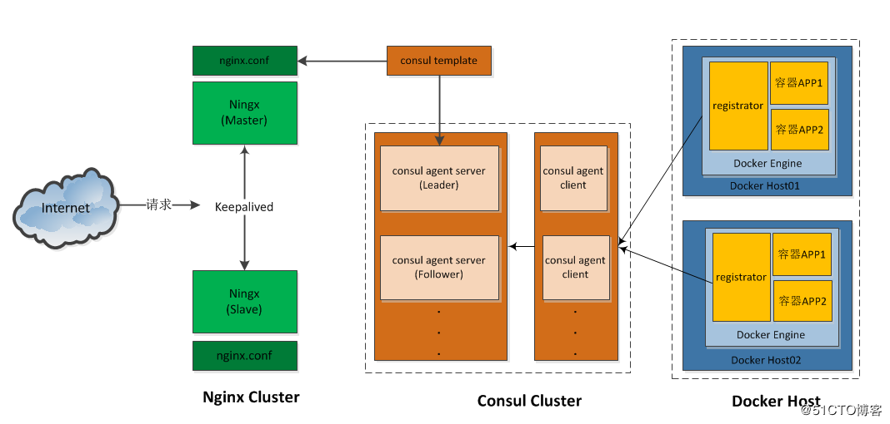

# 自动发现容器服务

基于Consul+Registrator+Nginx实现容器服务自动发现的集群框架

自动添加Docker容器，然后对外自动发现。

如果是一个单一的服务，可以通过这个方案来做为kubernetes的初步方案。

# 1. 基本概念

使用Docker将Consul、Consul Template、Registrator和Nginx组装成一个值得信任且可扩展的服务框架，这套架构让你在这个框架中添加和移除服务，不需要重写任何配置，也不需要重启任何服务，一切都能正常运行，工作流程很简单：

# 参考文档

* [基于Consul+Registrator+Nginx实现容器服务自动发现的集群框架](https://blog.51cto.com/ganbing/2086851)
* [微服务注册发现集群搭建——Registrator + Consul + Consul-template + nginx](https://blog.csdn.net/jek123456/article/details/78083618)

当前流行的有：Istio

* [Istio入门实战与架构原理——使用Docker Compose搭建Service Mesh](https://www.cnblogs.com/skabyy/p/10668079.html)

