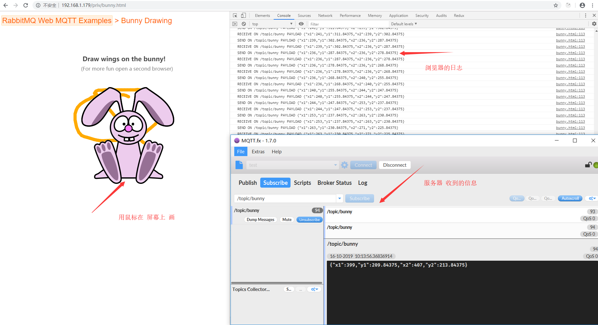

# Docker Compose 例子

[TOC]


# 1. 部署架构

[本文文档的代码在这里可以找到](https://github.com/fanhualei/wukong-bd/tree/master/examples/docker-compose)


# 2. 前期准备

## 2.1. 定义工作目录

定义compose工作目录

```shell
mkdir /opt/myapp ;cd /opt/myapp

mkdir rabbitmq mysql redis tomcat-hz tomcat-wx
```


## 2.2. 定义存储空间

如果是使用本地目录，docker-compose会自动建立，**可以不执行下面的代码**。

如果使用nfs网络存储，需要重新挂载网络存储。

```shell
#如果是使用本地目录，docker-compose会自动建立，下面的代码是示例，没有实际用途
mkdir /data/myapp
cd /data/myapp
mkdir rabbitmq mysql redis tomcat-hz tomcat-wx
```


# 3. 具体实现


## 3.0 常见问题

### ① 容器的时区问题

docket安装的默认是美国时区，如果宿主机是北京时间，那么会发现双方相差几个小时

```shell
#测试方法：登录到容器中,执行这个指令，看看日期与宿主机器是否相同
date
```

> 解决方法

```shell
#在compose文件中的volumes，将宿主机器的文件给复制到容器中，:ro 表示只读，担心被容器给写了
    volumes:
      - /etc/localtime:/etc/localtime:ro
```


### ② Tomcat时区问题

即使Docker容器的时区设置对了，但是看Tomcat日期，时区还是不对。

这时候需要传递一个环境变量给容器。

> 解决方法

```shell
#在compose文件中给Tomcat添加系统变量
    environment:  
      TZ: 'Asia/Shanghai'  
```


### ③ Mysql时区问题

> 解决方法

将Mysql所在容器的时区配置正确，mysql时区取自所在容器。

具体解决方案见：***① 容器的时区问题***


### ④ 严格启动顺序

tomcat 只有在Mysql Redis 与 RabbitMq 启动后才可以用

使用诸如[wait-for-it](https://github.com/vishnubob/wait-for-it)， [dockerize](https://github.com/jwilder/dockerize)或sh-compatible [wait-for之类的工具](https://github.com/Eficode/wait-for)。这些是小型包装脚本，您可以在应用程序的映像中包括这些脚本，以轮询给定的主机和端口，直到它接受TCP连接为止。

```yaml
# 例子代码
depends_on:
  - mysql
  entrypoint: “bash /usr/local/bin/wait-for-it.sh mysql:3306 – java -jar /safebox-eureka.jar”
```


Docker官网也给出了一些解决方案：https://docs.docker.com/compose/startup-order/


### ⑤ 是否选择OpenJdk

OpenJdk与Oracle发行版的选择


## 3.1 定义变量

```shell
cd /opt/myapp
vi .env
```

> 文件内容

```properties
# 基础路径
DATA_PATH=/data/myapp
```


## 3.2 撰写Dockerfile


### Tomcat

有两种做法：

* 不适用DockerFile
  * 好处是，不用再编译镜像了，生了编译的过程与空间。
  * 将编译好的server.xml直接通过`-v`外挂到镜像中。
* 使用DockerFile
  * 坏处是多了一个镜像文件
  * 好处是为了未来，可以将应用程序等打包到镜像中，今后使用镜像来更新程序。


由于Tomcat需要单独的配置，所以这里单独进行了设置。

实际中`tomcat-wx tomcat-hz`要分别建立不同的Dockerfile文件，另外按照官网的提示，要将应用程序打包到镜像中。


#### ① 复制server.xml

先生成一个`tomcat:9.0.20-jre8-alpine`镜像，并将文件复制出来。

```shell
docker run --name my-tomcat-temp  -d tomcat:9.0.20-jre8-alpine
docker cp my-tomcat-temp:/usr/local/tomcat/conf/server.xml ./
docker rm -f  my-tomcat-temp
ls
```


#### ② 修改server.xml

在`</host>`前一行添加

```xml
<Context path="" docBase="/usr/local/tomcat/webapps" debug="0" reloadable="false"/>
```


> 参考资料

* [详解Tomcat 配置文件server.xml](https://www.cnblogs.com/kismetv/p/7228274.html)
* [tomcat安全配置参考](https://www.cnblogs.com/youqc/p/9402586.html)


#### ③ 创建Dockerfile

```shell
cd /opt/myapp/tomcat-wx
vi /opt/myapp/tomcat-wx/Dockerfile
```

> Dockerfile

```dockerfile
#带有管理界面的rabbitmq
FROM tomcat:9.0.20-jre8-alpine
#修改配置
COPY server.xml /usr/local/tomcat/conf
```


### 3.2.2 Mysql

Mysql 直接使用官方的镜像就可以了，这里只给出导入导出的示例

官网给出了示例代码

```shell
#Creating database dumps
docker exec some-mysql sh -c 'exec mysqldump --all-databases -uroot -p"$MYSQL_ROOT_PASSWORD"' > /some/path/on/your/host/all-databases.sql

#Restoring data from dump files
docker exec -i some-mysql sh -c 'exec mysql -uroot -p"$MYSQL_ROOT_PASSWORD"' < /some/path/on/your/host/all-databases.sql
```


#### ① 宿主机上导入数据

> 模拟一个SQL语句

定义一个文件：init.sql

```sql
create database wk;
use wk;
create table user (id int,name varchar(50));
insert into user values(1,'james');
insert into user values(2,'sophia');
```


> 进行导入

* 一定要加上-T 
* 执行这个一定要小心。应该在开发环境测试无误后，再提交到服务器上


```shell
docker-compose exec -T mysql sh -c 'exec mysql -uroot -pmysql@root ' < ./00-sql-init/init.sql
```


#### ② 宿主机上备份数据

导出一个以秒为日期的数据

```shell
docker-compose exec mysql sh -c 'exec mysqldump --opt -uroot -pmysql@root wk' >wk-$(date +"%Y%m%d-%H%M%S").sql
```


### 3.2.3 Backup定时备份


#### ① 注意事项

* docker守护进程

```
如果记得在生成一个alpine镜像时，要做一个for循环，不然镜像就退出。
由于/bin/sh ash 都是后台执行，所以容器会exit
这就时说为什么要做 crond -f  ， -f 是让crond在前台执行。
```

* 使用 bash或ash(alpine)进行登录

```
使用/bin/sh登录容器，删除键不好用
```

* ENTRYPOINT 还没有弄明白怎么做


#### ② 创建数据库备份脚本


> 定义工作目录

```shell
mkdir -p /opt/myapp/backup; cd /opt/myapp/backup
```

> 建立脚本

```shell
cd /opt/myapp/backup
vi backup.sh
```


> backup.sh

```sh
#!/bin/sh

#database info
DB_USER="root"
DB_PASS=$MYSQL_ROOT_PASSWORD
DB_HOST=$MYSQL_HOST
DB_NAME=$MYSQL_DB

# 定义在容器内部的路径
ADM_DIR="/myapp/mysqladm/"            #the backup.sh path
BCK_DIR="/myapp/mysqladm/files"    #the backup file directory

if [ ! -d $ADM_DIR  ];then
  mkdir $ADM_DIR
fi

if [ ! -d $BCK_DIR  ];then
  mkdir $BCK_DIR
fi


DATE=`date +%F`
#备份数据库的文件名
OUT_SQL="${DB_NAME}-${DATE}.sql"

#最终保存的数据库备份文件名
TAR_SQL="${DB_NAME}-${DATE}.tar"

mysqldump --opt -u$DB_USER -p$DB_PASS -h$DB_HOST $DB_NAME > $BCK_DIR/$OUT_SQL

#========================================
#DAYS=15代表删除15天前的备份，即只保留最近15天的备份
DAYS=15

#进入备份存放目录
cd $BCK_DIR
tar -czf $TAR_SQL ./$OUT_SQL

#删除.sql格式的备份文件
rm $OUT_SQL


#删除15天前的备份文件(注意：{} \;中间有空格)
find $BCK_DIR -name "${DB_NAME}-*" -type f -mtime +$DAYS -exec rm {} \;
```


> 可以执行

```shell
chmod +x backup.sh
```


#### ③ 创建应用程序备份脚本

主要备份的内容有：

* 应用程序
* 用户上传的数据，例如图片，文件等。

具体操作省略


#### ④  配置定时任务


```shell
cd /opt/myapp/backup
#设定定时任务,每天早上3点1分进行备份
cat <<EOF > crontab.bak
1 3 * * * /myapp/mysqladm/backup.sh
EOF
#做结尾行，不然会出现错误
echo "" >> crontab.bak

```


下面是测试用，每分钟备份一次

```
*/1 * * * * /myapp/mysqladm/backup.sh
```


#### ⑤ 撰写Dockerfile

```shell
cd /opt/myapp/backup
vi /opt/myapp/backup/Dockerfile
```

> Dockerfile

```dockerfile
#备份镜像
FROM alpine

#复制备份脚本
COPY backup.sh    /myapp/mysqladm/
#复制定时任务
COPY crontab.bak  /myapp/


# 安装mysql客户端
RUN apk add --no-cache mysql-client \
      # 启动定时任务
      && crontab /myapp/crontab.bak    

# 启动定时任务,必须添加-f ,不然容器启动不了
CMD ["crond","-f"]
```


### 3.2.4 Rabbitmq

由于Rabbitmq需要启动MQTT插件，所以这里单独定制了一个镜像。


#### ① Dockerfile

```shell
cd /opt/myapp/rabbitmq
vi /opt/myapp/rabbitmq/Dockerfile
```

> Dockerfile

```dockerfile
#带有管理界面的rabbitmq
FROM rabbitmq:3.8.0-management-alpine
# 启动mqtt插件
RUN rabbitmq-plugins enable --offline rabbitmq_mqtt rabbitmq_web_mqtt
```


#### ② 映射端口

RabbitMQ 已经有一些自带管理插件的镜像。用这些镜像创建的容器实例可以直接使用默认的 15672 端口访问，默认账号密码是`guest/guest`


- `4369` (epmd), `25672` (Erlang distribution)
- `5672` 是amqp默认端口 , `5671` (AMQP 0-9-1 without and with TLS)
- `15672` (if management plugin is enabled) 是rabbitmq management管理界面默认访问端口
- `61613`, `61614` (if STOMP is enabled)
- `1883`, `8883` (if MQTT is enabled)  mqtt tcp协议默认端口


#### ③  参考资料

> 相关文档

- [RabbitMQ手册之rabbitmq-plugins](https://www.jianshu.com/p/0ff7c2e5c7cb)
- [Docker安装RabbitMQ配置MQTT](https://blog.csdn.net/hololens/article/details/80059991)
- [Docker 部署 RabbitMQ 集群](https://www.jianshu.com/p/52546bcf8723?utm_source=oschina-app)
- [RabbitMQ的简单使用](https://blog.csdn.net/wangbing25307/article/details/80845641)


## 3.3 撰写compose文件

```shell
cd /opt/myapp
vi docker-compose.yml
```


```yml
version: '3'
services:

  tomcat-wx:
    hostname: tomcat-wx
    restart: always
    build: ./tomcat-wx
    #容器的映射端口，21080是宿主机的端口
    ports:
      - 21080:8080    
    #定义挂载点
    volumes:
      - ${DATA_PATH}/tomcat-wx/webapps:/usr/local/tomcat/webapps
      - ${DATA_PATH}/tomcat-wx/logs:/usr/local/tomcat/logs
      - /etc/localtime:/etc/localtime:ro
    environment:  
      TZ: 'Asia/Shanghai'  
    #启动依赖  
    depends_on:
      - mysql
      - redis
      - rabbitmq

  #mysql
  mysql:
    hostname: mysql
    image: mysql:5.7
    restart: always
    volumes:
      - ${DATA_PATH}/mysql/conf:/etc/mysql/conf.d
      - ${DATA_PATH}/mysql/data:/var/lib/mysql
      - /etc/localtime:/etc/localtime:ro
    environment:
      MYSQL_ROOT_PASSWORD: mysql@root
      
  #定时备份业务：将要备份的数据库传入，同时要设置日期，不然时间不对。    
  backup:
    hostname: backup
    build: ./backup
    restart: always
    tty: true
    environment:
      MYSQL_ROOT_PASSWORD: mysql@root
      MYSQL_HOST: mysql
      MYSQL_DB: sys
    volumes:
      - ${DATA_PATH}/backup/mysql:/myapp/mysqladm/files
      - /etc/localtime:/etc/localtime:ro
    #启动依赖  
    depends_on:
      - mysql      
      
  #redis
  redis:
    hostname: redis
    image: redis:5.0.6-alpine
    restart: always
    # 开启持久化，并设置密码
    command: redis-server --appendonly yes --requirepass "redis123"
    volumes:
      - ${DATA_PATH}/redis/data:/data
      - /etc/localtime:/etc/localtime:ro
      
  #rabbitmq
  rabbitmq:
    hostname: rabbitmq
    build: ./rabbitmq
    restart: always
    environment:
      RABBITMQ_DEFAULT_USER: guest
      RABBITMQ_DEFAULT_PASS: fanhualei 
    volumes:
      - /etc/localtime:/etc/localtime:ro
      - ${DATA_PATH}/rabbitmq/data:/var/lib/rabbitmq
    ports:
      - "15672:15672"
      - "31883:1883"
      #By default the Web MQTT plugin exposes a WebSocket endpoint on port 15675
      - "15675:15675"
      
      
  #mosquitto 主要是为了测试 rabbitmq的客户端
  mosquitto:
    hostname: mosquitto
    image: eclipse-mosquitto:1.6.7
    restart: always      
      
```


## 3.4 生成容器

```shell
docker-compose up --build -d
```


## 3.5 单元测试


内部 Tomcat Redis Mysql rabbitMq联通：`backup` 可以连通`mysql` 。 `mosquitto` 可以连通`rabbitmq`


①②③④⑤⑥⑦⑧⑨

### 3.5.1 常用命令

```shell
#停止运行并移除容器
docker-compose down

#启动单个服务
docker-compose up -d 服务名

#查看当前运行的服务
docker-compose ps

#构建镜像，--no-cache表示不用缓存，否则在重新编辑Dockerfile后再build可能会直接使用缓存而导致新编辑内容不生效
docker-compose build --no-cache

#查看镜像
docker-compose images

#查看日志
docker-compose logs

#启动/停止服务
docker-compose start/stop 服务名

#拉取镜像
docker-compose pull 镜像名
```


### 3.5.2 测试Tomcat

#### ① 添加index.html

```shell
echo hello James.    $(date +%F%n%T) > /data/myapp/tomcat-wx/webapps/index.html
```


#### ② 浏览器打开首页

由于tomcat-wx外挂了`21080`，所以可以用宿主机的IP地址来访问。

在浏览器中输入：http://192.168.1.179:21080/


#### ③ 测试日志是否正确

日志的日期，以及日志是否持久化

```shell
ls /data/myapp/tomcat-wx/logs
more /data/myapp/tomcat-wx/logs/localhost_access_log.2019-10-09.txt
```


```shell
catalina.2019-10-09.log  # tomcat自身的日志
host-manager.2019-10-09.log   # 管理相关日志
localhost.2019-10-09.log  
localhost_access_log.2019-10-09.txt  #访问日志文件
manager.2019-10-09.log # 管理相关日志
```


#### ④ 登录到容器中

看看日期是否正确

```shell
docker-compose exec  tomcat-wx  /bin/sh
#看与宿主机是否一致
date
```


### 3.5.3 测试Mysql


#### ① 登录到容器中

看看日期是否正确

```shell
docker-compose exec  mysql  /bin/bash
#看与宿主机是否一致
date

#登录到mysql 
mysql -uroot -pmysql@root

#看看mysql的 now()函数日期与服务器是否一致
mysql>select now();

#看看mysql的 时区是否取自服务器
mysql>show variables like '%time_zone%';
```


#### ② mysql数据持续化

登录到mysql中添加数据，在今后的过程中，再重新Up时候，看看数据是否保存下来

```shell
docker-compose exec  mysql  mysql -uroot -pmysql@root

#登录到mysql 

> show databases;
> create database wk;
> use wk;
> show tables;
> create table user (id int,name varchar(50));
> insert into user values(1,'james');
> insert into user values(2,'sophia');
> select * from wk.user;
```


#### ③ 备份数据库

见 3.2.3章节的backup容器。

#### ④ 批量导入数据

见 3.2.2章节的backup容器。


### 3.5.4 测试Redis


#### ① 登录到redis中

```shell
# -a redis密码
docker-compose exec redis redis-cli -a redis123
```


#### ② 进行一些基本操作

```shell
keys *
set key1 "hello"
get key1
set key2 1
INCR key2
get key2
```


```
登录redis即获得帮助
    redis-cli
    help    
基本使用命令
    查看所有的key列表  keys *
    增加一条记录key1  set key1 "hello"
    得到数据         get key1
    增加一条数字记录  set key2 1
    让数字自增       INCR key2
    删除一个        del key1   
    删除所有数据     flushall
```


#### ③ 测试持久化

删除容器后重启，发现以前的数据都还在

```shell
docker-compose down
docker-compose up -d
docker-compose exec redis redis-cli -a redis123
127.0.0.1:6379>  get key1
```


### 3.5.5 测试rabbitmq

[参考文档](https://github.com/fanhualei/wukong-framework/blob/master/reference/mq.md)

#### ①  Web是否可以访问

在浏览器中输入`http://192.168.1.179:15672/  `，访问到rabbitmq，用户名：guest  密码：fanhualei


#### ②  rabbitmq基本操作

```shell
docker-compose exec rabbitmq /bin/ash

#查看状态
rabbitmqctl status

#查看可用插件及已安装插件
rabbitmq-plugins list

#查看用户
rabbitmqctl list_users

#添加管理用户
rabbitmqctl add_user admin yourpassword
rabbitmqctl set_user_tags admin administrator
```


#### ③ 测试mosquitto服务

mosquitto是一个mqtt服务，docker镜像才3M，所以拿过来当客户端用。

[Mosquitto-pub地址](https://mosquitto.org/man/mosquitto_pub-1.html)  [Mosquitto-sub地址](https://mosquitto.org/man/mosquitto_sub-1.html)


> 打开一个窗口，用来监听

```
docker-compose exec mosquitto mosquitto_sub -t topic1 
```

想结束了，就用`ctrl+c`来结束


> 打开一个窗口，用来发送

```
docker-compose exec mosquitto mosquitto_pub -t topic1 -m 'hello world1'
```


#### ④ 测试rabbitmq-mqtt

* -h rabbitmq 用来将服务器指向rabbitmq
* -u guest 用户名
* -p fanhualei 密码


> 打开一个窗口，用来监听

```
docker-compose exec mosquitto mosquitto_sub -t topic1  -h rabbitmq -u guest -P fanhualei
```

想结束了，就用`ctrl+c`来结束


> 打开一个窗口，用来发送

```
docker-compose exec mosquitto mosquitto_pub -t topic1 -m 'hello world1'  -h rabbitmq -u guest -P fanhualei
```


#### ⑤ 添加一些数据

添加exchange


#### ⑥ 删除容器后看数据

做了数据持久化，删除容器后，容器中的数据应该在。


> mqtt客户端

* [MQTT入门（4）- 客户端工具](https://www.iteye.com/blog/rensanning-2406598)

* 推荐：MQTTfx  或 Mosquitto 


### 3.5.6 测试web-mqtt

[官方文档](https://www.rabbitmq.com/web-mqtt.html)

#### ①  下载例子代码

可以将这个脚本放到`tomcat-wx`目录中，方便用浏览器访问

```shell
#已经运行的tomcat工程
cd /data/myapp/tomcat-wx/webapps/

wget  https://github.com/rabbitmq/rabbitmq-web-mqtt-examples/archive/master.zip

yum install -y unzip
unzip master.zip
mv rabbitmq-web-mqtt-examples-master/priv/  ./
rm -fr rabbitmq-web-mqtt-examples-master/

```


#### ② 开放15675防火墙端口(临时)

一定要重启防火墙，并看到这个端口开发了。

真实环境中，会用nginx的安全套阶层来反向代理的。

```shell
# 添加指定需要开放的端口：
firewall-cmd --add-port=15675/tcp --permanent
# 重载入添加的端口：
firewall-cmd --reload
# 查询指定端口是否开启成功：
firewall-cmd --query-port=15675/tcp
```


#### ③  修改echo.html脚本

> echo.html

修改服务器的地址，并且添加登录所需要的用户与密码

```shell
cd priv
vi echo.html
# var wsbroker = '192.168.1.179';  //mqtt websocket enabled broker
# var options = {
#     timeout: 3,
#     userName: 'guest',
#     password: 'fanhualei',
```


> 显示内容

可以发送信息，如果3秒没有相应，那么自动断开，发送信息时，重新连接。


*在浏览器中输入`http://192.168.1.179:15672/  `，访问到rabbitmq，用户名：guest  密码：fanhualei*


#### ④  修改bunny.html脚本


> 修改bunny.html脚本

跟echo.html一样，需要：修改服务器的地址，并且添加登录所需要的用户与密码


>  显示内容

可以拿鼠标在上面画，然后会把坐标信息发送的服务器上。




#### ⑤ 安全方面注意事项

> 基本问题

* 如何使用https
  * 用nginx做代理就可以了
* 如何保证登录后才能访问这个页面
  * 将client端的html防止到一个受权限控制的页面。
* mqtt密码泄露怎么办？在浏览器中可以看到这个密码
  * 这个还没有想到好的办法，只能在topic上做应用了，让topic很难跟踪。
* 如何使用证书？
  * 不知道呢，好像不行。


> 网上的安全方案

* [Mqtt精髓系列之安全](https://blog.csdn.net/yangguosb/article/details/78677774)
* [浅析MQTT安全](http://rui0.cn/archives/975)
* 为每个设备设定单独的权限，如果Rabbit这个问题不能解决，那么只能使用商业的MQTT工具了或者使用mosquitto了。
  * mosquitto 可以对每个topic进行认证
  * [【转载】MQTT的学习之Mosquitto集群搭建](https://www.cnblogs.com/chen1-kerr/p/7269388.html)


> 一些基本措施

下面的安全措施，有些可能不能实现

* 避免使用匿名登录
* 不同用户设定不同的topic
* 避免使用通配符，得到所有的权限


#### ⑥ 官网资源

[mqtt官网](http://mqtt.org/)，上面还是有很多资料的，其中mqtt3.3.1是在2014年发布的，所以现在的类库都是好多年前的，不必在意。 今年新发布了mqtt5，估计等上半年后再使用吧，新的东西，要等到其他的厂商适配。

* 服务器列表
* 类库列表
  * js
  * java
  * c 或c++
  * 特殊硬件设备：arduino ESP8266 等
* 工具列表


### 3.5.7 测试rabbitmq的权限认证


#### ①  授权指令解释

[参考网址](https://www.rabbitmq.com/rabbitmqctl.8.html#set_topic_permissions)

命令格式：[**set_topic_permissions**](https://www.rabbitmq.com/rabbitmqctl.8.html#set_topic_permissions) [**-p** vhost] user exchange write read

> 案例1

给用户`janeway`分配虚拟主机的`my-vhost`的`amq.topic` EXchange 下一`janeway-.`开头的路由

```shell
rabbitmqctl set_topic_permissions -p my-vhost janeway amq.topic "janeway-.*" "^janeway-.*"
```


> 案例2

rabbitmq支持变量 `username, vhost, client_id`。`client_id`只能用于mqtt

给用户`janeway`分配虚拟主机的`my-vhost`的`amq.topic` EXchange 下一`janeway-.`开头的路由

```shell
rabbitmqctl set_topic_permissions -p my-vhost janeway amq.topic "^{username}-.*" "^{username}-.*"
```


#### ② 设计方案

根据上面的权限原理，可以这么来设计

| 分类     | 说明             | 权限                                                         |
| -------- | ---------------- | ------------------------------------------------------------ |
| 硬件终端 | ①上传  ②接收     | ①上传：读写。②接收：只读                                     |
| 手机端   | 可以访问所有通道 | 不能直接连接Mqtt服务器，应通过服务器权限分配后，再分配到具体硬件终端。 |
| 服务器   |                  |                                                              |

> 结论，一共需要三类用户

终端用户（定义一个）： ①上传：只写。②接收：只读 。使用clientId做为区分码。


#### ③  用户管理指令

> 添加用户

[**add_user**](https://www.rabbitmq.com/rabbitmqctl.8.html#add_user) username password

```
rabbitmqctl add_user janeway changeit
```


> 验证用户

[**authenticate_user**](https://www.rabbitmq.com/rabbitmqctl.8.html#authenticate_user) username password

```
rabbitmqctl authenticate_user janeway verifyit
```


> 变更密码

[**change_password**](https://www.rabbitmq.com/rabbitmqctl.8.html#change_password) username newpassword

```
rabbitmqctl change_password janeway newpass
```


> 清空密码

[**clear_password**](https://www.rabbitmq.com/rabbitmqctl.8.html#clear_password) username

```
rabbitmqctl clear_password janeway
```

清空完毕后，不能登录系统


> 删除用户

[**delete_user**](https://www.rabbitmq.com/rabbitmqctl.8.html#delete_user) username

```
rabbitmqctl delete_user janeway
```


> 显示用户

[**list_users**](https://www.rabbitmq.com/rabbitmqctl.8.html#list_users)

```
rabbitmqctl list_users
```


> 设置用户tag

[**set_user_tags**](https://www.rabbitmq.com/rabbitmqctl.8.html#set_user_tags) username [tag ...]

```shell
# 设置分类
rabbitmqctl set_user_tags janeway administrator
# 清除分类
rabbitmqctl set_user_tags janeway
```


#### ④ 访问控制指令(显示)


> 清空vhost授权

[**clear_permissions**](https://www.rabbitmq.com/rabbitmqctl.8.html#clear_permissions) [**-p** vhost] username

```
rabbitmqctl clear_permissions -p my-vhost janeway
```


> 清空topic授权

[**clear_topic_permissions**](https://www.rabbitmq.com/rabbitmqctl.8.html#clear_topic_permissions) [**-p** vhost] username [exchange]

`exchange`

*The name of the topic exchange to clear topic permissions, defaulting to all the topic exchanges the given user has topic permissions for.*

```
rabbitmqctl clear_topic_permissions -p my-vhost janeway amq.topic
```


> 显示vhost授权

[**list_permissions**](https://www.rabbitmq.com/rabbitmqctl.8.html#list_permissions) [**-p** vhost]

```
rabbitmqctl list_permissions -p my-vhost
```


> 显示topic授权

[**list_topic_permissions**](https://www.rabbitmq.com/rabbitmqctl.8.html#list_topic_permissions) [**-p** vhost]

```
rabbitmqctl list_topic_permissions -p my-vhost
```


> 显示某个用户的授权

[**list_user_permissions**](https://www.rabbitmq.com/rabbitmqctl.8.html#list_user_permissions) username

```
rabbitmqctl list_user_permissions janeway
```


> 显示某个用户top的授权

[**list_user_topic_permissions**](https://www.rabbitmq.com/rabbitmqctl.8.html#list_user_topic_permissions) username

```
rabbitmqctl list_topic_user_permissions janeway
```


> 显示所有的vhost


```
rabbitmqctl list_vhosts name tracing
```


#### ⑤ 访问控制指令(控制)

> 设置vhost权限

[**set_permissions**](https://www.rabbitmq.com/rabbitmqctl.8.html#set_permissions) [**-p** vhost] user conf write read

```
rabbitmqctl set_permissions -p my-vhost janeway "^janeway-.*" ".*" ".*"
```


> 设置topic权限

[**set_topic_permissions**](https://www.rabbitmq.com/rabbitmqctl.8.html#set_topic_permissions) [**-p** vhost] user exchange write read

```
rabbitmqctl set_topic_permissions -p my-vhost janeway amq.topic "^janeway-.*" "^janeway-.*"
```


```
rabbitmqctl set_topic_permissions -p my-vhost janeway amq.topic "^{username}-.*" "^{username}-.*"
```


# 4. Nginx反向代理


## 4.1 建立Nginx工程

这个工程主要用来做反向代理，主要预留的功能有：

* www 目录，存放网页
* log 目录，存放日志
* myconf目录，存放http的配置文件
* myconf-stream目录，存放stream反向代理的文件


### ① 建立工程目录

```shell
mkdir -p /opt/my-nginx
cd /opt/my-nginx
```


### ②  创建nginx.conf文件

```
# 要生成的nginx.conf 放在nginx目录中，这个目录今后放dockerfile文件
mdir nginx
cd ./nginx
```


从默认的nginx版本中复制出一份`nginx.conf`，然后做以下的修改：

* 去掉nginx版本号，为了安全
* 引入myconf目录
* 引入myconf-stream目录

为了方便编辑，这里做了一个批处理

> 创建一个`createConf.sh` 文件

```shell
#!/bin/bash

rm nginx.conf
# 运行一个环境，来复制默认的conf文件,然后删除
docker run --name my-nginx-temp  -d nginx:alpine 
docker cp my-nginx-temp:/etc/nginx/nginx.conf ./ 
docker rm -f my-nginx-temp ;

# 去掉版本，添加html配置目录
lineNum=$(grep -nr 'include /etc/nginx/conf.d/\*.conf;'  ./nginx.conf  | awk -F ':' '{print $1}') 
numi=${lineNum}i 
sed -i ${numi}"include /etc/nginx/myconf/*.conf;" ./nginx.conf 
sed -i ${numi}"server_tokens off;" ./nginx.conf 


# 添加stream配置目录
lineNum=$(grep -nr 'http {'  ./nginx.conf  | awk -F ':' '{print $1}') 
numi=${lineNum}i 

sed -i ${numi}"#-------------- " ./nginx.conf 
sed -i ${numi}"}" ./nginx.conf 
sed -i ${numi}"include /etc/nginx/myconf-stream/*.conf;" ./nginx.conf 
sed -i ${numi}"stream {" ./nginx.conf 
sed -i ${numi}"# fanhladd " ./nginx.conf 
```


```shell
# 执行这个脚本生成一个 nginx.conf，去掉nginx的版本信息，为了安全
chmod +x createConf.sh
./createConf.sh
```


### ③  创建Dockerfile文件

> 创建Dockerfile文件

```dockerfile
#备份镜像
FROM nginx:alpine

#替换脚本
COPY nginx.conf    /etc/nginx/nginx.conf
```


> nginx.conf 默认的样子

```properties
user  nginx;
worker_processes  auto;

error_log  /var/log/nginx/error.log warn;
pid        /var/run/nginx.pid;


events {
    worker_connections  1024;
}


# fanhladd
stream {
include /etc/nginx/myconf-stream/*.conf;
}
#--------------
http {
    include       /etc/nginx/mime.types;
    default_type  application/octet-stream;

    log_format  main  '$remote_addr - $remote_user [$time_local] "$request" '
                      '$status $body_bytes_sent "$http_referer" '
                      '"$http_user_agent" "$http_x_forwarded_for"';

    access_log  /var/log/nginx/access.log  main;

    sendfile        on;
    #tcp_nopush     on;

    keepalive_timeout  65;

    #gzip  on;

server_tokens off;
include /etc/nginx/myconf/*.conf;
    include /etc/nginx/conf.d/*.conf;
}    
```


###  ④  编写comfose文件


```shell
# 到compose根目录
cd ..
vi docker-compose.yml
```


```yml
version: '3'
services:

  nginx:
    hostname: nginx
    build: ./nginx
    restart: always
    # 此处一定要使用host，不然反向代理不通
    network_mode: host   
    volumes:
      - /data/my-nginx/nginx/www/:/usr/share/nginx/html/
      - /data/my-nginx/nginx/logs/:/var/log/nginx/
      # 存放可以定义http与https的代理文件
      - /data/my-nginx/nginx/myconf/:/etc/nginx/myconf/
      # 存放配置方向代理例如rabbitmq,mysql的配置文件
      - /data/my-nginx/nginx/myconf-stream/:/etc/nginx/myconf-stream/
      - /etc/localtime:/etc/localtime:ro
```


### ⑤ 生成容器

```shell
docker-compose up -d
```


### ⑥ 测试

生成一个测试文件

```
echo hello world $(date "+%Y-%m-%d %H:%M:%S") >/data/my-nginx/nginx/www/index.html
```


- 在浏览器中访问
  - http://192.168.1.179/


## 4.2 Nginx反向代理Tomcat

Nginx集成

- 方向代理Tomcat
  - Https解析
  - WebSocket
  
  

Nginx反向代理tomcat的好处有两个：

- 是可以简化SSL配置，tomcat不用配置SSL
- 使用域名来解析到不同的tomcat端口上。


### 4.2.1 常见问题

方向代理不成功

1：没有将nginx设置成host模式

2：没有将80 443 端口的权限给开放。


```shell
# 添加指定需要开放的端口：
firewall-cmd --add-port=80/tcp --permanent
# 重载入添加的端口：
firewall-cmd --reload
# 查询指定端口是否开启成功：
firewall-cmd --query-port=80/tcp
```


### 4.2.2 反向代理80端口


#### ① 确认tomcat可以访问

确认tomcat的端口映射到了服务器。

> 打开这个网址，看看能不能访问到

http://192.168.1.179:21080


#### ②  撰写反向代理文件

新撰写的文件应该放到`myconf`目录中 。

```shell
vi /data/my-nginx/nginx/myconf/my-tomcat.conf
```


> my-tomcat.conf 文件

```properties
server {
  listen 80;
  #这个需要修改
  server_name my-tomcat;
  server_tokens off;
  ## Don't show the nginx version number, a security best practice

  location / {
    proxy_set_header   X-Real-IP $remote_addr;
    proxy_set_header   Host      $http_host;
    #这个需要修改
    proxy_pass  http://192.168.1.179:21080;
  }
}
```


#### ③  重启nginx

重启nginx配置

```shell
# 一般要执行下面文件，检查以下
docker-compose exec nginx nginx -t

# 然后再执行配置文件
docker-compose exec nginx nginx -s reload
```


#### ④  查看是否可以访问

配置本地的`hosts`文件，将my-tomcat指向ip地址`192.168.1.179`


> 打开这个网址，看看能不能访问到

http://my-tomcat/


### 4.2.3 反向代理443端口


#### ① 得到Https证书

在阿里云得到证书文件，并放到指定文件夹`/data/my-nginx/nginx/myconf/ss-cert`中

```shell
mkdir /data/my-nginx/nginx/myconf/ss-cert
```

这个目录映射到了容器的`/etc/nginx/myconf/ss-cert/` 目录


#### ②  撰写反向代理文件

新撰写的文件应该放到`myconf`目录中 。

```shell
vi /data/my-nginx/nginx/myconf/my-tomcat-https.conf
```


> my-tomcat-https.conf 文件

```properties
server {
  listen 443 ssl;

  server_name ss.runzhichina.com;
  server_tokens off;

  root html;
  index index.html index.htm;
  ssl_certificate   /etc/nginx/myconf/ss-cert/1893036_ss.runzhichina.com.pem;
  ssl_certificate_key  /etc/nginx/myconf/ss-cert/1893036_ss.runzhichina.com.key;
  ssl_session_timeout 5m;
  ssl_ciphers ECDHE-RSA-AES128-GCM-SHA256:ECDHE:ECDH:AES:HIGH:!NULL:!aNULL:!MD5:!ADH:!RC4;
  ssl_protocols TLSv1 TLSv1.1 TLSv1.2;
  ssl_prefer_server_ciphers on;

  location / {

    # 下面代码是用来通过80端口访问的 21080
     proxy_set_header   X-Real-IP $remote_addr;
     proxy_set_header   Host      $http_host;
     proxy_pass  http://127.0.0.1:21080;

    # 下面是websocket配置
     proxy_http_version 1.1;
     proxy_set_header Upgrade $http_upgrade;
     proxy_set_header Connection "upgrade";
   
   }

}

```


#### ③  重启nginx


重启nginx配置

```shell
# 一般要执行下面文件，检查以下
docker-compose exec nginx nginx -t

# 然后再执行配置文件
docker-compose exec nginx nginx -s reload
```


#### ④  查看是否可以访问

确认tomcat的端口映射到了服务器。

配置本地的`hosts`文件，将`ss.runzhichina.com`指向ip地址`192.168.1.179`


> 打开这个网址，看看能不能访问到

https://ss.runzhichina.com/


**如果不能访问**，请看看`443`端口防火墙是否打开


## 4.3 Nginx反向代理RabbitMq


Nignx反向代理RabbitMq：

* 不用在RabbitMq中配置SSL了，这样内部链接时，效率更高。
* Nignx学习成本低，学会了，今后可以应用到Mysql等其他工具的反向代理中。


### 4.3.1 无SSL反向代理


#### ①  将Mqtt端口映射到宿主机

`1883 `映射到宿主机 `31883`

```yml
  #rabbitmq
  rabbitmq:
    hostname: rabbitmq
    build: ./rabbitmq
    restart: always
    environment:
      RABBITMQ_DEFAULT_USER: guest
      RABBITMQ_DEFAULT_PASS: fanhualei 
    volumes:
      - /etc/localtime:/etc/localtime:ro
      - ${DATA_PATH}/rabbitmq/data:/var/lib/rabbitmq
    ports:
      - "15672:15672"
      - "31883:1883"
```


#### ②  添加stream代理文件

```shell
vi /data/my-nginx/nginx/myconf-stream/rabbit.conf
```


> rabbit.conf

```properties
server {
	listen 1883;
	proxy_connect_timeout 3s;
	proxy_timeout 525600m;    
	proxy_pass 192.168.1.179:31883;
}                          
```


#### ③  开放1833防火墙端口

一定要重启防火墙，并看到这个端口开发了。

```shell
# 添加指定需要开放的端口：
firewall-cmd --add-port=1883/tcp --permanent
# 重载入添加的端口：
firewall-cmd --reload
# 查询指定端口是否开启成功：
firewall-cmd --query-port=1883/tcp
```


#### ④  重启nginx

重启nginx配置

```shell
# 一般要执行下面文件，检查以下
docker-compose exec nginx nginx -t

# 然后再执行配置文件
docker-compose exec nginx nginx -s reload
```


#### ⑤ 使用MQTTfx进行测试

按照正常的配置方法进行测试就可以了。


### 4.3.2 单向SSL反向代理

#### ①  将Mqtt端口映射到宿主机

`1883 `映射到宿主机 `31883`  ，使用`up -d`重新生成 rabbitmq

```yml
  #rabbitmq
  rabbitmq:
    hostname: rabbitmq
    build: ./rabbitmq
    restart: always
    environment:
      RABBITMQ_DEFAULT_USER: guest
      RABBITMQ_DEFAULT_PASS: fanhualei 
    volumes:
      - /etc/localtime:/etc/localtime:ro
      - ${DATA_PATH}/rabbitmq/data:/var/lib/rabbitmq
    ports:
      - "15672:15672"
      - "31883:1883"
```

*小技巧：如果在最后测试过程中，发现反向代理不能访问，那么就返回每一步，看看具体那个地方出错了。*

*这步可以用：直连31883的mqtt服务，以及使用：http://192.168.1.179:15672 访问服务*


#### ②  复制证书到nginx中

证书制作过程，见3.10

```shell
mkdir -p /data/my-nginx/nginx/myconf-stream/rabbitmq-cert

cd /opt/myapp/rabbitmq
cp ./manually/testca/ca_certificate.pem /data/my-nginx/nginx/myconf-stream/rabbitmq-cert/ca_certificate.pem

cp ./manually/server/server_certificate.pem /data/my-nginx/nginx/myconf-stream/rabbitmq-cert/server_certificate.pem

cp ./manually/server/private_key.pem /data/my-nginx/nginx/myconf-stream/rabbitmq-cert/server_key.pem

```


#### ③  添加stream代理文件


```shell
vi /data/my-nginx/nginx/myconf-stream/rabbitmq-ssl.conf
```


> rabbitmq-ssl.conf

这里与配置https一样，只用添加服务器的证书与私钥就可以了

```ini
       
server {
  listen 8883 ssl;
  proxy_connect_timeout 3s;
  proxy_timeout 525600m;    
  proxy_pass 192.168.1.179:31883;

  ssl_certificate      /etc/nginx/myconf-stream/rabbitmq-cert/server_certificate.pem;
  ssl_certificate_key  /etc/nginx/myconf-stream/rabbitmq-cert/server_key.pem;
  ssl_ciphers ECDHE-RSA-AES128-GCM-SHA256:ECDHE:ECDH:AES:HIGH:!NULL:!aNULL:!MD5:!ADH:!RC4;
  
  ssl_protocols TLSv1 TLSv1.1 TLSv1.2;
  ssl_prefer_server_ciphers on;

}       

```


* `ssl_prefer_server_ciphers   on;`
  
  * //依赖SSLv3和TLSv1协议的服务器密码将优先于客户端密码
* `ssl_ciphers`
  
  * 密码加密方式
* `ssl_protocols`
  
  * 指定密码为openssl支持的格式
  
  

#### ④  重启nginx


重启nginx配置

```shell
# 一般要执行下面文件，检查以下
docker-compose exec nginx nginx -t

# 然后再执行配置文件
docker-compose exec nginx nginx -s reload
```


#### ⑤ 开放8883防火墙端口

一定要重启防火墙，并看到这个端口开发了。

```shell
# 添加指定需要开放的端口：
firewall-cmd --add-port=8883/tcp --permanent
# 重载入添加的端口：
firewall-cmd --reload
# 查询指定端口是否开启成功：
firewall-cmd --query-port=8883/tcp
```


#### ⑥ 使用MQTTfx进行测试

按照正常的配置方法进行测试就可以了。由于nginx方向带了1883与8883两个端口，所以可以用`非SSL`与`SSL`进行连接。

> 下面只显示了用SSL连接的配置


### 4.3.3 双向SSL反向代理

#### ①  将Mqtt端口映射到宿主机

`1883 `映射到宿主机 `31883`  ，使用`up -d`重新生成 rabbitmq

配置与【单向SSL反向代理】一样。


#### ②  复制证书到nginx中

证书制作过程，见3.10

【双向方向代理】与【单向方向代理】唯一的不同是：多了一个`ca_certificate.pem`

```shell
mkdir -p /data/my-nginx/nginx/myconf-stream/rabbitmq-cert

cd /opt/myapp/rabbitmq
cp ./manually/testca/ca_certificate.pem /data/my-nginx/nginx/myconf-stream/rabbitmq-cert/ca_certificate.pem

cp ./manually/server/server_certificate.pem /data/my-nginx/nginx/myconf-stream/rabbitmq-cert/server_certificate.pem

cp ./manually/server/private_key.pem /data/my-nginx/nginx/myconf-stream/rabbitmq-cert/server_key.pem
```


#### ③  添加stream代理文件

【双向方向代理】与【单向方向代理】唯一的不同是：多了一个`ca_certificate.pem`


```shell
vi /data/my-nginx/nginx/myconf-stream/rabbitmq-ssl-verify-client.conf
```


> rabbitmq-ssl-verify-client.conf


```ini
       
server {
  listen 8884 ssl;
  proxy_connect_timeout 3s;
  proxy_timeout 525600m;    
  proxy_pass 192.168.1.179:31883;

  ssl_certificate      /etc/nginx/myconf-stream/rabbitmq-cert/server_certificate.pem;
  ssl_certificate_key  /etc/nginx/myconf-stream/rabbitmq-cert/server_key.pem;
  ssl_ciphers ECDHE-RSA-AES128-GCM-SHA256:ECDHE:ECDH:AES:HIGH:!NULL:!aNULL:!MD5:!ADH:!RC4;
  
  ssl_protocols TLSv1 TLSv1.1 TLSv1.2;
  ssl_prefer_server_ciphers on;

  # 开启客户端验证，由于客户端是用ca.crt来签证的
  ssl_verify_client on;
  ssl_client_certificate /etc/nginx/myconf-stream/rabbitmq-cert/ca_certificate.pem;

}       

```


#### ④  重启nginx


重启nginx配置

```shell
# 一般要执行下面文件，检查以下
docker-compose exec nginx nginx -t

# 然后再执行配置文件
docker-compose exec nginx nginx -s reload
```


#### ⑤ 开放8884防火墙端口

一定要重启防火墙，并看到这个端口开发了。

```shell
# 添加指定需要开放的端口：
firewall-cmd --add-port=8884/tcp --permanent
# 重载入添加的端口：
firewall-cmd --reload
# 查询指定端口是否开启成功：
firewall-cmd --query-port=8884/tcp
```


#### ⑥ 使用MQTTfx进行测试

按照正常的配置方法进行测试就可以了。由于nginx方向带了1883与8883两个端口，所以可以用`非SSL`与`SSL`进行连接。

【双向方向代理】与【单向方向代理】唯一的不同是：客户端需要向服务器提交：证书+私钥

> 下面只显示了用SSL连接的配置


这个图片中的端口`8883`不对，为了测试，在本节中将端口修改成了`8884`，所以你应该按照`8884`来配置


### 4.3.4 证书注销

这个章节内容今后会补充完整。

如果发现证书泄露，那么可以注销证书，具体步骤如下

#### ①  OpenSSL 注销证书

[证书介绍及openssl生成证书和吊销列表](https://blog.csdn.net/xmayyang/article/details/52815446)

#### ②  Nginx中进行配置

添加：

```
ssl_crl                     /home/ubu/openssl_ocsp_test/root-ca/all-revoked.crl;
```


然后重启nginx


# 5 RabbitMq启动SSL（选看）

可以启动Nginx的SSL功能，来反向代理没有SSL的RabbitMq。

这里只是列出了一个测试的方法，具体实践中，可以使用Nginx来执行。


## 5.1 基本概念


以下是与TLS相关的基本配置设置：

| 配置键                           | 描述                                                         |
| -------------------------------- | ------------------------------------------------------------ |
| listeners.ssl                    | 侦听TLS连接的端口列表。RabbitMQ可以侦听[单个接口或多个接口](https://www.rabbitmq.com/networking.html)。 |
| ssl_options.cacertfile           | 证书颁发机构（CA）捆绑包文件路径                             |
| ssl_options.certfile             | 服务器证书文件路径                                           |
| ssl_options.keyfile              | 服务器私钥文件路径                                           |
| ssl_options.verify               | 是否应该启用[对等验证](https://www.rabbitmq.com/ssl.html#peer-verification)？ |
| ssl_options.fail_if_no_peer_cert | 设置为true时，如果客户端无法提供证书，则TLS连接将被拒绝      |


## 5.2 安装MQTTfx  

> 参考了:[阿里-使用MQTT.fx接入物联网平台](https://www.alibabacloud.com/help/zh/doc-detail/86706.htm)


下载并安装MQTT.fx软件。请访问[MQTT.fx官网](https://mqttfx.jensd.de/index.php/download)。


## 5.3 测试直连Mqtt服务


### ①  将Mqtt端口映射到宿主机

`1883 8883`映射到宿足机


### ② 防火墙开放端口

```shell
# 添加指定需要开放的端口：
firewall-cmd --add-port=1883/tcp --permanent
# 重载入添加的端口：
firewall-cmd --reload
# 查询指定端口是否开启成功：
firewall-cmd --query-port=1883/tcp
```


### ③  进行测试

在MQTTfx中配置，并进行测试，这里一定要设置`用户名与密码`


## 5.4 配置SSL单向认证服务


### ① 得到证书

有两种方法：

* 手动生成CA，证书和私钥
* 自动生成CA，证书和私钥
  * 参考这个文档[RabbitMQ指南（七） SSL\TLS通信](https://blog.csdn.net/weixin_43533358/article/details/83792038)


最终需要4个文件：

| rabbitmq的Key          | 文件名                 | 说明                       |
| ---------------------- | ---------------------- | -------------------------- |
| ssl_options.cacertfile | ca_certificate.pem     | CA证书文件                 |
| ssl_options.certfile   | server_certificate.pem | 服务端证书文件             |
| ssl_options.keyfile    | server_key.pem         | 服务端私钥文件             |
| 无                     | client_key.p12         | 客户端证书文件，用于客户端 |


### ②  配置Dockerfile

地址rabbitmq的Dockerfile文件

```dockerfile
#带有管理界面的rabbitmq
FROM rabbitmq:3.8.0-management-alpine
# 启动mqtt插件
RUN rabbitmq-plugins enable --offline rabbitmq_mqtt

COPY ./manually/testca/ca_certificate.pem /cert/ca_certificate.pem
COPY ./manually/server/server_certificate.pem /cert/server_certificate.pem
COPY ./manually/server/private_key.pem /cert/server_key.pem
```


### ③  配置Compose文件

地址rabbitmq的Dockerfile文件

```yaml
  #rabbitmq
  rabbitmq:
    hostname: rabbitmq
    build: ./rabbitmq
    restart: always
    environment:
      RABBITMQ_DEFAULT_USER: guest
      RABBITMQ_DEFAULT_PASS: fanhualei

      RABBITMQ_SSL_CACERTFILE: /cert/ca_certificate.pem
      RABBITMQ_SSL_CERTFILE: /cert/server_certificate.pem
      RABBITMQ_SSL_KEYFILE: /cert/server_key.pem
      #客户端不需要带证书
      RABBITMQ_SSL_FAIL_IF_NO_PEER_CERT: 'false'
      RABBITMQ_SSL_VERIFY: 'verify_none'

    volumes:
      - /etc/localtime:/etc/localtime:ro
      - ${DATA_PATH}/rabbitmq/data:/var/lib/rabbitmq
    ports:
      - "15672:15672"
      - "15671:15671"
      - "1883:1883"
      - "8883:8883"
```


### ④  生成镜像并再次配置

这个镜像不包含Mqtt的SSL功能，所以要配置后重新启动。

```shell
docker-compose up -d

# 登录到容器中，追加配置
docker-compose exec rabbitmq ash
>cd /etc/rabbitmq/
# 追加mqtt.listeners.ssl.default
>vi rabbitmq.conf

# 重启容器
docker-compose restart rabbitmq
```


> rabbitmq.conf

```ini
loopback_users.guest = false
listeners.ssl.default = 5671
ssl_options.cacertfile = /cert/ca_certificate.pem
ssl_options.certfile = /cert/server_certificate.pem
ssl_options.fail_if_no_peer_cert = false
ssl_options.keyfile = /cert/server_key.pem
ssl_options.verify = verify_none
default_pass = fanhualei
default_user = guest
management.ssl.port = 15671
management.ssl.cacertfile = /cert/ca_certificate.pem
management.ssl.certfile = /cert/server_certificate.pem
management.ssl.fail_if_no_peer_cert = false
management.ssl.keyfile = /cert/server_key.pem
management.ssl.verify = verify_none

# 下面这一行是追加的。
mqtt.listeners.ssl.default = 8883

```


### ⑤ mqttfx使用证书连接

通过这个配置连接服务器，并且发布一些数据


### ⑥ 访问管理界面

这次一定要使用https . 我认为管理界面的证书，可以单独使用，与mqtt的证书不同。

地址rabbitmq的Dockerfile文件

https://192.168.1.179:15671/


## 5.5 配置SSL双向认证服务

略


## 5.6 参考资料

- 网友的文档
  - [安装Nginx,配置反向代理,打开微信小程序测试MQTT连接](https://www.bilibili.com/video/av70119734/)
  - [RabbitMQ+Erlang+MQTT安装及配置](https://www.jianshu.com/p/9db463ab0ab0)
- 官网
  - [http://www.rabbitmq.com/mqtt.html](http://www.rabbitmq.com/mqtt.html)
  - [http://www.rabbitmq.com/web-mqtt.html](http://www.rabbitmq.com/web-mqtt.html)


# 6 制作证书

[参考网址](https://www.rabbitmq.com/ssl.html#manual-certificate-generation):本指南的这一部分说明了如何生成证书颁发机构，并使用它来生成和签名两个证书/密钥对，一个用于服务器，一个用于客户端库。请注意，可以[使用](https://www.rabbitmq.com/ssl.html#automated-certificate-generation)推荐的[现有工具](https://www.rabbitmq.com/ssl.html#automated-certificate-generation)使该过程[自动化](https://www.rabbitmq.com/ssl.html#automated-certificate-generation)。


## 6.1 使用tls-gen生成

参考文档

* [RabbitMQ指南（七） SSL\TLS通信](https://blog.csdn.net/weixin_43533358/article/details/83792038)
* [gitHub官方网址](https://github.com/michaelklishin/tls-gen)
* [关于证书链的一点认知](https://www.jianshu.com/p/fcd0572c4765)


### 6.1.1 创建tls-gen镜像

由于tls-gen 需要 `Python 3.5 or later  `  `openssl`  `make`  ，与我机器上的python 冲突

在[example目录中，可以找到相关代码](https://github.com/fanhualei/wukong-bd/tree/master/examples)


#### ① 建立工程目录

```shell
mkdir -p /opt/my-tls-gen
cd /opt/my-tls-gen
```


#### ②  创建Dockerfile文件

```shell
mkdir tls-gen
cd tls-gen
vi Dockerfile
```


> 创建Dockerfile文件

```dockerfile

FROM python:3.7.4-alpine3.10

#安装make openssl  libssl-dev 下载代码，并且解压到根目录下
RUN apk add --update --no-cache make openssl unzip \
    && wget https://github.com/michaelklishin/tls-gen/archive/master.zip \
    && unzip -d / master.zip


#  守护进程，不然程序自动退出
CMD ["/bin/sh","-c","while true; do sleep 3; done"]

```


####  ③  编写comfose文件

```shell
# 到compose根目录
cd ..
vi docker-compose.yml
```

> docker-compose.yml

```yml
version: '3'
services:

  tls-gen:
    hostname: tls-gen
    build: ./tls-gen
    volumes:
      - /etc/localtime:/etc/localtime:ro
      - /data/tls-gen/:/data/    
```


#### ④ 生成容器

```shell
docker-compose up -d
```

*生成过程，提示没有权限，可以忽略*

#### ⑤ 测试

```shell
# 看看启动了吗？
docker-compose ps

docker-compose exec tls-gen ash
cd /tls-gen-master/
```


### 6.1.2 基本类型

主要时为了产生：CA,client,server的私钥与证书。 

生成一个CA和由其签名的两个证书/密钥对：

- 1：CA =>cient    证书/密钥对
- 2：CA =>servier 证书/密钥对


#### ① 生成

```shell
cd /tls-gen-master/basic
# pass a password using the PASSWORD variable
make PASSWORD=bunnies
# results will be under the ./result directory
ls -lha ./result

```


*PASSWORD 是为了生成p12格式的证书*

#### ②  重新生成

```shell
make regen PASSWORD=bunnies
```

#### ③  校验

```shell
make verify
```

#### ④  显示信息

```shell
make info
```


#### ⑤ 其他功能

```shell
# 清空输出
make clean 
```


### 6.1.2 中间层类型


首先生成一个根CA，然后分别生成中server与client的CA，然后再分别签名server与client的证书对。

- Chain 1: root CA => 中间层client CA => client 证书/密钥对
- Chain 2: root CA => 中间层server CA   => server 证书/密钥对


 生成

```shell
cd /tls-gen-master/separate_intermediates
# pass a password using the PASSWORD variable
make PASSWORD=bunnies
# results will be under the ./result directory
ls -lha ./result

```


*PASSWORD 是为了生成p12格式的证书*

其他`make`功能同 **基本类型**


### 6.1.3 两个中间层类型


首先生成一个根CA，然后分别两个中间层CA，然后再用第二个中间层证书分别签名server与client的证书对。

- Chain 1: root CA => 中间层1 CA=>中间层2 CA => client 证书/密钥对
- Chain 2: root CA =>中间层1 CA =>中间层2 CA => server 证书/密钥对


 生成

```shell
cd /tls-gen-master/two_shared_intermediates
# pass a password using the PASSWORD variable
make PASSWORD=bunnies
# results will be under the ./result directory
ls -lha ./result

```


*PASSWORD 是为了生成p12格式的证书*

其他`make`功能同 **基本类型**


### 6.1.4 将证书复制出来

```shell
# 进入到容器中，
cp -r ./result/ /data
```

然后再宿主机器上`/data/tls-gen`就可以看到了。


## 6.2 手工生成

本部分适用于希望提高其对过程，OpenSSL命令行工具以及一些重要方面OpenSSL配置的了解的人员。


### 6.2.1 证书颁发机构

有时候，使用SSL协议是自己内部服务器使用的，这时可以不必去找第三方权威的CA机构做证书，可以做自签证书（自己创建root CA（非权威））主要有以下三个步骤。


#### ①  创建工作目录

为证书颁发机构创建一个目录

```shell
mkdir testca
cd testca
mkdir certs private
chmod 700 private
echo 01 > serial
touch index.txt
```


#### ②  配置openssl.cnf文件

现在，在新创建的`testca` 目录中添加以下OpenSSL配置文件`openssl.cnf`：

[06.Openssl基本概念](https://www.cnblogs.com/aixiaoxiaoyu/p/8400036.html)


```ini
[ ca ]
default_ca = testca

[ testca ]

dir = .
#存放CA证书文件
certificate = $dir/ca_certificate.pem

#Openssl定义的用于以签发证书的文本数据库文件
database = $dir/index.txt

#存放CA指令签发生成新证书的目录
new_certs_dir = $dir/certs

#存放CA私钥的文件
private_key = $dir/private/ca_private_key.pem


serial = $dir/serial

#从当前CRL到下次CRL发布以天为单位的时间间隔 CRL证书作废
default_crl_days = 7
#签发证书的有效期，以天为单位
default_days = 365
default_md = sha256

#该字段的策略决定CA要求和处理证书请求提供的DN域各个参数值的规则
policy = testca_policy
#指定了生成自签名证书时要使用的证书扩展项字段
x509_extensions = certificate_extensions


[ testca_policy ]
commonName = supplied
stateOrProvinceName = optional
countryName = optional
emailAddress = optional
organizationName = optional
organizationalUnitName = optional
domainComponent = optional

[ certificate_extensions ]
basicConstraints = CA:false

[ req ]
default_bits = 2048
default_keyfile = ./private/ca_private_key.pem
default_md = sha256
prompt = yes
distinguished_name = root_ca_distinguished_name
x509_extensions = root_ca_extensions

[ root_ca_distinguished_name ]
commonName = hostname

[ root_ca_extensions ]
basicConstraints = CA:true
keyUsage = keyCertSign, cRLSign

[ client_ca_extensions ]
basicConstraints = CA:false
keyUsage = digitalSignature,keyEncipherment
extendedKeyUsage = 1.3.6.1.5.5.7.3.2

[ server_ca_extensions ]
basicConstraints = CA:false
keyUsage = digitalSignature,keyEncipherment
extendedKeyUsage = 1.3.6.1.5.5.7.3.1
```


#### ③  生成密钥和证书

接下来，我们需要生成测试证书颁发机构将使用的密钥和证书。仍在testca 目录中：

```shell
openssl req -x509 -config openssl.cnf -newkey rsa:2048 -days 365 \
    -out ca_certificate.pem -outform PEM -subj /CN=MyTestCA/ -nodes

#DER类型的格式，两者是一样的
openssl x509 -in ca_certificate.pem -out ca_certificate.cer -outform DER
```

这是生成测试证书颁发机构所需的全部。根证书位于`ca_certificate.pem中` ，也位于`testca / ca_certificate.cer`中。这两个文件包含相同的信息，但格式不同，PEM和DER。大多数软件使用前者，但是某些工具需要后者。

设置了证书颁发机构之后，我们现在需要为客户端和服务器生成私钥和证书。RabbitMQ代理使用PEM格式的证书和私钥。一些客户端库使用PEM格式，另一些则需要转换为其他格式（例如PKCS＃12）。

Java和.NET客户端使用称为PKCS＃12的证书格式和自定义证书存储。证书库包含客户端的证书和密钥。PKCS存储区通常受密码保护，因此必须提供密码。


### 6.2.2 服务器端

获取权威机构颁发的证书，

* 需要先得到私钥的key文件（.key）
* 然后使用私钥的key文件生成sign req 文件（.csr）或 req.pem文件
* 最后把csr文件发给权威机构，等待权威机构认证，认证成功后，会返回证书文件（.crt）。 

```shell
cd ..
ls
# => testca
mkdir server
cd server
#首先：生成私钥
openssl genrsa -out private_key.pem 2048
#然后使用私钥的key文件生成sign req 文件（.csr）或 req.pem文件
openssl req -new -key private_key.pem -out req.pem -outform PEM \
    -subj /CN=$(hostname)/O=server/ -nodes

#最后把csr文件(req.pem)发给权威机构，等待权威机构认证，认证成功后，会返回证书文件（.crt） 
cd ../testca
openssl ca -config openssl.cnf -in ../server/req.pem -out \
    ../server/server_certificate.pem -notext -batch -extensions server_ca_extensions

#Java和.NET客户端使用称为PKCS＃12的证书格式，这里进行转换
cd ../server
openssl pkcs12 -export -out server_certificate.p12 -in server_certificate.pem -inkey private_key.pem \
    -passout pass:MySecretPassword
```

### 6.2.3 客户端

原理同服务器端，因为要做双向认证，所以这里也需要生成

```shell
cd ..
ls
# => server testca
mkdir client
cd client
#首先：生成私钥
openssl genrsa -out private_key.pem 2048
#然后使用私钥的key文件生成sign req 文件（.csr）或 req.pem文件
openssl req -new -key private_key.pem -out req.pem -outform PEM \
    -subj /CN=$(hostname)/O=client/ -nodes
    
#最后把csr文件(req.pem)发给权威机构，等待权威机构认证，认证成功后，会返回证书文件（.crt）     
cd ../testca
openssl ca -config openssl.cnf -in ../client/req.pem -out \
    ../client/client_certificate.pem -notext -batch -extensions client_ca_extensions

#Java和.NET客户端使用称为PKCS＃12的证书格式，这里进行转换
cd ../client
openssl pkcs12 -export -out client_certificate.p12 -in client_certificate.pem -inkey private_key.pem \
    -passout pass:MySecretPassword
```


# 7 系统监控


## 7.1 规划

在单机的环境中，有两种方法来看性能：

> 执行docker的命令

```shell
docker stats tomcat
```

> 安装监控软件

推荐：cAdvisor+InfluxDB+Grafana 监控Docker


## 7.2 安装

### ① 建立工程目录

```shell
mkdir -p /opt/my-monitor
cd /opt/my-monitor
```


### ② 编写comfose文件


```shell
vi docker-compose.yml
```


```yml
version: '3'
services:

  influxdb:
    hostname: influx
    restart: always
    image: influxdb:1.5-alpine
    environment:
      #初始化一个数据库
      INFLUXDB_DB: cadvisor
    ports:
      - "8086:8086"
    volumes:
      - /data/my-monitor/influxdb:/var/lib/influxdb
      - /etc/localtime:/etc/localtime:ro  
      
      
  grafana:
    hostname: grafana
    restart: always
    image: grafana/grafana
    volumes:
      - /data/my-monitor/grafana/data:/var/lib/grafana
      - /etc/localtime:/etc/localtime:ro    
    ports:
      - "3000:3000"
    depends_on:
      - influxdb

        
  cadvisor:
    hostname: cadvisor
    restart: always  
    image: google/cadvisor
    ports:
      - "8080:8080"
    environment:
      detach: 'true'
    #连接influxdb,influxdb默认是没有密码的
    command: -storage_driver=influxdb -storage_driver_db=cadvisor -storage_driver_host=influxdb:8086  
    volumes:
      - /:/rootfs:ro
      - /var/run:/var/run:rw
      - /sys:/sys:ro
      - /var/lib/docker/:/var/lib/docker:ro
      - /dev/disk/:/dev/disk:ro
      - /etc/localtime:/etc/localtime:ro    
    depends_on:
      - influxdb
       
     
```

​    

###  ③  生成容器

```shell
docker-compose up -d
```


### ④    测试

- 在浏览器中访问
  - [http://192.168.1.179:3000](http://192.168.1.179:3000/)

> 默认密码是：admin admin


## 7.3 单元测试


### ① influx


> 参考网址

* [官方说明文档](https://github.com/docker-library/docs/tree/master/influxdb)


> 管理界面已经不能使用了

adminstrator 在1.3 版本时就被删除了，所以`8083:8083`没有用了


> 初始化数据库

可以通过命令参数来进行。 


> 用户权限

influx默认是没有 权限认证的，可以启动，也可以使用命令参数来启动。


> 持久化

```
-v $PWD:/var/lib/influxdb
```


> 基本命令

也可以登录到系统中使用shell脚本

```
# 登录到数据库中
docker-compose exec influxdb influx

# 创建数据库
> create database <test_name>
> show databases
# 使用某个数据库
> use <test_name>
# SHOW measurements命令查看所有的表，这个类似于mysql下的 show tables;
> SHOW MEASUREMENTS;
# 查询全部数据
> SELECT * FROM <measurement_name> ORDER BY time DESC LIMIT 3
```

[influxdb 数据库的简单使用](https://xiexianbin.cn/database/influxdb/2018-04-09-influxdb/)


### ② cadvisor

用来将采集的数据发送到influx数据库


> 参考网址

- [官方说明文档](https://github.com/google/cadvisor)


> 访问地址

可以看到一个UI界面

http://192.168.1.179:8080


### ③  grafana


> 参考网址

- [官方说明grafana](https://hub.docker.com/r/grafana/grafana)
- [安装说明](https://grafana.com/docs/installation/docker/)


> 持久化存储

```bash
-v grafana-storage:/var/lib/grafana \
```


> 可以安装插件


> 密码可以从文件中读取


### ④  其他参考网址

https://www.cnblogs.com/Cherry-Linux/p/9144650.html


## 7.4 grafana详细配置 


### 7.4.1 常用模板

[通过官网模板轻松实现Grafana的可视化界面配置（以MySQL监控项为例）](https://www.cnblogs.com/xuliuzai/p/11134714.html)


[利用谷歌开源工具cAdvisor 结合influxdb存储＋Grafana前端展示进行Docker容器的监控](https://www.cnblogs.com/hanyifeng/p/6233851.html)

### 7.4.2 基本使用


## 参考网址

* 详细说明： [cAdvisor+InfluxDB+Grafana 监控Docker](https://www.cnblogs.com/zhujingzhi/p/9844558.html)

* 监控软件对比：http://dockone.io/article/397


[Docker监控套件(Telegraf+Influxdb+Grafana)研究与实践](https://www.jianshu.com/p/378d0005c0a4)


# 8 压力测试

可以先测试每个组件的最大吞吐量，然后找到最小的那个

[高并发压力测试工具Tsung使用教程](https://www.awaimai.com/628.html)

## 8.1 Mqtt压力测试

压力测试工具github上开源的工具:https://github.com/emqx/emqtt-bench

[参考网址](http://www.yihaomen.com/article/java/713.htm)


## 8.2 Mysql 压力测试


## 8.3 Tomcat 压力测试


## 8.4 Redis 压力测试


## 8.5 Nginx整体压力测试


> 启动一个窗口进行压力测试

`ab`是一个压力测试工具

```shell
yum install httpd-tools
ab -c 5000 -n 500000 http://192.168.1.186:31524/
```


# 参考文档

* 基本使用
  * [docker和docker-compose的前后端项目部署（含MySQL，Redis和RabbitMQ）](https://www.jianshu.com/p/528fa4d62ace)
  * [docker-compose.yml部署redis，mysql，tomcat，jenkins，activemq](https://blog.csdn.net/qq_40460909/article/details/84672492)
  * [Docker Compose 搭建Mysql主从复制集群](https://blog.csdn.net/u012562943/article/details/86589834)
* Tomcat使用
  * [tomcat常用配置详解和优化方法](https://www.cnblogs.com/xuwc/p/8523681.html)