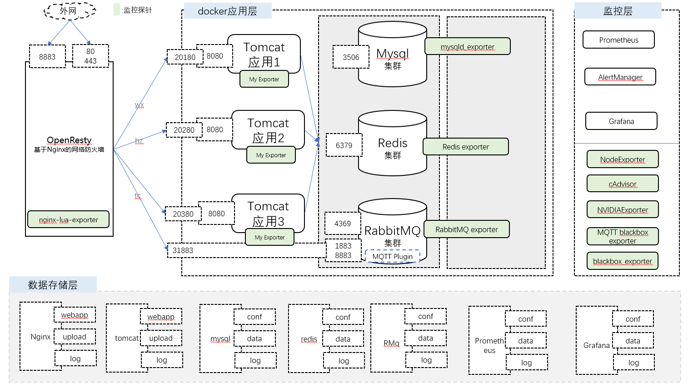
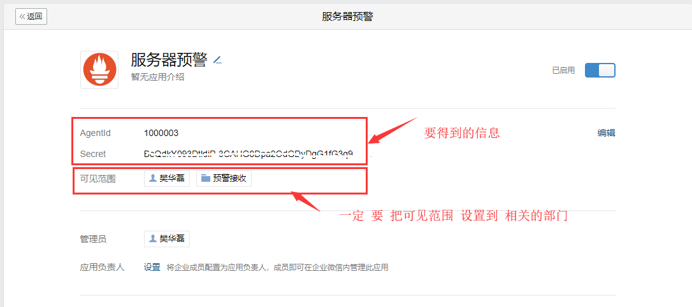
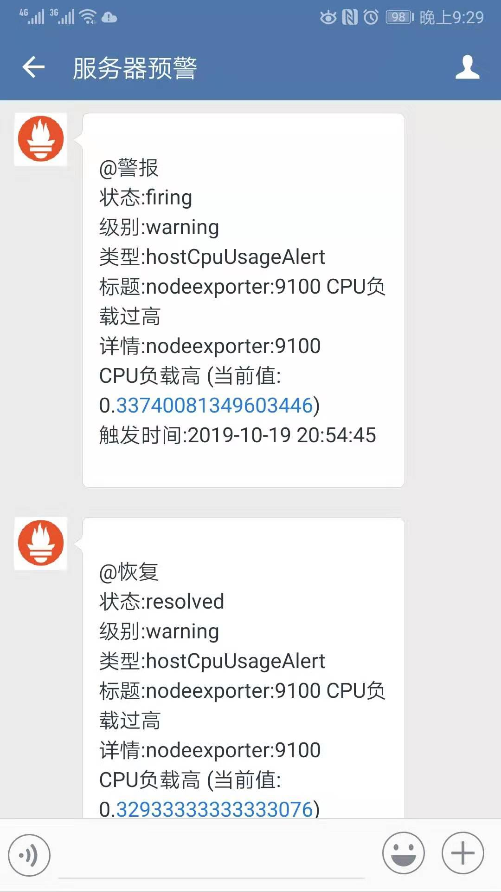
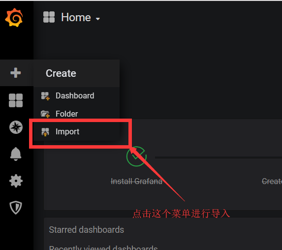
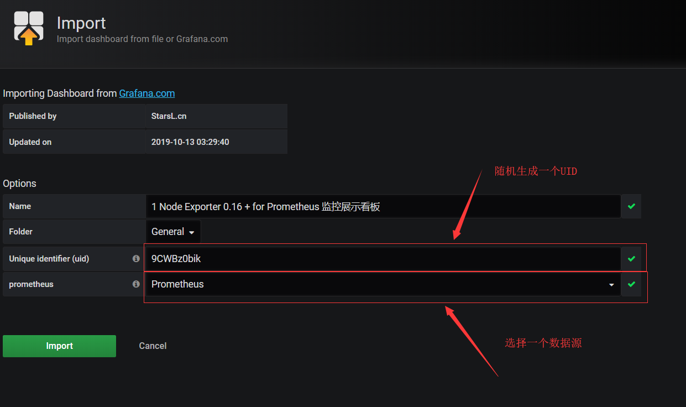
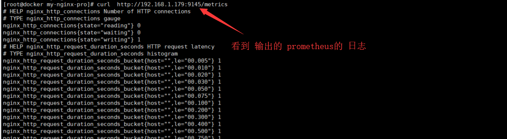
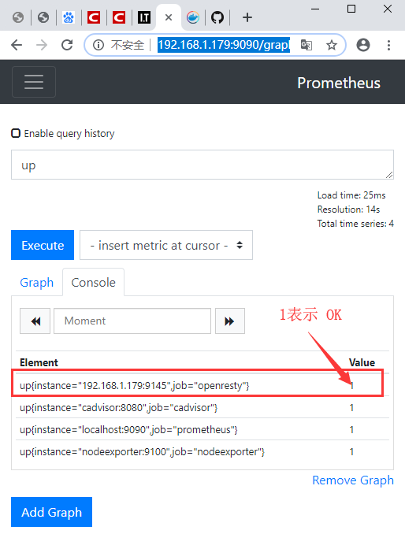

# 数据监控之具体案例

[参考网址](https://github.com/stefanprodan/dockprom)


# 1. 部署架构





按照监控的对象不同，分为三部分：

* 主机监控层
* 服务监控层
  * 服务组件监控：mysql redis rabbitmq
  * 自有业务监控:  需要在java程序中写监控代码 
* Nginx网关监控层


# 2. 主机监控层


## 2.0 常见问题

一些关键问题记录在这里


## 2.1 准备工作目录

### ① 定义工作目录

定义compose工作目录

```shell
mkdir /opt/my-monitor-pro 

cd /opt/my-monitor-pro
```


### ② 定义存储空间

如果是使用本地目录，docker-compose会自动建立。

如果使用nfs网络存储，需要重新挂载网络存储。


## 2.2 定义变量


```shell
cd /opt/my-monitor-pro
vi .env
```

> 文件内容

```properties
# 基础路径
DATA_PATH=/data/my-monitor-pro
```


## 2.3 组件配置

 

### 2.3.1 配置Prometheus

Prometheus的[Docker 网址](https://hub.docker.com/r/prom/prometheus) 说明很少，而[官方安装说明](https://prometheus.io/docs/prometheus/latest/installation/)功能描述也不完整。所以本次设置参考了[github上网友的方案](https://github.com/stefanprodan/dockprom)。

①②③④⑤⑥⑦⑧⑨


建立`prometheus`配置文件，今后用些文件生成`prometheus`容器。

#### ① 建立promethues目录

这个目录未来会被挂载到promethues系统中

```shell
mkdir prometheus
```


#### ② 配置prometheus.yml

```
vi prometheus/prometheus.yml
```


可以添加很多rules：

```
rule_files:  - /etc/prometheus/rules/*.rules
```


```yml
global:
  scrape_interval:     1m
  evaluation_interval: 1m

  # Attach these labels to any time series or alerts when communicating with
  # external systems (federation, remote storage, Alertmanager).
  external_labels:
      monitor: 'docker-host-alpha'

# Load and evaluate rules in this file every 'evaluation_interval' seconds.
rule_files:
  - "*.rules"

# A scrape configuration containing exactly one endpoint to scrape.
scrape_configs:
  - job_name: 'nodeexporter'
    scrape_interval: 15s
    static_configs:
      - targets: ['nodeexporter:9100']

  - job_name: 'cadvisor'
    scrape_interval: 15s
    static_configs:
      - targets: ['cadvisor:8080']

  - job_name: 'prometheus'
    scrape_interval: 15s
    static_configs:
      - targets: ['localhost:9090']


alerting:
  alertmanagers:
  - scheme: http
    static_configs:
    - targets: 
      - 'alertmanager:9093'

```


#### ③ 配置报警规则

`*.rules` 是报警规则文件


> 服务监控规则

```
vi prometheus/targets.rules
```


```yaml
groups:
- name: targets
  rules:
  # 监控服务宕机
  - alert: monitor_service_down
    expr: up == 0
    for: 30s
    labels:
      severity: critical
    annotations:
      summary: "监控服务停止监控"
      description: "监控服务 {{ $labels.instance }} 没有响应."
```


> 监控主机

```
vi prometheus/host.rules
```


```yaml
groups:
# 宿主机
- name: host
  rules:
  #CPU负载过高
  - alert: high_cpu_load
    expr: node_load1 > 1.5
    for: 30s
    labels:
      severity: warning
    annotations:
      summary: "{{ $labels.instance }}负载过高"
      description: "Docker宿主机当前负载过高, 每秒的平均负载是 {{ $value}}. 当前实例： {{ $labels.instance }} ，具体任务： {{ $labels.job }}."

  #这个是用来测试的
  - alert: hostCpuUsageAlert
    expr: sum(avg without (cpu)(irate(node_cpu_seconds_total{mode!='idle'}[5m]))) by (instance) > 0.3
    for: 1m
    labels:
      severity: warning
    annotations:
      summary: "{{ $labels.instance }} CPU负载过高"
      description: "{{ $labels.instance }} CPU负载过高 (当前值: {{ $value }})"


  # 内存使用过高
  - alert: high_memory_load
    expr: (sum(node_memory_MemTotal_bytes) - sum(node_memory_MemFree_bytes + node_memory_Buffers_bytes + node_memory_Cached_bytes) ) / sum(node_memory_MemTotal_bytes) * 100 > 85
    for: 30s
    labels:
      severity: warning
    annotations:
      summary: "{{ $labels.instance }} 内存快用完了"
      description: "{{ $labels.instance }} 使用了 {{ humanize $value}}%. 当前任务{{ $labels.job }}."
  
  # 判断磁盘空间 rootfs=本地磁盘路径  aufs=挂载磁盘空间
  - alert: high_storage_load
    expr: (node_filesystem_size_bytes{fstype="rootfs"} - node_filesystem_free_bytes{fstype="rootfs"}) / node_filesystem_size_bytes{fstype="rootfs"}  * 100 > 85
    for: 30s
    labels:
      severity: warning
    annotations:
      summary: "{{ $labels.instance }}存储空间不足"
      description: "{{ $labels.instance }}存储空间是 {{ humanize $value}}%. 当前任务 {{ $labels.job }}."
```


```
vi prometheus/containers.rules
```


```yaml
groups:
# 监控容器
- name: containers
  rules:
  # 某个容器当掉了
  - alert: jenkins_down
    expr: absent(container_memory_usage_bytes{name="jenkins"})
    for: 30s
    labels:
      severity: critical
    annotations:
      summary: "Jenkins宕机了"
      description: "Jenkins超过30秒没有响应了."

  # 某个容器的CPU过高	
  - alert: jenkins_high_cpu
    expr: sum(rate(container_cpu_usage_seconds_total{name="jenkins"}[1m])) / count(node_cpu_seconds_total{mode="system"}) * 100 > 10
    for: 30s
    labels:
      severity: warning
    annotations:
      summary: "Jenkins CPU使用率过高"
      description: "Jenkins CPU 当前使用率是 {{ humanize $value}}%."

  # 某个容器的内储存过高
  - alert: jenkins_high_memory
    expr: sum(container_memory_usage_bytes{name="jenkins"}) > 1200000000
    for: 30s
    labels:
      severity: warning
    annotations:
      summary: "Jenkins memory使用率过高"
      description: "Jenkins memory 使用率是 {{ humanize $value}}."
```

 

#### ④ 报警模板的测试

使用`promtool check rules`命令的来进行测试。

```shell
docker-compose exec prometheus ls /etc/prometheus/

docker-compose exec prometheus promtool check rules  /etc/prometheus/containers.rules

docker-compose exec prometheus promtool check rules  /etc/prometheus/host.rules

docker-compose exec prometheus promtool check rules  /etc/prometheus/targets.rules
```


### 2.3.2 配置alertmanager


#### ① 建立alertmanager目录

这个目录未来会被挂载到`alertmanager`系统中

```shell
mkdir alertmanager
```


#### ②  配置企业微信


从[企业微信官网](https://work.weixin.qq.com/)得到 `企业Id Agentid  Secret`





#### ③ 配置config.yml


```
vi alertmanager/config.yml
```


> config.yml

  

* 解决回复
  * `resolve_timeout`  默认值为`5m` , 分钟(`minute`)未接收到告警后标记，那么可能解决或者没有解决。
  * 如果收到的数据值小于报警值，那么会马上发送消息。
  * `send_resolved=true` 才返回解决信息。
* 路由匹配
  * 配置最深的匹配route截至，除非该节点**continue**为true
  * `match` `match_re` 分别`字符串验证` 与 `正则表达式`
* 告警分组
  * **group_wait**参数设置等待时间
  * **group_by**来定义分组规则
  * **group_interval**用于定义相同的Group之间发送告警通知的时间间隔
  * **repeat_interval** 如果警报已经成功发送通知, 想设置发送告警通知之前要等待时间


```yaml
#config.yml

 # 全局配置项
global:
  resolve_timeout: 5m
  wechat_api_corp_id: "ww61d97edebf566d2a"
  wechat_api_secret: "BeQdkY193DtldiP-3CAHG8Dpa2OdGDyDgG1fG3q9QWo"

  smtp_smarthost: 'smtp.21cn.com:25'
  smtp_from: 'runzhi_share@21cn.com'
  smtp_auth_username: 'runzhi_share@21cn.com'
  smtp_auth_password: '123'
  smtp_hello: '21cn.com'


templates:
- '*.msg'


route:
  group_by: ['alertname']
  group_wait: 10s
  group_interval: 10s
  repeat_interval: 3m
  receiver: 'wechat'
  #子路由
  routes:
  - receiver: 'email'
    match:
      severity: warning


receivers:
- name: 'wechat'
  wechat_configs:
  - agent_id: '1000003'
    message: '{{ template "wechat.msg" . }}'
    to_party: '2'
    send_resolved: true

- name: 'email'
  email_configs:
  - to: 'runzhi_share@21cn.com'
    html: '{{ template "email.msg" . }}'
    headers: { Subject: " {{ .CommonLabels.instance }} {{ .CommonAnnotations.summary }}" }

```


#### ④ 配置消息模板

这个模板语言不是那么好用，建议使用默认的，也就是不指定模板消息。默认的唯一的确定是英文的提示。


> 邮件模板

不建议用，因为邮箱经常被当作垃圾邮件。

```shell
vi alertmanager/email.msg
```


```
{{ define "email.msg" }}
{{ range .Alerts }}
 <pre>
实例: {{ .Labels.instance }}
信息: {{ .Annotations.summary }}
详情: {{ .Annotations.description }}
时间: {{ .StartsAt.Format "2006-01-02 15:04:05" }}
 </pre>
{{ end }}
{{ end }}
```


> 微信模板

```shell
vi wecaht.msg
```


```yaml
{{ define "wechat.msg" }}{{- if gt (len .Alerts.Firing) 0 -}}{{ range .Alerts }}
@警报
状态:{{ .Status }}
级别:{{ .Labels.severity }}
类型:{{ .Labels.alertname }}
标题:{{ .Annotations.summary }}
详情:{{ .Annotations.description }}
触发时间:{{ .StartsAt.Format "2006-01-02 15:04:05" }}
{{ end }}{{ end -}}{{- if gt (len .Alerts.Resolved) 0 -}}{{ range .Alerts }}
@恢复
状态:{{ .Status }}
级别:{{ .Labels.severity }}
类型:{{ .Labels.alertname }}
标题:{{ .Annotations.summary }}
详情:{{ .Annotations.description }}
触发时间:{{ .StartsAt.Format "2006-01-02 15:04:05" }}
恢复时间: {{ .EndsAt.Format "2006-01-02 15:04:05" }}
{{ end }}{{ end -}}{{- end }}
```


#### ⑤ 企业微信调试方法

如果收不到信息，可以先看看日志

```
docker-compose logs alertmanager
```

然后看看微信能不能收到信息

- [参考文档](https://blog.csdn.net/qq_36937234/article/details/96306900)
- [微信提供的调试地址](https://work.weixin.qq.com/api/devtools/devtool.php)


#### ⑥ 参考文档

* [关于微信与email写的比较全的文档](https://www.e-learn.cn/content/qita/2638665)
* [Prometheus官方关于微信的配置说明](https://prometheus.io/docs/alerting/configuration/#wechat_config)
* [一个关于Prometheus全面介绍的文档](https://songjiayang.gitbooks.io/prometheus/content/alertmanager/wechat.html)
* [Prometheus好多的文档](https://blog.csdn.net/coffin_monkey/article/category/8967165)
* [Prometheus官方文档中文版](https://github.com/Alrights/prometheus)

①②③④⑤⑥⑦⑧⑨


### 2.3.3 配置node-exporter

[hubDocker地址](https://hub.docker.com/r/prom/node-exporter/tags)

直接在compose文件中安装。


> 收集如下监控指标：

- node_boot_time：系统启动时间
- node_cpu：系统CPU使用量
- node*disk**：磁盘IO
- node*filesystem**：文件系统用量
- node_load1：系统负载
- node*memeory**：内存使用量
- node*network**：网络带宽
- node_time：当前系统时间
- go_*：node exporter中go相关指标
- process_*：node exporter自身进程相关运行指标


### 2.3.4 配置cadvisor

[cadvisor Hub-Docker 地址](https://hub.docker.com/r/google/cadvisor)


### 2.3.5 配置grafana

[grafanaHub-Docker 地址](https://hub.docker.com/r/grafana/grafana)

#### ① 配置Datasources

> 建立目录

```shell
mkdir -p grafana/datasources

```


> 配置**Prometheus.json**

```shell
vi grafana/datasources/Prometheus.json
```


```json
{
    "name":"Prometheus",
    "type":"prometheus",
    "url":"http://prometheus:9090",
    "access":"proxy",
    "basicAuth":false
}
```


#### ② 配置**Dashboards**

| 名称              | 说明                              |
| ----------------- | --------------------------------- |
| docker_containers | Docker整体性能检测                |
| docker_host       | 监控主机性能，CPU 内存 磁盘 网络  |
| monitor_services  | Prometheus服务的监控              |
| nginx_container   | Nginx监控，请求数 连接数 连接速率 |


> 建立目录

```shell
mkdir -p grafana/dashboards

```


> 下载或修改相关文件

```json
cd grafana/dashboards
wget https://raw.githubusercontent.com/stefanprodan/dockprom/master/grafana/dashboards/docker_containers.json

wget https://raw.githubusercontent.com/stefanprodan/dockprom/master/grafana/dashboards/docker_host.json

wget https://raw.githubusercontent.com/stefanprodan/dockprom/master/grafana/dashboards/monitor_services.json

wget https://raw.githubusercontent.com/stefanprodan/dockprom/master/grafana/dashboards/nginx_container.json
```


#### ③ 配置setup.sh

```
cd /opt/my-monitor-pro/grafana
wget https://raw.githubusercontent.com/stefanprodan/dockprom/master/grafana/setup.sh
```


#### ④ 改变权限

```
chmod 755 ./grafana/setup.sh
```


## 2.4 撰写Compose文件

[参考了这个网址](https://github.com/stefanprodan/dockprom)


```shell
cd /opt/my-monitor-pro
vi docker-compose.yml
```


```yml
version: '3'

networks:
  monitor-net:
    ipam:
      driver: default
      config:
        - subnet: "172.16.238.0/24"
        #- subnet: "2001:3984:3989::/64"      

  monitor-target:
    external:
      name: myapp_default

services:

  # prometheus
  prometheus:
    image: prom/prometheus:v2.13.1
    hostname: prometheus
    volumes:
      - ./prometheus/:/etc/prometheus/
      #- ${DATA_PATH}/prometheus/data/:/prometheus/
      - /etc/localtime:/etc/localtime:ro
    command:
      - '--config.file=/etc/prometheus/prometheus.yml'
      - '--storage.tsdb.path=/prometheus'
      - '--web.console.libraries=/etc/prometheus/console_libraries'
      - '--web.console.templates=/etc/prometheus/consoles'
      - '--storage.tsdb.retention.time=200h'
      - '--web.enable-lifecycle'      
    restart: unless-stopped
    expose:
      - 9090
    ports:
      - "9090:9090"  
    networks:
      - monitor-net
      - monitor-target
    labels:
      org.label-schema.group: "monitoring"


  # alertmanager 这个没有设置数据持久化
  alertmanager:
    image: prom/alertmanager:v0.19.0
    hostname: alertmanager
    volumes:
      - ./alertmanager/:/etc/alertmanager/
      - /etc/localtime:/etc/localtime:ro
    command:
      - '--config.file=/etc/alertmanager/config.yml'
      - '--storage.path=/alertmanager'
    restart: unless-stopped
    expose:
      - 9093
    ports:
      - "9093:9093"        
    networks:
      - monitor-net
    labels:
      org.label-schema.group: "monitoring"


  # nodeexporter
  nodeexporter:
    image: prom/node-exporter:v0.18.1
    hostname: nodeexporter
    volumes:
      - /proc:/host/proc:ro
      - /sys:/host/sys:ro
      - /:/rootfs:ro
      - /etc/localtime:/etc/localtime:ro
    command:
      - '--path.procfs=/host/proc'
      - '--path.rootfs=/rootfs'
      - '--path.sysfs=/host/sys'
      - '--collector.filesystem.ignored-mount-points=^/(sys|proc|dev|host|etc)($$|/)'
    restart: unless-stopped
    expose:
      - 9100
    networks:
      - monitor-net
    labels:
      org.label-schema.group: "monitoring"
      
  # cadvisor    
  cadvisor:
    image: google/cadvisor:v0.33.0
    hostname: cadvisor
    volumes:
      - /:/rootfs:ro
      - /var/run:/var/run:rw
      - /sys:/sys:ro
      - /var/lib/docker/:/var/lib/docker:ro
      - /dev/disk/:/dev/disk:ro
      - /etc/localtime:/etc/localtime:ro
    restart: unless-stopped
    expose:
      - 8080
    networks:
      - monitor-net
    labels:
      org.label-schema.group: "monitoring" 
      
      
  # grafana    
  grafana:
    #6.4.3 没有curl 所以执行setup.sh 会出现错误
    image: grafana/grafana:6.3.6
    hostname: grafana
    volumes:
      #- ${DATA_PATH}/grafana/data/:/var/lib/grafana/
      - ./grafana/datasources:/etc/grafana/datasources
      - ./grafana/dashboards:/etc/grafana/dashboards
      - ./grafana/setup.sh:/setup.sh
      - /etc/localtime:/etc/localtime:ro
    entrypoint: /setup.sh
    environment:
      - GF_SECURITY_ADMIN_USER=admin
      - GF_SECURITY_ADMIN_PASSWORD=admin
      - GF_USERS_ALLOW_SIGN_UP=false
    restart: unless-stopped
    expose:
      - 3000
    ports:
      - "3000:3000"        
    networks:
      - monitor-net
    labels:
      org.label-schema.group: "monitoring"
  
  
  # mysql-exporter    
  mysql-exporter:
    image: prom/mysqld-exporter
    hostname: mysql-exporter
    volumes:
      - /etc/localtime:/etc/localtime:ro
    environment:
      - DATA_SOURCE_NAME="exporter:ex-123456@(192.168.1.179:3306)/"      
    restart: unless-stopped
    expose:
      - 9104
    networks:
      - monitor-net
    labels:
      org.label-schema.group: "monitoring"   
  
```

## 2.5 生成容器


```shell
docker-compose up -d
```


## 2.6 单元测试


### 2.6.1 测试Prometheus


#### ① 访问管理界面

访问9090端口，看看能不能打开

```
http://192.168.1.179:9090/graph
```


#### ② 数据持久化测试(未通过)

还不知道怎么做呢


### 2.6.2 测试alertmanager


#### ① 访问管理界面

访问9093端口，看看能不能打开

```
http://192.168.1.179:9093
```


#### ② 测试警报流程

手动拉高系统的CPU使用率

```shell
cat /dev/zero>/dev/null
```

分别测试报警与报警取消的状态。




### 2.6.3 测试grafana

#### ① 访问管理界面

访问3000端口，看看能不能打开

```
http://192.168.1.179:3000
```


#### ② 下载Dashboard

>  点击导入菜单





> 进行简单配置




#### ③ 常用模板介绍

* Node Exproter
  * [Node Exporter模板-外语很全-*Node Exporter Full*](https://grafana.com/grafana/dashboards/1860)
  * [Node Exporter模板-外语-*Node Exporter Server Metrics*-一般虽然评分高](https://grafana.com/grafana/dashboards/405)

* Docker

  * [Docker监控模板-*Docker and system monitoring*](https://grafana.com/grafana/dashboards/893)

  * [Docker监控模板-简洁型-*Docker and Host Monitoring w/ Prometheus*](https://grafana.com/grafana/dashboards/179)

  * [Docker监控模板-刚更新-检索条件做的不错-**Docker Container & Host Metrics**](https://grafana.com/grafana/dashboards/10619)


# 3. Nginx网关监控层

`lua`模式需要自己来定义传输数据，这样足够灵活，但是工作量大。

prometheus推荐两种监控方式 lua或vts，这里使用lua方式，要使用lua方式，需要引入openresty这个nginx的发行版本。

>  引入openresty的初衷

* 老罗在锤子手机发布会推荐了，听说不错。
* 懒的配置nginx lua环境了
* 听说这个版本会覆盖掉nginx-plus收费版本的功能。


## 3.1 配置Nginx监控

* [nginx-lua-prometheus官方网址](https://github.com/knyar/nginx-lua-prometheus)
* 官方的网址能统计的信息很少。并且不多于。所以有人扩展这部分
  * [参考了这个网址](https://github.com/zrbcool/prometheus-lua-nginx/blob/master/workdir/conf.d/counter.conf)


### ① 下载lua脚本

```shell
cd /opt/my-nginx-pro/nginx/lua.d
wget https://raw.githubusercontent.com/knyar/nginx-lua-prometheus/master/prometheus.lua
```


### ② 添加Server

官网上说要修改`nginx.conf`，实际上只用添加到`prometheus.conf`中就行。

```
vi nginx/conf.d/prometheus.conf
```


* `allow `   `deny`  在具体应用中应该看看怎么修改

> 下面这个是官网的教程

官网的教程包含的内容太少，需要自己定义来增加相关内容。

```shell
lua_shared_dict prometheus_metrics 10M;
lua_package_path "/etc/nginx/lua.d/?.lua;;";
init_by_lua '
  prometheus = require("prometheus").init("prometheus_metrics")
  metric_requests = prometheus:counter(
    "nginx_http_requests_total", "Number of HTTP requests", {"host", "status"})
  metric_latency = prometheus:histogram(
    "nginx_http_request_duration_seconds", "HTTP request latency", {"host"})
  metric_connections = prometheus:gauge(
    "nginx_http_connections", "Number of HTTP connections", {"state"})
';
log_by_lua '
  metric_requests:inc(1, {ngx.var.server_name, ngx.var.status})
  metric_latency:observe(tonumber(ngx.var.request_time), {ngx.var.server_name})
';


server {
  listen 9145;
  #allow 192.168.0.0/16;
  #deny all;
  location /metrics {
    content_by_lua '
      metric_connections:set(ngx.var.connections_reading, {"reading"})
      metric_connections:set(ngx.var.connections_waiting, {"waiting"})
      metric_connections:set(ngx.var.connections_writing, {"writing"})
      prometheus:collect()
    ';
  }
}

```


> 自定义增加的内容


```shell
lua_shared_dict prometheus_metrics 10M;
lua_package_path "/etc/nginx/lua.d/?.lua;;";
init_by_lua '
  prometheus = require("prometheus").init("prometheus_metrics")
  metric_requests = prometheus:counter(
    "nginx_http_requests_total", "Number of HTTP requests", {"host", "status"})
metric_latency = prometheus:histogram("nginx_http_request_duration_seconds", "HTTP request latency status", {"host","server_port", "status", "scheme", "method", "endpoint", "fullurl","remote_addr","body_bytes_sent"})
  metric_connections = prometheus:gauge(
    "nginx_http_connections", "Number of HTTP connections", {"state"})
';
log_by_lua '
  metric_requests:inc(1, {ngx.var.server_name, ngx.var.status})
  local host = ngx.var.host
  local fullurl = ngx.unescape_uri(ngx.var.uri)
  local status = ngx.var.status
  local scheme = ngx.var.scheme
  local method = ngx.var.request_method
  local remote_addr = ngx.var.remote_addr
  local body_bytes_sent = ngx.var.body_bytes_sent
  local latency = ngx.var.upstream_response_time or 0
  local server_port = ngx.var.server_port 
  local _, _,  endpoint = string.find(fullurl, "(/[.%w_-]*)")

  metric_latency:observe(tonumber(latency), {host,server_port, status, scheme, method, endpoint, fullurl,remote_addr,body_bytes_sent})
';


server {
  listen 9145;
  #allow 192.168.0.0/16;
  #deny all;
  location /metrics {
    content_by_lua '
      metric_connections:set(ngx.var.connections_reading, {"reading"})
      metric_connections:set(ngx.var.connections_waiting, {"waiting"})
      metric_connections:set(ngx.var.connections_writing, {"writing"})
      prometheus:collect()
    ';
  }
}
```


### ③ 重启Nginx


```shell
# 一般要执行下面文件，检查以下
docker-compose exec nginx nginx -t

# 然后再执行配置文件
docker-compose exec nginx nginx -s reload
```


### ④ 测试


> 在浏览器无法访问

```
http://192.168.1.179:9145/metrics
```


> 在外网通过浏览器也无法访问


> 执行下面命令，可以看到结果

```shell
curl  http://192.168.1.179:9145/metrics
```




## 3.2 配置 Prometheus


### ① Nginx宿主机上开放防火墙

> 参考文档

* [如何开放防火墙](https://www.e-learn.cn/content/qita/2352883)
* [centos7之firewalld规则详解（二）](https://blog.csdn.net/aizhen_forever/article/details/78396765)


`9145`默认是不能容器访问的，因为没有打开防火墙。怎么对内部的iP地址开放，又不让外网访问？

* 监控容器的IP地址是可以查看的。
* 宿主机防火墙，可以针对某些IP地址开放。
  * 容器的IP地址被固定在这个范围内了`172.16.238.0/24`

```shell
#查看所有打开的端口： 
firewall-cmd --zone=public --list-ports

# 针对一个ip段访问
firewall-cmd --permanent --add-rich-rule="rule family="ipv4" source address="172.16.238.0/24" port protocol="tcp" port="9145" accept"

firewall-cmd --permanent --add-rich-rule="rule family="ipv4" source address="172.16.238.0/24" port protocol="tcp" port="3306" accept"

firewall-cmd --permanent --add-rich-rule="rule family="ipv4" source address="172.30.0.1" port protocol="tcp" port="3306" accept"

firewall-cmd --zone=public --add-port=3306/tcp --permanent


#更新防火墙规则： 
firewall-cmd --reload

#查看规则
firewall-cmd --list-rich-rules

```


### ② 修改prometheus.yml

```
vi prometheus/prometheus.yml
```

追加:

```
  - job_name: 'openresty'
    scrape_interval: 15s
    static_configs:
      - targets: ['192.168.1.179:9145']
```


### ③ 测试

打开浏览器：http://192.168.1.179:9090/graph

输入`UP`，看结果。




> 如果出现错误，那么可能是网络的问题，下面有具体的方法

```shell
# 登陆到prometheus
docker-compose exec prometheus ash
> wget 192.168.1.179:9145/metrics
```


## 3.3 配置 Grafana

### ①  打开Grafana

http://192.168.1.179:3000


### ② 网上导入Dashboards脚本

https://grafana.com/grafana/dashboards

添加dashboards
点击`Create` - `Import`，输入`dashboards的id（推荐462）`

| 编号                    | 说明                     |
| ----------------------- | ------------------------ |
| 462                     | 要修改一下，不然没有数据 |
| 10223                   | 直接出数据               |
| 10442,10443,10444,10445 | 这个是优化后数据的报表   |

以上报表总体来说，都要修改。


# 4. Mysql监控


## 4.1 配置网络

当前遇到一个问题，`myapp` 与 `my-monitor-pro`分别属于docker的不同`network`，所以这两个docker群里面的容器是不能互相访问的，那该怎么办呢？

有两种方法：

* 方法1：`给my-monitor-pro`分配可以访问`myapp`的`network`。 
  * 有点省事，不用开放防火墙端口了。
  * 缺点只能用在一台机器。
* 方法2：将Mysql映射到宿主机端口，这样就可以访问了。
  * 缺点：要配置防火墙，另外还要指定IP才可以访问。


### 4.1.1 方法1：增加network


#### ① 修改监控docker-compose


```yaml
version: '3'

networks:
  monitor-net:
    ipam:
      driver: default
      config:
        - subnet: "172.16.238.0/24"
        #- subnet: "2001:3984:3989::/64"      
  #追加了现存网络
  monitor-target:
    external:
      name: myapp_default 

services:

  # prometheus
  prometheus:
    image: prom/prometheus:v2.13.1
    hostname: prometheus
##################省略的配置######################################
#只用在prometheus中添加，要监控的network:monitor-target
    networks:
      - monitor-net
      - monitor-target
##################省略的配置######################################      
```


#### ② 测试是否联通

```shell
# 以root登陆到容器中，不然prometheus登录默认的用户是nobody
docker-compose exec -u root  prometheus ash
> ping mysql
```

*当然也可以用普通用户登录到容器中，然后把ping权限付给普通用户，不推荐这么来做，如果要做，[可以看这个文档](https://blog.csdn.net/wyongqing/article/details/80638135)*


### 4.1.2 方法2：访问宿主机端口

这个操作与Nginx的访问相同，具体做法如下：

* 将mysql的端口映射到宿主机上。
* 修改宿主的防火墙，只让`监控容器`的IP地址段可以访问。
* 进行测试。（需要使用mysql客户端，或者telent）


## 4.2 配置Mysql

下面的代码，在配置Mysql的时候，已经做为初始化脚本自动生成了。所以不用操作了。


下面只是一个示意操作步骤，详情看[Mysql初始化脚本](docker-example.md)

> 添加一个用户

```sql
CREATE USER 'exporter'@'%' IDENTIFIED BY '123456' WITH MAX_USER_CONNECTIONS 3;
GRANT PROCESS, REPLICATION CLIENT, SELECT ON *.* TO 'exporter'@'%';
```

*注意：建议为用户设置最大连接限制，以避免在重负载下监视碎片以免服务器过载。并非所有MySQL / MariaDB版本都支持此功能。例如，MariaDB的10.1（提供与Ubuntu 18.04）[并不支持此功能](https://mariadb.com/kb/en/library/create-user/#resource-limit-options)。*


> 在真实环境中

为了安全，只能监控的主机才能访问

```
'exporter'@'%'  变更成  'exporter'@'172.16.238.0/24'
```


## 4.3 配置Mysql Exporter

[mysqld-exporter Hub-Docker地址](https://hub.docker.com/r/prom/mysqld-exporter)


详细配置见：[2.4 撰写Compose文件](#2.4 撰写Compose文件)

```shell	
docker-compose exec -u root  mysql-exporter ash

> ping -c 2 mysql
172.18.0.3
> wget localhost:9104/metrics


docker-compose logs  mysql-exporter
```

​      - DATA_SOURCE_NAME="exporter:ex-123456@(172.18.0.3:3306)/wk"


vi 

## 4.4 配置Prometheus


## 4.5 配置Grafana


①②③④⑤⑥⑦⑧⑨

# 参考文档


* 官方文档
  * [Exporter列表](https://prometheus.io/docs/instrumenting/exporters/)
  * [官方Docker地址](https://hub.docker.com/u/prom)
* 网友
  * [中文文档](https://yunlzheng.gitbook.io/prometheus-book/)


