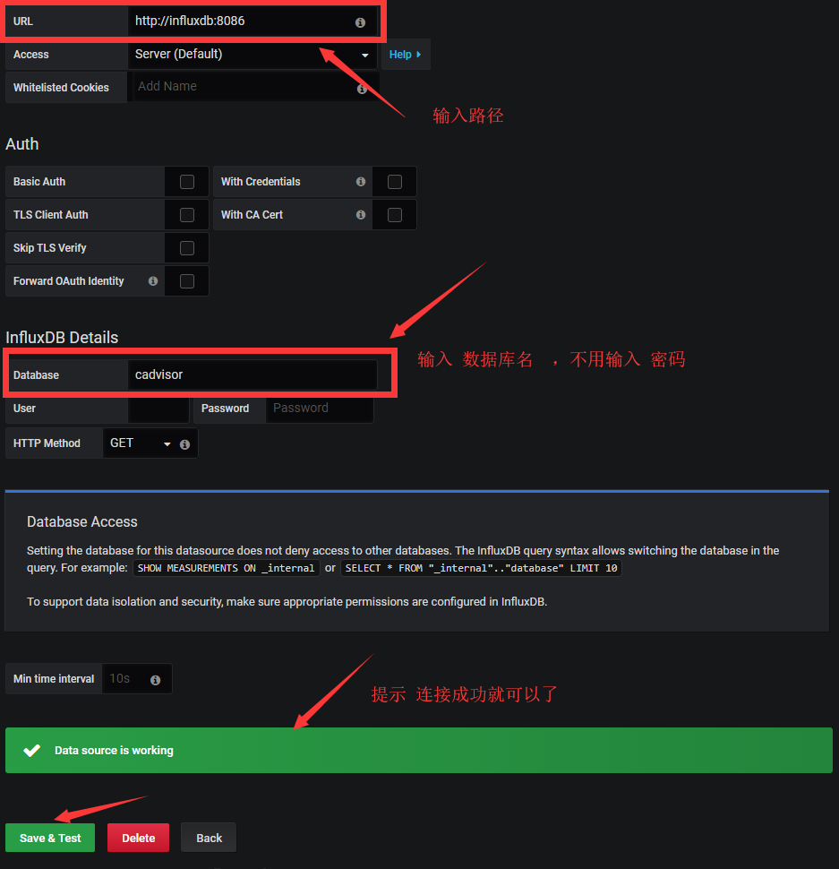

# 监控的组合派

`cAdvisor+InfluxDB+Grafana`


# 1 安装


## 1.1 建立工程目录

```shell
mkdir -p /opt/my-monitor
cd /opt/my-monitor
```


## 1.2 编写comfose文件


```shell
vi docker-compose.yml
```


```yml
version: '3'
services:

  influxdb:
    hostname: influx
    restart: always
    image: influxdb:1.5-alpine
    environment:
      #初始化一个数据库
      INFLUXDB_DB: cadvisor
    ports:
      - "8086:8086"
    volumes:
      - /data/my-monitor/influxdb:/var/lib/influxdb
      - /etc/localtime:/etc/localtime:ro  
      
      
  grafana:
    hostname: grafana
    restart: always
    image: grafana/grafana
    volumes:
      - /data/my-monitor/grafana/data:/var/lib/grafana
      - /etc/localtime:/etc/localtime:ro    
    ports:
      - "3000:3000"
    depends_on:
      - influxdb

        
  cadvisor:
    hostname: cadvisor
    restart: always  
    image: google/cadvisor
    ports:
      - "8080:8080"
    environment:
      detach: 'true'
    #连接influxdb,influxdb默认是没有密码的
    command: -storage_driver=influxdb -storage_driver_db=cadvisor -storage_driver_host=influxdb:8086  
    volumes:
      - /:/rootfs:ro
      - /var/run:/var/run:rw
      - /sys:/sys:ro
      - /var/lib/docker/:/var/lib/docker:ro
      - /dev/disk/:/dev/disk:ro
      - /etc/localtime:/etc/localtime:ro    
    depends_on:
      - influxdb
       
     
```

​    

## 1.3  生成容器

```shell
docker-compose up -d
```


## 1.4  测试

- 在浏览器中访问
  - [http://192.168.1.179:3000](http://192.168.1.179:3000/)

> 默认密码是：admin admin




# 2 单元测试


## 2.1 influx


> 参考网址

- [官方说明文档](https://github.com/docker-library/docs/tree/master/influxdb)


> 管理界面已经不能使用了

adminstrator 在1.3 版本时就被删除了，所以`8083:8083`没有用了


> 初始化数据库

可以通过命令参数来进行。 


> 用户权限

influx默认是没有 权限认证的，可以启动，也可以使用命令参数来启动。


> 持久化

```
-v $PWD:/var/lib/influxdb
```


> 基本命令

也可以登录到系统中使用shell脚本

```
# 登录到数据库中
docker-compose exec influxdb influx

# 创建数据库
> create database <test_name>
> show databases
# 使用某个数据库
> use <test_name>
# SHOW measurements命令查看所有的表，这个类似于mysql下的 show tables;
> SHOW MEASUREMENTS;
# 查询全部数据
> SELECT * FROM <measurement_name> ORDER BY time DESC LIMIT 3
```

[influxdb 数据库的简单使用](https://xiexianbin.cn/database/influxdb/2018-04-09-influxdb/)


## 2.2 cadvisor

用来将采集的数据发送到influx数据库


> 参考网址

- [官方说明文档](https://github.com/google/cadvisor)


> 访问地址

可以看到一个UI界面

http://192.168.1.179:8080


## 2.3  grafana


> 参考网址

- [官方说明grafana](https://hub.docker.com/r/grafana/grafana)
- [安装说明](https://grafana.com/docs/installation/docker/)


> 持久化存储

```bash
-v grafana-storage:/var/lib/grafana \
```


> 可以安装插件


> 密码可以从文件中读取


## 2.4  其他参考网址

https://www.cnblogs.com/Cherry-Linux/p/9144650.html


# 3 grafana详细配置 


## 3.1 常用模板

[通过官网模板轻松实现Grafana的可视化界面配置（以MySQL监控项为例）](https://www.cnblogs.com/xuliuzai/p/11134714.html)


[利用谷歌开源工具cAdvisor 结合influxdb存储＋Grafana前端展示进行Docker容器的监控](https://www.cnblogs.com/hanyifeng/p/6233851.html)

## 3.2 基本使用


# 参考网址

- 详细说明： [cAdvisor+InfluxDB+Grafana 监控Docker](https://www.cnblogs.com/zhujingzhi/p/9844558.html)
- 监控软件对比：http://dockone.io/article/397


[Docker监控套件(Telegraf+Influxdb+Grafana)研究与实践](https://www.jianshu.com/p/378d0005c0a4)


