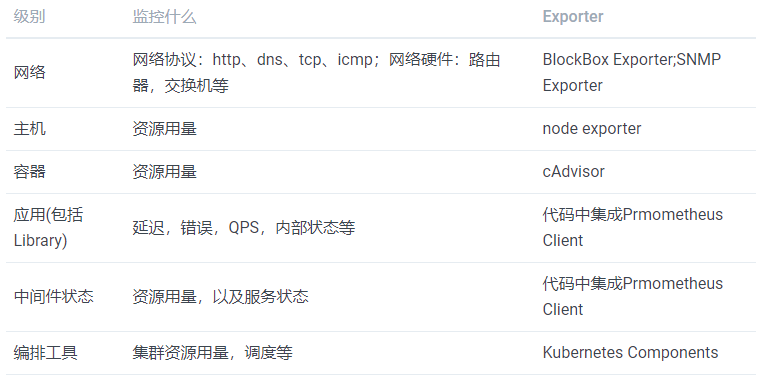
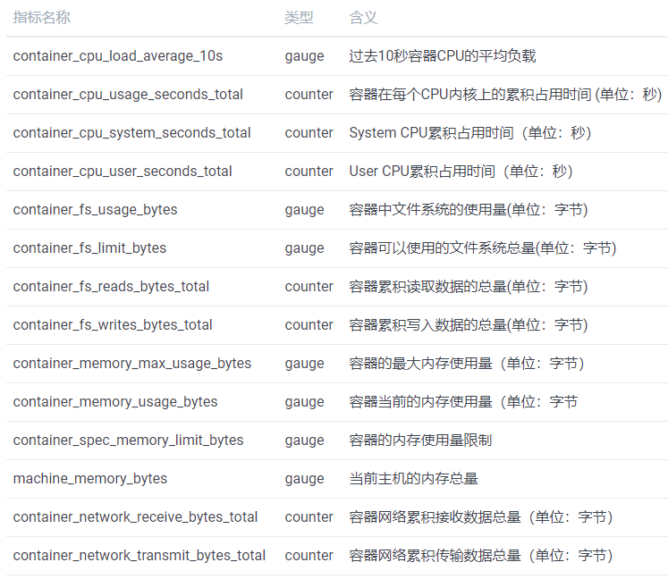

# 系统监控-基础概念

*"You can't fix what you can't see"。可视化是监控的核心目标之一*


[TOC]


# 1 技术选型


##  1.1 相关工具分析

基于Docker的系统监控软件与解决方案很多，要选择一款合适自己的很不容易。下面列出一些基本组件的特点，以便参考


### ① Prometheus 派

[中文文档](https://yunlzheng.gitbook.io/prometheus-book/)

Prometheus现在很火，成为k8s官方监控方案，自成体系，不用再去找其他的组件。唯一一个是可以使用grafana来展示报表。

```
Prometheus从2016年加入CNCF，到2018年8月毕业，现在已经成为Kubernetes的官方监控方案。

Prometheus可以从Kubernetes集群的各个组件中采集数据，比如kubelet中自带的cadvisor，api-server等，而node-export就是其中一种来源

Exporter是Prometheus的一类数据采集组件的总称。它负责从目标处搜集数据，并将其转化为Prometheus支持的格式。与传统的数据采集组件不同的是，它并不向中央服务器发送数据，而是等待中央服务器主动前来抓取，默认的抓取地址为[http://CURRENT_IP:9100/metrics](http://current_ip:9100/metrics)
```

> 主要组件介绍

| 名称              | 说明                                                         | 备注                                       |
| ----------------- | ------------------------------------------------------------ | ------------------------------------------ |
| Prometheus        | 集成采集、存储（支持多种时序数据库）、页面展示与一体的监控工具 | Prometheus在开源社区也十分活跃，gitHub 27K |
| node-exporter     | 采集服务器层面的运行指标，包括机器的loadavg、filesystem、meminfo等基础监控，类似于传统主机监控维度的zabbix-agent |                                            |
| Blackbox_exporter | 探测：icmp、tcp、http(get\post)、dns、ssl证书过期时间        |                                            |
|                   |                                                              |                                            |
|                   |                                                              |                                            |
|                   |                                                              |                                            |


### ② 组合派

各个网友根据自己的喜好来组合出来的监控组合，有些已经不流行了。

比较常见的有：

* [cAdvisor+InfluxDB+Grafana 监控Docker](https://www.cnblogs.com/zhujingzhi/p/9844558.html)
* [Telegraf+InfluxDB+Grafana搭建服务器监控平台](https://blog.csdn.net/w958660278/article/details/80484486)


| 名称             | 说明                                                         | 备注                                                         |
| ---------------- | ------------------------------------------------------------ | ------------------------------------------------------------ |
| 使用命令行监控   | top ; docker stats 容器名；                                  |                                                              |
| cAdvisor         | docker的采集器                                               | Google提供的                                                 |
| InfluxDB         | 时序数据库                                                   |                                                              |
| Grafana          | 页面展示工具                                                 | gitHub 31K                                                   |
|                  |                                                              |                                                              |
| Heapster(废弃了) | k8s的监控工具                                                | 被废弃了，Google提供的。k8s1.11版本及以上默认使用metric-server |
| Telegraf         | [可收集系统和服务的统计数据](https://cloud.tencent.com/developer/news/377267) | 可以扩展其他内容，Telegraf是influxdata公司的时间序列平台TICK技术栈中的“T”。 |
| ELK              | [日志采集](https://www.jianshu.com/p/d7fdb0917530)           | ElasticSearch、Logstash、Kibana ，Beats                      |
|                  |                                                              |                                                              |


## 1.2 需求描述

* 用的人很多，现在很活跃
* 使用简单
* 消耗服务器性能低
* 可以监控主机信息cup 内存等
* 可以监控docker，K8s
* 可以监控服务，例如:mysql 等
* 可以监控网络流量等


## 1.3 选型总结

* **首推**：`Prometheus+Grafana`
  * 太流行了，集成度高，啥都能监控
* **其次**：`Telegraf+InfluxDB+Grafana`
  * `telegraf`可以监控第三方
* **最后**：`cAdvisor+InfluxDB+Grafana`
  * `cAdivso`是`google K8s`标配


## 1.4 参考文档

* 各个监控工具介绍
  * [容器监控工具方案对比](https://blog.csdn.net/u013289746/article/details/79290512)
* Prometheus
  * [容器监控实践—node-exporter](https://www.jianshu.com/p/e3c9fc929d8a)
  * [Prometheus 监控之 Blackbox_exporter黑盒监测 [icmp、tcp、http(get\post)、dns、ssl证书过期时间]](https://blog.csdn.net/qq_25934401/article/details/84325356)

* grafana模板
  * [*Prometheus*+*Node Exporter CPU 内存 磁盘 IO 网络 流量 温度等监控指标*](https://grafana.com/grafana/dashboards/8919)
  * [Prometheus Blackbox Exporter的TCP，ICMP，HTTPS服务状态监控](https://grafana.com/grafana/dashboards/9965)
  * [*Docker and system monitoring*](https://grafana.com/grafana/dashboards/893)


# 2. Prometheus

[Prometheus中文教程](https://yunlzheng.gitbook.io/prometheus-book/)

## 2.1 架构说明


### ① Prometheus Server


| 名称               | 说明                                                         |
| ------------------ | ------------------------------------------------------------ |
| Prometheus Server  | 是Prometheus组件中的核心部分，负责实现对监控数据的获取，存储以及查询。 |
| Service Discovery  | 动态管理监控目标，并从这些监控目标中获取数据。               |
| Storage            | 一个时序数据库，将采集到的监控数据按照时间序列的方式存储在本地磁盘当中 |
| PromQL             | 实现对数据的查询以及分析                                     |
| Express Browser UI | 内置UI,直接通过PromQL实现数据的查询以及可视化。              |
| 集群配置           | 可以从其他的Prometheus Server实例中获取数据                  |


### ② Exporters

Prometheus Server通过访问该Exporter提供的Endpoint端点HTTP服务，即可获取到需要采集的监控数据。

Exporters类型

| 分类                                       | 说明                                                         |
| ------------------------------------------ | ------------------------------------------------------------ |
| **直接采集**：内置了对Prometheus监控的支持 | 比如cAdvisor，Kubernetes，Etcd，Gokit等，都直接内置了用于向Prometheus暴露监控数据的端点。 |
| **间接采集**：并不直接支持Prometheus       | 需要通过Prometheus提供的Client Library编写该监控目标的监控采集程序。例如： Mysql Exporter，JMX Exporter，Consul Exporter等。 |


### ③ AlertManager

AlertManager即Prometheus体系中的告警处理中心。

AlertManager管理告警的后续处理流程。可以与邮件，Slack等等内置的通知方式进行集成，也可以通过Webhook自定义告警处理方式。


### ④ PushGateway

Prometheus Server不能Exporter进行通信时，可以利用PushGateway来进行中转。

将内部网络的监控数据主动Push到Gateway当中，Prometheus Server则以Pull的方式从PushGateway中获取到监控数据。


## 2.2 PromQL介绍


### ① 数据模型

Prometheus可以采集到当前主机所有监控指标的样本数据。

```
# HELP node_cpu Seconds the cpus spent in each mode.
# TYPE node_cpu counter
node_cpu{cpu="cpu0",mode="idle"} 362812.7890625
# HELP node_load1 1m load average.
# TYPE node_load1 gauge
node_load1 3.0703125
```

在time-series中的每一个点称为一个样本（sample），样本由以下三部分组成：

- 指标(metric)：metric name和描述当前样本特征的labelsets;
- 时间戳(timestamp)：一个精确到毫秒的时间戳;
- 样本值(value)： 一个float64的浮点型数据表示当前样本的值。

```
<--------------- metric ---------------------><-timestamp -><-value->http_request_total{status="200", method="GET"}@1434417560938 => 94355http_request_total{status="200", method="GET"}@1434417561287 => 94334
http_request_total{status="404", method="GET"}@1434417560938 => 38473http_request_total{status="404", method="GET"}@1434417561287 => 38544
http_request_total{status="200", method="POST"}@1434417560938 => 4748http_request_total{status="200", method="POST"}@1434417561287 => 4785
```


### ② Metrics类型

Prometheus定义了4中不同的指标类型(metric type)：Counter（计数器）、Gauge（仪表盘）、Histogram（直方图）、Summary（摘要）。


> Counter：只增不减的计数器

只增不减（除非系统发生重置），目的**了解产生速率的变化**。

常见的监控指标：

* http_requests_total
* node_cpu  
* 在应用程序中记录某些事件发生的次数

*一般在定义Counter类型指标的名称时推荐使用_total作为后缀。*


例如，通过PromQL内置的rate()函数获取HTTP请求量的增长率：

```
rate(http_requests_total[5m])
```

查询当前系统中，访问量前10的HTTP地址：

```
topk(10, http_requests_total)
```


> Gauge：可增可减的仪表盘

目的：反应系统的当前状态。

常见指标如：

* node_memory_MemFree（主机当前空闲的内容大小）
* node_memory_MemAvailable（可用内存大小）。


通过Gauge指标，用户可以直接查看系统的当前状态：

```
node_memory_MemFree
```

通过PromQL内置函数delta()可以获取样本在一段时间返回内的变化情况。例如，计算CPU温度在两个小时内的差异：

```
delta(cpu_temp_celsius{host="zeus"}[2h])
```

还可以使用deriv()计算样本的线性回归模型，甚至是直接使用predict_linear()对数据的变化趋势进行预测。例如，预测系统磁盘空间在4个小时之后的剩余情况：

```
predict_linear(node_filesystem_free{job="node"}[1h], 4 * 3600)
```


> 使用Histogram和Summary分析数据分布情况

Histogram和Summary主用用于统计和分析样本的分布情况。

按照请求延迟的范围进行分组。例如，统计延迟在0~10ms之间的请求数有多少而10~20ms之间的请求数又有多少。通过这种方式可以快速分析系统慢的原因。

通过Histogram和Summary类型的监控指标，我们可以快速了解监控样本的分布情况。

[详细内容见](https://yunlzheng.gitbook.io/prometheus-book/parti-prometheus-ji-chu/promql/prometheus-metrics-types#shi-yong-histogram-he-summary-fen-xi-shu-ju-fen-bu-qing-kuang)


### ③ 深入PromQL

Prometheus通过指标名称（metrics name）以及对应的一组标签（labelset）唯一定义一条时间序列。指标名称反映了监控样本的基本标识，而label则在这个基本特征上为采集到的数据提供了多种特征维度。用户可以基于这些特征维度过滤，聚合，统计从而产生新的计算后的一条时间序列。[详细介绍](https://yunlzheng.gitbook.io/prometheus-book/parti-prometheus-ji-chu/promql/prometheus-query-language)

* PromQL基本操作
* PromQL操作符
* PromQL聚合操作
* PromQL内置函数
* 在HTTP API中使用PromQL


### ④ 4个黄金指标和USE方法

> 一些常用的监控维度




> 4个黄金指标

四种类型的指标：延迟，通讯量，错误以及饱和度：

* 延迟：服务请求所需时间。
* 通讯量：监控当前系统的流量，用于衡量服务的容量需求。
* 错误：监控当前系统所有发生的错误请求，衡量当前系统错误发生的速率。
* 饱和度：衡量当前服务的饱和度。


主要关注以下三种关键指标：

- (请求)速率：服务每秒接收的请求数。
- (请求)错误：每秒失败的请求数。
- (请求)耗时：每个请求的耗时。


> USE方法

USE方法主要关注与资源的：使用率(Utilization)、饱和度(Saturation)以及错误(Errors)。

- 使用率：关注系统资源的使用情况。 这里的资源主要包括但不限于：CPU，内存，网络，磁盘等等。100%的使用率通常是系统性能瓶颈的标志。
- 饱和度：例如CPU的平均运行排队长度，这里主要是针对资源的饱和度(注意，不同于4大黄金信号)。任何资源在某种程度上的饱和都可能导致系统性能的下降。
- 错误：错误计数。例如：“网卡在数据包传输过程中检测到的以太网网络冲突了14次”。

通过对资源以上指标持续观察，通过以下流程可以知道用户识别资源瓶颈：


## 2.3 告警处理

>  **告警能力在Prometheus的架构中被划分成两个独立的部分**

* 通过在Prometheus中定义AlertRule（告警规则）
* 如果满足告警触发条件就会向Alertmanager发送告警信息。


> **一条告警规则主要由以下几部分组成：**

* 告警名称：
  * 用户需要为告警规则命名，需要能够直接表达出该告警的主要内容

* 告警规则：
  * 告警规则实际上主要由PromQL进行定义，查询结果持续多长时间（During）后出发告警.


> **Alertmanager作为一个独立的组件，具体功能有:**

* 消除重复的告警信息
* 对告警信息进行分组并且路由到正确的通知方
* 内置了对邮件，Slack等多种通知方式的支持
* 支持与Webhook的集成
  * Webhook与钉钉机器人进行集成
  * Webhook与微信机器人进行集成
* 静默和告警抑制机制对告警通知行为进行优化
  * 抑制是指当某一告警发出后，可以停止重复发送由此告警引发的其它告警的机制。
  * 静默提供了一个简单的机制可以快速根据标签对告警进行静默处理。
  * 静默设置需要在Alertmanager的Werb页面上进行设置。


### ① 自定义告警规则

为了能够让Prometheus能够启用定义的告警规则，我们需要在Prometheus全局配置文件中通过**rule_files**指定一组告警规则文件的访问路径，Prometheus启动后会自动扫描这些路径下规则文件中定义的内容，并且根据这些规则计算是否向外部发送通知。


>  一条典型的告警规则如下所示：

```
groups:
- name: example
  rules:
  - alert: HighErrorRate
    expr: job:request_latency_seconds:mean5m{job="myjob"} > 0.5
    for: 10m
    labels:
      severity: page
    annotations:
      summary: High request latency
      description: description info
```

在告警规则文件中，我们可以将一组相关的规则设置定义在一个group下。在每一个group中我们可以定义多个告警规则(rule)。一条告警规则主要由以下几部分组成：

- alert：告警规则的名称。

- expr：基于PromQL表达式告警触发条件，用于计算是否有时间序列满足该条件。

- for：评估等待时间，可选参数。用于表示只有当触发条件持续一段时间后才发送告警。在等待期间新产生告警的状态为pending。

- labels：自定义标签，允许用户指定要附加到告警上的一组附加标签。

- annotations：用于指定一组附加信息，比如用于描述告警详细信息的文字等，annotations的内容在告警产生时会一同作为参数发送到Alertmanager。

  

> 模板化

一般来说，在告警规则文件的annotations中使用`summary`描述告警的概要信息，`description`用于描述告警的详细信息。同时Alertmanager的UI也会根据这两个标签值，显示告警信息。为了让告警信息具有更好的可读性，Prometheus支持模板化label和annotations的中标签的值。

通过`$labels.<labelname>`变量可以访问当前告警实例中指定标签的值。$value则可以获取当前PromQL表达式计算的样本值。


> 查看告警状态

通过Prometheus WEB界面中的Alerts菜单查看当前Prometheus下的所有告警规则


> [实例：定义主机监控告警](https://yunlzheng.gitbook.io/prometheus-book/parti-prometheus-ji-chu/alert/prometheus-alert-rule#shi-li-ding-yi-zhu-ji-jian-kong-gao-jing)

* 定义规则
* 重启prometheus
* 拉动cpu
  * cat /dev/zero>/dev/null


### ② 部署AlertManager

* 可以使用docker来安装
* 创建alertmanager配置文件
* 启动Alertmanager
* 查看运行状态
  * Alertmanager启动后可以通过9093端口访问，http://192.168.33.10:9093
* 关联Prometheus与Alertmanager


### ③ Alertmanager配置概述

Alertmanager主要负责对Prometheus产生的告警进行统一处理，因此在Alertmanager配置中一般会包含以下几个主要部分：

- 全局配置（global）：用于定义一些全局的公共参数，如全局的SMTP配置，Slack配置等内容；
- 模板（templates）：用于定义告警通知时的模板，如HTML模板，邮件模板等；
- 告警路由（route）：根据标签匹配，确定当前告警应该如何处理；
- 接收人（receivers）：接收人是一个抽象的概念，它可以是一个邮箱也可以是微信，Slack或者Webhook等，接收人一般配合告警路由使用；
- 抑制规则（inhibit_rules）：合理设置抑制规则可以减少垃圾告警的产生


### ④ 给告警处理路由打上标签

以确定在接收到告警后，选择那个路由进行处理。

> 路由匹配

* 直到找到最深的匹配route
* 如果route中设置**continue**的值为false，那么告警在匹配到第一个子节点之后就直接停止


> 告警的匹配有两种方式可以选择

* 存在标签labelname并且其值等于labelvalue
* 基于正则表达式，通过设置**match_re**验证

如果警报已经成功发送通知, 如果想设置再次发送间隔时间，则可以通过**repeat_interval**参数进行设置。


> 告警分组

使用**group_by**来定义分组规则。如果满足**group_by**中定义标签名称，那么这些告警将会合并为一个通知发送给接收器。

* 通过**group_wait**参数设置等待时间
* 而**group_interval**配置，则用于定义相同的Group之间发送告警通知的时间间隔。


### ⑤  使用Receiver处理告警信息

每一个receiver具有一个全局唯一的名称，并且对应一个或者多个通知方式

官方内置的第三方通知集成包括：

* 邮件
*  即时通讯软件（如Slack、Hipchat）
* 移动应用消息推送(如Pushover)
* 自动化运维工具（例如：Pagerduty、Opsgenie、Victorops）
* 支持Webhook，实现更多个性化的扩展支持。


> 邮件通知

* 定义全局的SMTP配置
* 为receiver配置email_configs
  * 定义一组接收告警的邮箱地址
  * 邮件通知模板
  * 当前接收人需要单独的SMTP配置，那直接在email_config中覆盖即可
  * 接受告警恢复的通知，在email_config中定义`send_resolved`为true即可。


> 集成Slack

国外的软件，这里不介绍了


> 集成企业微信

Alertmanager已经内置了对企业微信的支持，我们可以通过企业微信来管理报警，更进一步可以通过企业微信和微信的互通来直接将告警消息转发到个人微信上。

[prometheus官网](https://prometheus.io/docs/alerting/configuration/#wechat_config)中给出了企业微信的相关配置说明

[相关案例](https://yunlzheng.gitbook.io/prometheus-book/parti-prometheus-ji-chu/alert/alert-manager-use-receiver/alert-with-wechat)


> 集成钉钉：基于Webhook的扩展

[相关案例](https://yunlzheng.gitbook.io/prometheus-book/parti-prometheus-ji-chu/alert/alert-manager-use-receiver/alert-manager-extension-with-webhook)


### ⑥告警模板详解

默认情况下Alertmanager使用了系统自带的默认通知模板，模板源码可以从https://github.com/prometheus/alertmanager/blob/master/template/default.tmpl获得。Alertmanager的通知模板基于[Go的模板系统](http://golang.org/pkg/text/template)。Alertmanager也支持用户定义和使用自己的模板，一般来说有两种方式可以选择。

* 第一种，基于模板字符串。
  * 直接在Alertmanager的配置文件中使用模板字符串
* 第二种方式，自定义可复用的模板文件
  * 可以创建自定义模板文件custom-template.tmpl


### ⑦ 屏蔽告警通知

* 预先定义的抑制机制
* 临时定义的静默规则


> 抑制机制

可以避免当某种问题告警产生之后用户接收到大量由此问题导致的一系列的其它告警通知。例如当集群不可用时，用户可能只希望接收到一条告警，告诉他这时候集群出现了问题，而不是大量的如集群中的应用异常、中间件服务异常的告警通知。


> 静默规则

用户或者管理员还可以直接通过Alertmanager的UI临时屏蔽特定的告警通知。通过定义标签的匹配规则(字符串或者正则表达式)，如果新的告警通知满足静默规则的设置，则停止向receiver发送通知。


### ⑧ 使用Recoding Rules优化性能

类似于后台批处理的机制能够在后台完成这些复杂样本数据聚合以及其它各种运算操作

Prometheus会在后台完成expr中定义的PromQL表达式计算，并且将计算结果保存到新的时间序列record中。同时还可以通过labels为这些样本添加额外的标签。

这些规则文件的计算频率与告警规则计算频率一致，都通过global.evaluation_interval定义:


## 2.4 Exporter详解


### ① Exporter来源

>  社区

| 范围     | 常用Exporter                                                 |
| -------- | ------------------------------------------------------------ |
| 数据库   | MySQL Exporter, Redis Exporter, MongoDB Exporter, MSSQL Exporter等 |
| 硬件     | Apcupsd Exporter，IoT Edison Exporter， IPMI Exporter, Node Exporter等 |
| 消息队列 | Beanstalkd Exporter, Kafka Exporter, NSQ Exporter, RabbitMQ Exporter等 |
| 存储     | Ceph Exporter, Gluster Exporter, HDFS Exporter, ScaleIO Exporter等 |
| HTTP服务 | Apache Exporter, HAProxy Exporter, Nginx Exporter等          |
| API服务  | AWS ECS Exporter， Docker Cloud Exporter, Docker Hub Exporter, GitHub Exporter等 |
| 日志     | Fluentd Exporter, Grok Exporter等                            |
| 监控系统 | Collectd Exporter, Graphite Exporter, InfluxDB Exporter, Nagios Exporter, SNMP Exporter等 |
| 其它     | Blockbox Exporter, JIRA Exporter, Jenkins Exporter， Confluence Exporter等 |
|          |                                                              |

> 用户自定义的

用户还可以基于Prometheus提供的Client Library创建自己的Exporter程序


> Exporter的运行方式

* 独立使用的
  * Node Exporter MySQL Exporter、Redis Exporter
* 集成到应用中的
  * Kubernetes，ETCD等直接在代码中使用了Prometheus的Client Library


> Exporter规范

所有的Exporter程序都需要按照Prometheus的规范，返回监控的样本数据。以Node Exporter为例，当访问/metrics地址时会返回以下内容：

```
# HELP node_cpu Seconds the cpus spent in each mode.
# TYPE node_cpu counter
node_cpu{cpu="cpu0",mode="idle"} 362812.7890625
# HELP node_load1 1m load average.
# TYPE node_load1 gauge
node_load1 3.0703125
```


### ② cAdvisor Exporter

* 安装cAdvisor
* 与Prometheus集成
* 进行测试

[详细内容](https://yunlzheng.gitbook.io/prometheus-book/part-ii-prometheus-jin-jie/exporter/commonly-eporter-usage/use-prometheus-monitor-container)


CAdvisor中获取到的典型监控指标：




### ③ MySQLD Exporter

[详细步骤](https://yunlzheng.gitbook.io/prometheus-book/part-ii-prometheus-jin-jie/exporter/commonly-eporter-usage/use-promethues-monitor-mysql)

> 执行步骤

* 安装prom/mysqld-exporter 镜像
* 修改Prometheus配置文件，连接MySQLD Exporter
* 启动Prometheus
* 通过Prometheus的状态页，可以查看当前Target的状态


> 使用：四个与性能和资源利用率相关的指标

* 监控数据库吞吐量
* 连接情况
  * 允许的最大连接数
  * 当前开放的连接
  * 当前开放的连接
  * 当前错误的连接
  * 由于超出最大连接数导致的错误
  * 由于系统内部导致的错误
  * 当前剩余的可用连接数
  * 实例连接拒绝数
* 监控缓冲池使用情况
  * 缓冲池中的内存页的总页数
  * 正常从缓冲池读取数据的请求数量
  * 从磁盘读取数据的请求数量
    * 可能意味着数据库的性能有问题
  * 计算2分钟内磁盘读取请求次数的增长率的变化情况
* 查询性能
  * 超时的查询记录数
  * Slow_queries的增长情况
  * 在MySQL中还可以通过安装response time插件
    * 细化MySQL查询响应时间的分布情况


### ④ Blackbox Exporter

黑盒监控以故障为导向，检测站点或者服务的可访问性，以及访问效率等，包含HTTP、HTTPS、DNS、TCP以及ICMP的方式对网络进行探测。


> 具体步骤：

* 安装
* 配置blockbox.yml
* 启动Blockbox Exporter实例
* 与Prometheus集成
* 自动发现探测配置
  * N个目标站点且都需要M种探测方式


> 探针实例

* HTTP探针
* 自定义HTTP请求
  * headers body
  * 令牌字符串
  * HTTPS 证书的服务
* 自定义探针行为

Blackbox的Github项目中获取更多使用信息


> 使用Java自定义Exporter


应用程序中使用client_java，直接在应用程序层面提供对Prometheus的支持。

* 自定义Collector
* 使用HTTP Server暴露样本数据
* 在业务代码中进行监控埋点
  * 类型Gauge和Counter:监控某个业务当前正在处理的请求数量
* 与PushGateway集成
* Spring Boot 进行统一拦截，来监控访问指标


## 2.5 数据与可视化


### ① 使用Console Template

可以直接使用Grafana

### ② Grafana的使用

Grafana提供了一个共享服务：https://grafana.com/dashboards

> 认识面板（Panel）

当前内置了5种类型的面板，分别是：Graph，Singlestat，Heatmap, Dashlist，Table以及Text。

* 变化趋势：Graph面板
* 分布统计：Heatmap面板
* 当前状态：SingleStat面板

### ③ 模板化Dashboard

比如有多台机器，就不用每台都设计一个模板，用一个模板就可以了。


## 2.6 集群与高可用

单个Prometheus Server基本上能够应对大部分用户监控规模的需求。

[参考具体搭建实例](https://yunlzheng.gitbook.io/prometheus-book/part-ii-prometheus-jin-jie/readmd/alertmanager-high-availability)


### ① 数据存储

按照两个小时为一个时间窗口，将两小时内产生的数据存储在一个块(Block)中

* 可以本地存储
* 也可以远程存储
  * Remote Write & Remote Read
  * 支持类似于InfluxDB 等远程存储机制
* 数据恢复，可以删除某两个小时的数据块，然后重启


### ② 联邦集群

现在用不上，只有机器很多，并且时分布到不同的机房中，可以使用这个。


### ③ Prometheus高可用

有很多方案

* 基本HA：服务可用性
  * 只需要部署多套Prometheus Server实例，并且采集相同的Exporter目标即可。
  * 这种部署方式适合监控规模不大，不会频繁发生迁移，并且只需要保存短周期监控数据的场景
* 基本HA + 远程存储
  * 基本HA模式的基础上通过添加Remote Storage存储支持
* 基本HA + 远程存储 + 联邦集群
  * 当单台Promthues Server无法处理大量的采集任务时
  * 使用场景
    * 场景一：单数据中心 + 大量的采集任务
    * 场景二：多数据中心


### ④ Alertmanager高可用

部署多个，使用Gossip协议避免不重复发送。


## 2.7 Prometheus服务发现

引入代理人概念，例如：k8s , Consul  。 还有基于DNS以及文件的方式动态发现监控目标


### ① 基于文件的服务发现

是最通用的方式。在特定的文件中写入要监控的对象。 会每分钟刷新的。

这种通用的方式可以衍生了很多不同的玩法，比如与自动化配置管理工具(Ansible)结合、与Cron Job结合等等。

或者使用自定义程序，来生成相应的文件对象。


### ② 基于Consul的服务发现

Consul是由HashiCorp开发的一个支持多数据中心的分布式服务发现和键值对存储服务的开源软件，被大量应用于基于微服务的软件架构当中。

可以很方便的与Prometheus集成。


### ③ 服务发现与Relabel

我们可能还需要：

- 按照不同的环境dev, stage, prod聚合监控数据？
- 对于研发团队而言，我可能只关心dev环境的监控数据，如何处理？
- 如果为每一个团队单独搭建一个Prometheus Server。
  - 那么如何让不同团队的Prometheus Server采集不同的环境监控数据？

希望Prometheus Server能够按照某些规则（比如标签）从服务发现注册中心返回的Target实例中有选择性的采集某些Exporter实例的监控数据。


> Prometheus的Relabeling机制

这种发生在采集样本数据之前，对Target实例的标签进行重写的机制在Prometheus被称为Relabeling。


> 使用replace/labelmap重写标签


> 使用keep/drop过滤Target实例


## 2.8 监控Kubernetes

这个在k8s中说明。

