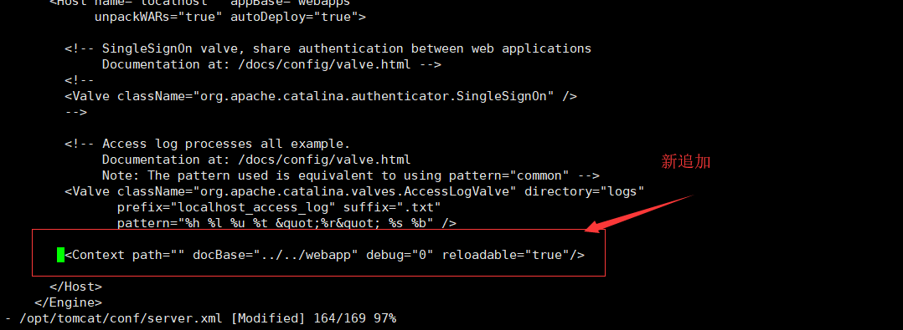
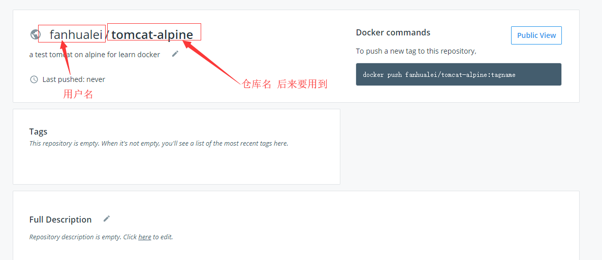
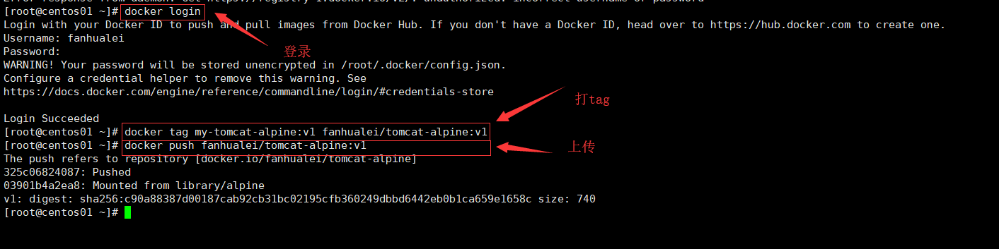

## Tomcat镜像制作


## 基于alpine

使用一个最小的linux操作系统，为了测试，生产环境中，要使用centos.


### 手工创建

参考文档：https://wiki.alpinelinux.org/wiki/Tomcat

创建一个容器，一启动，就启动tomcat，然后可以通过8080访问根目录，输出`版本 主机名 ip`


#### 第一步、安装jdk和tomcat

```shell
docker pull alpine

#生成容器，并登录容器
docker run -dit --name tomcat-alpine alpine ash
docker exec -it tomcat-alpine ash

#使用阿里镜像
sed -i 's/dl-cdn.alpinelinux.org/mirrors.aliyun.com/g' /etc/apk/repositories

#如果使用阿里镜像，安装openjdk 比较慢，大概需要8分钟 这个jdk要104MB
apk add openjdk8

#安装tomcat
cd /opt

wget http://mirrors.tuna.tsinghua.edu.cn/apache/tomcat/tomcat-9/v9.0.24/bin/apache-tomcat-9.0.24.tar.gz

tar xvzf apache-tomcat-9.0.24.tar.gz
rm -f apache-tomcat-9.0.24.tar.gz

# 建立软连接
ln -s /opt/apache-tomcat-9.0.24/  /opt/tomcat
ln -s /opt/apache-tomcat-9.0.24/bin/catalina.sh /bin/tomcat

#启动tomcat,进行测试
/opt/tomcat/bin/catalina.sh start
wget -qO- 127.0.0.1:8080
/opt/tomcat/bin/catalina.sh stop


```


#### 第二步、添加jsp文件

```shell
#部署程序
mkdir /opt/webapp
#新建一个index.jsp文件
vi /opt/webapp/index.jsp

#修改启动文件
vi /opt/tomcat/conf/server.xml
# host节点追加<Context path="" docBase="../../webapp" debug="0" reloadable="true"/>

#查看启动的tomcat是否正确
/opt/tomcat/bin/catalina.sh start
wget -qO- localhost:8080
```


> index.jsp 这里要修改里面的版本号

```jsp
<%@ page language="java" contentType="text/html; charset=utf-8"  import="java.net.InetAddress" pageEncoding="utf-8"%>
<%
InetAddress addr = InetAddress.getLocalHost();
out.print("v1 : " + addr.getHostName()+"   : " + addr.getHostAddress());
%>

```

> server.xml




#### 第三步、保存镜像并测试

这里要注意，如果有更新，要去修改版本号

> commit镜像


```shell
docker ps 
# 根据上面查询出来的，替换ID中的内容或使用容器名
docker commit tomcat-alpine my-tomcat-alpine:v2
# 也可以用：docker ps -q  --filter name=tomcat-alpine
docker commit $(docker ps -q  --filter name=tomcat-alpine) my-tomcat-alpine:v2
```


> 测试这个镜像

```shell
# 启动一个新镜像
docker run -dit --name my-app my-tomcat-alpine:v2 tomcat run

# 测试是否得到到网页内容，下面两种方法都可以
curl $(docker inspect -f '{{.NetworkSettings.IPAddress }}' my-app):8080
wget -qO- $(docker inspect -f '{{.NetworkSettings.IPAddress }}' my-app):8080

# 得到容器ip地址方法
docker inspect -f '{{.Name}} - {{.NetworkSettings.IPAddress }}' $(docker ps -aq)
docker inspect -f '{{.NetworkSettings.IPAddress }}' my-app


```


#### 第四步、提交到hub.docker

> 注册账户并建立仓库

到hub.docker注册一个账户，并建立一个仓库。




> 上传镜像

上传大概需要2分钟，100M大小的镜像

```
docker login

docker tag my-tomcat-alpine:v2 fanhualei/tomcat-alpine:v2

docker push fanhualei/tomcat-alpine:v2
```




#### 第五步、编写使用说明


Run the default Tomcat server

```shell
docker run -dit --rm --name my-app fanhualei/tomcat-alpine:v2 tomcat run
```


You can test it by visiting `curl container-ip:8080` or use `wget`

```shell
wget -qO- $(docker inspect -f '{{.NetworkSettings.IPAddress }}' my-app):8080
```


You can then go to `http://localhost:8888` or `http://host-ip:8888` in a browser.

```
docker run -dit --rm --name my-app -p 8888:8080 fanhualei/tomcat-alpine:v2 tomcat run
```


Create a data directory on the host system (outside the container) and mount this to a directory visible from inside the container. this will delete the container's /opt/webapp/index.jsp 

```
docker run -dit  --name my-app -v /container_data/my-app/webapp:/opt/webapp -p 8888:8080 fanhualei/tomcat-alpine:v2 tomcat run           
```


### 使用Dockerfile创建

使用手工创建的好处是能分布进行测试


```shell
# 清理一下镜像
docker rmi my-tomcat-alpine:v3

# 生成镜像
docker build -t my-tomcat-alpine:v3 .

# 运行容器
docker run -dit --name my-app-v3 my-tomcat-alpine:v3

# 测试容器
curl $(docker inspect -f '{{.NetworkSettings.IPAddress }}' my-app-v3):8080
```


