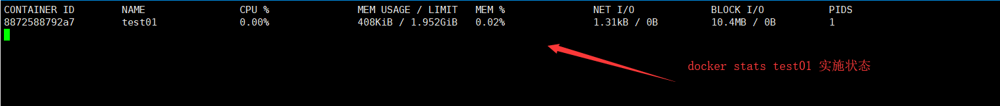
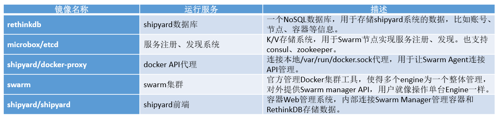

# Docker

如果你就想简单的使用，那么花10分钟看这个文档。[10分钟学会使用docker](https://github.com/fanhualei/wukong-framework/blob/master/reference/docker.md)

如果你想深入了解原理，那么看下面的文档。

比较好的文档：

* [docker命令行大全详解（更新中）](https://blog.csdn.net/talkxin/article/details/83061973)


[TOC]


## 1. 介绍


### Docker优点

* 快速打包
* 控制多个版本
* 移植性高
* 标准化
* 隔离性与安全性


### 虚拟机与容器的区别

> Docker的缺点：

由于共享宿主机内核，只是进程级隔离，因此隔离性和稳定性不如虚拟机，容器具有一定权限访问宿主机内核，存在一定安全 隐患。 


>  Docker好处：

速度快，性能好，占用空间好


### 应用场景

* 标准化运行环境
  * 避免环境冲突，解决生产环境的标准化
* 自动化测试与持续集成
* 快速弹性扩展
* 微服务


### kubernetes


docker自己推荐：machine+swarm+compose。被kubernetes打败了。


## 2. 安装


安装很简单，一行命令就能安装完毕了

```shell
## 安装
$ curl -sSL https://get.daocloud.io/docker | sh
$ docker -v
Docker version 19.03.2, build 6a30dfc

##修改docker镜像地址，官方的镜像库连接太慢，这里转到daocloud镜像库。 
$ curl -sSL https://get.daocloud.io/daotools/set_mirror.sh | sh -s http://91c0cc1e.m.daocloud.io 

## 启动docker服务，并设置开机启动 
$ systemctl enable docker.service && service docker start
```


如果想知道原理，可以参考一下文档：

在百度搜索:`docker一键安装`

* [下面是我以前的安装步骤](https://github.com/fanhualei/wukong-framework/blob/master/reference/docker.md)
* [daocloud官方网址](http://get.daocloud.io/)
* [菜鸟docker安装](https://www.runoob.com/docker/centos-docker-install.html)
* [Docker - 加速镜像下载（使用DaoCloud镜像服务）](https://www.hangge.com/blog/cache/detail_2401.html)
* [Docker的学习--命令使用详解](https://www.cnblogs.com/CraryPrimitiveMan/p/4657835.html)

注：如果是一个干净的mini centos，会提示一个警告，这个时候，可以按照提示安装`yum install deltarpm -y`


## 3. 镜像管理


### 什么是镜像？

简单说，Docker镜像是一个不包含Linux内核而又精简的Linux操作系统。


### 镜像从哪里来？

Docker Hub是由Docker公司负责维护的公共注册中心，包含大量的容器镜像，Docker工具默认从这个公共镜像库下载镜像。
`https://hub.docker.com/explore`
默认是国外的源，下载会慢，可以国内的源提供下载速度：
`curl -sSL https://get.daocloud.io/daotools/set_mirror.sh | sh -s http://91c0cc1e.m.daocloud.io` 


### 镜像工作原理？

[10张图带你深入理解Docker容器和镜像](http://dockone.io/article/783)

容器=镜像+可读文件层

当我们启动一个新的容器时，Docker会加载只读镜像，并在其之上添加一个读写层，并将镜像中的目录复制一份到
`/var/lib/docker/aufs/mnt/`容器ID为目录下，我们可以使用chroot进入此目录。如果运行中的容器修改一个已经存在的文件，
那么会将该文件从下面的只读层复制到读写层，只读层的这个文件就会覆盖，但还存在，这就实现了文件系统隔离，当删除容
器后，读写层的数据将会删除，只读镜像不变。


### 镜像文件存储结构？

docker相关文件存放在：`/var/lib/docker`目录下


### 镜像常用命令

`docker --help | grep imge`

```
search 从服务器上查找镜像
pull   下载一个镜像
push   将镜像放到自己的私有仓库或者公共仓库
history 查看镜像的历史
images 查看本地镜像
commit 保存镜像
build  设置镜像创建时的变量
rmi    删除镜像
       https://www.runoob.com/docker/docker-build-command.html
export 将一个【容器】保存成tar文件
import 将一个tar文件生成镜像
save   将一个【镜像】保存成tar文件
load   将一个tar文件生成镜像
```


### 示例

下面例子是连续的，必须一步一步的操作。


#### 下载一个镜像，并启动容器:search+pull

```shell
# 查找镜像
$ docker search ubuntu
# 把镜像拉到本地
$ docker pull ubuntu
# 执行一个容器
$ docker run -itd --name test01 ubuntu
# 查看容器
$ docker ps
```


#### 删除容器，文件也被删除:rm

在容器中创建两个文件，删除容器，两个文件也消失了

```shell
# 进入一个容器
$ docker attach test01
$root@1e25fff09c94:/# cd home
$root@1e25fff09c94:/# touch a.txt
$root@1e25fff09c94:/# touoch b.txt

##docker退出容器，而不关闭容器： ctrl+q+p；

# 查看这个容器的某个目录,应该有a.txt与b.txt
$ docker exec test01 ls /home

# 删除docker
$ docker stop test01
$ docker rm test01

# 再运行，发现已经被删除了。
$ docker run -itd --name test01 ubuntu
$ docker exec test01 ls /home
```


#### 将容器保存成镜像:images+commit

这样就能保存容器的文件

用到：`images` ，`commit`

```shell
# 查看当前有几个镜像
$ docker images

# 修改容器的内容
$ docker exec test01 touch /home/a.txt
$ docker exec test01 touch /home/b.txt
$ docker exec test01 ls /home

# 将容器的内容保存成镜像
$ docker commit test01 ubuntu:self

# 查看当前有几个镜像
$ docker images

# 运行一个镜像
$ docker run -itd --name test01_self ubuntu:self

# 查看容器中是否包含了那两个文件
$ docker exec test01_self ls /home
```


#### 删除镜像:rmi

`rmi`：删除镜像

`rm`：删除容器

`-f` 表示强行删除


```shell
# 如果有容器在运行，那么删除镜像报错
$ docker rmi ubuntu:self

# 停止容器,还是不能删除
$ docker stop test01_self

# 只能先删除容器了
$ docker rm test01_self

# 再次删除
$ docker rmi ubuntu:self

# 查看当前有几个镜像
$ docker images
```


#### 导出导入:export+import

使用`export`将一个容器导出成tar文件

使用`import`将一个tar文件生成镜像文件

```shell
# 导出一个容器
$ docker export test01 > test01.tar

# 查看导出的文件，以及文件大小
$ ls 
$ du -sh test01.tar

# 导入成镜像
$ docker import  test01.tar ubuntu:self

# 查看当前有几个镜像
$ docker images

# 运行一个镜像,这样会报错
$ docker run -itd --name test01_self ubuntu:self

# 这个不报错
$ docker run -itd --name test01_self ubuntu:self /bin/bash

# 查看容器中是否包含了那两个文件
$ docker exec test01_self ls /home
```


#### 保存镜像到tar文件:save+load


```shell
$ docker save ubuntu:self > ubuntu_self.tar
$ docker load -i ubuntu_self.tar
```


## 4. 容器管理

```shell
# 得到test01 ip地址
docker inspect -f {{.NetworkSettings.IPAddress}} test01

# 用一个容器做为基础容器，其他容器复制这个容器的 network volumes
docker run --name infracon -it -v /dtat/infracon/volume:/data/web/html busybox

docker run --name nginx --netword container:infracon --volumes-from infracon -it busybox


```


### 4.1 创建容器

使用 `docker run --help` 来看相关命令的使用方法


#### 提供标准输入：-i

* 可以使用 attach 进入容器
* --interactive                    Keep STDIN open even if not attached

#### 给一个伪终端：-t

* 有一个伪终端
* --tty                            Allocate a pseudo-TTY

#### 后台执行：-d

* 将容器放到后台运行
* --detach                         Run container in background and print container ID


#### 修改hosts：--add-host list

--add-host list                  Add a custom host-to-IP mapping (host:ip)

```shell
$ docker exec  teset01_self cat /etc/hosts
```

查看一个容器的IP地址


```shell
docker run -itd --name test01_self01 --add-host abc:192.168.12.123 ubuntu:self /bin/bash
docker exec  test01_self01 cat /etc/hosts

```


#### 提供访问linux内核：--cap-add


####  将容器ID保存到文件中：--cidfile 


#### 添加一个设备到容器中：--device


#### 设置容器DNS：--dns

```shell
# 查看DNS
$ docker exec test01_self cat /etc/resolv.conf
$ docker run -itd --dns 6.6.6.6 ubuntu
```


#### 传入一个系统变量：-e

在容器中，可以通过echo来得到变量

```shell
$ docker run -itd -e java_version:123456 ubuntu
```


#### 暴露一个端口：--expose

可以是一个范围

```shell
$ docker run -itd --expose 80 ubuntu
```


#### 设定容器的主机名：-h

```shell
$ docker run -h myComputer ubuntu
```


#### 指定容器的IP地址：--net

如果一台机器上有很多容器，同时并不想让这些容器相互访问，可以通过划分IP端来隔离

这个使用了docker的网络分配方法，详细内容见后面

```shell
# 创建一个自网段，并且指定IP地址
$ docker network create --subnet=10.0.0.0/16 network_10
$ docker network ls
$ docker run -itd --net=network_10 --ip 10.0.0123 utuntu
# 查看这个容器的IP
$ docker inspect 容器名
```


#### 通过机器名关联不同容器：--link


#### 日志收集：--log-driver

docker默认将日志保存在本地。

通过设置，可以将日志发送到统一的日志收集系统便于分析。

--log-opt日志收集选项


#### 挂载分区：--mount


#### 可以执行大内存程序：--oom-kell-disable

例如执行spark程序


#### 将宿主机器上端口转发到容器：-p

与大写P与小写p，功能不一样

```shell
# 创建一个自网段，并且指定IP地址

$ docker run -itd -p 8888:80 utuntu

```

大写P会将所有端口，都映射到宿主机器的随机端口


#### 自动重启容器：--restart

如果容器挂掉，可以自动重启3次，如果还没有启动，就不启动了。

```shell


$ docker run -itd --restart on-failure:3 utuntu

```


#### 去掉操作系统的最大限制：--ulimit

例如spark要打开很多文件，开启很多线程，所以要突破linux的限制

```shell
$ docker run -itd --ulimit nproc=10240 --ulimit nofile=12400 utuntu
# ulimit -a 查看当前系统设置
```


#### 将容器的目录挂载到宿主机：-v


#### 共享目录：--volumes-from


#### 进入容器后的默认目录：-w


#### CPU限制：--cpu-period

--cpu-period：周期

--cpu-quota :多长时间

-c：各个容器分配cpu的权重值

-cpuset-cpus : 指定几核


#### 限制磁盘读取速度：--device--read-bps

--device--read-bps：字节数

--device--write-bps

--device--read-iops：

--device--write-iops


#### 限制内存：-m


```shell
$ docker run -itd -m 10240000 utuntu
```

--memory-swap

--memory-swappiness

限制内存交换区


#### 限制使用磁盘空间：--storag-opt

指定容器可以使用的最大空间数


### 4.2 容器常用管理命令

```shell
# 删除所有容器,如果你做测试，里面有很多容器，可以全部删除，这个命令慎用
docker rm -f $(docker ps -q -a)
```


#### 基本命令

##### 显示列表：ps

* -a 显示没有启动的
* -l  显示最后一条
* -q 只显示编号
* -s  显示容器大小


##### 进入一个容器：attach

建议使用：`docker exec -it 容器名 /bin/bash`

##### 删除容器：rm


##### 启动容器：start


##### 停止容器：stop


##### 重新命令容器：rename

以前随机的容器名，可以从新命令一个


##### 暂停容器：kill pause unpase


#### 高级命令


##### 查看容器配置信息：inspect

```shell
docker inspect test01
```


##### 执行容器的命令:exec


##### 显示容器的进程: top


##### 双向复制文件：cp

相互复制文件

```shell
docker cp derby.log test01:/home
docker cp test01:/home/a.txt ./
```


##### 出指定的容器的端口映射：port


##### 查看容器的变化：diff

```
docker diff test01
```


##### 查看容器的日志输出：log


##### 查看容器的状态：status




##### 修改容器的配置：update

详细内容可以通过`docker update --help`来看


##### 监控整个docker的事件：event

每个docker的启动，停止等事件都会被输出


### 4.3 容器数据持久化

一个容器被删除后，数据也会被删除，那么怎么才能将数据保存下来呢？

容器与容器之间如何共享呢？

有两个方法：


##### 数据卷

将宿主目录挂载到容器目录中

数据卷特点： 

* 在容器启动初始化时，如果容器使用的宿主机挂载点有数据，这些数据就会拷贝到容器中。 

*  数据卷可以在容器直接共享和重用。 

* 可以直接对数据卷里的内容进行修改。

* 数据卷的变化不会影响镜像的更新。 

* 卷会一直存在，即使挂载数据卷的容器已经删除。

 示例： `docker run -itd --name web01 -v /container_data/web:/data Ubuntu`

 注：/container_data/web为宿主机目录，/data是容器中目录，目录不存在会自动创建。

 

##### 容器数据卷

将一个运行的容器做为数据卷，让其他容器挂载这个容器实现数据共享

将一个运行的容器作为数据卷，让其他容器通过挂载这个容器实现数据共享。 

示例： 

```shell
# 创建一个容器，其中有一个共享的目录
docker run -itd -v /data --name  web00  ubuntu
docker exec web00 ls /data
docker exec web00 touch /data/index.txt
docker exec web00 ls /data

# 创建一个容器，包含另外一个容器的目录
docker run -itd --name web01 --volumes-from web00 ubuntu
docker exec web01 ls /data
```


### 4.4 案例: mysql安装 

删除所有容器,如果你做测试，里面有很多容器，可以全部删除，这个命令慎用

`docker rm -f $(docker ps -q -a)`

这个练习的目的：

* 两个mysql可以相互连接
* 可以查看mysql的日志
* 可以将mysql的数据库给放在宿主机目录上。
* 数据库的备份与恢复


[mysql主从配置实现一主一从读写分离](https://blog.51cto.com/13910274/2172910)

#### 安装第一个mysql

```shell
# 自动看是否有mysql镜像,如果没有就自动下载一个
# 设置 默认密码 123456
docker run --name mysql01 -e MYSQL_ROOT_PASSWORD=123456 -d mysql

# 创建一个数据库wp
docker exec mysql01 sh -c 'exec mysql -uroot -p"$MYSQL_ROOT_PASSWORD" -e"create database wp"' 


# 登录到容器的msyql
docker exec -it mysql01 mysql -uroot -p123456

# 登录到容器的机器上
docker exec -it mysql01  /bin/bash
```


#### 安装第二个mysql

从第二个可以连接到第一个服务

```shell
# 自动看是否有mysql镜像,如果没有就自动下载一个
# 设置 默认密码 123456
docker run --name mysql02 -e MYSQL_ROOT_PASSWORD=123456 --link mysql01:dbhost -d  mysql

# 登录到容器的机器上
docker exec -it mysql02  /bin/bash

#从mysql02 登录到 mysql01服务器， dbhost是一个别名
mysql -h dbhost -uroot -p123456
# 登录成功后，可以
> show databases;
```


注：如果你从第一个mysql01 可以通过地址，连接到第二个服务器：mysql -h 172.17.0.4 -uroot -p123456


### 4.5 案例：配置mysql主从数据库

主从数据库速度比较快，用的人也很多，做为练习可以参考：[mysql 主从数据库配置](mysql-replication.md)

mysql的集群也非常好用，同时docker 提供了mysql集群的安装。

* [docker简易搭建MySQL集群](https://blog.csdn.net/belonghuang157405/article/details/80808541)
* [docker安装mysql，以及主从和主备切换](https://blog.csdn.net/qq_33562996/article/details/80568628)
* [主流MySQL集群实现架构优劣势与适用场景分析](https://blog.csdn.net/u012974916/article/details/53118941)
* [在docker下搭建MySQL MHA集群](https://www.jianshu.com/p/d00d17797855)


### 4.6 案例：使用docker安装wordpress


#### 传统安装的不足

传统的安装方法:[WordPress详细安装教程](http://www.yzipi.com/13.htm)

需要在自己的机器上安装：Nginx  php  Mysql 。

但是这样会出现一些问题：例如自己的机器已经安装了一些应用软件，这样可能提前安装了Nginx php mysql，并且这些版本于wordpress要求的版本不一样，这样怎么办？


#### 规划使用docker安装

* 安装一个mysql的docker容器
* 安装一个nginx+php环境的docker容器
* 在nginx+php容器中，安装wordpress


> 疑问

* 为啥不把mysql nginx php安装到一个容器中?

分开的好处是mysql可以公用。合起来的好处，便于打包分享。

* 有没有wordpress的docker容器

有，这不是练习吗，一个案例。如果真正使用中，可以直接安装wordpress

* 如何找到nginx+php的docker

  可以到[https://hub.docker.com](https://hub.docker.com/) 搜一下


#### 准备知识


##### 如何搜索镜像

网址:[https://hub.daocloud.io](https://hub.daocloud.io/)


当然，你也可以选择https://hub.docker.com/ 来查找镜像。


#### 具体安装步骤讲解

[docker命名规范](https://github.com/fanhualei/wukong-framework/blob/master/reference/specification_server.md#docker%E5%91%BD%E5%90%8D%E8%A7%84%E8%8C%83)

[centos上mysql的使用](https://github.com/fanhualei/wukong-bd/blob/master/doc/hive.md#%E5%AE%89%E8%A3%85mysql)


##### 安装mysql

wordpress 网站上说只能用mysql5.6 ,我下载的最新镜像是MySQL8，会连接不上。

```shell
docker pull mysql:5.6
docker images
docker run -d --name test-mysql -e MYSQL_ROOT_PASSWORD=123456 mysql:5.6 

# 创建一个数据库wp
docker exec test-mysql sh -c 'exec mysql -uroot -p"$MYSQL_ROOT_PASSWORD" -e"create database wp"' 


# 用宿主机的Mysql进行登录容器的mysql
docker exec -it test-mysql mysql -uroot -p123456

# 登录到容器的机器上
docker exec -it test-mysql  /bin/bash
```


##### 安装nginx-php

https://hub.docker.com/r/richarvey/nginx-php-fpm

```shell
# 建立了一个link ,同时把文件放到了宿主的目录中，放出来一个88
$ docker run -d --name test-web --link test-mysql:dbhost -p 88:80 -v /container_data/web:/var/www/html richarvey/nginx-php-fpm

docker exec -it test-web  /bin/bash

# 建立一个html文件
$ cd /container_data/web
$ vi a.html
# 访问宿主的地址88
http://192.168.56.102:88/a.html
```


###### link的作用


##### 安装wordpress

```shell
# 进入宿主机的外挂目录
cd /container_data
#下载wordpress
yum install wget
wget https://cn.wordpress.org/latest-zh_CN.tar.gz
# 解压
tar -zxvf latest-zh_CN.tar.gz
# 复制到web目录
mv wordpress/* /container_data/web/ 

# 重启 test-web 这个很重要,不然连接不上数据库
docker restart test-web

```

注意：如果宿主机器上有防火墙，那么需要将88端口给开放出来。


> 访问宿主机的88端口


## 5. 网络管理


### 5.0 网络基本知识


```shell
# 一个网络工具
yum -y install bridge-utils
brctl show
ip link show
docker network ls


# 创建一对虚拟网卡（下面命令不全，可以网上搜索）
ip link add name veth1.1 type weth peer name veth1.2

ip link show

ip link set dev veth1.2 netns r1

ip link show

ip netns exec r1 ifconfig -a

ip netns exec r1 ip link set dev veth1.2 name eth0

ip netns exec r1 ifconfig -a

# 激活
ifconfig veth1.1 10.1.0.1/24 up
ip netns exec r1 ifconfig eth0 10.1.0.2/24 up

# busybox 一个用来测试的镜像，很小
docker run -it --rm busybox
```


> 参考文档

* [实验一：通过bridge-utils工具创建网桥并实现网络连接](https://www.cnblogs.com/BurnovBlog/p/10738619.html)


### 5.1 *官方例子

[官方网络管理文档](https://docs.docker.com/network/network-tutorial-standalone/)

#### 使用brige模式

涉及独立Docker容器的网络连接。宿主端不能访问brige模式下的docker容器

##### 使用默认桥接网络(不建议在生产环境中用)

```shell
# 列出当前网络
docker network ls

#启动两个alpine容器运行ash，这是Alpine的默认shell而不是bash.
#未指定任何 --network标志，因此容器将连接到默认bridge网络。
docker run -dit --name alpine1 alpine ash
docker run -dit --name alpine2 alpine ash

#检查两个容器是否实际启动
docker container ls

#检查bridge网络以查看连接到它的容器
docker network inspect bridge

#使用docker attach 命令连接到alpine1
docker attach alpine1

#使用该ip addr show命令显示alpine1容器内的网络接口
alpine1> ip addr show

# 确保alpine1可以通过ping连接到互联网
alpine1> ping -c 2 www.baidu.com

# 现在尝试ping第二个容器。首先，通过其IP地址ping它
alpine1> ping -c 2 172.17.0.3

#这成功了。接下来，尝试alpine2按容器名称ping 容器。这将失败。
alpine1> ping -c 2 alpine2

#停止并移除两个容器。
alpine1>exit
docker container stop alpine1 alpine2
docker container rm alpine1 alpine2
```

请记住，`bridge`不建议将默认网络用于生产。要了解用户定义的桥接网络，请继续学习 [下一个教程](https://docs.docker.com/network/network-tutorial-standalone/#use-user-defined-bridge-networks)。


##### 使用用户定义的网桥

在此示例中，我们再次启动两个`alpine`容器，但将它们附加到`alpine-net`我们已创建的用户定义的网络中。这些容器根本没有连接到默认`bridge`网络。然后我们启动第三个`alpine`连接到`bridge`网络但未连接的容器`alpine-net`，以及`alpine`连接到两个网络的第四个容器。


```shell
#创建alpine-net网络。您不需要该--driver bridge标志，因为它是默认值，但此示例显示了如何指定它。
docker network create --driver bridge alpine-net

#列出Docker的网络：
docker network ls

#检查alpine-net网络。这将显示其IP地址以及没有容器连接到它的事实：
#请注意，此网络的网关与网关172.18.0.1的默认网桥相对172.17.0.1。您的系统上的确切IP地址可能有所不同。
docker network inspect alpine-net

#创建您的四个容器。注意--network标志。您只能在docker run命令期间连接到一个网络，因此您需要在 docker network connect以后连接alpine4到bridge 网络。
docker run -dit --name alpine1 --network alpine-net alpine ash
docker run -dit --name alpine2 --network alpine-net alpine ash
docker run -dit --name alpine3 alpine ash
docker run -dit --name alpine4 --network alpine-net alpine ash
docker network connect bridge alpine4

#验证所有容器是否正在运行：
docker container ls

#再次检查bridge网络和alpine-net网络：容器alpine3并alpine4连接到bridge网络。
docker network inspect bridge

#docker network inspect alpine-net  容器alpine1，alpine2和alpine4连接到 alpine-net网络。
docker network inspect alpine-net

#在用户定义的网络上alpine-net，容器不仅可以通过IP地址进行通信，还可以将容器名称解析为IP地址。此功能称为自动服务发现。让我们连接alpine1并测试一下。alpine1应该能够解析 alpine2和alpine4（和alpine1本身）IP地址。
 docker container attach alpine1
 alpine1> ping -c 2 alpine2
 alpine1> ping -c 2 alpine4
 alpine1> ping -c 2 alpine1
 # 从alpine1，你根本不应该连接alpine3，用ip地址也不行，因为它不在alpine-net网络上。
 alpine1> ping -c 2 alpine3
 
 # ping: bad address 'alpine3'
 alpine1> ping -c 2 172.17.0.3
 alpine1> ping -c 2 172.17.0.2

#断开alpine1使用分离序列， CTRL+ p CTRL+ q（按住CTRL并键入p后跟q）。
```


> 跨网络连接

请记住，`alpine4`它连接到默认`bridge`网络和`alpine-net`。它应该能够到达所有其他容器。但是，您需要`alpine3`通过其IP地址进行寻址。连接到它并运行测试。

```shell
#
docker container attach alpine4
alpine4> ping -c 2 alpine1

alpine4> ping -c 2 alpine2

# 不能通过名字来ping ping: bad address 'alpine3',但是可以ping ip地址
alpine4> ping -c 2 alpine3

alpine4> ping -c 2 172.17.0.2

# ping 自己
alpine4> ping -c 2 alpine4

#断开alpine4使用分离序列， CTRL+ p CTRL+ q（按住CTRL并键入p后跟q）。
```


> 停止并删除所有容器和`alpine-net`网络。

```shell
docker container stop alpine1 alpine2 alpine3 alpine4
docker container rm alpine1 alpine2 alpine3 alpine4
docker network rm alpine-net
```


#### 使用host模式

我感觉host模式用途不大，为啥不做端口转发呢？

host模式，将宿主的配置，直接复制到自己的机器上

##### 目标

目标是启动一个`nginx`直接绑定到Docker主机上的端口80 的容器。从网络的角度来看，这与隔离级别相同，就好像`nginx`进程直接在Docker主机上运行而不是在容器中运行一样。但是，在所有其他方式（例如存储，进程命名空间和用户命名空间）中，`nginx`进程与主机隔离。

##### 先决条件

- 此过程要求端口80在Docker主机上可用。要使Nginx侦听其他端口，请参阅[该](https://hub.docker.com/_/nginx/)[图像](https://hub.docker.com/_/nginx/)的 [文档`nginx`](https://hub.docker.com/_/nginx/)

```shell
[root@centos01 ~]# curl localhost
curl: (7) Failed connect to localhost:80; 拒绝连接
```


##### 具体操作

```shell

# 创建并启动容器作为分离进程。该--rm选项意味着一旦退出/停止就移除容器。该-d标志表示启动容器分离（在后台）。
docker run --rm -d --network host --name my_nginx nginx

# 通过浏览到http：// localhost：80 /来访问Nginx 。
curl localhost

# ip addr show

# 查看host情况
docker network inspect host

# 使用该netstat命令验证哪个进程绑定到端口80 。您需要使用，sudo因为该进程由Docker守护程序用户拥有，否则您将无法看到其名称或PID。
netstat -tulpn | grep :80

#停止容器。它将在使用该--rm选项启动时自动删除。
docker container stop my_nginx
```

如果想让外网访问宿主机，需要将宿主机器的防火墙给关闭了。

```shell
# 开放端口 80
$ firewall-cmd --zone=public --add-port=80/tcp --permanent
```


#### 使用overlay模式 

这个可以跨多个docker主机。使用了`docker swarm`技术，这个技术与`k8`有重复的地方，这里就不详细介绍这种技术了，具体看`k8`


添加了一个docker service ，然后在不同的物理机器上建立的容器，会有两个网络地址，其中一个地址，可以访问其他物理机上相同网络的机器。


#### 使用macvlan模式

也是跨多个主机的技术，这个是在硬件网卡上做配置，好处是速度快，坏处是很多云服务商不支持，并且数量有限制。


### 5.2 常见问题

* [docker设置固定ip地址](https://www.cnblogs.com/xuezhigu/p/8257129.html)
  * 默认，容器启动后ip地址会变化
* 在已经建立好的容器中，如何添加与宿足机的端口映射。 例如生成一个nginx如何映射出80?
* 如何配置一个ip与宿主机器是一个网段。（见官方例子）
* 如何将本地的docker分成两个不同的网段，网段内的机器可以访问，网段外的机器不能访问。（见官方例子）
* 一个容器可以配置多个ip吗? 一个连接内部网段，一个连接外网。（见官方例子）
* 创建一个容器，感觉就想虚拟机一样，可以通过ssh连接。（见dockerfile中的ssh例子）


> 追加映射端口有三种方法

* 修改改容器文件
  * [docker修改映射端口](https://www.jianshu.com/p/02b2f30ed6cb)
  * [【docker】追加docker容器端口映射的方法](https://www.cnblogs.com/richerdyoung/p/10154753.html)
* iptables转发端口(不建议用)
* 保存镜像，然后再追加端口
  * [Docker给运行中的容器添加映射端口-是同了另外两种方法](https://www.cnblogs.com/fansik/p/6518423.html)


以上方法实现成功了，可以添加一个脚本用来做这个事情。


### 5.3 固定IP地址

```
docker run -itd --name net-01 --network bridge --ip 172.17.0.2 ubuntu /bin/bash
```

不能使用默认的`bridge`，需要自定义一个网络


### 5.4 安装centos

```shell
# 下载镜像
docker pull centos

# 生成一个容器
docker run -itd --name centos01 centos /bin/bash

# 进入容器
docker exec -it centos01  /bin/bash

# 安装ifconfig
yum install net-tools

ifconfig
```


### 5.5 具体实践

安装完docker会在宿主机器上建立一个网络，可以使用`ifoncig`


常用的两个命令：

docker inspet

docker network ls


## 6. DockerFile


[你确定你会写 Dockerfile 吗？](https://blog.csdn.net/alex_yangchuansheng/article/details/95239984)


官网给出的一些脚本

```shell
docker build -t friendlyhello .  # Create image using this directory's Dockerfile
docker run -p 4000:80 friendlyhello  # Run "friendlyhello" mapping port 4000 to 80
docker run -d -p 4000:80 friendlyhello         # Same thing, but in detached mode
docker container ls                                # List all running containers
docker container ls -a             # List all containers, even those not running
docker container stop <hash>           # Gracefully stop the specified container
docker container kill <hash>         # Force shutdown of the specified container
docker container rm <hash>        # Remove specified container from this machine
docker container rm $(docker container ls -a -q)         # Remove all containers
docker image ls -a                             # List all images on this machine
docker image rm <image id>            # Remove specified image from this machine
docker image rm $(docker image ls -a -q)   # Remove all images from this machine
docker login             # Log in this CLI session using your Docker credentials
docker tag <image> username/repository:tag  # Tag <image> for upload to registry
docker push username/repository:tag            # Upload tagged image to registry
docker run username/repository:tag                   # Run image from a registry
```

[Dockerfile RUN，CMD，ENTRYPOINT命令区别](https://www.jianshu.com/p/f0a0f6a43907)


#### Wordpress环境示例

> Dockerfile

```dockerfile
FROM centos

MAINTAINER lexiaoyao

RUN yum install -y httpd php php-gd php-mysql mysql mysql-server

ENV MYSQL_ROOT_PASSWORD 123456

RUN echo "<?php phpinfo()?>" > /var/www/html/index.php

ADD start.sh /start.sh RUN chmod +x /start.sh


ADD https://cn.wordpress.org/wordpress-4.7.4-zh_CN.tar.gz /var/www/html

COPY wp-config.php /var/www/html/wordpress


VOLUME ["/var/lib/mysql"]


CMD /start.sh


EXPOSE 80 3306

```


>  start.sh 

```sh
service httpd 
start service mysqld 
start mysqladmin -uroot password $MYSQL_ROOT_PASSWORD 
tail -f
```


> wp-config.php

略


#### Tomcat环境示例


```dockerfile
FROM centos:6 

MAINTAINER lexiaoyao

ADD jdk-8u45-linux-x64.tar.gz /usr/local  # 本地已经下载的文件

ENV JAVA_HOME /usr/local/jdk1.8.0_45

ADD http://mirrors.tuna.tsinghua.edu.cn/apache/tomcat/tomcat-8/v8.0.45/bin/apachetomcat-8.0.45.tar.gz /usr/local

WORKDIR /usr/local/apache-tomcat-8.0.45 

ENTRYPOINT ["bin/catalina.sh", "run"]
EXPOSE 8080

```


#### 可SSH登录容器环境示例

centos默认是安装了ssh服务，这里就做了一个测试


##### 第一步、建立一个目录

```shell
mkdir dockerfile-ssh
```


##### 第二步、编辑Dockerfile

执行命令`vi Dockerfile`，并编辑脚本


```dockerfile
FROM centos

MAINTAINER lexiaoyao 

ENV ROOT_PASSWORD 123456

RUN yum install -y openssh-server 

RUN echo $ROOT_PASSWORD |passwd --stdin root

RUN ssh-keygen -t dsa -f /etc/ssh/ssh_host_dsa_key  
RUN ssh-keygen -t rsa -f /etc/ssh/ssh_host_rsa_key  

CMD ["/usr/sbin/sshd", "-D"]

EXPOSE 22

```


##### 第三步、创建镜像


```shell
docker build -t ssh .
```


##### 第四步、创建容器

```
docker run -itd --name ssh -p 2222:22 ssh
```


## 7. 搭建仓库


### 7.1 私有仓库

Docker Hub作为Docker默认官方公共镜像；如果想自己搭建私有镜像仓库，官方也提供registry镜像，使得搭建私有仓 库非常简单。

#### 下载registry镜像并启动 

```shell
docker pull registry 

docker run -d -v /opt/registry:/var/lib/registry -p 5000:5000 --restart=always --name registry registry
```


#### 测试，查看镜像仓库中所有镜像 

```shell
curl http://192.168.1.120:5000/v2/_catalog 

#{"repositories":[]}
```


#### 配置私有仓库可信任

```shell
vi /etc/docker/daemon.json

#{"insecure-registries":["192.168.1.120:5000"]} 

service docker restart 
```


#### 打标签 

```shell
docker tag centos:6 192.168.1.120:5000/centos:6 
```


#### 上传 

```shell
docker push 192.168.1.120:5000/centos:6 
```


#### 下载 

```shell
docker pull 192.168.1.120:5000/centos:6
```

 

#### 列出镜像标签 

```shell
curl http://192.168.1.120:5000/v2/centos/tags/list
```


### 7.2 共有仓库


1、注册账号 https://hub.docker.com 

2、登录Docker Hub 

```shell
# 
docker login  
#或 
docker login --username=aaa --password=123456 
```


3、镜像打标签

```shell
docker tag wordpress:v1 lizhenliang/wordpress:v1 
```


4、上传 

```shell
docker push lizhenliang/wordpress:v1
#搜索测试：  
docker search lizhenliang 
```

 

5、下载 

```shell
docker pull lizhenliang/wordpress:v1
```


## 8. 图像化界面

有两个

1、DockerUI
2、Shipyard（推荐使用）

[Docker 图形化页面管理工具使用](https://www.cnblogs.com/frankdeng/p/9686735.html)


### DockerUI

用的人不多，了解就行。[官方地址](https://hub.docker.com/r/abh1nav/dockerui)


### Shipyard

**这个可以管理一个集群，通过web页面，就可以操作docker集群**

Shipyard也是基于Docker API实现的容器图形管理系统，支持container、images、engine、cluster等功能，可满足我 们基本的容器部署需求。
Shipyard分为手动部署和自动部署。



[官方部署文档](https://www.shipyard-project.com/docs/deploy/)


## 9. 构建容器的监控系统


详细说明： [cAdvisor+InfluxDB+Grafana 监控Docker](https://www.cnblogs.com/zhujingzhi/p/9844558.html)


`cAdvisor+InfluxDB+Grafana`

* **cAdvisor**

​	Google开源的工具，用于监控Docker主机和容器系统资源，通过图形页面实时显示数据，但不存储；它通过 宿主机/proc、/sys、/var/lib/docker等目录下文件获取宿主机和容器运行信息。 

* **InfluxDB**

  是一个分布式的时间序列数据库，用来存储cAdvisor收集的系统资源数据。 

* **Grafana**

  可视化展示平台，可做仪表盘，并图表页面操作很方面，数据源支持zabbix、Graphite、InfluxDB、 OpenTSDB、Elasticsearch等

* 它们之间关系

   cAdvisor容器数据采集->InfluxDB容器数据存储->Grafana可视化展示


### 


influxdb 

```shell
docker run 
\ -d 
\ -p 8083:8083 
\ -p 8086:8086 
\ --name influxdb tutum/influxdb

```


cadvisor 

```shell
docker run -d 
\ --volume=/:/rootfs:ro 
\ --volume=/var/run:/var/run:rw 
\ --volume=/sys:/sys:ro 
\ --volume=/var/lib/docker/:/var/lib/docker:ro 
\ --link influxdb:influxdb 
\ -p 8081:8080 
\ --name=cadvisor 
\ google/cadvisor:latest 
\ -storage_driver=influxdb 
\ -storage_driver_db=cadvisor 
\ -storage_driver_host=influxdb:8086

```


grafana 

```shell
docker run -d 
\ -p 3000:3000 
\ -e INFLUXDB_HOST=influxdb 
\ -e INFLUXDB_PORT=8086 
\ -e INFLUXDB_NAME=cadvisor 
\ -e INFLUXDB_USER=cadvisor 
\ -e INFLUXDB_PASS=cadvisor 
\ --link influxdb:influxsrv 
\ --name grafana 
\ grafana/grafana

```


## 10. docker高级使用


三剑客：

* docker compose 
* docker swarm  
* docker machine


这里介绍一些工具，了解就行，今后直接跳转到kubernetes

[高级教程](https://www.qikqiak.com/k8s-book/docs/8.Docker Compose.html)


### compose

Compose是一个定义和管理多容器的工具，使用Python语言编写。使用Compose配置文件描述多个容器应用的架构，比如使用什么镜像、数据卷、网络、映射端口等；然后一条命令管理所有服务，比如启动、停止、重启等。


官网地址：https://docs.docker.com/compose/


#### 安装

1.下载二进制文件

可以根据版本号，来下载

```shell
curl -L https://github.com/docker/compose/releases/download/1.24.1/docker-compose-`uname -s`-`uname -m` -o /usr/local/bin/docker-compose


```


 2.对二进制文件添加可执行权限 

```shell
chmod +x /usr/local/bin/docker-compose
```


3.测试安装 

```shell
docker-compose --version
```


也可以使用pip工具安装：pip install docker-compose


#### YAML文件格式

1. 不支持制表符tab键缩进，需要使用空格缩进
2.  通常开头缩进2个空格 
3. 字符后缩进1个空格，如冒号、逗号、横杆 
4. 用井号注释 
5. 如果包含特殊字符用单引号引起来 
6. 布尔值（true、false、yes、no、on、off）必须用引号括起来，这样分析器会将他们解释为字符串。


#### 使用


##### 案例：nginx+mysql+php

假设建立一个 nginx+mysql+php的环境

一个compose会创建一个网络，如果连接外边的机器，要使用一个特殊命令。

可以指定启动的顺序

```shell
# 建立一个compse目录
mkdir compose_lnmp
cd compose_lnmp

# 创建一个nginx
mkdir nginx
cd nginx
vi Dockerfile


# 创建一个php
mkdir php
cd php
vi Dockerfile

# mysql使用镜像

# 启动服务
cd ..
docker-compose up -build


```


通过一个文件，用来编排多个容器一起使用

```yaml
version: '3'
services:
  nginx:
    hostname: nginx
    build:
      context: ./nginx
      dockerfile: Dockerfile
    ports:
      - "80:80"
    links:
      - php:php-cgi
    volumes:
      - /data/container/web:/usr/local/nginx/html
      
  php:
  	hostname: php
  	build: ./php
  	links:
  	  - mysql:mysql-db
    volumes:
      - /data/container/php:/usr/local/nginx/html
      
   mysql:
     hostname:mysql
     image: mysql:5.6
     ports:
       - 3306:3306
     volumes:
       - /data/container/msyql/conf:/etc/mysql/conf.d  
       - /data/container/msyql/data:/var/lib/msyql   
     environment:
       MYSQL_ROOT_PASSWORD: 123546
```


### swam

docker官方提供了一个集群负载均衡的应用。


#### 节点规划

```
操作系统：Ubuntu16.04_x64 

管理节点：192.168.1.110 

工作节点：192.168.1.111 工作节点：192.168.1.112
```


#### 管理节点初始化swarm

```shell
docker swarm init --advertise-addr 192.168.1.110
```


####  工作节点加入swarm

```shell
 docker swarm join --token SWMTKN-1-XXX 192.168.1.110:2377
```


#### 服务管理

```shell
# 创建服务 
docker service create --replicas 1 --name hello busybox 

# 显示服务详细信息 
docker service inspect --pretty hello  

# 易于阅读显示 json格式返回 
docker service inspect hello  

# 扩展服务实例数 
docker service scale hello=3 

# 查看服务任务  -f是过滤
docker service ls 
docker service ps hello 
docker service ps -f 'desired-state=running' hello 

# 滚动更新服务 
docker service create 
\ --replicas 3 
\ --name redis 
\ --update-delay 10s 
\ redis:3.0.6 

docker service update --image redis:3.0.7 redis

# 创建服务时设定更新策略，副本10 更新间隔10s 可以最大2个任务一起更新，如果出现错误那么继续 
docker service create 
\ --name my_web 
\ --replicas 10 
\ --update-delay 10s 
\ --update-parallelism 2 
\ --update-failure-action continue 
\ nginx:1.12 

# 创建服务时设定回滚策略 ， 故障录20% rollback-max-failure-ratio .2 
docker service create 
\ --name my_web 
\ --replicas 10 
\ --rollback-parallelism 2 
\ --rollback-monitor 20s 
\ --rollback-max-failure-ratio .2 
\ nginx:1.12 

# 服务更新 
docker service update --image nginx:1.13 my_web 

# 手动回滚 
docker service update --rollback my_web 

```


#### 使用原生Overlay Network

```shell
# 创建overlay网络 
docker network create --driver overlay my-network 

# 创建新服务并使用overlay网络 
docker service create 
\ --replicas 3 
\ --network my-network 
\ --name my-web 
\ nginx 

# 将现有服务连接到overlay网络 
docker service update --network-add my-network my-web 

# 删除正在运行的服务网络连接 

docker service update --network-rm my-network my-web

```


#### 数据持久化

两种方式 volume与bind

volume 

```shell
# 创建数据卷,dst 容器的某个目录
docker service create 
\ --mount type=volume src=<VOLUME-NAME>,dst=<CONTAINER-PATH>
\ --name myservice 
\ <IMAGE> 


# 查看数据卷详细信息 
docker volume inspect <VOLUME-NAME> 

# 使用NFS共享存储作为数据卷 
docker service create 
\ --mount 'type=volume,src=<VOLUME-NAME>,dst=<CONTAINER-PATH>,volume-driver=local,volumeopt=type=nfs,volume-opt=device=<nfs-server>:<nfs-path>,"volume-opt=o=addr=<nfsaddress>,vers=4,soft,timeo=180,bg,tcp,rw"‘ 
\ --name myservice 
\ <IMAGE>

```


在宿主机器的`/var/lib/docker/volumes/test/_data` 是挂载的，容器的`/data`的内容

```shell

docker service create 
\ --mount type=volume,src=test,dst=/data 
\ --name v-hello 
\ busybox

docker service ls

docker volumes ls
docker volume inspect test
```

nfs的安装:[CentOS7下NFS服务安装及配置](https://www.cnblogs.com/st-jun/p/7742560.html)

```
yum install nfs-utils
```


 bind:前提需要在宿主机有这个目录，这种方式用的不多。

```shell
 # 读写挂载 
 docker service create 
 \ --mount type=bind,src=<HOST-PATH>,dst=<CONTAINER-PATH> 
 \ --name myservice 
 \ <IMAGE> 
 
 # 只读挂载 docker service create 
 \ --mount type=bind,src=<HOST-PATH>,dst=<CONTAINER-PATH>,readonly 
 \ --name myservice 
 \ <IMAGE>
```


#### 服务发现与负载均衡


```shell
# 进容器查看DNS记录 
nslookup hello  

# 获取虚拟IP 
docker service inspect -f '{{json .Endpoint.VirtualIPs}}' hello 

# 设置DNS轮询模式  endpoint-mode  vip 与dnsrr,通常使用vip,dnsrr不支持端口暴漏
docker service create 
\ --replicas 3 
\ --name my-web 
\ --network my-network 
\ --endpoint-mode dnsrr 
\ nginx

```


#### 高可用性


#### 配置文件存储

将配置文件分发到每个节点

1.生成一个基本的Nginx配置文件 site.conf

```xml
 server { listen         80; server_name  localhost; location / { root   /usr/share/nginx/html; index  index.html index.htm; } }
```


 2.将site.conf保存到docker配置中 

```shell
docker config create site.conf site.conf 
docker config ls 
```


3.创建一个Nginx并应用这个配置  

```shell
docker service create 
\ --name nginx 
\ --config source=site.conf,target=/etc/nginx/conf.d/site.conf 
\ --publish 8080:80 
\ nginx:latest
```


#### 应用实战

创建一个私有仓库`192.168.1.110:5000/nginx:v1`

如果不使用nfs的话，那么就需要将每台机器上的目录都防止数据文件。


1.创建overlay网络 

```shell
docker network create -d overlay lnmp 
```


2.创建Nginx服务 

```shell
docker service create 
\ --name nginx 
\ --replicas 3 
\ --network lnmp 
\ --publish 8888:80 
\ --mount type=volume,source=wwwroot,destination=/usr/local/nginx/html 
\ 192.168.1.110:5000/nginx:v1 
```


3.创建PHP服务

```shell
docker service create 
\ --name php 
\ --replicas 3 
\ --network lnmp 
\ --mount type=volume,source=wwwroot,destination=/usr/local/nginx/html 
\ 192.168.1.110:5000/php:v1

```


4.创建MySQL服务 

```shell
docker service create 
\ --name mysql 
\ --replicas 1 
\ --network lnmp 
\ --config src=my.cnf,target="/etc/mysql/conf.d/my.cnf" 
\ --mount type=volume,source=dbdata,destination=/var/lib/mysql 
\ -e MYSQL_ROOT_PASSWORD=123456 
\ -e MYSQL_USER=wordpress 
\ -e MYSQL_PASSWORD=wp123456 
\ -e MYSQL_DATABASE=wordpress 
\ mysql:5.6

```


#### swarm编排服务

一键部署：docker stack deploy -c service_stack.yml lnmp


## 11. Kubernetes


