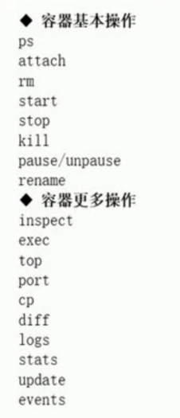

# Docker

如果你就想简单的使用，那么花10分钟看这个文档。[10分钟学会使用docker](https://github.com/fanhualei/wukong-framework/blob/master/reference/docker.md)

如果你想深入了解原理，那么看下面的文档。

[TOC]


## 介绍


### Docker优点

* 快速打包
* 控制多个版本
* 移植性高
* 标准化
* 隔离性与安全性


### 虚拟机与容器的区别

> Docker的缺点：

由于共享宿主机内核，只是进程级隔离，因此隔离性和稳定性不如虚拟机，容器具有一定权限访问宿主机内核，存在一定安全 隐患。 


>  Docker好处：

速度快，性能好，占用空间好


### 应用场景

* 标准化运行环境
  * 避免环境冲突，解决生产环境的标准化
* 自动化测试与持续集成
* 快速弹性扩展
* 微服务


## 安装


安装很简单，一行命令就能安装完毕了

```shell
## 安装
$ curl -sSL https://get.daocloud.io/docker | sh
$ docker -v
Docker version 19.03.2, build 6a30dfc

##修改docker镜像地址，官方的镜像库连接太慢，这里转到daocloud镜像库。 
$ curl -sSL https://get.daocloud.io/daotools/set_mirror.sh | sh -s http://91c0cc1e.m.daocloud.io 

## 启动docker服务，并设置开机启动 
$ systemctl enable docker.service && service docker start
```


如果想知道原理，可以参考一下文档：

在百度搜索:`docker一键安装`

* [下面是我以前的安装步骤](https://github.com/fanhualei/wukong-framework/blob/master/reference/docker.md)
* [daocloud官方网址](http://get.daocloud.io/)
* [菜鸟docker安装](https://www.runoob.com/docker/centos-docker-install.html)
* [Docker - 加速镜像下载（使用DaoCloud镜像服务）](https://www.hangge.com/blog/cache/detail_2401.html)
* [Docker的学习--命令使用详解](https://www.cnblogs.com/CraryPrimitiveMan/p/4657835.html)

注：如果是一个干净的mini centos，会提示一个警告，这个时候，可以按照提示安装`yum install deltarpm -y`


## 镜像管理


### 什么是镜像？

简单说，Docker镜像是一个不包含Linux内核而又精简的Linux操作系统。


### 镜像从哪里来？

Docker Hub是由Docker公司负责维护的公共注册中心，包含大量的容器镜像，Docker工具默认从这个公共镜像库下载镜像。
`https://hub.docker.com/explore`
默认是国外的源，下载会慢，可以国内的源提供下载速度：
`curl -sSL https://get.daocloud.io/daotools/set_mirror.sh | sh -s http://91c0cc1e.m.daocloud.io` 


### 镜像工作原理？

[10张图带你深入理解Docker容器和镜像](http://dockone.io/article/783)

容器=镜像+可读文件层

当我们启动一个新的容器时，Docker会加载只读镜像，并在其之上添加一个读写层，并将镜像中的目录复制一份到
`/var/lib/docker/aufs/mnt/`容器ID为目录下，我们可以使用chroot进入此目录。如果运行中的容器修改一个已经存在的文件，
那么会将该文件从下面的只读层复制到读写层，只读层的这个文件就会覆盖，但还存在，这就实现了文件系统隔离，当删除容
器后，读写层的数据将会删除，只读镜像不变。


### 镜像文件存储结构？

docker相关文件存放在：`/var/lib/docker`目录下


### 镜像常用命令

`docker --help | grep imge`

```
search 从服务器上查找镜像
pull   下载一个镜像
push   将镜像放到自己的私有仓库或者公共仓库
history 查看镜像的历史
images 查看本地镜像
commit 保存镜像
build  设置镜像创建时的变量
rmi    删除镜像
       https://www.runoob.com/docker/docker-build-command.html
export 将一个【容器】保存成tar文件
import 将一个tar文件生成镜像
save   将一个【镜像】保存成tar文件
load   将一个tar文件生成镜像
```


### 示例

下面例子是连续的，必须一步一步的操作。


#### 下载一个镜像，并启动容器:search+pull

```shell
# 查找镜像
$ docker search ubuntu
# 把镜像拉到本地
$ docker pull ubuntu
# 执行一个容器
$ docker run -itd --name test01 ubuntu
# 查看容器
$ docker ps
```


#### 删除容器，文件也被删除:rm

在容器中创建两个文件，删除容器，两个文件也消失了

```shell
# 进入一个容器
$ docker attach test01
$root@1e25fff09c94:/# cd home
$root@1e25fff09c94:/# touch a.txt
$root@1e25fff09c94:/# touoch b.txt

##docker退出容器，而不关闭容器： ctrl+q+p；

# 查看这个容器的某个目录,应该有a.txt与b.txt
$ docker exec test01 ls /home

# 删除docker
$ docker stop test01
$ docker rm test01

# 再运行，发现已经被删除了。
$ docker run -itd --name test01 ubuntu
$ docker exec test01 ls /home
```


#### 将容器保存成镜像:images+commit

这样就能保存容器的文件

用到：`images` ，`commit`

```shell
# 查看当前有几个镜像
$ docker images

# 修改容器的内容
$ docker exec test01 touch /home/a.txt
$ docker exec test01 touch /home/b.txt
$ docker exec test01 ls /home

# 将容器的内容保存成镜像
$ docker commit test01 ubuntu:self

# 查看当前有几个镜像
$ docker images

# 运行一个镜像
$ docker run -itd --name test01_self ubuntu:self

# 查看容器中是否包含了那两个文件
$ docker exec test01_self ls /home
```


#### 删除镜像:rmi

`rmi`：删除镜像

`rm`：删除容器

`-f` 表示强行删除


```shell
# 如果有容器在运行，那么删除镜像报错
$ docker rmi ubuntu:self

# 停止容器,还是不能删除
$ docker stop test01_self

# 只能先删除容器了
$ docker rm test01_self

# 再次删除
$ docker rmi ubuntu:self

# 查看当前有几个镜像
$ docker images
```


#### 导出导入:export+import

使用`export`将一个容器导出成tar文件

使用`import`将一个tar文件生成镜像文件

```shell
# 导出一个容器
$ docker export test01 > test01.tar

# 查看导出的文件，以及文件大小
$ ls 
$ du -sh test01.tar

# 导入成镜像
$ docker import  test01.tar ubuntu:self

# 查看当前有几个镜像
$ docker images

# 运行一个镜像,这样会报错
$ docker run -itd --name test01_self ubuntu:self

# 这个不报错
$ docker run -itd --name test01_self ubuntu:self /bin/bash

# 查看容器中是否包含了那两个文件
$ docker exec test01_self ls /home
```


#### 保存镜像到tar文件:save+load


```shell
$ docker save ubuntu:self > ubuntu_self.tar
$ docker load -i ubuntu_self.tar
```


## 容器管理


### 创建容器

使用 `docker run --help` 来看相关命令的使用方法


#### 提供标准输入：-i

* 可以使用 attach 进入容器
* --interactive                    Keep STDIN open even if not attached

#### 给一个伪终端：-t

* 有一个伪终端
* --tty                            Allocate a pseudo-TTY

#### 后台执行：-d

* 将容器放到后台运行
* --detach                         Run container in background and print container ID


#### 修改hosts：--add-host list

--add-host list                  Add a custom host-to-IP mapping (host:ip)

```shell
$ docker exec  teset01_self cat /etc/hosts
```

查看一个容器的IP地址


```shell
docker run -itd --name test01_self01 --add-host abc:192.168.12.123 ubuntu:self /bin/bash
docker exec  test01_self01 cat /etc/hosts

```


#### 提供访问linux内核：--cap-add


####  将容器ID保存到文件中：--cidfile 


#### 添加一个设备到容器中：--device


#### 设置容器DNS：--dns

```shell
# 查看DNS
$ docker exec test01_self cat /etc/resolv.conf
$ docker run -itd --dns 6.6.6.6 ubuntu
```


#### 传入一个系统变量：-e

在容器中，可以通过echo来得到变量

```shell
$ docker run -itd -e java_version:123456 ubuntu
```


#### 暴露一个端口：--expose

可以是一个范围

```shell
$ docker run -itd --expose 80 ubuntu
```


#### 设定容器的主机名：-h

```shell
$ docker run -h myComputer ubuntu
```


#### 指定容器的IP地址：--net

如果一台机器上有很多容器，同时并不想让这些容器相互访问，可以通过划分IP端来隔离

这个使用了docker的网络分配方法，详细内容见后面

```shell
# 创建一个自网段，并且指定IP地址
$ docker network create --subnet=10.0.0.0/16 network_10
$ docker network ls
$ docker run -itd --net=network_10 --ip 10.0.0123 utuntu
# 查看这个容器的IP
$ docker inspect 容器名
```


#### 通过机器名关联不同容器：--link


#### 日志收集：--log-driver

docker默认将日志保存在本地。

通过设置，可以将日志发送到统一的日志收集系统便于分析。

--log-opt日志收集选项


#### 挂载分区：--mount


#### 可以执行大内存程序：--oom-kell-disable

例如执行spark程序


#### 将宿主机器上端口转发到容器：-p

与大写P与小写p，功能不一样

```shell
# 创建一个自网段，并且指定IP地址

$ docker run -itd -p 8888:80 utuntu

```

大写P会将所有端口，都映射到宿主机器的随机端口


#### 自动重启容器：--restart

如果容器挂掉，可以自动重启3次，如果还没有启动，就不启动了。

```shell


$ docker run -itd --restart on-failure:3 utuntu

```


#### 去掉操作系统的最大限制：--ulimit

例如spark要打开很多文件，开启很多线程，所以要突破linux的限制

```shell
$ docker run -itd --ulimit nproc=10240 --ulimit nofile=12400 utuntu
# ulimit -a 查看当前系统设置
```


#### 将容器的目录挂载到宿主机：-v


#### 共享目录：--volumes-from


#### 进入容器后的默认目录：-w


#### CPU限制：--cpu-period

--cpu-period：周期

--cpu-quota :多长时间

-c：各个容器分配cpu的权重值

-cpuset-cpus : 指定几核


#### 限制磁盘读取速度：--device--read-bps

--device--read-bps：字节数

--device--write-bps

--device--read-iops：

--device--write-iops


#### 限制内存：-m


```shell
$ docker run -itd -m 10240000 utuntu
```

--memory-swap

--memory-swappiness

限制内存交换区


#### 限制使用磁盘空间：--storag-opt

指定容器可以使用的最大空间数


### 容器常用管理命令

```shell
# 删除所有容器,如果你做测试，里面有很多容器，可以全部删除，这个命令慎用
docker rm -f $(docker ps -q -a)
```





#### 基本命令

##### 显示列表：ps

* -a 显示没有启动的
* -l  显示最后一条
* -q 只显示编号
* -s  显示容器大小


##### 进入一个容器：attach

建议使用：`docker exec -it 容器名 /bin/bash`

##### 删除容器：rm


##### 启动容器：start


##### 停止容器：stop


##### 重新命令容器：rename

以前随机的容器名，可以从新命令一个


##### 暂停容器：kill pause unpase


#### 高级命令


##### 查看容器配置信息：inspect

```shell
docker inspect test01
```


##### 执行容器的命令:exec


##### 显示容器的进程: top


##### 双向复制文件：cp

相互复制文件

```shell
docker cp derby.log test01:/home
docker cp test01:/home/a.txt ./
```


##### 出指定的容器的端口映射：port


##### 查看容器的变化：diff

```
docker diff test01
```


##### 查看容器的日志输出：log


##### 查看容器的状态：status


##### 修改容器的配置：update

详细内容可以通过`docker update --help`来看


##### 监控整个docker的事件：event

每个docker的启动，停止等事件都会被输出


### 容器数据持久化

一个容器被删除后，数据也会被删除，那么怎么才能将数据保存下来呢？

容器与容器之间如何共享呢？

有两个方法：


##### 数据卷

将宿主目录挂载到容器目录中

数据卷特点： 

* 在容器启动初始化时，如果容器使用的宿主机挂载点有数据，这些数据就会拷贝到容器中。 

*  数据卷可以在容器直接共享和重用。 

* 可以直接对数据卷里的内容进行修改。

* 数据卷的变化不会影响镜像的更新。 

* 卷会一直存在，即使挂载数据卷的容器已经删除。

 示例： `docker run -itd --name web01 -v /container_data/web:/data Ubuntu`

 注：/container_data/web为宿主机目录，/data是容器中目录，目录不存在会自动创建。

 

##### 容器数据卷

将一个运行的容器做为数据卷，让其他容器挂载这个容器实现数据共享

将一个运行的容器作为数据卷，让其他容器通过挂载这个容器实现数据共享。 

示例： 

```shell
# 创建一个容器，其中有一个共享的目录
docker run -itd -v /data --name  web00  ubuntu
docker exec web00 ls /data
docker exec web00 touch /data/index.txt
docker exec web00 ls /data

# 创建一个容器，包含另外一个容器的目录
docker run -itd --name web01 --volumes-from web00 ubuntu
docker exec web01 ls /data
```


### 案例: mysql安装 

删除所有容器,如果你做测试，里面有很多容器，可以全部删除，这个命令慎用

`docker rm -f $(docker ps -q -a)`

这个练习的目的：

* 两个mysql可以相互连接
* 可以查看mysql的日志
* 可以将mysql的数据库给放在宿主机目录上。
* 数据库的备份与恢复


[mysql主从配置实现一主一从读写分离](https://blog.51cto.com/13910274/2172910)

#### 安装第一个mysql

```shell
# 自动看是否有mysql镜像,如果没有就自动下载一个
# 设置 默认密码 123456
docker run --name mysql01 -e MYSQL_ROOT_PASSWORD=123456 -d mysql

# 创建一个数据库wp
docker exec mysql01 sh -c 'exec mysql -uroot -p"$MYSQL_ROOT_PASSWORD" -e"create database wp"' 


# 登录到容器的msyql
docker exec -it mysql01 mysql -uroot -p123456

# 登录到容器的机器上
docker exec -it mysql01  /bin/bash
```


#### 安装第二个mysql

从第二个可以连接到第一个服务

```shell
# 自动看是否有mysql镜像,如果没有就自动下载一个
# 设置 默认密码 123456
docker run --name mysql02 -e MYSQL_ROOT_PASSWORD=123456 --link mysql01:dbhost -d  mysql

# 登录到容器的机器上
docker exec -it mysql02  /bin/bash

#从mysql02 登录到 mysql01服务器， dbhost是一个别名
mysql -h dbhost -uroot -p123456
# 登录成功后，可以
> show databases;
```


注：如果你从第一个mysql01 可以通过地址，连接到第二个服务器：mysql -h 172.17.0.4 -uroot -p123456


### 案例：配置mysql主从数据库

主从数据库速度比较快，用的人也很多，做为练习可以参考：[mysql 主从数据库配置](mysql-replication.md)

mysql的集群也非常好用，同时docker 提供了mysql集群的安装。

* [docker简易搭建MySQL集群](https://blog.csdn.net/belonghuang157405/article/details/80808541)
* [docker安装mysql，以及主从和主备切换](https://blog.csdn.net/qq_33562996/article/details/80568628)
* [主流MySQL集群实现架构优劣势与适用场景分析](https://blog.csdn.net/u012974916/article/details/53118941)
* [在docker下搭建MySQL MHA集群](https://www.jianshu.com/p/d00d17797855)


### 案例：使用docker安装wordpress


#### 传统安装的不足

传统的安装方法:[WordPress详细安装教程](http://www.yzipi.com/13.htm)

需要在自己的机器上安装：Nginx  php  Mysql 。

但是这样会出现一些问题：例如自己的机器已经安装了一些应用软件，这样可能提前安装了Nginx php mysql，并且这些版本于wordpress要求的版本不一样，这样怎么办？


#### 规划使用docker安装

* 安装一个mysql的docker容器
* 安装一个nginx+php环境的docker容器
* 在nginx+php容器中，安装wordpress


> 疑问

* 为啥不把mysql nginx php安装到一个容器中?

分开的好处是mysql可以公用。合起来的好处，便于打包分享。

* 有没有wordpress的docker容器

有，这不是练习吗，一个案例。如果真正使用中，可以直接安装wordpress

* 如何找到nginx+php的docker

  可以到[https://hub.docker.com](https://hub.docker.com/) 搜一下


#### 准备知识


##### 如何搜索镜像

网址:[https://hub.daocloud.io](https://hub.daocloud.io/)


当然，你也可以选择https://hub.docker.com/ 来查找镜像。


#### 具体安装步骤讲解

[docker命名规范](https://github.com/fanhualei/wukong-framework/blob/master/reference/specification_server.md#docker%E5%91%BD%E5%90%8D%E8%A7%84%E8%8C%83)

[centos上mysql的使用](https://github.com/fanhualei/wukong-bd/blob/master/doc/hive.md#%E5%AE%89%E8%A3%85mysql)


##### 安装mysql

wordpress 网站上说只能用mysql5.6 ,我下载的最新镜像是MySQL8，会连接不上。

```shell
docker pull mysql:5.6
docker images
docker run -d --name test-mysql -e MYSQL_ROOT_PASSWORD=123456 mysql:5.6 

# 创建一个数据库wp
docker exec test-mysql sh -c 'exec mysql -uroot -p"$MYSQL_ROOT_PASSWORD" -e"create database wp"' 


# 用宿主机的Mysql进行登录容器的mysql
docker exec -it test-mysql mysql -uroot -p123456

# 登录到容器的机器上
docker exec -it test-mysql  /bin/bash
```


##### 安装nginx-php

https://hub.docker.com/r/richarvey/nginx-php-fpm

```shell
# 建立了一个link ,同时把文件放到了宿主的目录中，放出来一个88
$ docker run -d --name test-web --link test-mysql:dbhost -p 88:80 -v /container_data/web:/var/www/html richarvey/nginx-php-fpm

docker exec -it test-web  /bin/bash

# 建立一个html文件
$ cd /container_data/web
$ vi a.html
# 访问宿主的地址88
http://192.168.56.102:88/a.html
```


###### link的作用


##### 安装wordpress

```shell
# 进入宿主机的外挂目录
cd /container_data
#下载wordpress
yum install wget
wget https://cn.wordpress.org/latest-zh_CN.tar.gz
# 解压
tar -zxvf latest-zh_CN.tar.gz
# 复制到web目录
mv wordpress/* /container_data/web/ 

# 重启 test-web 这个很重要,不然连接不上数据库
docker restart test-web

```

注意：如果宿主机器上有防火墙，那么需要将88端口给开放出来。


> 访问宿主机的88端口


