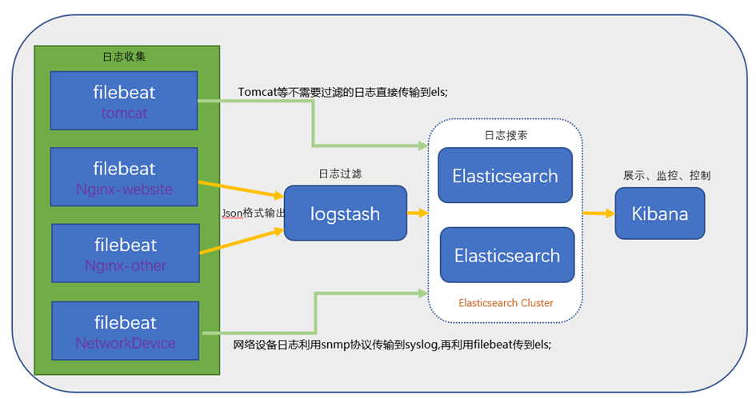

# ELK 

* [ELK安装说明](https://www.jianshu.com/p/d7fdb0917530)

##  介绍

ELK Stack （5.0版本之后→ Elastic Stack ==（ELK Stack + Beats）
ELK Stack包含：ElasticSearch、Logstash、Kibana

早期的ELK架构中使用Logstash收集、解析日志，但是Logstash对内存、cpu、io等资源消耗比较高。相比 Logstash，Beats所占系统的CPU和内存几乎可以忽略不计

* ElasticSearch

  * 是一个搜索引擎，用来搜索、分析、存储日志。它是分布式的，也就是说可以横向扩容，可以自动发现，索引自动分片，总之很强大。

* Logstash

  * 用来采集日志，把日志解析为json格式交给ElasticSearch。

* Kibana

  * 是一个数据可视化组件，把处理后的结果通过web界面展示

* Beats

  * 在这里是一个轻量级日志采集器，其实Beats家族有5个成员

    

x-pack对Elastic Stack提供了安全、警报、监控、报表、图表于一身的扩展包，是收费的

## 架构	

## 安装

## 参考网址

官网https://www.elastic.co/cn/
中文指南https://www.gitbook.com/book/chenryn/elk-stack-guide-cn/details

