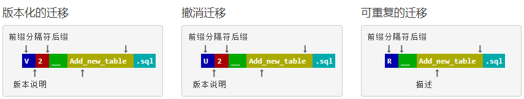
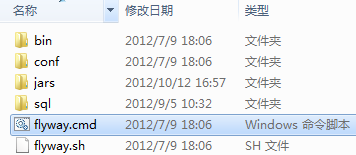
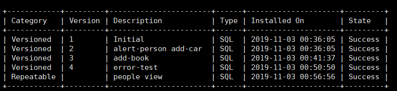

# 数据库版本工具flyway


# 1. 简介

*Flyway* 是独立于数据库的应用、管理并跟踪数据库变更的数据库版本管理工具。

* 项目主页是 *http://flywaydb.org/*  
* github:https://github.com/flyway/flyway
* docker:https://hub.docker.com/r/flyway/flyway


## 1.1 基于SQL的版本控制

推荐的一种方法。将SQL文件写入到特定的目录中，然后由flyway来执行

命名方法如下：



文件名由以下部分组成：

- **前缀**：`V`用于版本控制， `U`用于撤消 和 `R`可重复迁移
- **版本**：带点或下划线的版本可根据需要分隔尽可能多的部分（不适用于可重复的迁移）
- **分隔符**：（`__`两个下划线）
- **说明**：下划线或空格分隔单词
- **后缀**：`.sql`


例如：

```
V1__Initial.sql
V2__Add_people.sql
R__People_view.sql
```


## 1.2 基于JAVA的版本控制

基于Java的迁移非常适合使用SQL无法轻松表示的所有更改。写好的java程序，放入jar目录中就可以了。

这些通常是像

- BLOB和CLOB的更改
- 高级批量数据更改（重新计算，高级格式更改，…）


# 2. 安装


## 2.1 安装Mysql


### ① 配置docker文件

使用docker来安装mysql

```
cd /opt
mkdir -p my-flyway
cd my-flyway
vi docker-compose.yml
```


```yaml
version: '3'
services:
  #mysql
  mysql:
    hostname: mysql
    image: mysql:5.7
    restart: always
    ports:
      - "3306:3306"
    volumes:
      - /etc/localtime:/etc/localtime:ro
    environment:
      MYSQL_ROOT_PASSWORD: mysql@root
      MYSQL_DATABASE: test
```


### ②  生成数据库

```
docker-compose up -d
docker-compose ps
```


### ③  测试数据库

登录到Mysql

```shell
docker-compose exec  mysql  mysql -uroot -pmysql@root test

> show databases;
> show tables;
> select * from test.person;
```


## 2.2 安装Flyway

使用`docker` 安装`flyway`

### ① 创建工作目录

创建两个文件夹：`sql`与`conf`

```shell
mkdir -p flyway/sql flyway/conf
```


### ② 添加配置文件

配置要连接的数据库信息

```shell
vi flyway/conf/flyway.conf
```


> flyway.conf

```sql
flyway.url=jdbc:mysql://192.168.1.179/test
flyway.user=root
flyway.password=mysql@root
flyway.schemas=test
```

`flyway.schemas=test` 这个可以不设置。


### ③ 安装flyway

这里使用docker来安装flyway

```sh
vi flyway.sh
```


```sh	
#!/bin/sh
path=$(pwd)

cmd=$*

if  [ ! -n "$cmd" ] ;then
  cmd=migrate
fi

echo $cmd

docker run --rm -v $path/flyway/sql:/flyway/sql -v $path/flyway/conf:/flyway/conf flyway/flyway $cmd
```

> 变更权限

```
chmod 755 flyway.sh
```


> 测试

```sh
./flyway.sh info
```


# 3. 命令行模式


> 题外话

*下图是非docker安装后的目录结构，这里不做详细说明了。只研究docker形势下，并且是mysql的情况。*




## 3.1 命令说明


| 命令        | 说明                                                         | 备注   |
| ----------- | ------------------------------------------------------------ | ------ |
| **migrate** | 更新                                                         | 常用   |
| **info**    | 显示信息                                                     | 常用   |
| **repair**  | 修复，执行更新出现错误，修改完毕sql后，需要执行这个命令，然后才能进行更新 | 常用   |
| clean       | 清除所有数据，慎用                                           | 慎用   |
| validate    | 校验                                                         | 不常用 |
| undo        | 回滚                                                         | 收费版 |
| baseline    | 建立基线，一个数据库以前没有使用flyway，要先建立基线，然后引入flyway | 不常用 |

备注：收费版本有以下功能：`callbacks` `error overrides` `dry runs`


## 3.2 具体测试

①②③④⑤⑥⑦⑧⑨


### ① 初始化数据库

```shell
vi flyway/sql/V1__Initial.sql
```


> V1__Initial.sql

```sql
create table person (
    id int not null,
    name varchar(100) not null
);

insert into person values (1, 'Axel');
insert into person values (2, 'Mr. Foo');
insert into person values (3, 'Ms. Bar');
```


> 执行

```
./flyway.sh
```


### ② 进行更新

```shell
vi flyway/sql/V2__alert-person_add-car_.sql
```


> V2__alert-person_add-car_.sql

```sql
ALTER TABLE person ADD code int;

create table car (
    id int not null,
    name varchar(100) not null
);
insert into car values (1, 'car1');
insert into car values (2, 'car2');
```


> 执行

```
./flyway.sh
```


### ③ 再次更新

```shell
vi flyway/sql/V3__add-book_.sql
```


> V3__add-book_.sql

```sql
insert into car values (3, 'car3');

create table book (
    id int not null,
    name varchar(100) not null
);
insert into book values (1, 'book1');
```


> 执行

```
./flyway.sh
```


### ④ 执行错误更新并修复

当执行错误时，需要通过`repair`来进行修复

```shell
vi flyway/sql/V4__error-test_.sql
```


> V4__error-test_.sql

```sql
--这里会出现错误，因为book重复
create table book (
    id int not null,
    name varchar(100) not null
);
```


> 执行


```
# 执行这个会出现错误
./flyway.sh

# 修改book成book1
vi flyway/sql/V4__error-test_.sql

# 执行修复
./flyway.sh repair

# 执行成功
./flyway.sh
```


### ⑤ 创建重复更新

必须以R开头，这种脚本只要更新文件内容，就会被执行。

```
vi flyway/sql/R__people_view.sql
```


```sql
CREATE OR REPLACE VIEW people AS 
    SELECT id, name FROM person;
```


```sh
./flyway.sh
./flyway.sh info

# 修改sql文件，并重复更新
vi flyway/sql/R__people_view.sql

# 执行重复更新内容
./flyway.sh
```




### ⑥ 引入变量


> 通过conf文件配置变量

```sh
vi flyway/conf/flyway.conf
```


修改 `flyway.conf`  追加下面的内容

```
flyway.placeholders.tableName=car
```


> 添加新的版本


```shell
vi flyway/sql/V5__add-variable_.sql
```


`V5__add-variable_.sql`  中可以使用一个变量。

```sql
insert into ${tableName}  values (4, 'car4');
```


> 执行

```
./flyway.sh
```


①②③④⑤⑥⑦⑧⑨


# 3. SpringBoot模式

在springboot中集成，这样就可以控制版本信息了。


# 参考文档


* [快速掌握和使用Flyway](https://blog.csdn.net/xiang__liu/article/details/82780201)

