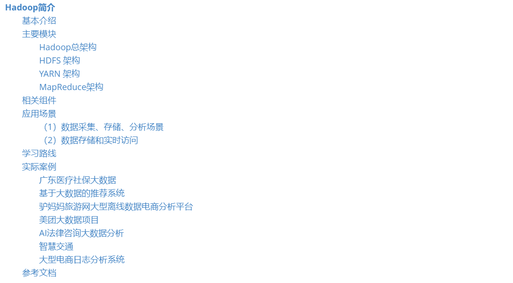
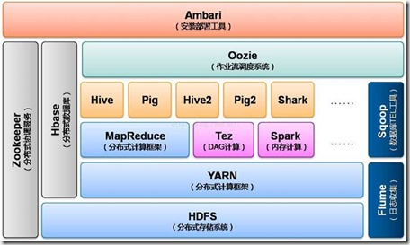
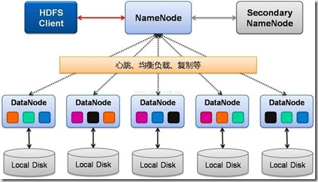
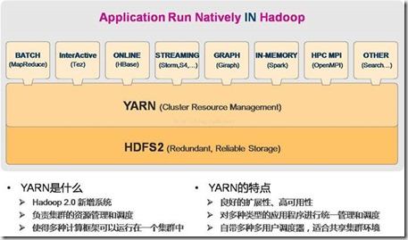
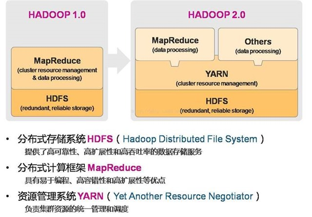
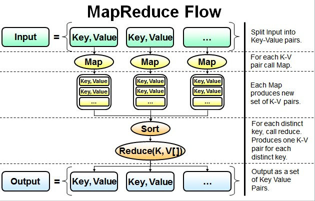
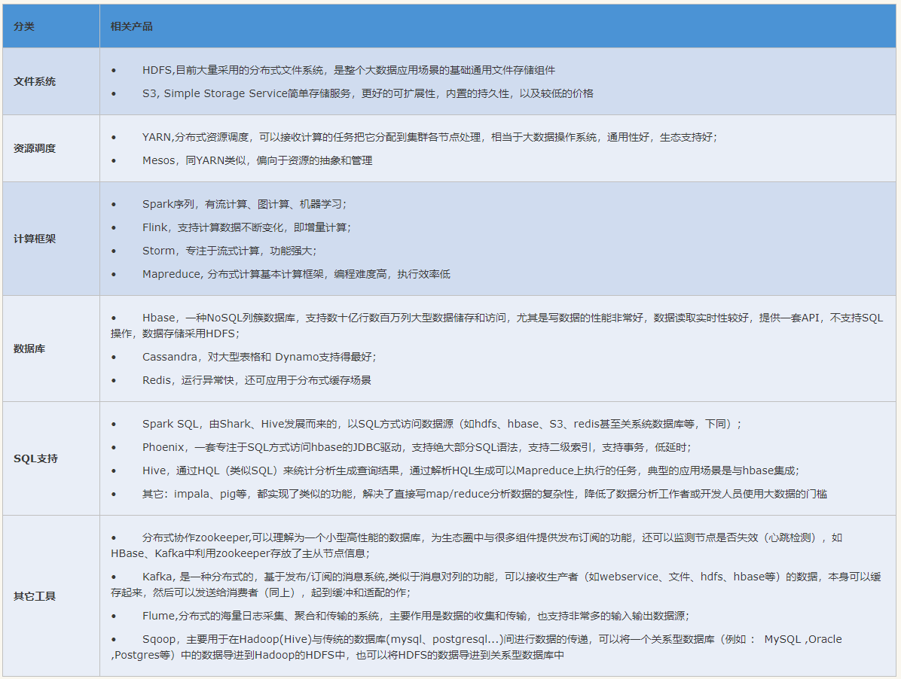

# Hadoop简介

> 目录

## 基本介绍

hadoop特点：

* 处理大型数据文件
  * 一个文件占用128M空间，所以上传的时候，要上传大文件。
  * 如果数据量小，都是小文件，就不适用hadoop
* 分布式存储与计算
  * 存储有保证，如果某台机器出现故障，也有备份。
  * 计算能力被分散到各个机器上。
  * 可以扩展到数千台机器上。

## 主要模块

* common：一些公用的函数，支持其他模块
* HDFS：分布式文件系统
* YARN：一个管理计算任务调度与集群资源的框架
* MapReduce：用于处理大数据
* OZone：Hadoop的对象存储
* Submarine：Hadoop的机器学习引擎

### Hadoop总架构

### HDFS 架构

* Active Namenode
  
* 主 Master（只有一个）
  * 管理 HDFS 的名称空间，管理数据块映射信息；配置副本策略；处理客户端读写请求
* Secondary NameNode
  
* NameNode 的热备；
  * 定期合并 fsimage 和 fsedits，推送给 NameNode；
  * 当 Active NameNode 出现故障时，快速切换为新的 Active NameNode。
* Datanode
  
* Slave（有多个）；
  * 存储实际的数据块；执行数据块读 / 写
* Client
  
  * 与 NameNode 交互，获取文件位置信息；
  * 与 DataNode 交互，读取或者写入数据；管理 HDFS、访问 HDFS。

### YARN 架构

yarn是一个新加的功能

### MapReduce架构

自己撰写计算程序，然后让框架来执行，并返回结果。Hadoop提供了一些基本的例子。

## 相关组件

除了核心模块，还有一些附属的组件，随着不同的组件出现，**这些组件有些已经被淘汰了**，后面会详细介绍的。

* Ambari：基于Web的工具，用来监控与配置Hadoop集群。
* Avro：数据序列化工具
* Cassandra：Cassandra是一套开源分布式NoSQL数据库系统。
  * 其主要功能比Dynamo （分布式的Key-Value存储系统）更丰富，但支持度却不如文档存储MongoDB
* Chukwa： 是一个开源的用于监控大型分布式系统的数据收集系统
  * 开源日志系统：scribe、chukwa、kafka、flume
* HBase：可扩展的分布式数据库，支持大型表的结构化数据存储。
* Hive：一个数据仓库工具
  * 可以将结构化的数据文件映射为一张数据库表，并提供简单的sql查询功能，可以将sql语句转换为MapReduce任务进行运行。
* Mahout：可扩展的机器学习和数据挖掘库
  * Mahout包含许多实现，包括聚类、分类、推荐过滤、频繁子项挖掘。
* Pig：用于并行计算的高级数据流语言和执行框架。
  * Apache Pig是MapReduce的一个抽象，它是一个工具/平台，用于分析较大的数据集，并将它们表示为数据流。
* Spark：用于Hadoop数据的快速通用计算引擎
  * Spark提供了一种简单而富有表现力的编程模型，支持广泛的应用程序，包括ETL，机器学习，流处理和图形计算。
* Tez：基于Hadoop YARN的通用数据流编程框架
  * 它提供了一个功能强大且灵活的引擎来执行任意DAG任务，以处理批量和交互式用例的数据。
  * Tez正在被Hadoop生态系统中的Hive™，Pig™和其他框架以及其他商业软件（例如ETL工具）采用，以取代Hadoop™MapReduce作为底层执行引擎。
* ZooKeeper：用于分布式应用程序的高性能协调服务

## 应用场景

Hadoop、Spark生态圈的组件是相互配合使用的，每个组件都有自己“用武之地”，组合起来完成即可以满足各种系统业务需求，下面列举两个例子：

### （1）数据采集、存储、分析场景

该场景下完成了整个数据的采集、存储、分析，并输出结果，组件搭配如下：

**Flume + kafka(zookeeper)+ Hdfs + Spark/Storm/Hive + Hbase (Zookeeper、Hdfs) /Redis**

说明如下：

* Flume
  * 用来从种渠道（如http、exec、文件、kafka , …）收集数据，并发送到kaffka(当然也可以存放到hdfs、hbase、file、…)
* Kafka
  * 可以缓存数据，与flume一样也支持各种协议的输入和输出。
  * 由于kafka需要zookeeper来完成负载均衡和HA，所以需要zookeeper来支持
* 开始计算
  * 这里有三种选择，Spark/Storm/Hive，各有优势
    * Hive目前仍使用广泛，该技术出现的较早；
    * Storm专注于流式处理，延迟非常低； 
    * Spark最有前景的计算工具；
    * 不管用什么，最终都是对数据的清理、统计，把得到的结果输出
* 展示结果数据存储
  * 可以使用Hbase kafka(zookeeper) /Redis或mysql等，看使用场景（数据量大小等因素）。
  * 由于处理之后的结果数据一般比较少可以直接放到Redis
  * 然后就可以采用常规的技术展示出报表或其它消费方式使用这些计算后的结果数据

### （2）数据存储和实时访问

这种场景非常类似常规应用开发场景，即通过java的JDBC来访问大数据集群，组件搭配：

**Jdbc + Solr + Phoenix/Spark sql + Hbase kafka(zookeeper) + Hdfs**

* Jdbc是通用的java操作数据库的方式，使用的是sql语句

* Solr为全文检索，完成站点分词搜索功能

* Phoenix/Spark sql方便以jdbc方式访问Hbase数据库

* Hdfs最终完成数据的物理存储

> 这个案例解释的不清楚，今后再补充

## 学习路线

* 第一阶段：
  * 掌握linux基础知识
    * 基本命令
    * ip、防火墙配置
    * 应用程序安装
  * 掌握Hadoop基础
    * 各种环境搭建
    * 常规集群管理
    * 核心组件shell交互
    * 熟练阅读hadoop官方文档
* 第二阶段：
  * hadoop实际应用(核心组件的使用)
    * hdfs
    * hbase
    * spark
  * 了解其他开源的hadoop关联产品
  * 学习一些实际的项目应用
* 第三阶段：
  * 深入研究各个模块
  * 改造开源产品

## 实际案例

### 广东医疗社保大数据

### 基于大数据的推荐系统

### 驴妈妈旅游网大型离线数据电商分析平台

### 美团大数据项目

### AI法律咨询大数据分析

### 智慧交通

### 大型电商日志分析系统

## 参考文档

* [hadoop生态系统主要架构图汇总](https://www.cnblogs.com/shujuxiong/p/9714441.html)
* [图解MapReduceMapReduce整体流程图](https://www.cnblogs.com/qiumingcheng/p/5396369.html)

