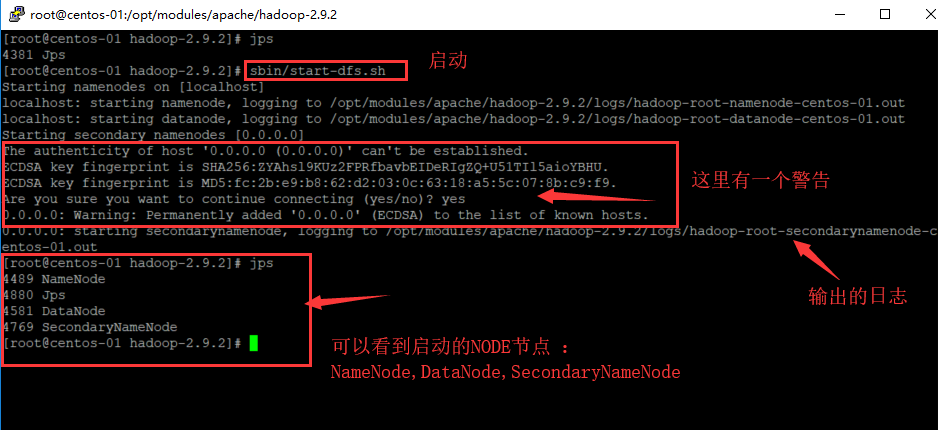
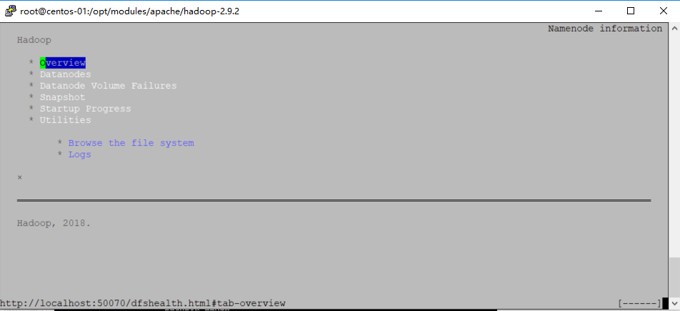
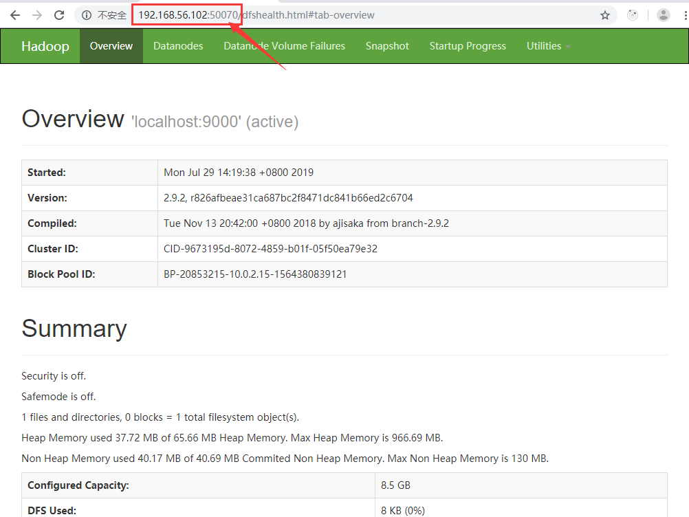

# Hadoop


> 参考网址

* [官方网址](http://hadoop.apache.org/)
* [官方推荐版本](http://hadoop.apache.org/docs/stable/)


## 1：开始安装

当前官方推荐的是`2.9.2`

* [官方参考文档](http://hadoop.apache.org/docs/stable/hadoop-project-dist/hadoop-common/SingleCluster.html)
* [w3cSchool教程](https://www.w3cschool.cn/hadoop)


### 1.1：必要软件

* 必须安装Java™。
* 必须安装ssh并且必须运行sshd才能使用管理远程Hadoop守护进程的Hadoop脚本
* 

#### 1.1.1：安装java

参考文档

* [Hadoop支持的Java版本](https://cwiki.apache.org/confluence/display/HADOOP2/HadoopJavaVersions)
* [centos7安装jdk](https://jingyan.baidu.com/article/9f7e7ec0f8c26b6f28155433.html)

> 具体安装命令

下载一个jdk，并放到共享目录share中。 关于共享目录，见[VirtualBox共享文件夹设置](virtualbox.md#共享文件夹)。

当前apache推荐的是hadoop2.9x，配置的jdk是1.7版本。所以使用了`jdk-7u67-linux-x64.tar.gz`

```shell
# 查找机器上是否安装过jdk
$ rpm -qa | grep jdk
# 如果有，可以使用rmp -e --nodeps 来进行卸载

$ cd /opt
$ mkdir modules
# 查看共享目录中的jdk
$ ls /media/sf_share/  
$  tar -zxf  /media/sf_share/jdk-7u67-linux-x64.tar.gz -C /opt/modules
$ pwd
$ vi /etc/profile #追加java路径
$ source /etc/profile
$ java -version

```

也有网友对配置profile文件有歧义，因为在hadoop中还要配置一次。


> vi /etc/profile 的内容

```
export JAVA_HOME=/opt/modules/jdk1.7.0_67
export PATH=$PATH:$JAVA_HOME/bin
```


#### 1.1.2：安装ssh

```shell
# 安装ssh于rsync ,其中rsync是用来数据同步的
$ yum install ssh
$ yum install rsync


# 补充信息，如何查询是否安装过软件了

$ rpm -qa | grep ssh 
$ ps -ef | grep ssh
$ service sshd status 

```


#### 1.1.3：其他准备

网上推荐要做一下准备，但是我感觉没有必要做，所以先记录下来。

* 修改hostname
* 关闭防火墙


### 1.2: 安装Hadoop


#### 1.2.1：下载Hadoop

当前官方指定的稳定版本是2.9.1，所以下载后，放到`share`目录下。


#### 1.2.2：安装Hadoop

一共有三种安装模式：

- [本地（独立）模式](http://hadoop.apache.org/docs/stable/hadoop-project-dist/hadoop-common/SingleCluster.html#Standalone_Operation)
- [伪分布式模式](http://hadoop.apache.org/docs/stable/hadoop-project-dist/hadoop-common/SingleCluster.html#Pseudo-Distributed_Operation)
- [全分布式模式](http://hadoop.apache.org/docs/stable/hadoop-project-dist/hadoop-common/SingleCluster.html#Fully-Distributed_Operation)


##### 前期准备

将hadoop 解压到指定目录，并指定`JAVA_HOME`

```shell
$ cd /opt/modules
$ mkdir apache
$ ll
# 查看共享目录下的hadoop是否存在
$ ll /media/sf_share/
# 解压到/opt/modules/apache
$ tar -zxf /media/sf_share/hadoop-2.9.2.tar.gz -C /opt/modules/apache
$ cd apache/hadoop-2.9.2
$ vi etc/hadoop/hadoop-env.sh 
# 将JavaHome 修改成export JAVA_HOME=/opt/modules/jdk1.7.0_67
```


##### 配置本地模式

默认情况下，Hadoop配置为以非分布式模式运行，作为单个Java进程。这对调试很有用。

以下示例复制解压缩的conf目录以用作输入，然后查找并显示给定正则表达式的每个匹配项。输出将写入给定的输出目录。

```shell
$ mkdir input
$ cp etc/hadoop/*.xml input
$ bin/hadoop jar share/hadoop/mapreduce/hadoop-mapreduce-examples-2.9.2.jar grep input output 'dfs[a-z.]+'
$ cat output/*
```

上面命令，实际是从`input`目录中按照`grep`正则表达式，找到对应的字符串，并且输出到`output`目录中。关于`mapreduce-examples`里面的例子，可以参考网友撰写的[运行 MapReduce 样例](https://blog.csdn.net/chengqiuming/article/details/78826143)


##### 配置伪分布式模式

为了防止配置错误，先备份一下hadoop，` tar -czvf hadoop-2.9.2-back.tar.gz hadoop-2.9.2/`。

具体配置按照官方的方法进行配置。


###### 修改配置文件

etc/hadoop/core-site.xml:

```xml
<configuration>
    <property>
        <name>fs.defaultFS</name>
        <value>hdfs://localhost:9000</value>
    </property>
</configuration>
```

etc/hadoop/hdfs-site.xml:

```xml
<configuration>
    <property>
        <name>dfs.replication</name>
        <value>1</value>
    </property>
</configuration>
```

配置只分发一份。


###### 设置SSH免登录

检查你是否可以免密码登录

```shell
$ ssh localhost
```

如果你不能免密码登录，那么执行下面的命令

```shell
$ ssh-keygen -t rsa -P '' -f ~/.ssh/id_rsa
$ cat ~/.ssh/id_rsa.pub >> ~/.ssh/authorized_keys
$ chmod 600 ~/.ssh/authorized_keys
```

如果对上面命令不太清楚，请看这篇文档:[ssh免密码登录](https://www.cnblogs.com/lingyejun/p/7367596.html)


###### 执行任务

下面介绍了执行MapReduce任务，如果你想执行一个YARN任务，请看下一节。


1：格式化文件系统

```shell
$ bin/hdfs namenode -format
```


2：启动`NameNode`与`DataNode`进程

```shell
 $ sbin/start-dfs.sh
```

hadoop进程的log写入到了` $HADOOP_LOG_DIR`目录（默认在` $HADOOP_HOME/logs`）




3：浏览`NameNode`的web接口

- NameNode - `http://localhost:50070/`

大多数情况下centos中是命令行的，那么在命令行下如何看这个地址是否显示呢？

```shell
# 在命令行下安装 links后，可以看到这个网址
$ yum install links
$ links http://localhost:50070/
```




如何在其他的机器上访问这个地址？ 默认不能访问的，因为有防火墙，所以需要先执行下面命令

```shell
# 关闭防火墙，如果你不想关闭防火墙，也可以单独是打开接口，见linux-mini.md中的配置。
$  systemctl stop firewalld.service
```

关闭完后防火墙，就可以用嗅探器看到服务器的端口了。


可以使用浏览器看到相关的信息




4：创建MapReduce要执行任务的HDFS目录

```shell
$ bin/hdfs dfs -mkdir /user
$ bin/hdfs dfs -mkdir /user/root
```


5：将输入的文件复制到分布式文件系统

```shell
$ bin/hdfs dfs -put etc/hadoop input
```

上面的命令，将本地的`etc/hadoop`目录下的好多`xml`文件复制到`/user/root/input`目录下，每个文件都占用了`128MB`的空间，所以尽量不要上传小文件。


> 参考文档
* [hdfs dfs命令指南](https://www.cnblogs.com/ximiaomiao/p/7003591.html)
* [HDFS常用命令](https://www.jianshu.com/p/ced993604727)

* [hadoop fs,hadoop dfs以及hdfs dfs区别](https://blog.csdn.net/u013019431/article/details/78485555)


6：执行检索的例子：找到一个词

```shell
 $ bin/hadoop jar share/hadoop/mapreduce/hadoop-mapreduce-examples-2.9.2.jar grep input output 'dfs[a-z.]+'
```

上面命令会在分布式服务器上的`/user/root/output`中放两个结果文件。


7：检查输出的文件：从分布式系统中copy文件到本地的output目录，然后查看

```shell
$ rm -rf output/
$ bin/hdfs dfs -get output output
$ cat output/*
```

或者

直接查看分布式系统上的文件

```shell
 $ bin/hdfs dfs -cat output/*
```


8：当执行完毕后，可以关闭这个线程

在执行下面的命令的时候，可以使用`jps`来看看执行前后的变化。

```
$ sbin/stop-dfs.sh
```

