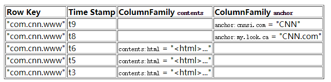
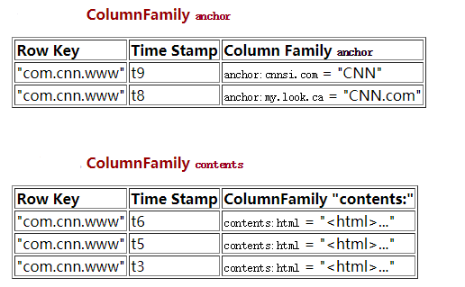
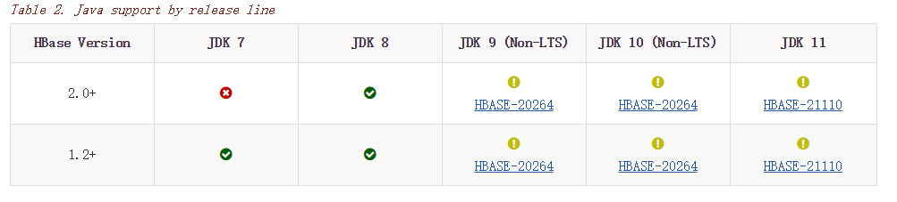
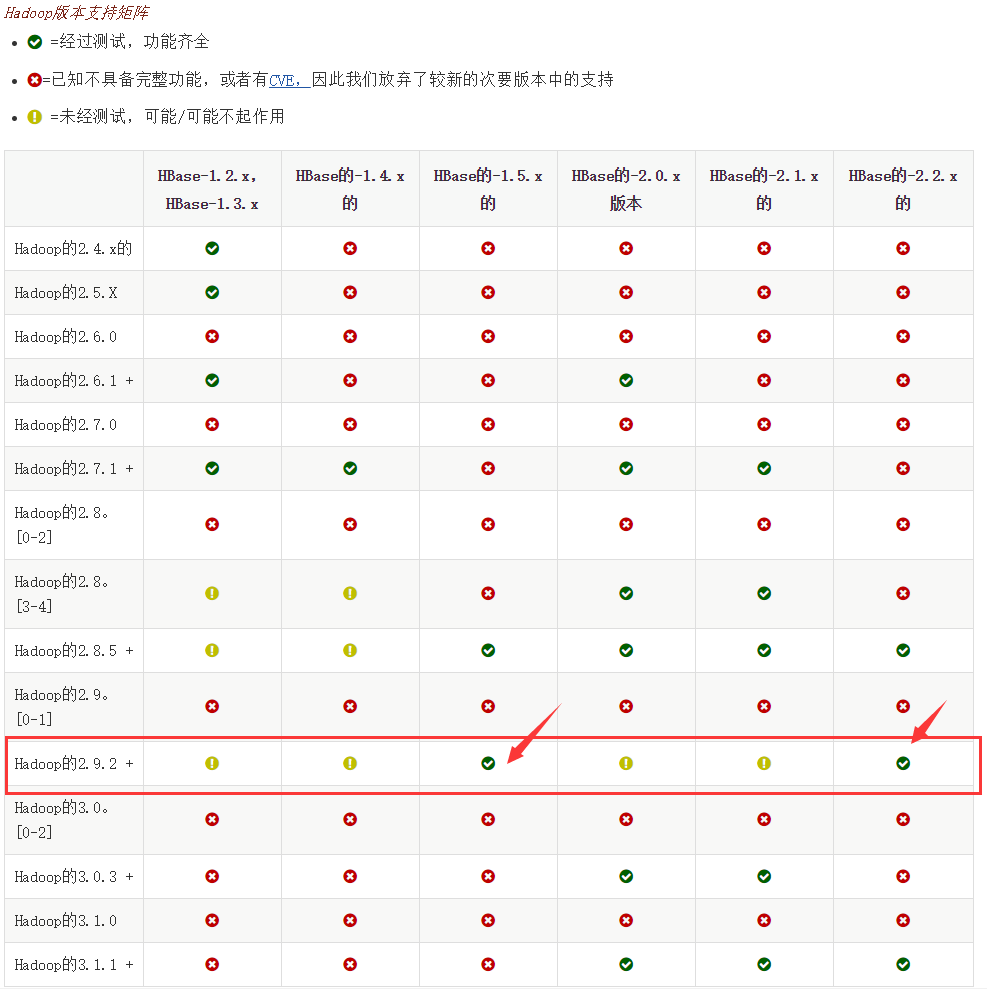
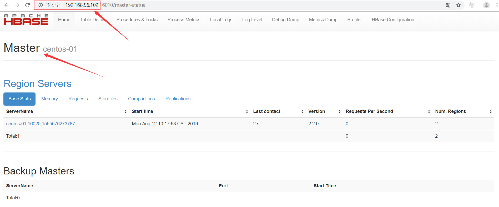
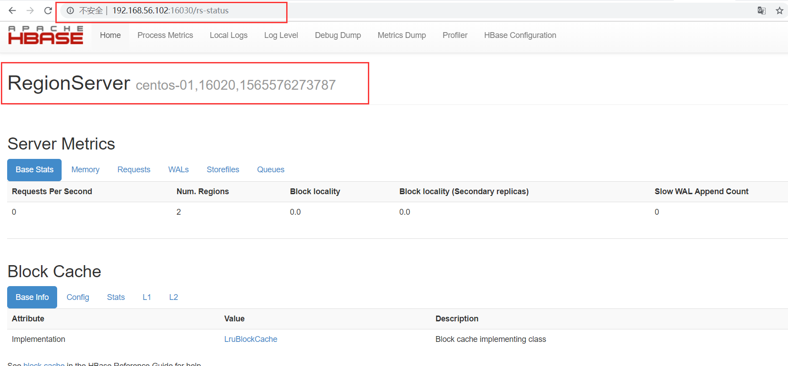
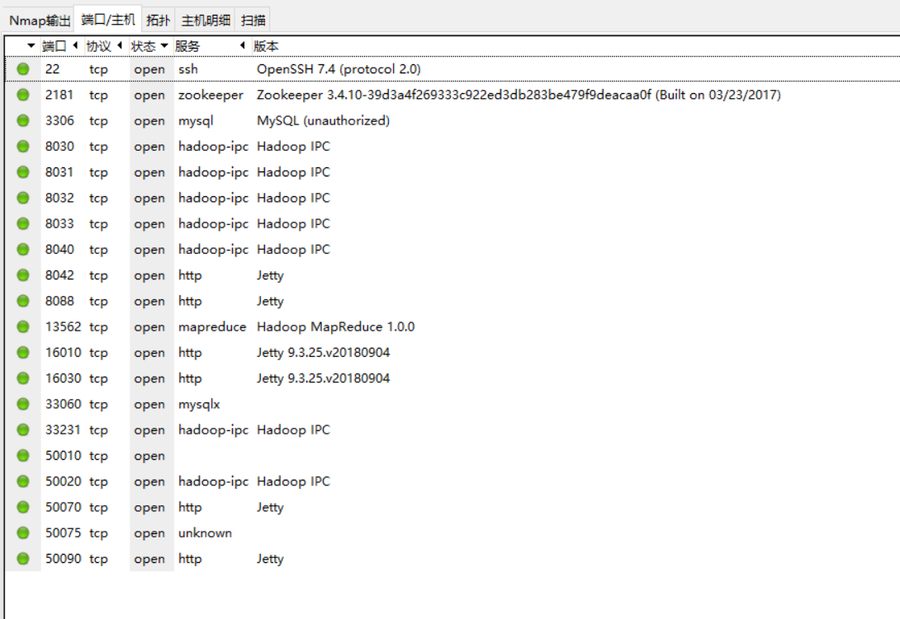
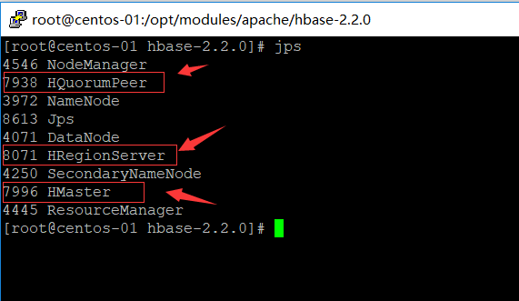

# HBase


**写在前面**

HBase 更像是"数据存储(Data Store)" 多于 "数据库(Data Base)"。


- [x] **什么时候用 HBase?**

HBase不适合所有问题.

首先，确信有足够多数据，如果有上亿或上千亿行数据，HBase是很好的备选。 如果只有上千或上百万行，则用传统的RDBMS可能是更好的选择。因为所有数据可以在一两个节点保存，集群其他节点可能闲置。

其次，确信可以不依赖所有RDBMS的额外特性 (e.g., 列数据类型, 第二索引, 事物,高级查询语言等.) 一个建立在RDBMS上应用，如不能仅通过改变一个JDBC驱动移植到HBase。相对于移植， 需考虑从RDBMS 到 HBase是一次完全的重新设计。

第三， 确信你有足够硬件。甚至 HDFS 在小于5个数据节点时，干不好什么事情 (根据如 HDFS 块复制具有缺省值 3), 还要加上一个 NameNode.

HBase 能在单独的笔记本上运行良好。但这应仅当成开发配置。


- [x] **HBase 和 Hadoop/HDFS 的区别?**

* [HDFS](http://hadoop.apache.org/hdfs/) 是分布式文件系统，适合保存大文件。官方宣称它并非普通用途文件系统，不提供文件的个别记录的快速查询。

* HBase 内部将数据放到索引好的 "存储文件(StoreFiles)" ，以便高速查询。


[TOC]


## 1. 基本概念

如果熟悉关系数据库，有时候对hbase不是太了解。 什么是按照列存储呢？ 到底是什么逻辑。

下面简单介绍一下。


###  1.1. 数据模型

下面是根据[BigTable](http://labs.google.com/papers/bigtable.html) 论文稍加修改的例子。 有一个名为`webtable`的表，包含两个列族`：contents`和`anchor`.在这个例子里面，`anchor`有两个列 (`anchor:cssnsi.com`, `anchor:my.look.ca`)，`contents`仅有一列(`contents:html`)


#### 1.1.1 概念视图

为了让熟悉关系型数据库的人看的，这会误导使用者。实在在磁盘上不是这么来存储的，这是一个展示结果。




#### 1.1.2 物理视图

尽管在概念视图里，表可以被看成是一个稀疏的行的集合。但在物理上，它的是区分列族 存储的。新的columns可以不经过声明直接加入一个列族.




值得注意的是在上面的概念视图中空白cell在物理上是不存储的，因为根本没有必要存储。因此若一个请求为要获取`t8`时间的`contents:html`，他的结果就是空。相似的，若请求为获取`t9`时间的`anchor:my.look.ca`，结果也是空。但是，如果不指明时间，将会返回最新时间的行，每个最新的都会返回。例如，如果请求为获取行键为"com.cnn.www"，没有指明时间戳的话，活动的结果是`t6`下的contents:html，`t9`下的`anchor:cnnsi.com`和`t8`下`anchor:my.look.ca`。


#### 1.1.3. 命名空间

命名空间是与关系数据库系统中的数据库类似的表的逻辑分组。这种抽象为即将出现的多租户相关功能奠定了基础：

> 例子

```shell
#Create a namespace
create_namespace 'my_ns'

#create my_table in my_ns namespace
create 'my_ns:my_table', 'fam'

#drop namespace
drop_namespace 'my_ns'

#alter namespace
alter_namespace 'my_ns', {METHOD => 'set', 'PROPERTY_NAME' => 'PROPERTY_VALUE'}
```

有两个预定义的特殊命名空间：

- hbase - 系统命名空间，用于包含HBase内部表
- default - 没有明确指定名称空间的表将自动落入此名称空间


```shell
#namespace=foo and table qualifier=bar
create 'foo:bar', 'fam'

#namespace=default and table qualifier=bar
create 'bar', 'fam'
```


#### 1.1.4. 列族

在HBase是*列族*一些列的集合。一个列族所有列成员是有着相同的前缀。比如，列*courses:history* 和 *courses:math*都是 列族 *courses*的成员.冒号(:)是列族的分隔符，用来区分前缀和列名。

column 前缀必须是可打印的字符，剩下的部分(称为qualify),可以由任意字节数组组成。列族必须在表建立的时候声明。column就不需要了，随时可以新建。

在物理上，一个的列族成员在文件系统上都是存储在一起。因为存储优化都是针对列族级别的，这就意味着，一个colimn family的所有成员的是用相同的方式访问的。


```shell
# 语法：create <table>, {NAME => <family>, VERSIONS => <VERSIONS>}
# 例如：创建表webtable，有两个family name：anchore，contents

$ hbase(main)> create 'webtable','anchore','contents'


```


#### 1.1.5 Cells

A *{row, column, version}* 元组就是一个HBase中的一个 `cell`。Cell的内容是不可分割的字节数组。


### 1.2. 数据操作模型

四个主要的数据模型操作是 Get, Put, Scan, 和 Delete. 通过 [HTable](http://hbase.apache.org/apidocs/org/apache/hadoop/hbase/client/HTable.html) 实例进行操作.


### 1.3. 版本

一个 *{row, column, version}* 元组是HBase中的一个单元(`cell`).但是有可能会有很多的单元的行和列是相同的，可以使用版本来区分不同的单元.

rows和column key是用字节数组表示的，version则是用一个长整型表示。这个long的值使用 `java.util.Date.getTime()` 或者 `System.currentTimeMillis()`产生的。这就意味着他的含义是“当前时间和1970-01-01 UTC的时间差，单位毫秒。

在HBase中，版本是按倒序排列的，因此当读取这个文件的时候，最先找到的是最近的版本。


#### 1.3.1. HBase的操作(包含版本操作)


* Get/Scan
  * 默认情况下，如果你没有指定版本，当你使用`Get`操作的时候，会返回最近版本的Cell
  * 如果想要返回返回两个以上的把版本,参见[Get.setMaxVersions()](http://hbase.apache.org/docs/current/api/org/apache/hadoop/hbase/client/Get.html#setMaxVersions())
  * 如果想要返回的版本不只是最近的，参见 [Get.setTimeRange()](http://abloz.com/hbase/book.html???)

* Put
  * 创建一个版本，默认使用当前时间戳
  * 当然你也可以自己设置时间戳。这就意味着你可以把时间设置在过去或者未来，或者随意使用一个Long值。
  * 要想覆盖一个现有的值，就意味着你的row,column和版本必须完全相等。

* Delete
  * Delete: 删除列的指定版本.
  * Delete column: 删除列的所有版本.
  * Delete family: 删除特定列族所有列
  * Hbase实际没有物理删除数据，而是做了删除标记。


### 1.4. 设计原则


#### 1.4.1 列族

* 最好是1个，多了有问题
  * 一个表存在多列族，注意基数(如, 行数). 如果列族A有100万行，列族B有10亿行，列族A可能被分散到很多很多区(及区服务器)。这导致扫描列族A低效。


#### 1.4.2 RowKey

##### 1.4.2.1 单调递增行键/时序数据

使用了顺序的key会将本没有顺序的数据变得有顺序，把负载压在一台机器上。所以要尽量避免时间戳或者(e.g. 1, 2, 3)这样的key。

如果你需要导入时间顺序的文件(如log)到HBase中，可以学习[OpenTSDB](http://opentsdb.net/)的做法。他有一个页面来描述他的[schema](http://opentsdb.net/schema.html).OpenTSDB的Key的格式是[metric_type][event_timestamp]，乍一看，似乎违背了不将timestamp做key的建议，但是他并没有将timestamp作为key的一个关键位置，有成百上千的metric_type就足够将压力分散到各个region了。


##### 1.4.2.2 尽量最小化行和列的大小(为何我的存储文件指示很大？)

在HBase中，值是作为一个单元(Cell)保存在系统的中的，要定位一个单元，需要行，列名和时间戳。无论是列族，属性和行键都会在数据中重复上亿次。所以他们的名字要小。


* 列族名
  * 尽量使列族名小，最好一个字符。(如 "d" 表示 data/default).
* 属性名
  * 对应的是fieldName
  * 最好用缩写，这个我喜欢
* rowKey
  * rowKey设计非常重要，这个需要仔细研究一下。并不是越短越好。
  * rowKey不能改变，如果要改变，只能删除后，新追加

#### 1.4.3 版本

* 最大数
  * 默认3，不要设的太大
* 最小数
  * 默认是0


#### 1.4.4 存储内容

​	任何可被转为字节数组的东西可以作为值存入。输入可以是字符串，数字，复杂对象，甚至图像，只要他们能转为字节。

​	存在值的实际长度限制 (如 保存 10-50MB 对象到 HBase 可能对查询来说太长);


#### 1.4.5 存活时间 (TTL)

列族可以设置TTL秒数，HBase 在超时后将自动删除数据。影响 *全部* 行的全部版本 - 甚至当前版本。

最新版本的HBase还支持按每个单元格设置生存时间。


#### 1.4.6 查询已删除的内容

[Get](http://hbase.apache.org/apidocs/org/apache/hadoop/hbase/client/Get.html) 或 [Scan](http://hbase.apache.org/apidocs/org/apache/hadoop/hbase/client/Scan.html) 操作仍可以获取删除的单元。

删除的单元仍然受TTL控制，并永远不会超过“最大版本数”被删除的单元。


#### 1.4.7 如果RowKey像*这样* ，但我又想像*那样*查询该表

* 过滤查询
  * 不要对大表进行全表扫描
* 定期更新第二索引
  * 第二索引可以在另一个表中创建，并通过MapReduce任务定期更新。
  * 任务可以在当天执行，但依赖于加载策略，可能会同主表失去同步。
*  双写第二索引
  * 将数据写到集群的同时创建第二索引(如：写到数据表，同时写到索引表)。
  * 如果该方法在数据表存在之后采用，则需要利用MapReduce任务来生成已有数据的第二索引。
* 汇总表(Summary Tables)
  * 对时间跨度长 (e.g., 年报) 和数据量巨大，汇总表是通用路径。可通过MapReduce任务生成到另一个表。
* 协处理第二索引
  * 协处理动作像 RDBMS 触发器。


#### 1.4.8. 给字段加上校验机制

HBase目前支持传统（SQL）数据库用语中的“约束”。

约束也可用于强制引用完整性，但强烈建议不要这样做，因为它会显着降低启用完整性检查的表的写入吞吐量。


### 1.5. 案例研究

下面将介绍HBase的一些典型数据设计用例，以及如何处理rowkey设计和构造。


#### 1.5.1.  日志与时间戳数据

假设正在收集以下数据元素。

- hostname
- timestamp
- log-event
- message

我们可以将它们存储在名为LOG_DATA的HBase表中，但是rowkey是什么？

rowkey将是hostname，timestamp和log-event的某种组合 - 但具体是什么？


##### 1.5.1.1. timestamp开头

rowkey= `[timestamp][hostname][log-event]`。

这样做有一个问题:单调递增[行键/时间序列数据中](https://hbase.apache.org/book.html#timeseries)描述的单调递增的rowkey问题。

通过对时间戳执行mod操作，在dist-lists中经常提到的关于“bucketing”时间戳的另一种模式。


##### 1.5.1.2. hostname开头

rowkey= `[hostname][log-event][timestamp]`。

如果有大量主机，并且按照主机名查询，这种方法是可取的。


##### 1.5.1.3. timestamp反向时间戳开头

如果要拉取最近的数据，可以采用反向时间戳来处理。

则将时间戳存储为反向时间戳（例如，`timestamp = Long.MAX_VALUE – timestamp`）


##### 1.5.1.4. rowKey的可变长度与固定长度

建议将rowkey转换成固定长度。

rowkey尽量要短。

在rowkey中使用一些替换可能是有意义的。至少有两种方法：散列和数字。


> **将Rowkey转成MD5：**

- [MD5 hash of hostname] = 16 bytes
- [MD5 hash of event-type] = 16 bytes
- [timestamp] = 8 bytes


> **将Rowkey转成数字**

对于这种方法，除了LOG_DATA之外，还需要另一个查找表，称为LOG_TYPES。LOG_TYPES的rowkey是：

- `[type]` （例如，指示主机名与事件类型的字节）
- `[bytes]` 原始主机名或事件类型的可变长度字节。


#### 1.5.2.  日志与时间戳区间数据

有一个网址详细解释: http://opentsdb.net/schema.html, Lessons Learned from OpenTSDB](https://www.slideshare.net/cloudera/4-opentsdb-hbasecon) from HBaseCon2012.


但这就是一般概念的工作原理：例如以这种方式获取数据......

```
[hostname][log-event][timestamp1]
[hostname][log-event][timestamp2]
[hostname][log-event][timestamp3]
```

每个详细事件都有单独的rowkeys，但是会像这样重写...

```
[hostname][log-event][timerange]
```

并且将上述事件中的每一个转换成以相对于开始时间范围的时间偏移（例如，每5分钟）存储的列。这显然是一种非常先进的处理技术


#### 1.5.3.  客户/订单

假设HBase用于存储客户和订单信息。摄取了两种核心记录类型：客户记录类型和订单记录类型。

>  客户记录类型将包括您通常期望的所有内容：

- 顾客号码
- 顾客姓名
- 地址（例如，城市，州，邮编）
- 电话号码等


>  订单记录类型包括以下内容：

- 顾客号码
- 订单号
- 销售日期
- 订单详细信息，例如商品明细，配送明细（有关详细信息，请参阅[订单对象设计](https://hbase.apache.org/book.html#schema.casestudies.custorder.obj)）


假设客户编号和销售订单的组合唯一地标识订单，这两个属性将组成rowkey，特别是组合键，例如：

```
[客户编号] [订单编号]
```

对于ORDER表。但是，还有更多的设计决策要做


##### 1.5.3.1. rowkey怎么设计合理？

在HBase中使用固定长度密钥是有利的，可以使用如下方案。

> Rowkey进行MD5编码：

- [客户编号的MD5] = 16个字节
- [订货号的MD5] = 16个字节

> Rowkey进行MD5与数字编码：

- [代替客户编号] = 8个字节
- [订货号的MD5] = 16个字节


##### 1.5.3.2. 单表？多个表？

传统的设计方法将为CUSTOMER和SALES提供单独的表。另一个选择是将多个记录类型打包到一个表中（例如，CUSTOMER ++）。单表最好。

具体做法如下：

> 客户记录类型Rowkey：

- [顾客ID]
- [type] =表示客户记录类型为“1”的类型

> 订单记录类型Rowkey：

- [顾客ID]
- [type] =表示订单记录类型的“2”的类型
- [订单]

这种特殊的CUSTOMER ++方法的优点是可以按客户ID组织许多不同的记录类型（例如，单次扫描可以获得有关该客户的所有信息）。缺点是扫描特定记录类型并不容易。


##### 1.5.3.3. 订单详情的设计？

假设订单详细结构如下：

> 订单

订单的基本信息

> 订单明细

对应多行记录，例如一个订单里面有多个商品。下面有很多中设计方法

###### 1.5.3.3.1 完全标准化

通过这种方法，ORDER，SHIPPING_LOCATION和LINE_ITEM 将会有单独的表格。

上面描述了 ORDER 表的 rowkey：schema.casestudies.custorder

SHIPPING_LOCATION 的复合 rowkey 就像这样：

- [order-rowkey]
- [shipping location number] （例如，第一地点，第二地点等）

LINE_ITEM 表的复合 rowkey 将如下所示：

- [order-rowkey]
- [shipping location number] （例如，第一地点，第二地点等）
- [line item number] （例如，第一条线，第二条等）

这样的标准化模型很可能是 RDBMS 的方法，但这不是 HBase 唯一的选择。这种做法的缺点是要检索任何订单的信息，您需要：

- 获取订单的订单表
- 在 SHIPPING_LOCATION 表上扫描该订单以获取 ShippingLocation 实例
- 扫描每个 ShippingLocation 的 LINE_ITEM

这是一个 RDBMS 无论如何都会在封面下做的事情，但由于 HBase 中没有加入，所以您只是更加意识到这一点。


###### 1.5.3.3.2 具有记录类型的单个表

采用这种方法，将会存在一个包含单个表的ORDER

Order rowkey 如上所述：schema.casestudies.custorder

- [order-rowkey]
- [ORDER record type]

ShippingLocation 复合 rowkey 将如下所示：

- [order-rowkey]
- [SHIPPING record type]
- [shipping location number] （例如，第一地点，第二地点等）

LineItem 复合 rowkey 将如下所示：

- [order-rowkey]
- [LINE record type]
- [shipping location number] （例如，第一地点，第二地点等）
- [line item number] （例如，第一条线，第二条等）


###### 1.5.3.3.3 非规范化

具有记录类型的单个表格的一种变体是对一些对象层次结构进行非规范化和扁平化.

比如将 ShippingLocation 属性折叠到每个 LineItem 实例上。

LineItem 复合 rowkey 将如下所示：

LineItem 复合 rowkey 将如下所示：

- [order-rowkey]
- [LINE record type]
- [line item number] （例如，第一条线，第二条等，必须注意的是，在整个订单中都是唯一的）

LineItem 列将是这样的：

- 项目编号（itemNumber）
- 数量（quantity）
- 价钱（price）
- shipToLine1（从 ShippingLocation 非正规化）
- shipToLine2（从 ShippingLocation 非正规化）
- shipToCity（从 ShippingLocation 非正规化）
- shipToState（从 ShippingLocation 非正规化）
- shipToZip（从 ShippingLocation 非正规化）

这种方法的优点包括不太复杂的对象层次结构，但其中一个缺点是，如果这些信息发生变化，更新会变得更加复杂。


###### 1.5.3.3.4 BLOB对象

通过这种方法，整个 Order 对象图都以某种方式处理为 BLOB。例如，上面描述了 ORDER 表的 rowkey：schema.casestudies.custorder，而一个名为“order”的列将包含一个可以反序列化的对象，该对象包含一个容器 Order，ShippingLocations 和 LineItems。

这里有很多选项：JSON，XML，Java 序列化，Avro，Hadoop Writable等等。所有这些都是相同方法的变体：将对象图编码为字节数组。应该注意这种方法，以确保在对象模型发生更改时保持向后兼容性，使旧的持久结构仍能从 HBase 中读出。

优点是能够以最少的 I/O 来管理复杂的对象图（例如，在本例中每个 HBase Get 有 Order），但缺点包括前面提到的关于序列化的向后兼容性，序列化的语言依赖性（例如 Java 序列化只适用于 Java 客户端），事实上你必须反序列化整个对象才能获得 BLOB 中的任何信息，以及像 Hive 这样的框架难以使用像这样的自定义对象。


### 1.6. 安全防护

设置HBase 和 HBase 客户端，以安全连接到HBase 资源.


### 1.7. ZooKeeper

一个分布式运行的HBase依赖一个zookeeper集群。所有的节点和客户端都必须能够访问zookeeper。

默认的情况下HBase会管理一个zookeep集群。这个集群会随着HBase的启动而启动。

当然，你也可以自己管理一个zookeeper集群，但需要配置HBase。你需要修改`conf/hbase-env.sh`里面的`HBASE_MANAGES_ZK` 来切换。这个值默认是true的，作用是让HBase启动的时候同时也启动zookeeper.


## 2.  安装

有三种安装方法

- 单机版：只使用本地文件模式，不使用hdfs.
- 伪分布模式：在单机模拟分布式，使用hdfs
- 分布式模式：配置hbase的分布式模式


### 2.1. 基本要求


#### 2.1.1. 操作系统要求

* SSH免密码登录
* DNS
  * HBase使用本地主机名自我报告其IP地址。
  * 修改hosts文件，指定域名
* NTP
  * 时钟服务器，各个服务器的时间应该是同步的。
* 文件和进程数限制（ulimit）
  * [centos7的修改ulimit](https://blog.csdn.net/free_xiaochen/article/details/86704263)
  * ulimit -a  查看当前数量
  * 建议将ulimit提高到至10240


#### 2.1.2. java要求



#### 2.1.3. Hadoop要求

*建议使用Hadoop 2.x.*  Hadoop 3.x仍处于早期访问版本中，尚未经过HBase社区对生产用例的充分测试。



>  用HBase替换捆绑的Hadoop！

因为HBase依赖于Hadoop，所以它将Hadoop jar捆绑在其*lib*目录下。捆绑的罐子仅用于独立模式。在分布式模式下，群集上的Hadoop版本与HBase下的版本匹配*至关重要*。将HBase lib目录中的hadoop jar替换为您在群集上运行的版本中的等效hadoop jar，以避免版本不匹配问题。确保在整个群集中替换HBase下的jar。Hadoop版本不匹配问题有各种表现形式。如果HBase出现挂起，请检查是否不匹配。

> 需要配置Hadoop的文件上限制

请确保已配置Hadoop的*conf / hdfs-site.xml*，并将`dfs.datanode.max.transfer.threads`值设置为至少以下值：

```xml
<property>
  <name>dfs.datanode.max.transfer.threads</name>
  <value>4096</value>
</property>
```


#### 2.1.4. ZooKeeper要求

ZooKeeper 3.4.x是必需的。


### 2.2. 单机模式


hbase-env.sh 路径

```
export JAVA_HOME=/opt/modules/jdk1.8.0_221
```


#### 2.2.1. 修改*hbase-site.xml* 文件

```xml
<property>
    <name>hbase.rootdir</name>
    <value>file:/opt/modules/data/hbase</value>
  </property>
  <property>
    <name>hbase.zookeeper.property.dataDir</name>
    <value>/opt/modules/data/zookeeper</value>
  </property>
  <property>
    <name>hbase.unsafe.stream.capability.enforce</name>
    <value>false</value>
    <description>
      Controls whether HBase will check for stream capabilities (hflush/hsync).

      Disable this if you intend to run on LocalFileSystem, denoted by a rootdir
      with the 'file://' scheme, but be mindful of the NOTE below.

      WARNING: Setting this to false blinds you to potential data loss and
      inconsistent system state in the event of process and/or node failures. If
      HBase is complaining of an inability to use hsync or hflush it's most
      likely not a false positive.
    </description>
  </property>
```


#### 2.2.2. 启动hbase

```shell
$ bin/start-hbase.sh
```


#### 2.2.3. 查看启动

```shell
$ jps	
```

只能看到HMaster这一个线程。

并且http://192.168.56.102:60010 不能访问，使用[http://192.168.56.102:16010](http://192.168.56.102:16010/)

HBASE1.0之后的版本web端访问的接口变更为16010




http://192.168.56.102:16030/




#### 2.2.4. 启动后的端口




#### 2.2.5. 简练练习

```shell
$ ./bin/hbase shell
$ hbase(main):001:0> create 'test', 'cf'
$ hbase(main):002:0> list 'test'
$ hbase(main):003:0> describe 'test'

$ hbase(main):003:0> put 'test', 'row1', 'cf:a', 'value1'
$ hbase(main):004:0> put 'test', 'row2', 'cf:b', 'value2'
$ hbase(main):005:0> put 'test', 'row3', 'cf:c', 'value3'

$ hbase(main):006:0> scan 'test'

$ hbase(main):007:0> get 'test', 'row1'

$ hbase(main):008:0> disable 'test'

$ hbase(main):011:0> drop 'test'

$ exit
```


#### 2.2.6. 关闭hbase

```shell
$ bin/stop-hbase.sh
```


### 2.3. 伪分布模式的安装

**需要修改的文件**

* hbase-env.sh
* hbase-site.xml
* reginservers(**官方文档没有说**)

fanhl@189.cn

* 配置JDK路径
* 配置数据存储位置，指定HDFS路径
* 指定分布式模式
* 配置zookeeper(可配合自己的zookeeper)
  * 也可以使用默认的 
  * 如果使用自定义的
    * 注意要替换zookeeper的jar包
* 用Hadoop的jar包，替换HBase的jar包(**可以不用执行**)
  * 首先备份HBase总的 hadoop开头的jar包
  * 然后、将hadoop的jar包复制到HBase的目录中。


#### 2.3.1. 解压hbase安装包

[在hbase网站上](https://www.apache.org/dyn/closer.lua/hbase/)下载2.2.0版本`hbase-2.2.0-bin.tar.gz`

```shell
$ cd /opt/modules/apache
$ tar xzvf /media/sf_share/hbase-2.2.0-bin.tar.gz
```


#### 2.3.2. 配置hbase-env.sh

```
export JAVA_HOME=/opt/modules/jdk1.8.0_221
```


#### 2.3.3 配置hbase-site.xml

```xml
<!--
/**
 * 官网上写的是通过8020端口
 * 由于我没有启动分布式，所以这里要修改成9000
   不然在分布式上显示不了数据库的内容
 *
 */
-->


<property>
  <name>hbase.rootdir</name>
  <value>hdfs://localhost:9000/hbase</value>
</property>

<property>
  <name>hbase.cluster.distributed</name>
  <value>true</value>
</property>


<property>
    <name>hbase.zookeeper.property.dataDir</name>
    <value>/opt/modules/data/zookeeper</value>
</property>


```

#### 2.3.4. 启动hbase

```shell
$ bin/start-hbase.sh
$ jps
```



可以通过jps可到多了两个线程.HMaster和HRegionServer进程。

HQuorumPeer 是zookeeper

#### 2.3.5. 开放接口

如果闲麻烦，可以关闭防火墙


```shell
$ systemctl stop firewalld.service
```

或者

```
firewall-cmd --add-port=16010/tcp --permanent
firewall-cmd --add-port=16030/tcp --permanent
firewall-cmd --reload
systemctl status firewalld
firewall-cmd --list-ports
```


#### 2.3.6. 启动后的常用网址

* HMaster
  * http://192.168.56.102:16010
* HRegionServer
  * http://192.168.56.102:16030
* hadoopMaster
  * [http://192.168.56.102:50070](http://192.168.56.102:50070/)
  * 也可使用命令来查看

```shell
$ ../hadoop-2.9.2/bin/hdfs dfs -ls /
```


#### 2.3.7. 简练练习

```shell
$ bin/hbase shell
$ hbase(main):001:0> create 'test', 'cf'
$ hbase(main):002:0> list 'test'
$ hbase(main):003:0> describe 'test'

$ hbase(main):003:0> put 'test', 'row1', 'cf:a', 'value1'
$ hbase(main):004:0> put 'test', 'row2', 'cf:b', 'value2'
$ hbase(main):005:0> put 'test', 'row3', 'cf:c', 'value3'

$ hbase(main):006:0> scan 'test'

$ hbase(main):007:0> get 'test', 'row1'

# 这命令可以不执行
#$ hbase(main):008:0> disable 'test'

# 这命令可以不执行
#$ hbase(main):011:0> drop 'test'

$ exit
```


### 2.4. 日常运行命令

> 前置服务

- 确保HDFS首先运行。
  - HBase通常不使用MapReduce或YARN守护进程。这些不需要启动。
- *如果*您正在管理自己的ZooKeeper，请启动它并确认它正在运行
  - 否则HBase将为您启动ZooKeeper作为其启动过程的一部分。

> 启动

```shell
$ bin/start-hbase.sh
```


> 停止

```shell
$ bin/stop-hbase.sh
$ jps
```


> 如果发现Hregionserver没有停止

```shell
$ bin/hbase-daemon.sh stop regionserver RegionServer
```


[Hadoop, HBase, Hive, ZooKeeper默认端口说明](https://www.cnblogs.com/hankedang/p/5649414.html)


### 2.5. 辅助工具


#### 2.5.1. rsync 数据同步工具


> 进行多台机器配置时，使用这个工具可以快速进行同步。

[rsync用法详细解释](https://www.cnblogs.com/noxy/p/8986164.html)

rsync（remote synchronize）是一个远程数据同步工具，可通过 LAN/WAN 快速同步多台主机之间的文件。也可以使用 rsync 同步本地硬盘中的不同目录。
rsync 是用于替代 rcp 的一个工具，rsync 使用所谓的 rsync算法 进行数据同步，这种算法只传送两个文件的不同部分，而不是每次都整份传送，因此速度相当快。 您可以参考 How Rsync Works A Practical Overview 进一步了解 rsync 的运作机制。


#### 2.5.2. xmllint xml验证工具

[xmllint命令处理xml与htm](http://www.361way.com/xmllint-html-xml/3048.html)


#### 2.5.3. jstack

`jstack` 是一个最重要(除了看Log)的java工具，可以看到具体的Java进程的在做什么。可以先用Jps看到进程的Id,然后就可以用jstack。他会按线程的创建顺序显示线程的列表，还有这个线程在做什么。


#### 2.5.4. clusterssh+top

clusterssh+top,感觉是一个穷人用的监控系统，但是他确实很有效，当你只有几台机器的是，很好设置。启动clusterssh后，你就会每台机器有个终端，还有一个终端，你在这个终端的操作都会反应到其他的每一个终端上。 这就意味着，你在一天机器执行“top”,集群中的所有机器都会给你全部的top信息。你还可以这样tail全部的log，等等。


### 2.6.  Shell基本命令

```shell
# 命名空间的操作
hbase(main):009:0> list_namespace
hbase(main):009:0> list_namespace_tables 'hbase'
hbase(main):009:0> help 'create_namespace'
hbase(main):009:0> create_namespace 'ns1'
hbase(main):009:0> list_namespace_tables 'ns1'

# 添加表
hbase(main):009:0>  help 'create'
hbase(main):009:0>  create 'ns1:stuInfo' , 'info','contact'
hbase(main):009:0>  list_namespace_tables 'ns1'
hbase(main):009:0> 	help 'scan'
hbase(main):009:0> 	scan 'ns1:stuInfo'

# 添加数据
hbase(main):009:0> 	help 'put'
hbase(main):009:0> 	put  'ns1:stuInfo','1001','info:age',"18"
hbase(main):009:0> 	put  'ns1:stuInfo','1001','info:gender',"male"
hbase(main):009:0> 	put  'ns1:stuInfo','1001','info:gender',"1"

hbase(main):009:0> 	put  'ns1:stuInfo','1003','info:age',"18"
hbase(main):009:0> 	put  'ns1:stuInfo','1003','info:name',"小懂"
hbase(main):009:0> 	put  'ns1:stuInfo','1003','info:gender',"male"

hbase(main):009:0> 	scan 'ns1:stuInfo'

# 查询 
hbase(main):009:0> 	get 'ns1:stuInfo','1003'
hbase(main):009:0> 	get 'ns1:stuInfo','1003','info'
hbase(main):009:0> 	get 'ns1:stuInfo','1003','info:age'
hbase(main):009:0> 	get 'ns1:stuInfo','1003','info:age','info:gender'

# 查询历史版本
hbase(main):009:0> 	get 'ns1:stuInfo','1003',{COLUMN=>'info',VERSIONS=>5}


# scan 全表查询 下面有些用 get 检索不到
hbase(main):009:0> 	scan 'ns1:stuInfo',{COLUMN=>['info:age','info:gender'],LIMIT=>2,STARTROW=>'1003'}
hbase(main):009:0> 	scan 'ns1:stuInfo',{STARTROW=>'1001',STOPROW=>'1003'}

# 删除
hbase(main):009:0>  help 'delete'
hbase(main):009:0>  help 'deleteall'
hbase(main):009:0>  scan 'ns1:stuInfo'
# 下面报错,但是可以使用deleteall
hbase(main):009:0>  delete 'ns1:stuInfo','1001'
# 下面删除一个列族是无效的,但是可以使用deleteall
hbase(main):009:0>  delete 'ns1:stuInfo','1001','info'
# 只能这样删除
hbase(main):009:0>  delete 'ns1:stuInfo','1001','info:age'


# 修改数据，也是用put


# 清空数据,并且对region的数量重置
truncate
# 清空数据,region的数量不变
truncate_preserve
```


## 3. 运行Shell

要运行HBase shell，请执行以下操作：

```shell
$ ./bin/hbase shell
```

键入`help`然后`<RETURN>`查看shell命令和选项列表。至少浏览帮助输出末尾的段落，了解如何将变量和命令参数输入HBase shell; 特别注意必须引用表名，行和列等。

请参阅[shell练习](http://hbase.apache.org/book.html#shell_exercises)，例如基本shell操作。


### 3.1. 使用Ruby脚本

有关编写Apache HBase脚本的示例，请查看HBase *bin* 目录。查看以** .rb*结尾的文件。要运行其中一个文件，请执行以下操作：

```
$ ./bin/hbase org.jruby.Main PATH_TO_SCRIPT
```


### 3.2. 使用操作系统的shell脚本


您可以在操作系统脚本解释器中使用HBase shell，例如Bash shell，它是大多数Linux和UNIX发行版的默认命令解释器。

不建议使用。

以这种方式生成HBase Shell命令很慢，因此在决定何时将HBase操作与操作系统命令行组合时，请记住这一点。

```shell
$ echo "describe 'test1'" | ./hbase shell -n
```

> 语法参考

[2>/dev/null和>/dev/null 2>&1和2>&1>/dev/null的区别](https://blog.csdn.net/longgeaisisi/article/details/90519690)


> 另外一个例子

```shell
#!/bin/bash

echo "describe 'test'" | ./hbase shell -n > /dev/null 2>&1
status=$?
echo "The status was " $status
if ($status == 0); then
    echo "The command succeeded"
else
    echo "The command may have failed."
fi
return $status
```


### 3.3. 从文件中读取HBase Shell命令

您可以将HBase Shell命令输入到文本文件中，每行一个命令，并将该文件传递给HBase Shell。

*示例命令文件*:sample_commands.txt

```
create 'test', 'cf'
list 'test'
put 'test', 'row1', 'cf:a', 'value1'
put 'test', 'row2', 'cf:b', 'value2'
put 'test', 'row3', 'cf:c', 'value3'
put 'test', 'row4', 'cf:d', 'value4'
scan 'test'
get 'test', 'row1'
disable 'test'
enable 'test'
```

*指示HBase Shell执行命令*

将路径传递给命令文件作为命令的唯一参数`hbase shell`。执行每个命令并显示其输出。如果未`exit`在脚本中包含该命令，则会返回到HBase shell提示符。无法以编程方式检查每个命令的成功或失败。此外，虽然您看到每个命令的输出，但命令本身不会回显到屏幕，因此很难将命令与其输出对齐。

```
$ ./hbase shell ./sample_commands.txt
0 row(s) in 3.4170 seconds

TABLE
test
1 row(s) in 0.0590 seconds

0 row(s) in 0.1540 seconds

0 row(s) in 0.0080 seconds

0 row(s) in 0.0060 seconds

0 row(s) in 0.0060 seconds

ROW                   COLUMN+CELL
 row1                 column=cf:a, timestamp=1407130286968, value=value1
 row2                 column=cf:b, timestamp=1407130286997, value=value2
 row3                 column=cf:c, timestamp=1407130287007, value=value3
 row4                 column=cf:d, timestamp=1407130287015, value=value4
4 row(s) in 0.0420 seconds

COLUMN                CELL
 cf:a                 timestamp=1407130286968, value=value1
1 row(s) in 0.0110 seconds

0 row(s) in 1.5630 seconds

0 row(s) in 0.4360 seconds
```


### 3.4. Shell 高级技巧


#### 3.4.1. 表变量

这个技巧可以现在不使用，因为简化不了多少操作。


#### 3.4.2. 命令历史记录irbrc

在您的主目录中为自己创建一个*.irbrc*文件。添加自定义项。一个有用的是命令历史记录，因此命令在Shell调用中保存：

```
$ more .irbrc
require 'irb/ext/save-history'
IRB.conf[:SAVE_HISTORY] = 100
IRB.conf[:HISTORY_FILE] = "#{ENV['HOME']}/.irb-save-history"
```


#### 3.4.3. 时间函数

要将日期'08 / 08/16 20:56:29'从hbase日志转换为时间戳，请执行以下操作：

```shell
hbase(main):021:0> import java.text.SimpleDateFormat
hbase(main):022:0> import java.text.ParsePosition
hbase(main):023:0> SimpleDateFormat.new("yy/MM/dd HH:mm:ss").parse("08/08/16 20:56:29", ParsePosition.new(0)).getTime() => 1218920189000
```

反向操作

```
hbase(main):021:0> import java.util.Date
hbase(main):022:0> Date.new(1218920189000).toString() => "Sat Aug 16 20:56:29 UTC 2008"
```

要以与HBase日志格式完全相同的格式输出，需要使用[SimpleDateFormat](http://download.oracle.com/javase/6/docs/api/java/text/SimpleDateFormat.html)。


#### 3.4.4. 查询与设置Shell配置

查询配置：

```
hbase(main):001:0> @shell.hbase.configuration.get("hbase.rpc.timeout")
=> "60000"
```

设置配置：

```
hbase(main):005:0> @shell.hbase.configuration.setInt("hbase.rpc.timeout", 61010)
hbase(main):006:0> @shell.hbase.configuration.get("hbase.rpc.timeout")
=> "61010"
```


#### 3.4.5. 使用HBase Shell预分割表

这个使用的不多，知道就可以了

通过HBase Shell `create`命令创建表时，可以使用各种选项预分割表。

最简单的方法是在创建表时指定一个拆分点数组。请注意，将字符串文字指定为拆分点时，这些将根据字符串的基础字节表示创建拆分点。因此，当指定分割点'10'时，我们实际上指定了字节分割点'\ x31 \ 30'。

分割点将定义`n+1`区域，其中`n`分割点的数量。最低区域将包含最低可能键的所有键，但不包括第一个分割点键。下一个区域将包含第一个分割点的键，但不包括下一个分割点键。对于所有分割点，这将持续到最后一个。最后一个区域将从最后一个分割点到最大可能键定义。

```
hbase>create 't1','f',SPLITS => ['10','20','30']
```

在上面的示例中，将使用列族'f'创建表't1'，预分割为四个区域。请注意，第一个区域将包含从'\ x00'到'\ x30'的所有键（因为'\ x31'是'1'的ASCII代码）。


#### 3.4.6. 调试

您可以在shell中设置调试开关，以便在运行命令时查看更多输出 - 例如，异常时的堆栈跟踪更多 - ：

```
hbase> debug <RETURN>
```

DEBUG日志级别

要在shell中启用DEBUG级别日志记录，请使用该`-d`选项启动它。

```
$ ./bin/hbase shell -d
```


#### 3.4.7. 其他命令

Count命令返回表中的行数。配置正确的CACHE时速度非常快

```
hbase> count '<tablename>', CACHE => 1000
```

以上计数一次提取1000行。如果您的行很大，请将CACHE设置得更低。默认是一次获取一行。


## 4. java开发

见专门的文档


## 5. 辅助功能


### 5.1. MapReduce与HBase

MR在HBase中做分析的不多，但是可以做一些简单的数据清洗

HBase自带一个MR程序，可以使用`lib/hbase-server-***-hadoop2.jar`，里面有一些常用的导入导出命令。


### 5.2. Hive与HBase集成

不用深入了解，Hive基本上会被其他的功能替换。

通过Hive可以进行max avg min max.


## 6. 常用功能


### 6.1. HBase压缩

- 要检查hadoop是否支持压缩

```shell
# 检查是否支持snappy压缩
bin/hadoop checknative
```

- 检查hbase是否支持压缩

```shell
bin/hbase org.apache.hadoop.util.NativeLibraryChecker
```

然后在网上查如何启动压缩。


### 6.2. 优化与维护


### 6.3. phoenix集成

[phoenix使用](hbase-phoenix.md)


##  参考资料


* [HBase教程--非常简单](https://www.yiibai.com/hbase/)
* [0.95版本的官方中文教程](http://abloz.com/hbase/book.html#preface)
* [HBase官方文档-这个非常不错](https://www.w3cschool.cn/hbase_doc/?)

