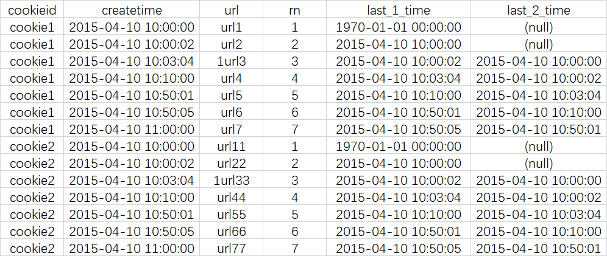
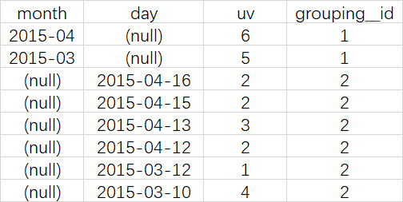
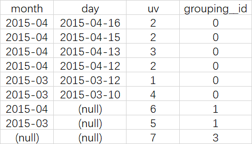

# Hive高级功能

[TOC]


## ETL

主要步骤：

* 1、得到一个完整的数据
* 2、清洗表，按照不同维度抽取数据
* 3、聚合数据
* 4、最后进行展示


## Hive常用语法操作


### 读取数据的场景


#### 一、HDFS上已经存在了数据文件

可以在hive建立一个表，将已有的数据文件与这个表关联起来。


> 假设在本地input/student.txt有个文件

```txt
1,小明
2,宣萱
3,悠悠
4,安安
5,小鱼
```

在一般情况下，如果在相对路径下，所有的数据默认放在`/user/root`，由于我是root登录的。

```shell
# 假设我是root登录的,下面三条显示的效果是一样的。建议加上完整的路径
$  bin/hdfs dfs -ls /user/root
$  bin/hdfs dfs -ls
$  bin/hdfs dfs -ls ./
```


> 第一步：通过hdfs，建立一个目录，并上传文件

```shell
# 建立目录
$ bin/hdfs dfs -mkdir hivetest

# 上传文件
$ bin/hdfs dfs -put input/student.txt hivetest
```


> 第二步：通过hive，建立一个表，并关联上一步的文件。

```shell
$ hive
$hive> use wukong;
$hive> show tables;
$hive> # 执行下面的sql语句  

```


sql语句如下: 以`,`为分隔符，并且放在另外一个目录中

```sql
create table wukong.student(
    id int,
    name string
) 
row format delimited fields terminated by ',' 
location '/user/root/hivetest';
```


> 第三步：通过hive，查询这个表，看是否关联成功

```shell
$hive>select * from student;
$hive>insert into student(id,name) values(6,'dddd');
```


#### 二、从HIVE开始建表

在hive中建立一个表，然后通过hive的命令将数据传入。

默认的路径在`/user/hive/warehouse`。如果建立一个`wukong`表，那么会建立这么一个路径`/user/hive/warehouse/wukong.db`.


> 如果想修改默认的存储路径，可以修改hive-seit.xml这个配置文件中的内容

```
  <property>
    <name>hive.metastore.warehouse.dir</name>
    <value>/user/hive/warehouse</value>
    <description>location of default database for the warehouse</description>
  </property>

```


### 编辑数据


#### 清空数据与表

```sql
// 强制清空一个表
drop database dbName cascade;

// 清空表的数据
truncate table tableName;

//删除表
drop table if exists tableName;

```


#### 追加数据

```sql
//上传数据，会追加数据,如果重复执行下面的命令，会重复多条 
load data local inpath '/opt/datas/test' into talbe teset;

//新版本支持insert 语句，尽量不用，很慢，有时候会死机
insert into table student(6,'爸爸');

//
insert into tablename  select * from tablename2
```


#### 创建表的三种方法


通过`show create table test;` 可以看到生成这个表的语句。


> 最普通的方法：create table

以前已经提到过，这里不说了。


>子查询法，检索出的结果生成一张表

```sql
create table test_02 as select name from test;
```


> 只复制表结构，不复制数据，就像视图一样

```
create table test_like like test;
```


### 导出数据

除了导出到本地，也可以到出到hdfs空间中。


#### 方式一：使用insert导出到本地

insert overwrite [local] directory 'path'  select sql;

* 一般要指定分割符号
* 可以控制导出的数据量
* 如果指定目录存在，系统会自动删除
* 如果目录不存在，那么会自动追加

```
insert overwrite local directory '/opt/datas/hive-output'
row format delimited
fields terminated by ','
select * from test limit 100;
```


#### 方式二：使用hive -e -f 进行导出

--使用hive的-e参数

`hive –e “select * from wyp” >> /local/wyp.txt`

 

--使用hive的-f参数, wyp.hql中为hql语句

`hive –f wyp.hql >> /local/wyp2.tx`


### 增大Hive默认内存

修改hive-env.sh


### 常用查询用法


#### 过滤语句

* where
* limit
* distinct
* between and
* is null  & is no null


#### 聚合函数

* count
* avg
* max
* min

#### 分组

* group by


#### 多表查询

* join
* join left
* join right
* join full


> 多表查询的优化

大表与小表关联，将小表加载到内存中中，大表在map读入阶段直接读入数据，然后输出结果

* [Hive Multiple MapJoin优化](https://www.jianshu.com/p/6415d6664839)

两阶段聚合

* [两阶段聚合（局部聚合+全局聚合）解决groupby产生数据倾斜的简单案例](https://blog.csdn.net/yu0_zhang0/article/details/81131888)


> 推荐文章

[Hive学习之路 （二十一）Hive 优化策略](https://www.cnblogs.com/qingyunzong/p/8847775.html)


#### 其他常用函数

[Hive常用函数大全一览](https://www.cnblogs.com/yuejiaming/p/10572358.html)


#### 窗口函数

窗口指一个数据范围

[hive 窗口函数，分析函数的一些理解](https://blog.csdn.net/kuodannie1668/article/details/79757186)

```sql
select * ,max(sal) over(partition by deptno order by sql desc) from emp;

/* 窗口函数的完整写法，与前面的 这个代码是示意，并不能执行 */  
select * ,max(sal) over(partition by deptno order by sql desc range between unbounded preceding and current row) from emp;
```


例子：

* 当有人访问了taobao.com，在他访问taobao.com 前5分钟 后10分钟 ，有没有访问支付宝

  ```sql
  select * ,
  	count(if(url='支付宝',1,null)) 
  	over (partition userid order ts Range between 300 PRECEDING and current row ) as tmp1, 
  	from X
  	where tmp1>0
  ```

  


#### 排序优化

[Hive_Hive 排序及优化 ORDER BY, SORT BY, DISTRIBUTE BY, CLUSTER BY](https://blog.csdn.net/u010003835/article/details/80938339)

* Hive 中的 ORDER BY 与其不足

* Hive 中的 SORT BY，DISTRIBUTE BY

* Hive 中的CLUSTER BY 与其不足


#### 自定义函数

用途不大，一边常用的函数hive都实现了。

* udf
  * 用户定义的格式化函数
  * 一条输入，一条输出
* udaf
  * 多条输入，一条输出
  * 用户自定义聚合函数
* udtf
  * 一条输入多条输出
  * 行转列


#### hiveservice2服务

这个优势，可与多人使用，可以进行权限认证，可以跨机器访问

更多细节，可以在网上搜索hiveservice2

##### 开启与关闭

```shell
$ bin/hiveserver2

# 开启beeline

$ bin/beeline
$bbline> !connect jdbc:hive2://ip.class:10000
```


##### metastore服务

减少mysql连接， 保护msql的安全


```shell
# 开启metastre 服务
bin/hive --service metastre &
```


[*hive*Server2 和 *metastore*的一点解读。 - aj117 - 博客园](https://www.baidu.com/link?url=Yp1rXjy4cFt64iwtdBFbpJEM_f0TBN3mt8eQbOSZolynrkhdyLLGzPaFoyw5Khli7KspqWHoqasuxdGttlwXP_&wd=&eqid=8765d9db00053d35000000025d4b9d97)


#### Struct，Map和Array

[Hive中集合数据类型Struct，Map和Array](https://blog.csdn.net/u014414323/article/details/83616361) 

建立一个表

```sql
create table if not exists jihetable(
 id string,
 area array<string>,
 province map<int,string>,
 city struct<name:string,city:string,type:int>
)
row format delimited fields terminated by '\t'
collection items terminated by ','
map keys terminated by ':'
stored as textfile;
```


添加数据

```
A	华东，华北，华西	1:北京，2:天津，3:河南	小明,郑州,3
```


#### java连接hiveserver2

例子代码，在开发过程用的不多

```java
public class Hiveserver2Test{

    private static String driverName = "org.apache.hive.jdbc.HiveDriver";
    private static String url = "jdbc:hive2://172.19.224.213:10000/xavierdb";

    private static Connection con = null;
    private static Statement state = null;
    private static ResultSet res = null;

    //加载驱动,创建连接
    @Before
    public void init() throws ClassNotFoundException, SQLException {
        Class.forName(driverName);
        con = DriverManager.getConnection(url, "hive", "hive");
        state = con.createStatement();
    }
    
    //创建数据库
    @Test
    public void CreateDb() throws SQLException {

        state.execute("create database xavierdb1");

    }
    // 查询数据
    @Test
    public void selectTab() throws SQLException {
        res = state.executeQuery("select * from student1");
        while (res.next()) {
            System.out.println(
                    res.getString(1) + "-" +
                            res.getString(2) + "-" +
                            res.getString(3) + "-" +
                            res.getString(4));
        }
    }

    // 统计查询（会运行mapreduce作业，资源开销较大）
    @Test
    public void countData() throws SQLException {
        res = state.executeQuery("select count(1) from student");
        while (res.next()) {
            System.out.println(res.getInt(1));
        }
    }
    
    // 查询所有数据库
    @Test
    public void showtDb() throws SQLException {
        res = state.executeQuery("show databases");
        while (res.next()) {
            System.out.println(res.getString(1));
        }
    }
    
        // 释放资源
    @After
    public void destory() throws SQLException {
        if (res != null) state.close();
        if (state != null) state.close();
        if (con != null) con.close();
    }


}
```


[用Java代码通过JDBC连接Hiveserver2](https://www.cnblogs.com/xavier-xd/p/10399581.html)


## 数据倾斜

[Hive学习之路 （十九）Hive的数据倾斜](https://www.cnblogs.com/qingyunzong/p/8847597.html)

[Hive学习之路 （二十一）Hive 优化策略](https://www.cnblogs.com/qingyunzong/p/8847775.html)


## Hive调用Py脚本

[Hive调用python脚本实现数据清洗、统计过程](https://blog.csdn.net/isyslab/article/details/80365894)


## 辅助功能


### Hive自带的日期函数


### case when函数


### hive压缩

先用load命令将数据导入到一个原始表中，然后通过insert into 到一个压缩表中。


## hive案例

案例参考网址

* [老铁Hive](https://www.cnblogs.com/qingyunzong/category/1191578.html)


### 案例1：部门职位


#### 1：准备数据

在`/opt/datas/`目录下建立这两个文件

emp.txt

```
7369,SMITH,CLERK,7902,1980-12-17,800.0,NULL,20
7499,ALLEN,SALESMAN,7698,1981-2-20,1600.0,300.0,30
7521,WARD,SALESMAN,7698,1981-2-22,1250.0,500.0,30
7566,JONES,MANAGER,7839,1981-4-2,2975.0,NULL,20
7654,MARTIN,SALESMAN,7698,1981-9-28,1250.0,1400.0,30
7698,BLAKE,MANAGER,7839,1981-5-1,2850.0,NULL,30
7782,CLARK,MANAGER,7839,1981-6-9,2450.0,NULL,10
7788,SCOTT,ANALYST,7566,1987-4-19,3000.0,NULL,20
7839,KING,PRESIDENT,NULL,1981-11-17,5000.0,NULL,10
7844,TURNER,SALESMAN,7698,1981-9-8,1500.0,0.0,30
7876,ADAMS,CLERK,7788,1987-5-23,1100.0,NULL,20
7900,JAMES,CLERK,7698,1981-12-3,950.0,NULL,30
7902,FORD,ANALYST,7566,1981-12-3,3000.0,NULL,20
7934,MILLER,CLERK,7782,1982-1-23,1300.0,NULL,10
```

dept.txt

```
10,ACCOUNTING,NEWYORK
20,RESEARCH,DALLAS
30,SALES,CHICAGO
40,OPERATIONS,BOSTON
```


#### 2：建立表并上传数据

```sql
create table IF NOT EXISTS emp(
empno int,
ename string,
job string,
mgr int,
hiredate string,
sal double,
comm double,
deptno int
)
ROW FORMAT DELIMITED FIELDS TERMINATED BY ',';

load data local inpath '/opt/datas/emp.txt' overwrite into table emp;


create table IF NOT EXISTS dept(
deptno int,
dname string,
loc string
)
ROW FORMAT DELIMITED FIELDS TERMINATED BY ',';


load data local inpath '/opt/datas/dept.txt' overwrite into table dept ;
```


#### 3：具体分析

[几种保存Hive查询结果的方法](https://www.cnblogs.com/fstimers/p/10858854.html)

##### 需求1

查询所有部门员工信息，按照薪资降薪排序，同时显示本部门的最高薪水与最低薪水

```sql
Select deptno,empno,ename,sal,max(sal) over(partition by deptno) maxSal,min(sal) over(partition by deptno) minSal from emp order by deptno,sal;
```


##### 需求2

以部门分组计算薪资在整个部门中的比例

```sql
Select deptno,empno,ename,sal,sum(sal) over(partition by deptno) sumSal,round(sal/sum(sal) over(partition by deptno),2) rate from emp order by deptno,sal
```


##### 需求3

以部门分组按薪资排序

```sql
select deptno,empno,ename,sal,row_number() over(partition by deptno order by sal desc) rn,deptno from emp;
```


##### 需求4

实现分组取每组的前三条记录.

`DENSE_RANK`可以取到并列的前三名。`,RANK() ` 不取并列的。

```sql
select 
t.empno,t.ename,t.sal,t.deptno,t.rnk 
from( 
select empno,ename,sal,deptno,DENSE_RANK() OVER (PARTITION BY deptno ORDER BY sal DESC ) as rnk from emp 
) t 
where 
t.rnk<=3；
```


### 案例2：窗口函数

常见的统计函数

在详细列表中追加一列或几列字段，用来显示汇总信息。

> 汇总函数

* 显示小学一年级5个班的语文成绩，并且追加一列（班级的平均成绩）
  * 追加的一列也可以
    * 班级的最高成绩
    * 班级的最低成绩
    * 班级的合计成绩
    * 按照年级的成绩
  * 高级一点的统计
    * 班级前三名的平均成绩


> 分区函数

* 将一个班的学生成绩按照从高到低，分成n部分，并显示每部分的学生成绩的详细
* 将一个班的学生成绩按照从高到低排序，
  * 并追加一个列，显示学生所在的名次
  * 如果有分数相同的学生，那么就并列第几名，但是后续的名次不连续
  * 如果有分数相同的学生，那么就并列第几名，但是后续的名次连续


> 多维度统计

* 在一个表中，统计一年每月出勤人数与每天统计的人数


#### SUM,AVG,MIN,MAX

[Hive学习之路 （十三）Hive分析窗口函数(一) SUM,AVG,MIN,MAX](https://www.cnblogs.com/qingyunzong/p/8782794.html)

```sql
select 
   cookieid, 
   createtime, 
   pv, 
   sum(pv) over (partition by cookieid order by createtime rows between unbounded preceding and current row) as pv1, 
   sum(pv) over (partition by cookieid order by createtime) as pv2, 
   sum(pv) over (partition by cookieid ) as pv3, 
   sum(pv) over (partition by cookieid order by createtime rows between 3 preceding and current row) as pv4, 
   sum(pv) over (partition by cookieid order by createtime rows between 3 preceding and 1 following) as pv5, 
   sum(pv) over (partition by cookieid order by createtime rows between current row and unbounded following) as pv6 
from cookie1;
```


```
pv1: 分组内从起点到当前行的pv累积，如，11号的pv1=10号的pv+11号的pv, 12号=10号+11号+12号
pv2: 同pv1
pv3: 分组内(cookie1)所有的pv累加
pv4: 分组内当前行+往前3行，如，11号=10号+11号， 12号=10号+11号+12号， 13号=10号+11号+12号+13号， 14号=11号+12号+13号+14号
pv5: 分组内当前行+往前3行+往后1行，如，14号=11号+12号+13号+14号+15号=5+7+3+2+4=21
pv6: 分组内当前行+往后所有行，如，13号=13号+14号+15号+16号=3+2+4+4=13，14号=14号+15号+16号=2+4+4=10
```

如果不指定ROWS BETWEEN,默认为从起点到当前行;
如果不指定ORDER BY，则将分组内所有值累加;
关键是理解ROWS BETWEEN含义,也叫做WINDOW子句：
PRECEDING：往前
FOLLOWING：往后
CURRENT ROW：当前行
UNBOUNDED：起点，

　　UNBOUNDED PRECEDING 表示从前面的起点，

　　UNBOUNDED FOLLOWING：表示到后面的终点
–其他AVG，MIN，MAX，和SUM用法一样。	


#### NTILE,ROW_NUMBER,RANK,DENSE_RANK


[Hive学习之路 （十四）Hive分析窗口函数(二) NTILE,ROW_NUMBER,RANK,DENSE_RANK](https://www.cnblogs.com/qingyunzong/p/8798102.html)

> 数据

```
cookie1,2015-04-10,1
cookie1,2015-04-11,5
cookie1,2015-04-12,7
cookie1,2015-04-13,3
cookie1,2015-04-14,2
cookie1,2015-04-15,4
cookie1,2015-04-16,4
cookie2,2015-04-10,2
cookie2,2015-04-11,3
cookie2,2015-04-12,5
cookie2,2015-04-13,6
cookie2,2015-04-14,3
cookie2,2015-04-15,9
cookie2,2015-04-16,7
```

> 表

```sql
create table cookie2(cookieid string, createtime string, pv int) row format delimited fields terminated by ',';
load data local inpath "/home/hadoop/cookie2.txt" into table cookie2;
```


##### NTIL

例如我们关心全公司前三分之一部分的数据，只需选择 ALL_CMP = 1 的数据就可以了
    如果只是关心全公司中间的三分之一数据，只需选择 ALL_CMP = 2 的数据就可以了

比如，统计一个cookie，pv数最多的前1/3的天

```
select
  cookieid,
  createtime,
  pv,
  ntile(3) over (partition by cookieid order by pv desc ) as rn 
from cookie.cookie2;
```


##### ROW_NUMBER

ROW_NUMBER() –从1开始，按照顺序，生成分组内记录的序列
–比如，按照pv降序排列，生成分组内每天的pv名次
ROW_NUMBER() 的应用场景非常多，再比如，获取分组内排序第一的记录;获取一个session中的第一条refer等。

-- 所以如果需要取每一组的前3名，只需要rn<=3即可，适合TopN

```sql
select
  cookieid,
  createtime,
  pv,
  row_number() over (partition by cookieid order by pv desc) as rn
from cookie.cookie2;
```

mysql8中也实现了类似的窗口函数


##### RANK 和 DENSE_RANK

```sql
select
  cookieid,
  createtime,
  pv,
  rank() over (partition by cookieid order by pv desc) as rn1,
  dense_rank() over (partition by cookieid order by pv desc) as rn2,
  row_number() over (partition by cookieid order by pv desc) as rn3
from cookie.cookie2 
where cookieid='cookie1';
```

**row_number**： 按顺序编号，不留空位
**rank**： 按顺序编号，相同的值编相同号，留空位
**dense_rank**： 按顺序编号，相同的值编相同的号，不留空位


##### LAG、LEAD、FIRST_VALUE和LAST_VALUE

[Hive学习之路 （十六）Hive分析窗口函数(四) LAG、LEAD、FIRST_VALUE和LAST_VALUE](https://www.cnblogs.com/qingyunzong/p/8798606.html)

数据

```
cookie1,2015-04-10 10:00:02,url2
cookie1,2015-04-10 10:00:00,url1
cookie1,2015-04-10 10:03:04,1url3
cookie1,2015-04-10 10:50:05,url6
cookie1,2015-04-10 11:00:00,url7
cookie1,2015-04-10 10:10:00,url4
cookie1,2015-04-10 10:50:01,url5
cookie2,2015-04-10 10:00:02,url22
cookie2,2015-04-10 10:00:00,url11
cookie2,2015-04-10 10:03:04,1url33
cookie2,2015-04-10 10:50:05,url66
cookie2,2015-04-10 11:00:00,url77
cookie2,2015-04-10 10:10:00,url44
cookie2,2015-04-10 10:50:01,url55
```

###### LAG

LAG(col,n,DEFAULT) 用于统计窗口内往上第n行值

```sql
select 
  cookieid, 
  createtime, 
  url, 
  row_number() over (partition by cookieid order by createtime) as rn, 
  LAG(createtime,1,'1970-01-01 00:00:00') over (partition by cookieid order by createtime) as last_1_time, 
  LAG(createtime,2) over (partition by cookieid order by createtime) as last_2_time 
from cookie.cookie4;
```




###### LEAD

LEAD(col,n,DEFAULT) 用于统计窗口内往下第n行值


###### FIRST_VALUE

取分组内排序后，截止到当前行，第一个值

###### LAST_VALUE

取分组内排序后，截止到当前行，最后一个值


##### GROUPING SETS、GROUPING__ID、CUBE和ROLLUP

[Hive学习之路 （十七）Hive分析窗口函数(五) GROUPING SETS、GROUPING__ID、CUBE和ROLLUP](https://www.cnblogs.com/qingyunzong/p/8798987.html)


GROUPING SETS,GROUPING__ID,CUBE,ROLLUP

这几个分析函数通常用于OLAP中，不能累加，而且需要根据不同维度上钻和下钻的指标统计，比如，分小时、天、月的UV数。

```
2015-03,2015-03-10,cookie1
2015-03,2015-03-10,cookie5
2015-03,2015-03-12,cookie7
2015-04,2015-04-12,cookie3
2015-04,2015-04-13,cookie2
2015-04,2015-04-13,cookie4
2015-04,2015-04-16,cookie4
2015-03,2015-03-10,cookie2
2015-03,2015-03-10,cookie3
2015-04,2015-04-12,cookie5
2015-04,2015-04-13,cookie6
2015-04,2015-04-15,cookie3
2015-04,2015-04-15,cookie2
2015-04,2015-04-16,cookie1
```


###### GROUPING SETS和GROUPING__ID

在一个GROUP BY查询中，根据不同的维度组合进行聚合，等价于将不同维度的GROUP BY结果集进行UNION ALL

**GROUPING__ID**，表示结果属于哪一个分组集合。

```sql
select 
  month,
  day,
  count(distinct cookieid) as uv,
  GROUPING__ID
from cookie.cookie5 
group by month,day 
grouping sets (month,day) 
order by GROUPING__ID;
```

等价

```sql
SELECT month,NULL,COUNT(DISTINCT cookieid) AS uv,1 AS GROUPING__ID FROM cookie5 GROUP BY month 
UNION ALL 
SELECT NULL,day,COUNT(DISTINCT cookieid) AS uv,2 AS GROUPING__ID FROM cookie5 GROUP BY day
```




##### CUBE立方体

根据GROUP BY的维度的所有组合进行聚合

```sql
SELECT  month, day,
COUNT(DISTINCT cookieid) AS uv,
GROUPING__ID 
FROM cookie5 
GROUP BY month,day 
WITH CUBE 
ORDER BY GROUPING__ID;
```

等价于

```sql
SELECT NULL,NULL,COUNT(DISTINCT cookieid) AS uv,0 AS GROUPING__ID FROM cookie5
UNION ALL 
SELECT month,NULL,COUNT(DISTINCT cookieid) AS uv,1 AS GROUPING__ID FROM cookie5 GROUP BY month 
UNION ALL 
SELECT NULL,day,COUNT(DISTINCT cookieid) AS uv,2 AS GROUPING__ID FROM cookie5 GROUP BY day
UNION ALL 
SELECT month,day,COUNT(DISTINCT cookieid) AS uv,3 AS GROUPING__ID FROM cookie5 GROUP BY month,day
```


##### ROLLUP向上归纳

是CUBE的子集，以最左侧的维度为主，从该维度进行层级聚合

```sql
SELECT  month, day, COUNT(DISTINCT cookieid) AS uv, GROUPING__ID  
FROM cookie5 
GROUP BY month,day WITH ROLLUP  ORDER BY GROUPING__ID;
```

可以实现这样的上钻过程：
月天的UV->月的UV->总UV




#### 案例3:影评案例

[Hive学习之路 （十二）Hive SQL练习之影评案例](https://www.cnblogs.com/qingyunzong/p/8727264.html)

数据在Datas目录中


### 基本知识


#### 表的区别

* 内部表
  * 删除内部表时，删除数据
* 外部表
  * create external table tableName
  * 删除外部表时，不删除数据。
    * 如果要删除数据 用 dfs -rm 进行删除
* 临时表
  * 当关闭hive时，会自动删除临时表
  * create temporary table tableName
* 桶表
  * 用的不多，可以不使用
  * 把一个文件分成多个文件


> 参考文档

* [Hive基础之表操作](https://www.jianshu.com/p/c41292b98bed)