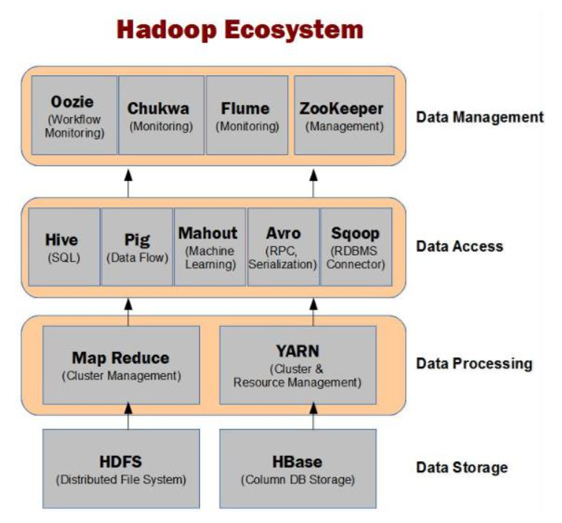
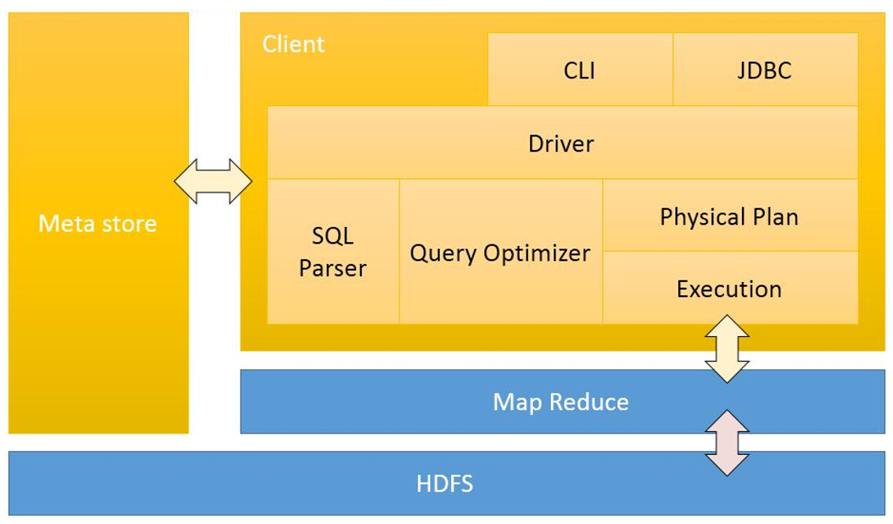
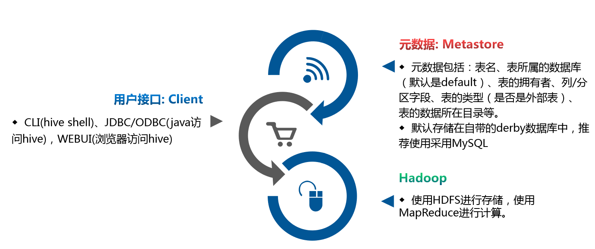
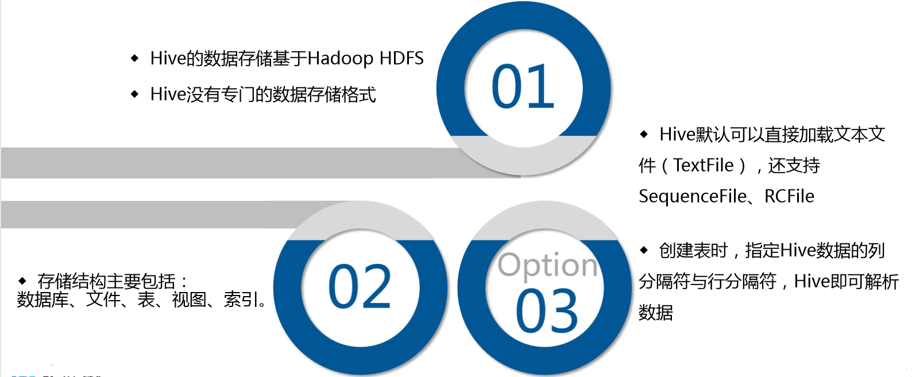
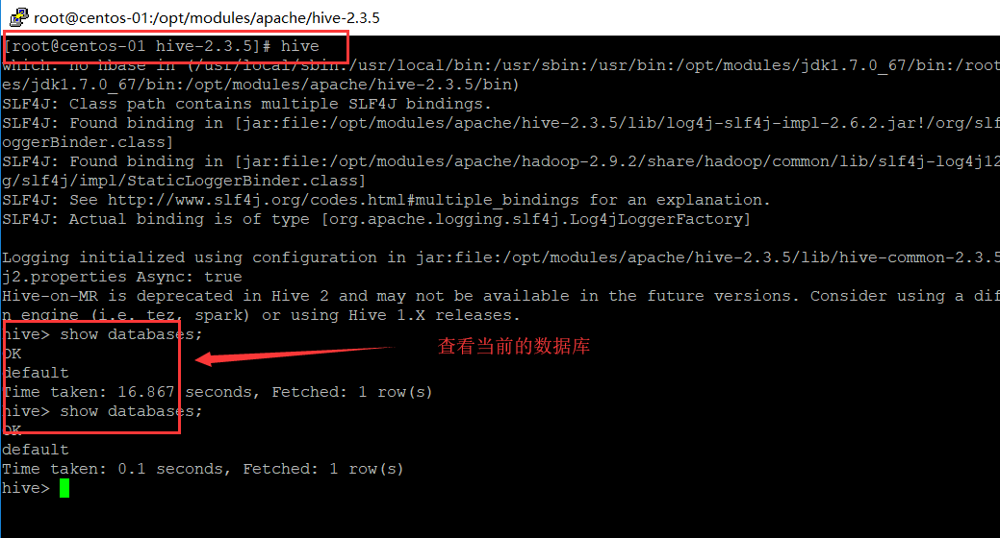

# Hive


## 一、ETL介绍

用来描述将数据从来源端经过萃取（extract）、转置（transform）、加载（load）至目的端的过程。**ETL**一词较常用在[数据仓库](https://baike.baidu.com/item/数据仓库)，但其对象并不限于[数据仓库](https://baike.baidu.com/item/数据仓库)。

### ELK介绍

代表了三个开源软件：Elasticsearch Logstash Kibana

现在又有**FileBeat** ，当您要面对成百上千、甚至成千上万的服务器、虚拟机和容器生成的日志时，请告别 SSH 吧。Filebeat 将为您提供一种轻量型方法，用于转发和汇总日志与文件，让简单的事情不再繁杂。输送至 Elasticsearch 或 Logstash。在 Kibana 中实现可视化。

ElasticSearch 是一个分布式、高扩展、高实时的搜索与[数据分析](https://baike.baidu.com/item/数据分析/6577123)引擎。

Elasticsearch是与名为Logstash的数据收集和日志解析引擎以及名为Kibana的分析和可视化平台一起开发的。这三个产品被设计成一个集成解决方案，称为“**Elastic Stack**”（以前称为“ELK stack”）。

 

Filebeat隶属于Beats，目前包含四种工具：

* Packetbeat：搜索网络数据流

* Topbeat:搜索cup 内存 等日志

* Filebeat:搜索文件系统

* Winlogbeat:搜索windows的日志


### 大数据平台架构


> 接入层

* canal(用的不是太多)
  * canal可以用来监控数据库数据的变化，从而获得新增数据，或者修改的数据
  * 使用canal同步mysql变更到elasticsearch
  * canal是阿里巴巴开发的
* sqoop
  * Sqoop(发音：skup)是一款开源的工具，主要用于在Hadoop(Hive)与传统的数据库(mysql、postgresql...)间进行数据的传递，可以将一个关系型数据库（例如 ： MySQL ,Oracle ,Postgres等）中的数据导进到Hadoop的HDFS中，也可以将HDFS的数据导进到关系型数据库中。
  * Sqoop是Apache开发的
* flume
  * Flume是Cloudera提供的一个高可用的，高可靠的，分布式的海量日志采集、聚合和传输的系统，Flume支持在日志系统中定制各类数据发送方，用于收集数据；

> 计算层

* Hive

  * hive是基于Hadoop的一个[数据仓库](https://baike.baidu.com/item/数据仓库/381916)工具，可以将结构化的数据文件映射为一张数据库表，并提供简单的sql查询功能，可以将sql语句转换为MapReduce任务进行运行。 其优点是学习成本低，可以通过类SQL语句快速实现简单的MapReduce统计，不必开发专门的MapReduce应用，十分适合[数据仓库](https://baike.baidu.com/item/数据仓库/381916)的统计分析。

* Storm

  * Apache Storm是一个分布式实时大数据处理系统

* Spark

  * Apache Spark 是专为大规模数据处理而设计的快速通用的计算引擎。

* Kylin

  * Apache Kylin™是一个开源的分布式分析引擎，提供Hadoop/Spark之上的SQL查询接口及多维分析（OLAP）能力以支持超大规模数据，最初由eBay Inc. 开发并贡献至开源社区。它能在亚秒内查询巨大的Hive表。

* Caffe

  * Caffe是一个[深度学习框架](https://baike.baidu.com/item/深度学习框架/22718084)

* Tensorflow

  * *TensorFlow*™ 是一个采用数据流图(data flow graphs),用于数值计算的开源软件库。

  

> 数据展示工具

* DataV
  * 阿里的工具，收费的
* ECharts
  * 百度，免费的


### 系统数据流动图


### DS-DW-DM-DA




 


## 二、Hive介绍

hive是基于Hadoop的一个[数据仓库](https://baike.baidu.com/item/数据仓库/381916)工具，可以将**结构化的数据文件**映射为**一张数据库表**，并提供简单的sql查询功能，可以将sql语句转换为MapReduce任务进行运行。 其优点是学习成本低，可以通过类SQL语句快速实现简单的MapReduce统计，不必开发专门的MapReduce应用，十分适合[数据仓库](https://baike.baidu.com/item/数据仓库/381916)的统计分析。


### Hive体系结构










### 下载Hive 

下载地址：https://hive.apache.org/downloads.html

看到可以下载的版本


### 安装Hive


> 配置

```shell
# 解压到/opt/modules/apache/hive-2.3.5


# 配置环境变量 在文件尾部输入
$ vi /etc/profile
#export HIVE_HOME=/opt/modules/apache/hive-2.3.5
#export PATH=$PATH:$HIVE_HOME/bin
$ source /etc/profile

$ cd /opt/modules/apache/hive-2.3.5
$ cd conf
$ cp hive-env.sh.template hive-env.sh
$ vi hive-env.sh
#将  HADOOP-HOME=/opt/modules/apache/hadoop-2.9.2
#    export HIVE_CONF_DIR=/opt/modules/apache/hive-2.3.5/conf
$ hive --version
```


> 启动hadoop

运行hive之前一定要启动hadoop(hdfs与yar)

```shell
$ cd /opt/modules/apache/hadoop-2.9.2
$ sbin/start-dfs.sh
# 查看hdfs的网址  http://192.168.56.102:50070/
$ sbin/start-yarn.sh
# 查看yarn的网址 http://192.168.56.102:8088/
```


如果是hive第一次运行，需要为hive建立路径(有可能/tmp已经建立了)

```shell
$ bin/hdfs dfs -mkdir       /tmp
$ bin/hdfs dfs -mkdir -p    /user/hive/warehouse
$ bin/hdfs dfs -chmod g+w   /tmp
$ bin/hdfs dfs -chmod g+w   /user/hive/warehouse
```


如果是hive2第一次运行(一定不能先执行hive命令，不然下面的命令不能使用)

```shell
$ bin/schematool -dbType derby -initSchema
```


> 运行Hive

```shell
$ hive
$hive> show databases;

```




### 运行Hive

运行hive之前一定要启动hadoop(hdfs与yar)

```shell
$ hive
$hive> create database wukong;
$hive> use wukong;
$hive> use wukong;
```


> 参考文档

* [Hive安装与配置详解](https://www.cnblogs.com/dxxblog/p/8193967.html)
* [官方的配置说明](https://cwiki.apache.org/confluence/display/Hive/GettingStarted#GettingStarted-InstallationandConfiguration)


