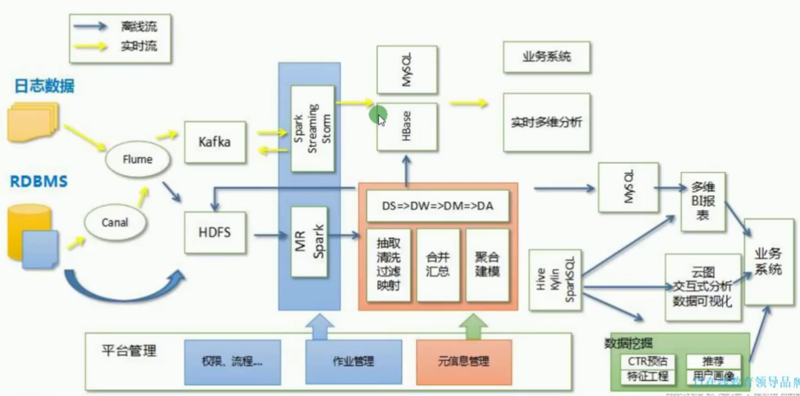

# Hive基础知识

> 目录


## 一、ETL介绍

用来描述将数据从来源端经过萃取（extract）、转置（transform）、加载（load）至目的端的过程。**ETL**一词较常用在[数据仓库](https://baike.baidu.com/item/数据仓库)，但其对象并不限于[数据仓库](https://baike.baidu.com/item/数据仓库)。

### ELK介绍

代表了三个开源软件：Elasticsearch Logstash Kibana

现在又有**FileBeat** ，当您要面对成百上千、甚至成千上万的服务器、虚拟机和容器生成的日志时，请告别 SSH 吧。Filebeat 将为您提供一种轻量型方法，用于转发和汇总日志与文件，让简单的事情不再繁杂。输送至 Elasticsearch 或 Logstash。在 Kibana 中实现可视化。

ElasticSearch 是一个分布式、高扩展、高实时的搜索与[数据分析](https://baike.baidu.com/item/数据分析/6577123)引擎。

Elasticsearch是与名为Logstash的数据收集和日志解析引擎以及名为Kibana的分析和可视化平台一起开发的。这三个产品被设计成一个集成解决方案，称为“**Elastic Stack**”（以前称为“ELK stack”）。

 

Filebeat隶属于Beats，目前包含四种工具：

* Packetbeat：搜索网络数据流

* Topbeat:搜索cup 内存 等日志

* Filebeat:搜索文件系统

* Winlogbeat:搜索windows的日志


### 大数据平台架构


> 接入层

* canal(用的不是太多)
  * canal可以用来监控数据库数据的变化，从而获得新增数据，或者修改的数据
  * 使用canal同步mysql变更到elasticsearch
  * canal是阿里巴巴开发的
* sqoop
  * Sqoop(发音：skup)是一款开源的工具，主要用于在Hadoop(Hive)与传统的数据库(mysql、postgresql...)间进行数据的传递，可以将一个关系型数据库（例如 ： MySQL ,Oracle ,Postgres等）中的数据导进到Hadoop的HDFS中，也可以将HDFS的数据导进到关系型数据库中。
  * Sqoop是Apache开发的
* flume
  * Flume是Cloudera提供的一个高可用的，高可靠的，分布式的海量日志采集、聚合和传输的系统，Flume支持在日志系统中定制各类数据发送方，用于收集数据；

> 计算层

* Hive

  * hive是基于Hadoop的一个[数据仓库](https://baike.baidu.com/item/数据仓库/381916)工具，可以将结构化的数据文件映射为一张数据库表，并提供简单的sql查询功能，可以将sql语句转换为MapReduce任务进行运行。 其优点是学习成本低，可以通过类SQL语句快速实现简单的MapReduce统计，不必开发专门的MapReduce应用，十分适合[数据仓库](https://baike.baidu.com/item/数据仓库/381916)的统计分析。

* Storm

  * Apache Storm是一个分布式实时大数据处理系统

* Spark

  * Apache Spark 是专为大规模数据处理而设计的快速通用的计算引擎。

* Kylin

  * Apache Kylin™是一个开源的分布式分析引擎，提供Hadoop/Spark之上的SQL查询接口及多维分析（OLAP）能力以支持超大规模数据，最初由eBay Inc. 开发并贡献至开源社区。它能在亚秒内查询巨大的Hive表。

* Caffe

  * Caffe是一个[深度学习框架](https://baike.baidu.com/item/深度学习框架/22718084)

* Tensorflow

  * *TensorFlow*™ 是一个采用数据流图(data flow graphs),用于数值计算的开源软件库。

  

> 数据展示工具

* DataV
  * 阿里的工具，收费的
* ECharts
  * 百度，免费的


### 系统数据流动图




### DS-DW-DM-DA


 


## 二、Hive介绍

hive是基于Hadoop的一个[数据仓库](https://baike.baidu.com/item/数据仓库/381916)工具，可以将**结构化的数据文件**映射为**一张数据库表**，并提供简单的sql查询功能，可以将sql语句转换为MapReduce任务进行运行。 其优点是学习成本低，可以通过类SQL语句快速实现简单的MapReduce统计，不必开发专门的MapReduce应用，十分适合[数据仓库](https://baike.baidu.com/item/数据仓库/381916)的统计分析。


### Hive体系结构


## 三、Hive的安装和基本使用


### 下载Hive 

下载地址：https://hive.apache.org/downloads.html

看到可以下载的版本


### 安装Hive


> 配置

```shell
# 解压到/opt/modules/apache/hive-2.3.5


# 配置环境变量 在文件尾部输入
$ vi /etc/profile
#export HIVE_HOME=/opt/modules/apache/hive-2.3.5
#export PATH=$PATH:$HIVE_HOME/bin
$ source /etc/profile

$ cd /opt/modules/apache/hive-2.3.5
$ cd conf
$ cp hive-env.sh.template hive-env.sh
$ vi hive-env.sh
#将  HADOOP-HOME=/opt/modules/apache/hadoop-2.9.2
#    export HIVE_CONF_DIR=/opt/modules/apache/hive-2.3.5/conf
$ hive --version
```


> 启动hadoop

运行hive之前一定要启动hadoop(hdfs与yar)

```shell
$ cd /opt/modules/apache/hadoop-2.9.2
$ sbin/start-dfs.sh
# 查看hdfs的网址  http://192.168.56.102:50070/
$ sbin/start-yarn.sh
# 查看yarn的网址 http://192.168.56.102:8088/
```


如果是hive第一次运行，需要为hive建立路径(有可能/tmp已经建立了)

```shell
$ bin/hdfs dfs -mkdir       /tmp
$ bin/hdfs dfs -mkdir -p    /user/hive/warehouse
$ bin/hdfs dfs -chmod g+w   /tmp
$ bin/hdfs dfs -chmod g+w   /user/hive/warehouse
```


如果是hive2第一次运行(一定不能先执行hive命令，不然下面的命令不能使用)

```shell
$ bin/schematool -dbType derby -initSchema
```


> 运行Hive

```shell
$ hive
$hive> show databases;

```


### 改变Hive默认的数据库

为什么要改变成mysql呢？ 因为默认的数据库不能多个client访问，否则会报错误。

如果你嫌麻烦，不改变mysql也可以。

#### 安装MySql

在CentOS7中默认安装有MariaDB，这个是MySQL的分支，尽量安装官方的mysql

> 安装

```shell
# 查看是否有msql 如果有就删除
$ rpm -qa | grep mysql
$ wget https://dev.mysql.com/get/mysql80-community-release-el7-3.noarch.rpm
$ yum install mysql80-community-release-el7-3.noarch.rpm
$ yum -y install mysql-community-server
```

> 启动

```shell
$ service mysqld status
$ service mysqld start
$ service mysqld stop

# 得到默认的密码 qg0hBFwD56-v
$ grep 'temporary password' /var/log/mysqld.log

# 一定要立即修改密码
$ mysql -uroot -p

# 设置新密码
$mysql> ALTER USER 'root'@'localhost' IDENTIFIED BY 'Root@mysql-1';

# 重新登录
$ mysql -uroot -pRoot@mysql-1

$mysql>set global validate_password.policy=0;
$mysql>set global validate_password.length=3;
$mysql>show global variables like '%validate_password%';
# 退出mysql后

# 设置mysql 启动后自动启动
$ systemctl enable mysql
```

* [CentOS7安装MySQL](https://www.cnblogs.com/nicknailo/articles/8563737.html)


> mysql安装的位置

```shell

# 执行命令的路径
 /usr/sbin/mysqld
 
# 文件存储路径 
  /var/lib/mysql
  
# 配置文件
 /etc/my.cnf
```


#### 改变Hive的配置

> 下载jdbc

由于hadoop使用的是1.7的jdk，所以需要查看那个jdbc适用这个版本。[具体参考官网](https://dev.mysql.com/doc/connector-j/5.1/en/connector-j-versions.html).

去mysql的官网下载，例如`5.1版本`,然后解压的到`mysql-connector-java-5.1.48.jar`文件。

将这个Jar文件，复制到hive/lib下


> 配置：进入hive的conf目录

```shell
 $ cp hive-default.xml.template hive-site.xml
 
```

然后配置这个hive-site.xml文件

这个版本的`useSSL=false`不好用，建议先忍着提示没有使用ssl吧。

```xml-dtd
<configuration>

<property>
<name>javax.jdo.option.ConnectionURL</name>
<value>jdbc:mysql://127.0.0.1:3306/hive?createDatabaseIfNotExist=true</value>
</property>

<property>
<name>javax.jdo.option.ConnectionDriverName</name>
<value>com.mysql.jdbc.Driver</value>
</property>

<property>
<name>javax.jdo.option.ConnectionUserName</name>
<value>root</value>
</property>

<property>
<name>javax.jdo.option.ConnectionPassword</name>
<value>root@mysql</value>
</property>
</configuration>

```


> 初始化mysql数据库

```shell
 $ bin/schematool -dbType mysql -initSchema
```

[官方文档](https://cwiki.apache.org/confluence/display/Hive/AdminManual+Metastore+Administration)


#### 优化Hive

> 内存溢出

If use JDK7, append following in conf/hive-env.sh:

```
export HADOOP_OPTS="$HADOOP_OPTS -XX:MaxPermSize=128m"
```

If use JDK8, append following in Conf/hive-env.sh:

```
export HADOOP_OPTS="$HADOOP_OPTS -XX:MaxMetaspaceSize=512m"
```


### 运行Hive

运行hive之前一定要启动hadoop(hdfs与yar)

```shell
$ hive
$hive> create database wukong;
$hive> use wukong;

```


### 通过Hive操纵数据

#### 创建表追加数据

```shell
$ hive
$hive> show databases;
$hive> use wukong;

# 创建表并指定分隔符
$hive> create table test(id int,name varchar(20)) ROW FORMAT DELIMITED FIELDS TERMINATED BY "\t";
$hive> show tables;

# 加载数据
$hive> load data local inpath '/opt/datas/test' into table test;

# 显示表中的内容
$hive> select * from test;

```


> test 数据文件，默认分隔符是ctrl+V  ctrl+A

```
1	aaa
2	bbb
```


#### 查看表的信息

```shell
# 显示表中的内容
$hive> desc test;

$hive> desc extended test;

# 下面这个命令显示的最全
$hive> desc formatted test;
```


#### 修改表

中文注释无法显示

```shell
# 改变表名字
$hive> alter table test rename to newtest;

# 添加字段与注释
$hive> alter table newtest add columns(age int comment 'this is age 年龄');

# 修改列名称与类型
$hive> alter table newtest change age newage string;

# 调整列的位置 这个语句在某些版本下无法执行，请删除after name
$hive> alter table newtest change  newage age string after name;
```


#### 清空表数据

```shell
$hive> truncate table newtest;

# 加上 cascade 可以请制将有数据的表给删除了
$hive> drop table newtest;
```


#### 查看hive自带函数

```shell
$hive> show functions;

$hive> desc function extended  year;
```


### Hive 常用操作


#### 日志处理

* 将conf/目录下的 hive-log4j2.properties.template 复制成hive-log4j2.properties，然后修改到

```text
# property.hive.log.dir = ${sys:java.io.tmpdir}/${sys:user.name}
property.hive.log.dir = /opt/modules/apache/hive-2.3.5/logs

```


#### 显示当前数据信息

当使用use wukong时，可以在命令符前显示当前数据库名称

* hive-site.xml

```xml
  <property>
    <name>hive.cli.print.current.db</name>
    <value>true</value>
    <description>Whether to include the current database in the Hive prompt.</description>
  </property>

```


#### 显示当前列名

```xml
  <property>
    <name>hive.cli.print.header</name>
    <value>true</value>
    <description>Whether to print the names of the columns in query output.</description>
  </property>

```


#### hive命令

```shell
$ bin/hive -help

# 默认登录到那个数据
$ bin/hive -database databesName

# 执行某个sql
$ bin/hive -e 'select * from wukong.test'

# 执行某个sql语句
$ bin/hive -f /opt/datas/test.sql

# 将一个查询的结果重定向到本地的文件,这时候导出的是带表头的，如果要关闭表头，见上一章节。
$ bin/hive -f /opt/datas/test.sql >> /opt/datas/hive.txt

```

> test.sql

```sql
select * from wukong.test
```


#### 定义Database的存储位置

不想使用默认的hdfs路径了，可以自定义. location后面跟的是路径

`create database dbname location "/hive_test" `


#### 常用shell命令

* ！
  * 表示可以访问Linux文件系统
  * ! ls /opt/datas;
* dfs
  * 表示可以访问分布式系统
  * dfs -ls /;


> 参考文档

* [Hive安装与配置详解](https://www.cnblogs.com/dxxblog/p/8193967.html)
* [官方的配置说明](https://cwiki.apache.org/confluence/display/Hive/GettingStarted#GettingStarted-InstallationandConfiguration)


