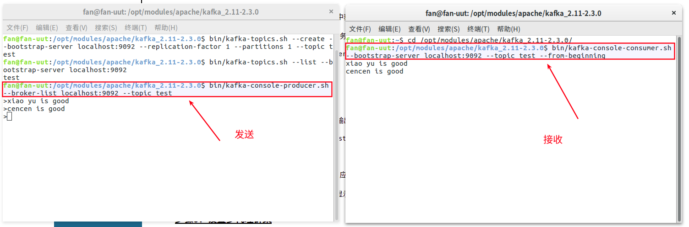

# kafka


## 1. 快速入门


### 1.1. 下载

http://kafka.apache.org/downloads

根据自己机器上安装的scala版本，下载相应的版本．例如：`kafka/2.3.0/kafka_2.11-2.3.0.tgz`


### 1.2. 安装

```shell
tar -zxvf kafka_2.11-2.3.0.tgz
```

修改必要配置`server.properties`

修改日志的目录

```
log.dirs=/opt/modules/apache/kafka_2.11-2.3.0/kafka-logs
```


### 1.3. 启动服务

Kafka使用[ZooKeeper，](https://zookeeper.apache.org/)因此如果您还没有ZooKeeper服务器，则需要先启动它。

ZooKeeper可以启动自己的服务器，也可以通过Kafka自带的ZooKeeper来启动.

这里我启动了我机器上自带的ZooKeeper服务器：

```shell
cd /opt/modules/apache/zookeeper-3.5.5/
bin/zkServer.sh start
```


现在启动Kafka服务器：

```shell
bin/kafka-server-start.sh config/server.properties
```


当然也可以使用下面的名利启动kafka，这样日志会输出到一个文件

```shell
bin/kafka-server-start.sh config/server.properties > logs/server-start.log 2>&1 &
```


### 1.4. 创建主题

让我们创建一个名为“test”的主题，它只包含一个分区，只有一个副本：

```shell
bin/kafka-topics.sh --create --bootstrap-server localhost:9092 --replication-factor 1 --partitions 1 --topic test
```

如果我们运行list topic命令，我们现在可以看到该主题：

```shell
bin/kafka-topics.sh --list --bootstrap-server localhost:9092
```


### 1.5. 发送消息

Kafka附带一个命令行客户端，它将从文件或标准输入中获取输入，并将其作为消息发送到Kafka集群。默认情况下，每行将作为单独的消息发送。

运行生产者，然后在控制台中键入一些消息以发送到服务器。

```shell
bin/kafka-console-producer.sh --broker-list localhost:9092 --topic test
```


### 1.6. 启动消费者

Kafka还有一个命令行使用者，它会将消息转储到标准输出。

```
bin/kafka-console-consumer.sh --bootstrap-server localhost:9092 --topic test --from-beginning
```

如果您在不同的终端中运行上述每个命令，那么您现在应该能够在生产者终端中键入消息并看到它们出现在消费者终端中。

所有命令行工具都有其他选项; 运行不带参数的命令将显示更详细地记录它们的使用信息。





### 1.7. 模拟多代理集群

到目前为止，我们一直在与一个经纪人竞争，但这并不好玩。对于Kafka来说，单个代理只是一个大小为1的集群，因此除了启动一些代理实例之外没有太多变化。但是为了感受它，让我们将我们的集群扩展到三个节点（仍然在我们的本地机器上）。

首先，我们为每个代理创建一个配置文件（在Windows上使用`copy`命令代替）：

```shell
cp config/server.properties config/server-1.properties
cp config/server.properties config/server-2.properties
```

现在编辑这些新文件并设置以下属性：

```
config/server-1.properties:
    broker.id=1
    listeners=PLAINTEXT://:9093
    log.dirs=/tmp/kafka-logs-1
 
config/server-2.properties:
    broker.id=2
    listeners=PLAINTEXT://:9094
    log.dirs=/tmp/kafka-logs-2
```

该`broker.id`属性是群集中每个节点的唯一且永久的名称。我们必须覆盖端口和日志目录，因为我们在同一台机器上运行这些，并且我们希望让所有代理尝试在同一端口上注册或覆盖彼此的数据。

我们已经启动了Zookeeper并启动了我们的单个节点，因此我们只需要启动两个新节点：

```shell
bin/kafka-server-start.sh config/server-1.properties &
bin/kafka-server-start.sh config/server-2.properties &
```

现在创建一个复制因子为3的新主题：

```shell
bin/kafka-topics.sh --create --bootstrap-server localhost:9092 --replication-factor 3 --partitions 1 --topic my-replicated-topic
```

好的，但现在我们有一个集群，我们怎么知道哪个经纪人正在做什么？要查看运行“describe topics”命令：

```shell
bin/kafka-topics.sh --describe --bootstrap-server localhost:9092 --topic my-replicated-topic
```

`Topic:my-replicated-topic   PartitionCount:1    ReplicationFactor:3 Configs:
    Topic: my-replicated-topic  Partition: 0    Leader: 1   Replicas: 1,2,0 Isr: 1,2,0`

这是输出的解释。第一行给出了所有分区的摘要，每个附加行提供有关一个分区的信息。由于此主题只有一个分区，因此只有一行。

- “leader”是负责给定分区的所有读写的节点。每个节点将成为随机选择的分区部分的领导者。
- “replicas”是复制此分区日志的节点列表，无论它们是否为领导者，或者即使它们当前处于活动状态。
- “isr”是“同步”复制品的集合。这是副本列表的子集，该列表当前处于活跃状态并且已经被领导者捕获。

请注意，在我的示例中，节点1是主题的唯一分区的领导者。

我们可以在我们创建的原始主题上运行相同的命令，以查看它的位置：


让我们向我们的新主题发布一些消息：

```shell
bin/kafka-console-producer.sh --broker-list localhost:9092 --topic my-replicated-topic
```

现在让我们使用这些消息：

```shell
bin/kafka-console-consumer.sh --bootstrap-server localhost:9092 --from-beginning --topic my-replicated-topic
```

现在让我们测试一下容错性。经纪人1充当领导者所以让我们杀了它：

```shell
ps aux | grep server-1.properties
kill -9 7564
```

领导已切换到其中一个关注者，节点1不再处于同步副本集中：

```shell
bin/kafka-topics.sh --describe --bootstrap-server localhost:9092 --topic my-replicated-topic
```


### 1.8. 使用Kafka Connect导入/导出数据

从控制台写入数据并将其写回控制台是一个方便的起点，但您可能希望使用其他来源的数据或将数据从Kafka导出到其他系统。对于许多系统，您可以使用Kafka Connect导入或导出数据，而不是编写自定义集成代码。

Kafka Connect是Kafka附带的工具，可以向Kafka导入和导出数据。它是一个可扩展的工具，可以运行 *连接器*，实现与外部系统交互的自定义逻辑。在本快速入门中，我们将了解如何使用简单的连接器运行Kafka Connect，这些连接器将数据从文件导入Kafka主题并将数据从Kafka主题导出到文件。

首先，我们将首先创建一些种子数据进行测试：

```shell
echo -e "foo\nbar" > test.txt
```

未完，待续


### 1.9. 使用Kafka Streams处理数据

Kafka Streams是一个客户端库，用于构建任务关键型实时应用程序和微服务，其中输入和/或输出数据存储在Kafka集群中。Kafka Streams结合了在客户端编写和部署标准Java和Scala应用程序的简单性以及Kafka服务器端集群技术的优势，使这些应用程序具有高度可扩展性，弹性，容错性，分布式等等。本[快速入门示例](http://kafka.apache.org/23/documentation/streams/quickstart)将演示如何运行在此库中编码的流应用程序。


> 参考资料

* [ddkafka安装和启动](https://www.orchome.com/6)

