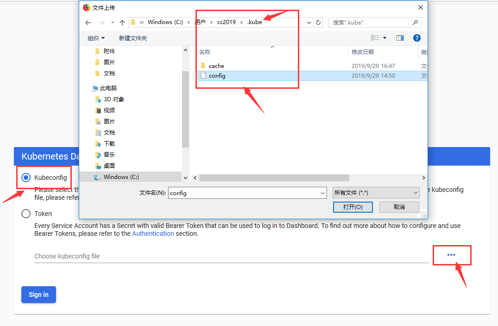

# 系统管理-证书形式（不建议使用这种方式）

本文章模拟如何给其他人分配k8s的权限。

假设有两个用户，一个是k8s管理员，一个或多个待分配的人员。

**不建议使用的原因：**

- 首先要创建证书，比较麻烦。
- 其次这种用户不能使用dashboard，只能用kubectrl来登录。


# 1. k8s管理员分配权限

假设在服务器上

```shell
mkdir ~/admin-user ; cd ~/admin-user
```


## 1.1 创建命名空间

模拟一个要分配的命名空间`testing`。这多创建了一个pod，用来测试。

```yaml
#预防已经建立过了
rm -f test.yaml;

#建立一个文件
cat>test.yaml<<EOF
apiVersion: v1
kind: Namespace
metadata:
  name: testing
  labels:
    env: testing
---
apiVersion: v1
kind: Pod
metadata:
  name: test-pd
  namespace: testing
spec:
  containers:
  - name: myapp
    image: alpine
    command: ["/bin/sh"]
    args: ["-c","while true; do sleep 3; done"]
    
EOF

#生效
kubectl apply -f test.yaml

#查看是否有这个pod
kubectl get pods -n testing
```


## 1.2 添加用户授权

在大部分场景下，引用内建`ClusterRole的admin/view/edit` 这几个Role就行


拟添加的用户

| 用户名        | 权限说明                |
| ------------- | ----------------------- |
| testing-admin | testing命名空间管理员   |
| testing-edit  | testing命名空间编辑人员 |
| testing-view  | testing命名空间浏览人员 |

> 进行配置

建立`rbd-admin.yaml`文件

```yaml
apiVersion: rbac.authorization.k8s.io/v1
kind: RoleBinding
metadata:
  creationTimestamp: null
  name: rbd-admin
  namespace: testing
roleRef:
  apiGroup: rbac.authorization.k8s.io
  kind: ClusterRole
  name: admin
subjects:
- apiGroup: rbac.authorization.k8s.io
  kind: User
  name: testing-admin
```

执行，并查看结果

```shell
# 进行绑定
kubectl apply -f rbd-admin.yaml

# 查看是否绑定成功的两种方式
kubectl get -f rbd-admin.yaml -o wide

kubectl get rolebinding -n testing -o wide
```


> 小技巧

*可以通过命令授权-得到要建立的文件：*

```shell
kubectl create rolebinding rbd-admin --clusterrole=admin --user=testing-admin -n testing -o yaml  --dry-run > rbd-admin.yaml
```


## 1.3 为该用户生成证书

```shell
# 证书存放位置
cd /etc/kubernetes/pki/

# 做一个私钥
(umask 077; openssl genrsa -out testing-admin.key 2048)

# 基于私钥生成一个证书证书请求，/CN=kube-user1/O=kubeusers  其中 CN是用户名，O是用户组 
openssl req -new -key testing-admin.key -out testing-admin.csr -subj "/CN=testing-admin"

# 签发证书,-days:表示证书的过期时间,x509:生成x509格式证书，第二天看看证书过期时间
openssl  x509 -req -in testing-admin.csr -CA ca.crt -CAkey ca.key  -CAcreateserial -out testing-admin.crt -days 2

# 查看证书内容
openssl x509 -in testing-admin.crt -text -noout

#下面的命令可以清空这些数据
rm testing-admin.key  testing-admin.crt  testing-admin.csr
```


## 1.4 将证书发送给用户

发送的文件有：

| 文件名            | 作用                    |
| ----------------- | ----------------------- |
| ca.crt            | 用来登录api的公用CA证书 |
| testing-admin.key | 用户的密钥              |
| testing-admin.crt | 用户的证书              |


# 2. 命名空间管理员登录

下面模拟命名空间管理员登录到k8s的过程。


## 2.1 安装kubectl

Ns管理员，需要在自己机器上安装`kubectl`，假设当前使用的是`win10`操作系统。

参考文档：[安装和设置kubectl](https://www.kubernetes.org.cn/installkubectl)

具体如下：


### ① 下载

在浏览器中下载`kubectl.exe`，可以跟服务器的一样。

```
https://storage.googleapis.com/kubernetes-release/release/v1.5.3/bin/windows/amd64/kubectl.exe
```

稳定版本：`https://storage.googleapis.com/kubernetes-release/release/stable.txt`


### ② 建立工作目录

```shell
# 在D盘，右键打开powerShell

mkdir d:\kubectl
cd d:\kubectl

# 将下载的内容移动到D盘
mv C:\Users\cc2019\Downloads\kubectl.exe .\
.\kubectl.exe set   --help

# 清空已经有的配置，这里是做测试，在正式环境中不要清空
rm -r ~\.kube
```


### ③ 配置conf

将管理员给的3个文件复制到当前目录

```shell
# 1.配置集群信息，存在可省略此步骤
.\kubectl.exe config set-cluster kubernetes-new --embed-certs=true --certificate-authority=.\ca.crt --server="https://192.168.1.185:6443"

# 2.配置客户端证书及密钥，用户名组名会自动提取
.\kubectl.exe config set-credentials testing-admin --embed-certs=true --client-certificate=.\testing-admin.crt --client-key=.\testing-admin.key

# 3.配置context，组合cluster和credentials
.\kubectl.exe config set-context testing-admin@kubernetes-new --cluster=kubernetes-new --user=testing-admin

# 4.指定当前上下文，这时候会在~目录下建立一个.kube 目录和conf文件
.\kubectl.exe config use-context testing-admin@kubernetes-new


```


### ④ 连接服务器


```shell
# 测试 肯看是否能得到那个pod
.\kubectl.exe  get pods
#提示下面错误 
#Error from server (Forbidden): pods is forbidden: User "testing-admin" cannot list resource "pods" in API group "" in the namespace "default"


# 下面例子是对的
.\kubectl.exe  get pods -n testing

# 登录进去 提示无法登录进去
.\kubectl exec -it   test-pd /bin/sh   -n testing
```


删除服务器的`testing-admin.key`看是否可以访问


### ⑤ 登录Dashboard

拿证书的conf，是不能给用户配置Dashboard登录权限的。





## 2.2 给组内用户分配权限


# 参考文档

* 做的比较简单的
  * [k8s认证及serviceAccount、userAccount](https://www.cnblogs.com/fawaikuangtu123/p/11295376.html)
  * [k8s之RBAC-基于角色的访问控制](https://www.cnblogs.com/fawaikuangtu123/p/11295430.html)
  * [k8s之dashboard认证、资源需求、资源限制及HeapSter](https://www.cnblogs.com/fawaikuangtu123/p/11296191.html)


