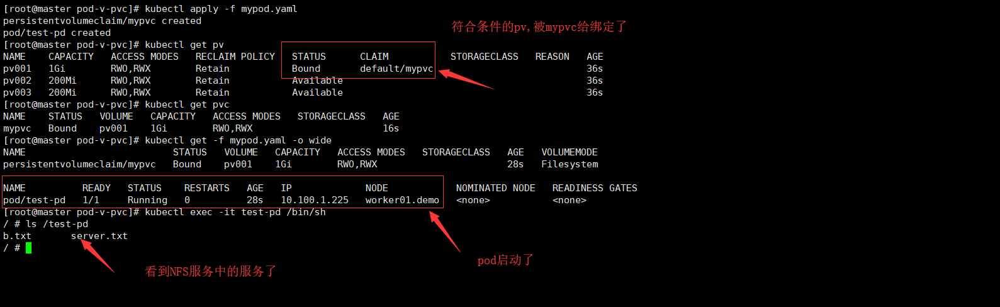

# kubernetes 代码示例

确保每个例子的代码都可以运行。


[TOC]


* github上有官方给的例子
  * https://github.com/kubernetes/examples


# 1. Pod


# 2. Service


# 3. Volume


## 3.1 局部存储


### 3.1.1 emptyDir

同一容器组中的不同容器都可以对该目录执行读写操作，并且共享其中的数据。

[更多内容，请参考](kubernetes-detail-volume.md/#1.2.1 emptyDir )

> 建立一个目录

```shell
mkdir pod-v-emptydir
cd pod-v-emptydir
vi mypod.yaml
```


> 定义一个文件: mypod.yaml

```yaml
apiVersion: v1 
kind: Pod
metadata:
  name: pod-emptydir
  namespace: default
  labels:
    app: myapp
    use: volumen-emptDir
spec:
  #定义一个http容器
  containers:
  - name: hpptd  
    image: nginx:alpine
    ports:
    - name: http
      containerPort: 80  
    volumeMounts:
    - name: html
      mountPath: /usr/share/nginx/html  #绑定到nginx
  #定义一个应用类
  - name: busybox
    image: busybox
    volumeMounts:
    - name: html
      mountPath: /data/  #绑定的目录可以不同名字
    command:
    - "/bin/sh"
    - "-c"
    - "while true; do echo $(date)>> /data/index.html; sleep 2; done"
  #定义一个存储卷    
  volumes:
  - name: html   #这个名字会被其他引用
    emptyDir: {}
```


> 进行测试

```shell
# 生成pod
kubectl apply -f mypod.yaml

# 看看启动了没有
kubectl get pods/pod-emptydir -o wide

# 查看内容
curl  10.100.1.231

# 删除
kubectl delete -f mypod.yaml
```


> 常用的调试脚本

```shell
# 查看帮助
kubectl explain pods.spec.volumes.emptydir
```


### 3.1.2 hostPath

将**所在节点**的文件系统上某一个文件或文件夹挂载进容器组（容器）。

绝大多数容器组并不需要使用 hostPath 数据卷，但是要监控宿主机的状态时，特别有用：

- 某容器需要访问 Docker，可使用 hostPath 挂载宿主节点的 /var/lib/docker
- 在容器中运行 cAdvisor，使用 hostPath 挂载宿主节点的 /sys

[更多内容，请参考](kubernetes-detail-volume.md/#1.2.2 hostPath)


cAdvisor在docker上的安装方法

```shell
sudo docker run \
  --volume=/:/rootfs:ro \
  --volume=/var/run:/var/run:ro \
  --volume=/sys:/sys:ro \
  --volume=/var/lib/docker/:/var/lib/docker:ro \
  --volume=/dev/disk/:/dev/disk:ro \
  --publish=8080:8080 \
  --detach=true \
  --name=cadvisor \
  google/cadvisor:latest
```


> 建立一个目录

```shell
mkdir pod-v-hostpath
cd pod-v-hostpath
vi mypod.yaml
```


> 定义一个文件: mypod.yaml

```yaml
apiVersion: v1
kind: Pod
metadata:
  name: test-pd
spec:
  containers:
  - image: nginx:alpine
    name: test-container
    volumeMounts:
    - mountPath: /test-pd
      name: test-volume
  volumes:
  - name: test-volume
    hostPath:
      # directory location on host
      path: /root
      # this field is optional
      type: Directory
```


> 进行测试

```shell
# 生成pod
kubectl apply -f mypod.yaml

# 看看启动了没有
kubectl get -f mypod.yaml -o wide

# 查看详细信息
kubectl describe -f mypod.yaml

# 查看生成的目录，有时候会很奇怪，跟本地的不一样，因为这个机器可能不是本地机器
kubectl exec -it test-pd /bin/sh
> ls /test-pd

# 删除
kubectl delete -f mypod.yaml
```


### 3.1.3 gitRepo


gitRepo卷类型已弃用。要为容器提供git存储库，[请将EmptyDir](https://kubernetes.io/docs/concepts/storage/volumes/#emptydir)安装到使用git克隆存储库的[InitContainer中](https://kubernetes.io/docs/concepts/storage/volumes/#emptydir)，然后将[EmptyDir](https://kubernetes.io/docs/concepts/storage/volumes/#emptydir)安装到Pod的容器中。


## 3.2 持久化存储


### 3.2.1 nfs 网络

- 可以在加载 NFS 数据卷前就在其中准备好数据；
- 可以在不同容器组之间共享数据；
- 可以被多个容器组加载并同时读写；
- 容器组被移除时，将仅仅 umount（卸载）NFS 数据卷，NFS 中的数据仍将被保留。


前提假设nfs网络已经安装，可以看一下[nfs网络安装](nfs.md)

假设已经安装完毕 	


> 建立一个目录

```shell
mkdir pod-v-nfs
cd pod-v-nfs
vi mypod.yaml
```


> 定义一个文件: mypod.yaml

```yaml
apiVersion: v1
kind: Pod
metadata:
  name: test-pd
spec:
  containers:
  - image: alpine
    name: test-container
    command:
    - "/bin/sh"
    - "-c"
    - "while true; do echo heloo world; sleep 3; done"
    
    volumeMounts:
    - mountPath: /test-pd
      name: nfs-storage
  volumes:
    - name: nfs-storage
      nfs:
        server: 192.168.1.185
        path: "/"   # 这个目录必须有，不然就建立不了容器
```


> 进行测试

```shell
# 生成pod
kubectl apply -f mypod.yaml

# 看看启动了没有
kubectl get -f mypod.yaml -o wide

# 查看详细信息
kubectl describe -f mypod.yaml

# 查看生成的目录，有时候会很奇怪，跟本地的不一样，因为这个机器可能不是本地机器
kubectl exec -it test-pd /bin/sh
> ls /test-pd

# 删除
kubectl delete -f mypod.yaml
```


## 3.3 配置型存储

### 3.3.1 secret

Kubemetes提供了Secret来处理敏感数据，比如密码、Token和密钥，相比于直接将敏感数据配置在Pod的定义或者镜像中，Secret提供了更加安全的机制（Base64加密），防止数据泄露。Secret的创建是独立于Pod的，以数据卷的形式挂载到Pod中，Secret的数据将以文件的形式保存，容器通过读取文件可以获取需要的数据。


> 建立一个目录

```shell
mkdir pod-v-secret
cd pod-v-secret
vi mypod.yaml
```


> 定义一个文件: mypod.yaml


参考文档[Kubernetes对象之Secret](https://www.jianshu.com/p/958f406ec071)

```shell
# 分别得到这两个数据
echo -n 'admin' | base64
# YWRtaW4=

echo -n '123456' | base64
# MTIzNDU2
```


```yaml
apiVersion: v1
kind: Secret
metadata:
  name: mysecret
type: Opaque
data:
  username: YWRtaW4=  #上面生成的base64
  password: MTIzNDU2 #上面生成的base64
---


apiVersion: v1
kind: Pod
metadata:
  name: test-pd
spec:
  containers:
  - image: alpine
    name: test-container
    command:
    - "/bin/sh"
    - "-c"
    - "while true; do echo heloo world; sleep 3; done"
    
    volumeMounts:
    - mountPath: /test-pd
      name: secret-storage
      readOnly: true
    - mountPath: /test-pd2
      name: secret-one-key
      readOnly: true      
  volumes:
    - name: secret-storage
      secret:
        secretName: mysecret
    - name: secret-one-key  # 也可以单独挂载一个
      secret:
        secretName: mysecret
        items:
        - key: username
          path: myusername/    #这个必须指定,可以写成与key一样的名称，这里为了做测试，写了不同的名字
```


> 进行测试

```shell
# 生成pod
kubectl apply -f mypod.yaml

# 看看启动了没有
kubectl get -f mypod.yaml -o wide

# 查看详细信息
kubectl describe -f mypod.yaml

# 查看生成的目录
kubectl exec -it test-pd /bin/sh
> ls /test-pd
> cat /test-pd/password
> cat /test-pd2/myusername    

# 删除
kubectl delete -f mypod.yaml
```


### 3.3.2 configMap

​	建立一个目录

```shell
cd ~ ; mkdir pod-v-config ; cd pod-v-config ; vi mypod.yaml

```


```yaml
apiVersion: v1
kind: ConfigMap
metadata:
  name: my-config
data:
  special.how: very
  special.type: charm123546/test/12234
  
---

apiVersion: v1
kind: Pod
metadata:
  name: test-pd
spec:
  containers:
  - image: alpine
    name: test-container
    command:
    - "/bin/sh"
    - "-c"
    - "while true; do echo heloo world; sleep 3; done"
    volumeMounts:
    - name: config-volume
      mountPath: /root/config  
  restartPolicy: Never  
  volumes:
    - name: config-volume
      configMap:
        name: my-config
      
   # 也可以单独提取一个key,具体看2.5 secret的例子，有类似的
   # 在一般情况下 configmap 挂载文件时，会先覆盖掉挂载目录
   # 如果想不对原来的文件夹下的文件造成覆盖，只是将 configmap 中的每个 key，按照文件的方式挂载到目录下，可以使用 subpath 参数。（但是这种情况不常用）
```


> 进行测试

```shell
# 生成pod
kubectl apply -f mypod.yaml

# 看看启动了没有
kubectl get -f mypod.yaml -o wide

# 查看详细信息
kubectl describe -f mypod.yaml

# 查看生成的目录
kubectl exec -it test-pd /bin/sh
> cd /root/config 
> cat special.how ; echo \n ; cat special.type ; echo \n
> exit

# 删除
kubectl delete -f mypod.yaml
```


# 4. PVC和PV

为什么又PV和PVC这个概念呢？ 上面学习中，可以看到用户要手工关联Volume，这样就强关联了。 实际上管理员可以定义一些不同大小或读取速度的空间，然后告诉程序员那些空间可以选择，这样程序员就不用知道这些空间到底背后实现的机制，这样就完全解耦合了。

* PersistentVolume缩写=PV

* PersistentVolumeClaim缩写=PVC


>操作步骤

* 存储管理员：创建了很多存储空间
* K8s管理员：创建PV与存储进行关联
* 程序员：创建PVC去申请PV，如果申请成功，那么PVC与PV绑定。


## 4.1 创建存储空间

> 创建目录

```shell
mkdir -p /home/data/v1
mkdir -p /home/data/v2
mkdir -p /home/data/v3
mkdir -p /home/data/v4
mkdir -p /home/data/v5
# 分配权限
chown nfsnobody.nfsnobody /home/data/v1
chown nfsnobody.nfsnobody /home/data/v2
chown nfsnobody.nfsnobody /home/data/v3
chown nfsnobody.nfsnobody /home/data/v4
chown nfsnobody.nfsnobody /home/data/v5
vi /etc/exports
```


> exports文件

```
/home/data/v1/ 192.168.1.0/24(rw,sync)
/home/data/v2/ 192.168.1.0/24(rw,sync)
/home/data/v3/ 192.168.1.0/24(rw,sync)
/home/data/v4/ 192.168.1.0/24(rw,sync)
/home/data/v5/ 192.168.1.0/24(rw,sync)
```


> 让共享目录生效

```shell
# 使定义生效
exportfs
# 查看生效结果
showmount -e
```


## 4.2 定义PV

k8s管理员来做这件事。`kubectl explain pv` 来查看帮助

关键顶一点：

* 访问模型
* 空间大小
* 回收机制
  * Retain 保留


下面定义一个nfs格式的pv:  `pv-demo.yaml`

```
cd ~ ; mkdir pod-v-pvc ;cd pod-v-pvc ; vi pv-demo.yaml
```


```yaml
# PV 不用名称空间，因为集群中通用
apiVersion: v1
kind: PersistentVolume
metadata: 
  name: pv001
  labels:
    name: pv001
    speed: fast

spec:
  #单路只读  单路读写ReadWriteOnce 多路读写ReadWriteMany   
  accessModes: ["ReadWriteMany","ReadWriteOnce"]   
  # 存储大小 Ei Pi Ti Gi Mi Ki 
  # 下面定vi义支持1G
  capacity:
    storage: 1Gi
  #当前支持的回收策略有：“Retain”（保留-默认）, “Recycle”（重复利用）, “Delete”（删除）. 
  #建议使用“Retain”（保留） 这样数据不会丢失，就是要重复使用这个，需要手工删除pv
  #“Recycle”（重复利用）：一旦删除pod ,那么数据会被清空
  #“Delete”（删除） pv状态设置成不可用，但是数据还被保留，用这个也相对安全，数据还是最重要的。
  #persistentVolumeReclaimPolicy: Recycle
  nfs:
    path: /home/data/v1/
    server: 192.168.1.185
    
---

apiVersion: v1
kind: PersistentVolume
metadata: 
  name: pv002
  labels:
    name: pv002
    speed: fast

spec:
  #单路只读  单路读写ReadWriteOnce 多路读写ReadWriteMany   
  accessModes: ["ReadWriteMany","ReadWriteOnce"]   
  # 存储大小 Ei Pi Ti Gi Mi Ki 
  # 下面定vi义支持1G
  capacity:
    storage: 200Mi
  nfs:
    path: /home/data/v2/
    server: 192.168.1.185
    
    
---

apiVersion: v1
kind: PersistentVolume
metadata: 
  name: pv003
  labels:
    name: pv003
    speed: fast

spec:
  #单路只读  单路读写ReadWriteOnce 多路读写ReadWriteMany   
  accessModes: ["ReadWriteMany","ReadWriteOnce"]   
  # 存储大小 Ei Pi Ti Gi Mi Ki 
  # 下面定vi义支持1G
  capacity:
    storage: 200Mi
  nfs:
    path: /home/data/v3/
    server: 192.168.1.185 
```


```shell
kubectl apply -f pv-demo.yaml

# 查看得到pv
kubectl get pv
```


## 4.3 定义PVC与Pod


> 建立yaml文件

```shell
vi mypod.yaml
```


> 定义一个文件: mypod.yaml

```yaml
apiVersion: v1
kind: PersistentVolumeClaim
metadata:
  name: mypvc
spec:
  accessModes: ["ReadWriteMany"] # 必须使PV要求的子集
  resources:          #资源要求
    requests:
      storage: 800Mi
---


apiVersion: v1
kind: Pod
metadata:
  name: test-pd
spec:
  containers:
  - image: alpine
    name: test-container
    command:
    - "/bin/sh"
    - "-c"
    - "while true; do echo heloo world; sleep 3; done"
    
    volumeMounts:
    - name: pv-storage
      mountPath: /test-pd
  volumes:
    - name: pv-storage
      persistentVolumeClaim:
        claimName: mypvc

```


> 进行测试

```shell
# 生成pod
kubectl apply -f mypod.yaml

# 查看pv是否绑定了
kubectl get pv

# 查看pvc是否绑定了
kubectl get pvc

# 看看启动了没有
kubectl get -f mypod.yaml -o wide

# 查看详细信息
kubectl describe -f mypod.yaml

# 查看生成的目录，有时候会很奇怪，跟本地的不一样，因为这个机器可能不是本地机器
kubectl exec -it test-pd /bin/sh
> ls /test-pd

# 删除
kubectl delete -f mypod.yaml

# 将pv也给删除了
kubectl delete -f pv-demo.yaml
```




## 4.4 回收策略

* pod 被删除了，PVC还在。
* PVC 被删除了呢 ?
  * 取决PV的回收策略
* 我手工，可以把PV删除呢？
  * 在新的版本不能删除


# 5. StorageClass

上一节提到PV与PVC的解决模式，这种模式会让管理员很烦，因为他们要提前建立存储空间，有没有自动建立的机制呢？

前提条件：

* 存储设备，有API接口，来进行输出存储划分。这样才可以自动创建PV 。 NFS不支持这种功能。
* glass存储集群


# 6. Secret

参考文档[Kubernetes对象之Secret](https://www.jianshu.com/p/958f406ec071)

ecret对象与ConfigMap对象类似，但它主要用于存储以下敏感信息，例如密码，OAuth token和SSH key等等。将这些信息存储在secret中，和直接存储在Pod的定义中，或Docker镜像定义中相比，更加安全和灵活。

Secret有三种类型：

- Opaque：使用base64编码存储信息，可以通过`base64 --decode`解码获得原始数据，因此安全性弱。
- kubernetes.io/dockerconfigjson：用于存储docker registry的认证信息。
- kubernetes.io/service-account-token：用于被 serviceaccount 引用。serviceaccout 创建时 Kubernetes 会默认创建对应的 secret。Pod 如果使用了 serviceaccount，对应的 secret 会自动挂载到 Pod 的 /run/secrets/kubernetes.io/serviceaccount 目录中。


## 6.1 Secret的创建 

当前只使用：type: Opaque 的创建模式，具体可以看下面的内容


## 6.2 Secret的使用

创建好Secret之后，可以通过两种方式使用：

- 以Volume方式，见[2.3.1 secret](#2.3.1 secret)
- 以环境变量方式


### 6.2.1 以环境变量方式

> 建立一个目录

```shell
mkdir secret-env
cd secret-env
vi mypod.yaml
```


> 定义一个文件: mypod.yaml


参考文档[Kubernetes对象之Secret](https://www.jianshu.com/p/958f406ec071)

```shell
# 分别得到这两个数据
echo -n 'admin' | base64
# YWRtaW4=

echo -n '123456' | base64
# MTIzNDU2
```


```yaml
apiVersion: v1
kind: Secret
metadata:
  name: mysecret
type: Opaque
data:
  username: YWRtaW4=  #上面生成的base64
  password: MTIzNDU2 #上面生成的base64
---

apiVersion: v1
kind: Pod
metadata:
  name: test-pd
spec:
  containers:
  - image: alpine
    name: test-container
    command:
    - "/bin/sh"
    - "-c"
    - "while true; do echo heloo world; sleep 3; done"
    
    env:
    - name: SECRET_USERNAME
      valueFrom:
        secretKeyRef:
          name: mysecret
          key: username
    - name: SECRET_PASSWORD
      valueFrom:
        secretKeyRef:
          name: mysecret
          key: password
```


> 进行测试

```shell
# 生成pod
kubectl apply -f mypod.yaml

# 看看启动了没有
kubectl get -f mypod.yaml -o wide

# 查看详细信息
kubectl describe -f mypod.yaml

# 查看生成的目录
kubectl exec -it test-pd /bin/sh
> echo $SECRET_USERNAME
> echo $SECRET_PASSWORD  

# 删除
kubectl delete -f mypod.yaml
```


### 6.2.2 以Volume方式

见[2.3.1 secret](#2.3.1 secret)


# 7. ConfigMap

ConfigMap顾名思义，是用于保存配置数据的键值对，可以用来保存单个属性，也可以保存配置文件。

参考文档[Kubernetes对象之ConfigMap](https://www.jianshu.com/p/cf8705a93c6b)


## 7.1 ConfigMap的创建

有以下方法：

* 从key-value字符串创建
* 从env文件创建
* 从目录创建
* 根据yaml描述文件创建


### 7.1.1 从key-value字符串创建(不推荐)

```shell
# 创建
kubectl create configmap my-config --from-literal=key1=/ddd/dd/values1 --from-literal=key2=values2

# 显示
kubectl get configmap my-config -o go-template='{{.data}}'

kubectl describe configmap my-config

# 删除
kubectl delete configmap my-config
```


### 7.1.2 从env文件创建vi

适合遗留的老系统，支持的文件格式很多，可以是`json,yaml,env` 注意文件尾部不要出现空格，不然可能报错。

在vi中，使用`:set invlist` 来显示空格

```shell
#模拟一个文件
echo -e "a=b\nc=d" | tee config.env

#创建
kubectl create configmap my-config --from-env-file=config.env

# 显示
kubectl get configmap my-config -o go-template='{{.data}}'

# 删除
kubectl delete configmap my-config
rm -f config.env
```


### 7.1.3 从目录创建

适合内容非常多的情况

```shell
#模拟目录
mkdir config
echo 123456789 >config/a
echo qqqqqqqqq >config/b

#创建
kubectl create configmap my-config --from-file=config

# 显示
kubectl get configmap my-config -o go-template='{{.data}}'

# 删除
kubectl delete configmap my-config
rm -rf config
```


### 7.1.4 根据yaml描述文件创建


> 创建文件

```
vi config.yaml
```


```yaml
apiVersion: v1
kind: ConfigMap
metadata:
  name: my-config
data:
  special.how: very
  special.type: charm123546/test/12234
```


> 使用

```shell
#创建
kubectl create  -f  config.yaml

# 显示
kubectl get -f  config.yaml -o go-template='{{.data}}'

# 删除
kubectl delete -f  config.yaml
rm -rf config.yaml
```


## 7.2 ConfigMap的使用

Pod可以通过三种方式来使用ConfigMap，分别为：

- 将ConfigMap中的数据设置为环境变量
- 将ConfigMap中的数据设置为命令行参数
- 使用Volume将ConfigMap作为文件或目录挂载
- configMap内容发生变更时，引用了它的pod都会变更
  - 环境变量传入的，不会改变已经建成的Pod
  - 但是用volume建立的，会立即改变。


### 7.2.1 环境变量方式

> 建立一个目录

```shell
mkdir config-env ; cd config-env
vi mypod.yaml
```


```yaml
apiVersion: v1
kind: ConfigMap
metadata:
  name: my-config
data:
  special.how: very
  special.type: charm123546/test/12234
  
---

apiVersion: v1
kind: ConfigMap
metadata:
  name: env-config
data:
  log_level: INFO
  
---


apiVersion: v1
kind: Pod
metadata:
  name: test-pd
spec:
  containers:
  - image: alpine
    name: test-container
    command:
    - "/bin/sh"
    - "-c"
    - "while true; do echo heloo world; sleep 3; done"
    
    # 下面方式可以key的名字
    env:
    - name: HOW
      valueFrom:
        configMapKeyRef:
          name: my-config
          key: special.how
    - name: TYPE
      valueFrom:
        configMapKeyRef:
          name: my-config
          key: special.type
          
    # 下面方式可以直接从一个大配置文件来引用      
    envFrom:
        - configMapRef:
            name: env-config  
```


> 进行测试

```shell
# 生成pod
kubectl apply -f mypod.yaml

# 看看启动了没有
kubectl get -f mypod.yaml -o wide

# 查看详细信息
kubectl describe -f mypod.yaml

# 查看生成的目录
kubectl exec -it test-pd /bin/sh
> echo $HOW
> echo $TYPE  
> echo $log_level  
> printENV
> exit

# 删除
kubectl delete -f mypod.yaml
```


### 7.2.2 命令行参数

> 建立一个目录

```shell
cd ~ ; mkdir config-cmd ; cd config-cmd ; vi mypod.yaml

```


```yaml
apiVersion: v1
kind: ConfigMap
metadata:
  name: my-config
data:
  special.how: very
  special.type: charm123546/test/12234
  
---

apiVersion: v1
kind: Pod
metadata:
  name: test-pd
spec:
  containers:
  - image: alpine
    name: test-container
    command:
    - "/bin/sh"
    - "-c"
    - "echo $(HOW) $(HOW);while true; do echo heloo world; sleep 3; done"
    
    env:
    - name: HOW
      valueFrom:
        configMapKeyRef:
          name: my-config
          key: special.how
    - name: TYPE
      valueFrom:
        configMapKeyRef:
          name: my-config
          key: special.type
```


> 进行测试

```shell
# 生成pod
kubectl apply -f mypod.yaml

# 看看启动了没有
kubectl get -f mypod.yaml -o wide

# 查看详细信息
kubectl describe -f mypod.yaml

# 查看生成的目录
kubectl exec -it test-pd /bin/sh
> echo $HOW :  $TYPE
> exit

# 删除
kubectl delete -f mypod.yaml
```


### 7.2.3 Volume挂载

详细内容见[2.3.2 configMap](#2.3.2 configMap)


# 8. 控制器


无状态

有状态： redis zookeeper mysql etcd 

节点有主节点，从节点，有先后顺序，没有一个控制器能控制这些内容。如果更复杂的需要将管理脚本注入statefulset，这部分不再说了


## 8.1 StatefulSet


### 8.1.1 模拟存储空间

如果[4.1 创建存储空间](#4.1 创建存储空间)做过了，那么这一步可以省略。

自nfs服务器上操作

> 创建目录

```shell
mkdir -p /home/data/v1
mkdir -p /home/data/v2
mkdir -p /home/data/v3
mkdir -p /home/data/v4
mkdir -p /home/data/v5
# 分配权限
chown nfsnobody.nfsnobody /home/data/v1
chown nfsnobody.nfsnobody /home/data/v2
chown nfsnobody.nfsnobody /home/data/v3
chown nfsnobody.nfsnobody /home/data/v4
chown nfsnobody.nfsnobody /home/data/v5
vi /etc/exports
```


> exports文件

```
/home/data/v1/ 192.168.1.0/24(rw,sync)
/home/data/v2/ 192.168.1.0/24(rw,sync)
/home/data/v3/ 192.168.1.0/24(rw,sync)
/home/data/v4/ 192.168.1.0/24(rw,sync)
/home/data/v5/ 192.168.1.0/24(rw,sync)
```


> 让共享目录生效

```shell
# 使定义生效
exportfs
# 查看生效结果
showmount -e
```


### 8.1.2 定义PV

k8s管理员来做这件事。`kubectl explain pv` 来查看帮助


下面定义一个nfs格式的pv:  `pv-demo.yaml`

```
cd ~ ; mkdir statefulset ;cd statefulset ; vi pv-demo.yaml
```


```yaml
# PV 不用名称空间，因为集群中通用
apiVersion: v1
kind: PersistentVolume
metadata: 
  name: pv001
  labels:
    name: pv001
    speed: fast

spec:
  #单路只读  单路读写ReadWriteOnce 多路读写ReadWriteMany   
  accessModes: ["ReadWriteMany","ReadWriteOnce"]   
  # 存储大小 Ei Pi Ti Gi Mi Ki 
  # 下面定vi义支持1G
  capacity:
    storage: 1Gi
  #当前支持的回收策略有：“Retain”（保留-默认）, “Recycle”（重复利用）, “Delete”（删除）. 
  #建议使用“Retain”（保留） 这样数据不会丢失，就是要重复使用这个，需要手工删除pv
  #“Recycle”（重复利用）：一旦删除pod ,那么数据会被清空
  #“Delete”（删除） pv状态设置成不可用，但是数据还被保留，用这个也相对安全，数据还是最重要的。
  #persistentVolumeReclaimPolicy: Recycle
  nfs:
    path: /home/data/v1/
    server: 192.168.1.185
    
---

apiVersion: v1
kind: PersistentVolume
metadata: 
  name: pv002
  labels:
    name: pv002
    speed: fast

spec:
  #单路只读  单路读写ReadWriteOnce 多路读写ReadWriteMany   
  accessModes: ["ReadWriteMany","ReadWriteOnce"]   
  # 存储大小 Ei Pi Ti Gi Mi Ki 
  # 下面定vi义支持1G
  capacity:
    storage: 200Mi
  nfs:
    path: /home/data/v2/
    server: 192.168.1.185
    
    
---

apiVersion: v1
kind: PersistentVolume
metadata: 
  name: pv003
  labels:
    name: pv003
    speed: fast

spec:
  #单路只读  单路读写ReadWriteOnce 多路读写ReadWriteMany   
  accessModes: ["ReadWriteMany","ReadWriteOnce"]   
  # 存储大小 Ei Pi Ti Gi Mi Ki 
  # 下面定vi义支持1G
  capacity:
    storage: 200Mi
  nfs:
    path: /home/data/v3/
    server: 192.168.1.185  
    
---

apiVersion: v1
kind: PersistentVolume
metadata: 
  name: pv004
  labels:
    name: pv004
    speed: fast

spec:
  #单路只读  单路读写ReadWriteOnce 多路读写ReadWriteMany   
  accessModes: ["ReadWriteMany","ReadWriteOnce"]   
  # 存储大小 Ei Pi Ti Gi Mi Ki 
  # 下面定vi义支持1G
  capacity:
    storage: 200Mi
  nfs:
    path: /home/data/v4/
    server: 192.168.1.185  
    
---

apiVersion: v1
kind: PersistentVolume
metadata: 
  name: pv005
  labels:
    name: pv005
    speed: fast

spec:
  #单路只读  单路读写ReadWriteOnce 多路读写ReadWriteMany   
  accessModes: ["ReadWriteMany","ReadWriteOnce"]   
  # 存储大小 Ei Pi Ti Gi Mi Ki 
  # 下面定vi义支持1G
  capacity:
    storage: 200Mi
  nfs:
    path: /home/data/v5/
    server: 192.168.1.185      
    
    
```


```shell
kubectl apply -f pv-demo.yaml

# 查看得到pv
kubectl get pv
```


### 8.1.3 创建StatefulSet

具体步骤如下：

* 定义一个无头service
* 定义一个StatefulSet
* 定义一个存储卷生成模板


```shell
vi mypod.yaml
```


> 定义一个文件: mypod.yaml

```yaml
# 定义一个无头的service ，这才能为每一个pod指定唯一的标识符
apiVersion: v1
kind: Service
metadata:
  name: mysvc
  namespace: default
spec:
  clusterIP: None  # 关键点，将clusterIP设为None
  selector:
    app: test    
---

apiVersion: apps/v1
kind: StatefulSet
metadata:
  name: myset
spec:
  #updateStrategy:
  #  rollingUpdate:
  #    partition: 2   # 只有大于等于2的才进行更新。
  serviceName: mysvc  #选择服务
  replicas: 3
  selector:
    matchLabels:
      app: test
  #pod模板
  template:
    metadata:
      labels:
        app: test
    spec:
      containers:
      - name: mypd
        image: fanhualei/tomcat-alpine:v1 
        command: ['tomcat']
        args: ['run']
        ports:
        - containerPort: 8080
          name: web
        volumeMounts:
        - name: myappdata
          mountPath: /opt/webapp     
  #定义PVC模板        
  volumeClaimTemplates:
  - metadata:
      name: myappdata
    spec:
      accessModes: ["ReadWriteOnce"]
      resources:
        requests:
          storage: 100Mi


```


> 进行测试

* 查看会不会自动生成PVC
* 看看节点会不会连续
* 每个Pod有自己的名字，并且是可以被解析的。
* 可以扩容缩容，缩减逆序
* 更新
  * partition 定义更新分区，模拟金丝雀发布

```shell
# 生成pod
kubectl apply -f mypod.yaml

# 看看启动了没有
kubectl get -f mypod.yaml -o wide

# 查看pod的情况 pod的名称是myset-0 myset-1
kubectl get pods -o wide

# 查看无头服务的IP地址
dig -t A mysvc.default.svc.cluster.local. @10.96.0.10


#StatefulSet在Headless Service的基础上又为StatefulSet控制的每个Pod副本创建了一个DNS域名，这个域名的格式为：
#$(podname).(headless server name)
#FQDN： $(podname).(headless server name).namespace.svc.cluster.local
# 登录到容器内部
kubectl exec -it myset-0 /bin/sh
> ping -c 2 myset-0.mysvc.default.svc.cluster.local
> ping -c 2 myset-1.mysvc.default.svc.cluster.local
> nslookup myset-0.mysvc.default.svc.cluster.local
> exit

# 查看pvc是否绑定了
kubectl get pvc

# 查看pv是否绑定了
kubectl get pv


# 查看详细信息
kubectl describe -f mypod.yaml

# 删除
kubectl delete -f mypod.yaml

# 删除自动生成PVC
kubectl get pvc
kubectl delete pvc  myappdata-myset-0 myappdata-myset-1

# 将pv也给删除了
kubectl delete -f pv-demo.yaml


```


### 8.1.4 针对某个节点升级

如果你删除了节点，需要重新制作一下环境。

```shell
# 减少容器，
kubectl patch sts myset -p '{"spec":{"replicas":2}}'

# kubectl get pods -o wide

# 节点虽然少了，但是pv的绑定还在
kubectl get pv -o wide

# 增加容器
kubectl patch sts myset -p '{"spec":{"replicas":4}}'

# 节点有绑定回去了
kubectl get pv -o wide


# 大于三的才更新
kubectl patch sts myset -p  '{"spec":{"updateStrategy":{"rollingUpdate":{"partition":3}}}}'

# 进行升级
kubectl set image sts myset *=fanhualei/tomcat-alpine:v3 

# 改变节点信息，分别查看每个节点的信息
kubectl get pod myset-2 -o yaml | grep image
```


