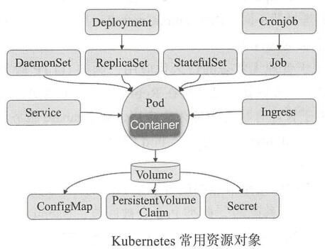
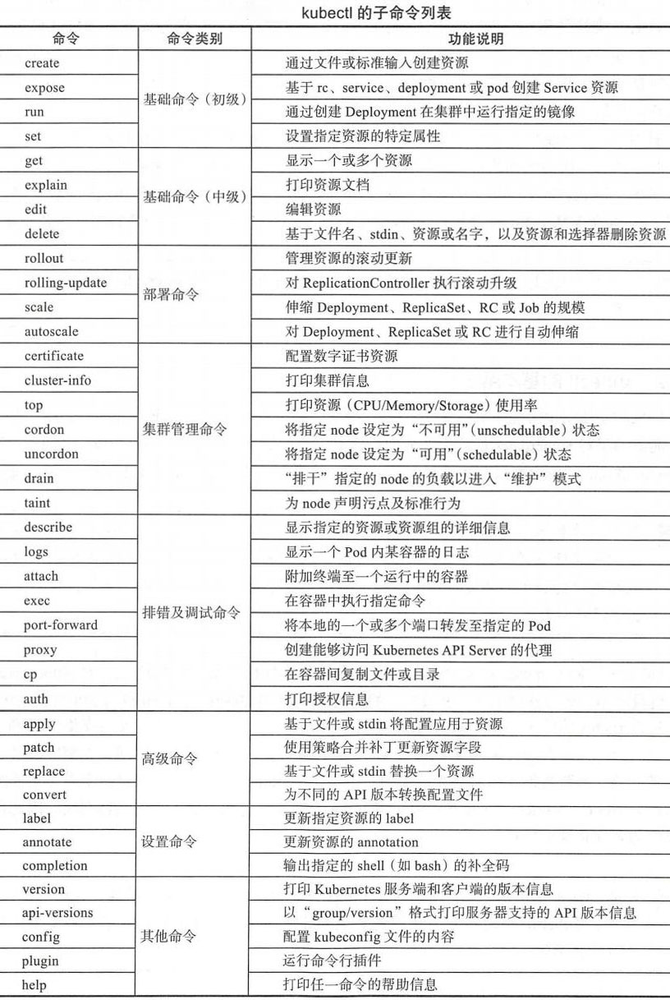
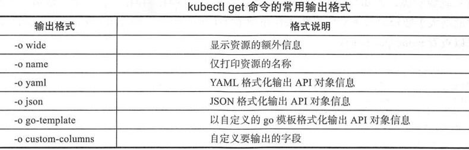
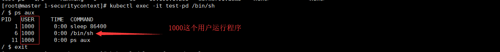
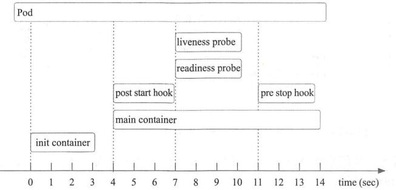
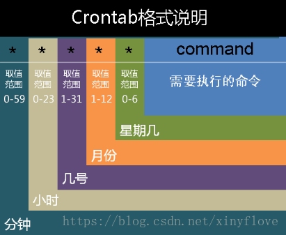

# 互动教程

确保每个例子的代码都可以运行。参考了[马哥kubernetes入门](https://pdf.us/tag/kubernetes/page/3)


[TOC]


* github上有官方给的例子
  * https://github.com/kubernetes/examples


# 基本概念










# 1. Pod

使用容器标准方式：一个容器仅运行一个进程

[参考网址](https://pdf.us/2019/02/19/2803.html)


## 1.1 Hello Pod


```shell
cd ~ ; mkdir 1-hello ; cd 1-hello
vi mypod.yaml
```


> mypod.yaml 详细

```yaml
apiVersion: v1
kind: Pod
metadata:
  name: test-pd
spec:
  containers:
  - name: myapp
    image: alpine
    command: ["/bin/sh"]
    args: ["-c","while true; do sleep 3; done"]
```


```shell
# 生成pod
kubectl apply -f mypod.yaml

# 看看启动了没有
kubectl get -f mypod.yaml -o wide

# 查看详细信息
kubectl describe -f mypod.yaml

# 查看生成的目录
kubectl exec -it test-pd /bin/sh
> exit

# 监控30秒看看
kubectl get -f mypod.yaml -o wide -w


# 删除
kubectl delete -f mypod.yaml
```


## 1.2 设置环境变量

应用程序若不支持从环境变量获取配置，可通过 entrypoint 脚本完成环境变量到程序配置文件的同步


```shell
cd ~ ; mkdir 1-env ; cd 1-env ; vi mypod.yaml

```


> mypod.yaml 详细

向Pod对象中容器传递环境变量有两种方法：env 和 envFrom。envFrom见[8.2 ConfigMap的使用](#8.2 ConfigMap的使用)

```yaml
apiVersion: v1
kind: Pod
metadata:
  name: test-pd
spec:
  containers:
  - name: filebeat
    image: alpine
    command: ["/bin/sh"]
    args: ["-c","while true; do sleep 3; done"]
    env:
    - name: REDIS_HOST
      value: db.ilinux.io:6379
    - name: LOG_LEVEL
      value: info
```


```shell

# 生成pod
kubectl apply -f mypod.yaml

# 看看启动了没有
kubectl get -f mypod.yaml -o wide

# 查看详细信息
kubectl describe -f mypod.yaml

# 登录到容器，看看环境变量是否存在
kubectl exec -it test-pd /bin/sh
> echo $REDIS_HOST
> exit

# 删除
kubectl delete -f mypod.yaml
```


## 1.3 共享节点网络

仅需设置 spec.hostNetwork 为 true.

IP地址为节点的IP地址，并且端口也暴漏出来了。


```shell
cd ~ ; mkdir 1-hostnetwork ; cd 1-hostnetwork
vi mypod.yaml
```


> mypod.yaml 详细

```yaml
apiVersion: v1
kind: Pod
metadata:
  name: test-pd
spec:
  containers:
  - name: my-test
    image: fanhualei/tomcat-alpine:v1
    command: ["tomcat"]
    args: ["run"]
  hostNetwork: true
```


```shell
# 生成pod
kubectl apply -f mypod.yaml

# 看看启动了没有
kubectl get -f mypod.yaml -o wide

# 查看详细信息
kubectl describe -f mypod.yaml

# 看那个节点的ip网页
curl 192.168.1.186:8080

# 查看生成的目录
kubectl exec -it test-pd /bin/sh
> ip add
> exit


# 删除
kubectl delete -f mypod.yaml
```


## 1.4 权限和访问控制

Security Context的目的是限制不可信容器的行为，保护系统和其他容器不受其影响。

Kubernetes提供了三种配置Security Context的方法：

- Container-level Security Context：仅应用到指定的容器
- Pod-level Security Context：应用到Pod内所有容器以及Volume
- Pod Security Policies（PSP）：应用到集群内部所有Pod以及Volume


```shell
cd ~ ; mkdir 1-securitycontext ; cd 1-securitycontext
vi mypod.yaml
```


> mypod.yaml 详细

设定Pod或容器的权限和访问控制.

以uid1000的非特权用户运行容器并禁止权限升级

```yaml
apiVersion: v1
kind: Pod
metadata:
  name: test-pd
spec:
  containers:
  - name: my-test
    image: alpine
    command: ["/bin/sh","-c","sleep 86400"]
    securityContext:
      runAsNonRoot: true
      runAsUser: 1000  # 指定用那个用户运行程序
      allowPrivilegeEscalation: false
```



```shell
# 生成pod
kubectl apply -f mypod.yaml

# 看看启动了没有
kubectl get -f mypod.yaml -o wide

# 查看详细信息
kubectl describe -f mypod.yaml


# 查看生成的目录
kubectl exec -it test-pd /bin/sh
> ps aux
> exit

# 删除
kubectl delete -f mypod.yaml
```


## 1.5 设置标签


```shell
cd ~ ; mkdir 1-labels ; cd 1-labels
vi mypod.yaml
```


> mypod.yaml 详细

资源标签 labels 位于 **metadata** 下

```yaml
apiVersion: v1
kind: Pod
metadata:
  name: test-pd
  labels:
    type: pod
    use: web
    speed: fast
spec:
  containers:
  - name: my-test
    image: fanhualei/tomcat-alpine:v1
    command: ['tomcat']
    args: ['run']
```


```shell
# 生成pod
kubectl apply -f mypod.yaml

# 查看标签
kubectl get pods --show-labels

# 看看启动了没有
kubectl get -f mypod.yaml -o wide  --show-labels

# 查看详细信息
kubectl describe -f mypod.yaml


# 查看生成的目录
kubectl exec -it test-pd /bin/sh
> exit


# 删除
kubectl delete -f mypod.yaml
```


> 标签选择器高级用法

**原则：**
同时指定的多个选择器是 AND 与 操作
使用空值标签，表示选择全部
空的标签选择器，表示没有资源被选择


**基于集合关系的选择器：**
key in (val1,val2,...)    在集合中即可
key notin (val1,val2,...)   不在集合中
key  所有存在此键名标签的资源
!key 所有不存在此键名标签的资源


```shell
#标签选择器 Label Selector
kubectl get pods -l use=web
kubectl get pods -l use!=web
kubectl get pods -l use==web
kubectl get pods -l use=web,name=ma   # 多个选择器

kubectl get pods -l "type in (pod,svc)"
kubectl get pods -l "type notin  (pod,svc)"
kubectl get pods -l "type"  #所有存在此键名标签的资源
kubectl get pods -l 'type in (pod,svc),!name' 
```


## 1.6 标签选择器

让其他对象找到Pod

Service/Deployment/ReplicaSet等关联到Pod对象，通过在spec字段嵌套selector字段，通过matchLabels指定标签选择器。

* matchLabels 直接用键值对
* matchExpressions 基于表达式指定标签选择器列表


```shell
cd ~/1-labels
vi mysvc.yaml
```


```yaml
apiVersion: v1
kind: Service
metadata:
  name: myapp-svc
spec:
  selector:
    app: test
    matchExpressions:
    - { key: tier, operator: In, values: [cache,foo]} #In和NotIn
    - { key: environment, opetator: Exists,values:}  #Exists和DostNotExist时values必须为空
  ports:
  - protocol: TCP
    port: 80  # Service暴露的端口
    targetPort: 8080  # 后端Pod对象的端口 也可为端口名
  
```


```shell
# 生成pod
kubectl apply -f mysvc.yaml

# 查看service
kubectl get svc 

#　创建 Service myapp-svc 后，会自动创建名为同名的Endpoints对象
kubectl get endpoints

#Service的默认类型为ClusterIP，仅能接收来自集群中Pod对象的请求
curl http://10.104.153.90:80/

# 删除
kubectl delete -f mysvc.yaml
```


## 1.7 发布到特定节点中

可以指定Pod发布到特定的宿主机器上，例如这些机器上有ssd硬盘

### 第一步、给节点设置标记

```shell
kubectl get nodes --show-labels
kubectl label nodes kube-node1 disktype=ssd  # 为节点添加标签
kubectl get nodes -L disktype
```


### 第二步、选择节点

让Pod在选定节点上运行,实现节点亲和性调度，**spec.nodeSelector**
绑定到特定节点还有一种方法 使用 **spec.nodeName（不常用，这种写的太死了）**


```shell
cd ~ ; mkdir 1-nodeSelector ; cd 1-nodeSelector
vi mypod.yaml
```


> mypod.yaml 详细

```yaml
apiVersion: v1
kind: Pod
metadata:
  name: test-pd
spec:
  nodeSelector:
    matchLabels:
      disktype: sdd
  #nodeName: 节点名称  
  containers:
  - name: myapp
    image: alpine
    command: ["/bin/sh"]
    args: ["-c","while true; do sleep 30; done"]
```


```shell
# 生成pod
kubectl apply -f mypod.yaml

# 看看启动了没有
kubectl get -f mypod.yaml -o wide

# 查看详细信息
kubectl describe -f mypod.yaml

# 查看生成的目录
kubectl exec -it test-pd /bin/sh
> exit

# 删除
kubectl delete -f mypod.yaml
```


## 1.8 生命周期




### 1.8.1 初始化容器

主容器启动之前要运行的容器，常用于执行一些预置操作
初始化容器必须运行完成至结束，每个初始化容器都必须按定义顺序串行运行

例如gitRepo这个取消了，可以通过初始化容器来实现类似的功能


```shell
cd ~ ; mkdir 1-8-initContainers ; cd 1-8-initContainers
vi mypod.yaml
```


> mypod.yaml 详细

spec.initContainers 定义

```yaml
apiVersion: v1
kind: Pod
metadata:
  name: test-pd
spec:
  containers:
  - name: myapp
    image: alpine
    command: ["/bin/sh"]
    args: ["-c","while true; do sleep 3; done"]
  initContainers:  
  - name: init-app
    image: alpine
    command: ['sh','-c','sleep 20']  
```


```shell
# 生成pod
kubectl apply -f mypod.yaml

# 看看启动了没有
kubectl get -f mypod.yaml -o wide

# 查看详细信息
kubectl describe -f mypod.yaml

# 查看生成的目录
kubectl exec -it test-pd /bin/sh
> exit

# 删除
kubectl delete -f mypod.yaml
```


### 1.8.2 钩子函数

**如何设置**

* kubectl explain pods.spec.containers.lifecycle.postStart.exec

* postStart，
  * 容器创建完成后立即运行，不保证一定会于容器中ENTRYPOINT之前运行
* preStop，
  * 容器终止操作之前立即运行，在其完成前会阻塞删除容器的操作调用

**钩子处理器实现方式**：

* Exec，在钩子事件触发时，直接在当前容器中运行由用户定义的命令
* HTTP，在当前容器中向某Url发起HTTP请求


```shell
cd ~ ; mkdir 1-8-hook ; cd 1-8-hook
vi mypod.yaml
```


> mypod.yaml 详细

spec.initContainers 定义

```yaml
apiVersion: v1
kind: Pod
metadata:
  name: test-pd
spec:
  containers:
  - name: myapp
    image: alpine
    command: ["/bin/sh"]
    args: ["-c","while true; do sleep 3; done"]
    lifecycle:
      postStart:
        exec:
          command: ["/bin/sh","-c","echo 'lifecycle hooks handler' > /home/index.html"]    
```


```shell
# 生成pod
kubectl apply -f mypod.yaml

# 看看启动了没有
kubectl get -f mypod.yaml -o wide

# 查看详细信息
kubectl describe -f mypod.yaml

kubectl exec test-pd -- cat /home/index.html

# 查看生成的目录
kubectl exec -it test-pd /bin/sh
> exit

# 删除
kubectl delete -f mypod.yaml
```


### 1.8.3 容器探测

**设置点**

- pods.spec.containers.livenessProbe
- pods.spec.containers.readinessProbe

**探测方法**

- ExecAction，在容器内执行命令，检测状态码是否为0
- TCPSocketAction，与容器的某tcp端口尝试连接，端口打开即为正常
- HTTPGetAction，向容器某端口发起get请求，响应码为2xx 3xx即为正常

**处理逻辑**

* 存活性检测 livenessProbe
  * 判定容器是否为Running状态，不通过则杀死容器，未定义存活性检测默认为 Success
* 就绪性检测 readinessProbe
  * 判断容器是否就绪并可对外提供服务，不通过则不会添加到Service对象端点列表中


### 1.8.4 容器重启策略

> pods.spec.restartPolicy

- Always，默认，总是重启
- OnFailure，出错时重启
- Never，不重启

`反复重启的延迟时间：10、20、40、80、160、300秒逐次延长，最大300秒`


### 1.8.5 设置容器终止宽限期

系统强制删除操作宽限期倒计时(30s)启动，发送TERM信号到Pod中每个容器的主进程，倒计时结束，发送KILL信号


测试node挂 机，发布需要等几分才会 在其它 的node机器 启动，这个明显不合理，对于大多数业务

`/etc/systemd/system/kube-controller-manager.service`

--grace-period=<seconds> 自定义宽限期时长，默认30秒


## 1.9 存活性探测

三种推测方法：ExecAction、TCPSocketAction、HTTPGetAction


### 1.9.1 exec 探针

可以探测某个文件是否存在


```shell
cd ~ ; mkdir 1-liveness-exec ; cd 1-liveness-exec
vi mypod.yaml
```


> mypod.yaml 详细

shell命令
test -e /tmp/healthy   # 若在在则返回0 不存在返回1

```yaml
viapiVersion: v1
kind: Pod
metadata:
  name: test-pd
spec:
  containers:
  - name: myapp
    image: alpine
    command: ["/bin/sh"]
    args: ["-c","touch /tmp/healthy; sleep 20; rm -rf /tmp/healthy; sleep 100"]
    livenessProbe:
      exec:
        command: ["test","-e","/tmp/healthy"]
```


```shell
# 生成pod
kubectl apply -f mypod.yaml

# 看看启动了没有
kubectl get -f mypod.yaml -o wide

# 查看详细信息
kubectl describe -f mypod.yaml

# 删除
kubectl delete -f mypod.yaml
```


### 1.9.2 **HTTP** 探针


```shell
cd ~ ; mkdir 1-liveness-http ; cd 1-liveness-http
vi mypod.yaml
```


> mypod.yaml 详细

spec.containers.livenessProbe.httpGet 向目标空器发起http请求，根据响应码判断
host <string> 默认为Pod IP，也可在httpHeaders中使用Host:定义
port <string> 必填
httpHeaders <[]Object> 请求头
path <string> 路径，url
scheme 默认为HTTP，也可是HTTPS

```yaml
apiVersion: v1
kind: Pod
metadata:
  name: test-pd
spec:
  containers:
  - name: myapp
    image: fanhualei/tomcat-alpine:v1
    command: ['tomcat']
    args: ['run']
    lifecycle:
      postStart:
        exec:
          command: ["/bin/sh","-c","echo Healthy > /opt/webapp/healthz.html"]
    
    livenessProbe:
      httpGet:
        path: /healthz.html
        port: 8080
```

如果配置错误，*有可能容器正确运行*，但是不会重启

```shell
# 生成pod
kubectl apply -f mypod.yaml

# 看看启动了没有
kubectl get -f mypod.yaml -o wide

# 查看详细信息
kubectl describe -f mypod.yaml

#一个窗口监控
kubectl get -f mypod.yaml -o wide -w
# 删除测试页面
kubectl exec test-pd -- rm /opt/webapp/healthz.html

# 查看生成的目录
kubectl exec -it test-pd /bin/sh
> ls /opt/webapp/
> exit

# 删除
kubectl delete -f mypod.yaml
```


### 1.9.3 TCP 探针

相比http更高效、更省资源，但精度略低

```shell
cd ~ ; mkdir 1-liveness-tcp ; cd 1-liveness-tcp
vi mypod.yaml
```


> mypod.yaml 详细

`spec.containers.livenessProbe.tcpSocket` 检查容器指定端口是否开启

* host 默认为Pod IP
* port 必选


`spec.containers.livenessProbe`下属性字段（在exec http通用）指定

* initialDelaySeconds ，探测延迟，默认为0s 容器启动后立即开始探测
* timeoutSeconds ，超时，默认值1s，最小值也为1s
* periodSeconds，频率，默认10s
* successThreshold，处于失败状态时，连接多少次成功才被认为是成功，默认1
* failureThreshold，处于成功状态时，连接多少次失败被认为是失败，默认3


```yaml
apiVersion: v1
kind: Pod
metadata:
  name: test-pd
spec:
  containers:
  - name: myapp
    image: fanhualei/tomcat-alpine:v1
    command: ['tomcat']
    args: ['run']
    
    livenessProbe:
      tcpSocket:  
        port: 8080
      initialDelaySeconds: 5 
      timeoutSeconds: 2 
```


```shell
# 生成pod
kubectl apply -f mypod.yaml

# 看看启动了没有
kubectl get -f mypod.yaml -o wide

# 查看详细信息
kubectl describe -f mypod.yaml

#一个窗口监控
kubectl get -f mypod.yaml -o wide -w
# 登录 手工关掉tomcat
kubectl exec -it test-pd /bin/sh
> /opt/tomcat/bin/shutdown.sh


# 删除
kubectl delete -f mypod.yaml
```


## 1.10 readinessProbe

三种推测方法：ExecAction、TCPSocketAction、HTTPGetAction


### 1.10.1 exec 探针

可以探测某个文件是否存在


```shell
cd ~ ; mkdir 1-readiness-exec ; cd 1-readiness-exec
vi mypod.yaml
```


> mypod.yaml 详细

shell命令
test -e /tmp/healthy   # 若在在则返回0 不存在返回1

```yaml
apiVersion: v1
kind: Pod
metadata:
  name: test-pd
spec:
  containers:
  - name: myapp
    image: alpine
    command: ["/bin/sh"]
    args: ["-c","touch /tmp/healthy; sleep 20; rm -rf /tmp/healthy; sleep 20"]
    readinessProbe:
      exec:
        command: ["test","-e","/tmp/healthy"]
```


```shell
# 生成pod
kubectl apply -f mypod.yaml

# 看看启动了没有
kubectl get -f mypod.yaml -o wide

# 查看详细信息
kubectl describe -f mypod.yaml

# 删除
kubectl delete -f mypod.yaml
```


### 1.10.2 **HTTP** 探针

**可以参考liveness的代码**


### 1.10.3 TCP 探针

**可以参考liveness的代码**


## 1.11 限制使用资源


一个cpu逻辑核心为 1 core = 1000 millicores 即1000m
内存单位为 G Gi M Mi K Ki 默认为字节


```shell
cd ~ ; mkdir 1-requests ; cd 1-requests
vi mypod.yaml
```


> mypod.yaml 详细

* requests 
  * 确保可用的最小资源，不一定会用得到，可能会用不到
* limits 
  * 最大值，硬限制

```yaml
apiVersion: v1
kind: Pod
metadata:
  name: stress-pod
spec:
  containers:
  - name: stress
    image: ikubernetes/stress-ng
    # -m 1 内存性能压力测试 1个进程  -c 1 cpu压力测试 1个进程
    command: ["/usr/bin/stress-ng","-m 1","-c 1","--metrics-brief"]
    resources:
      requests:
        memory: 128Mi
        cpu: 200m
      limits:
        memory: 256Mi
        cpu: 500m
```


```shell
# 生成pod
kubectl apply -f mypod.yaml

# 看看启动了没有
kubectl get -f mypod.yaml -o wide

# 查看详细信息
kubectl describe -f mypod.yaml


kubectl exec stress-pod -- top

kubectl get pods -w     # -w watch 查看数据变化

# 删除
kubectl delete -f mypod.yaml
```


> 辅助知识

CentOS 7的EPEL源包含了2个压力测试工具，一个是标准的stress, 另外一个是更强大的stress-ng，可以帮助模拟产生各种cpu压力。

stress参数和用法都很简单：

　　-c 2 : 生成2个worker循环调用sqrt()产生cpu压力

　　-i 1 : 生成1个worker循环调用sync()产生io压力

　　-m 1 : 生成1个worker循环调用malloc()/free()产生内存压力

　　比如, 从下面可以看出经过30秒的压力后，系统负载从0.00提升至0.57。


## 1.12 多容器之间通讯

kubernetes不建议一个pod中有多个容器


参考[kubernetes之多容器pod以及通信](https://www.cnblogs.com/tylerzhou/p/11009412.html)

容器经常是为了解决单一的,窄范围的问题,比如说微服务.然而现实中,一些复杂问题的完成往往需要多个容器.这里我们讨论一下如何把多个容器放在同一个pod里以及容器间的通信

* 容器的依赖关系和启动顺序
  * 不能保证那个先启动，因为时并行的。
  * 如果要顺序启动，那么使用初始容器(init container)

* 同一pod的容器间网络通信
  * 可以通过'localhost'来进行通信
  * 它们共享同一个Ip和相同的端口空间

* 同一个pod暴露多个容器
  * 在一个服务里暴露不同的端口来实现


### 1.12.1 共享存储卷


```shell
cd ~ ; mkdir 1-multi ; cd 1-multi
vi mypod.yaml
```


> mypod.yaml

```yaml
apiVersion: v1
kind: Pod
metadata:
  name: mc1
spec:
  volumes:
  - name: html
    emptyDir: {}
  containers:
  - name: 1st
    image: fanhualei/tomcat-alpine
    command: ["tomcat"]
    args: ["run"]
    volumeMounts:
    - name: html
      mountPath: /opt/webapp
      
  - name: 2nd
    image: alpine
    volumeMounts:
    - name: html
      mountPath: /html
    command: ["/bin/sh", "-c"]
    args:
      - while true; do
          date >> /html/index.html;
          sleep 10;
        done
```


```shell
# 生成pod
kubectl apply -f mypod.yaml

# 看看启动了没有
kubectl get -f mypod.yaml -o wide

kubectl exec mc1 -c 1st -- /bin/cat /opt/webapp/index.html
kubectl exec mc1 -c 2nd -- /bin/cat /html/index.html

#登录到不同的容器
kubectl exec -it mc1 -c 1st  /bin/sh
kubectl exec -it mc1 -c 2nd  /bin/sh

# 查看pod的端口
curl 10.100.1.230:8080


# 查看详细信息do
kubectl describe -f mypod.yaml

# 删除
kubectl delete -f mypod.yaml
```


### 1.12.2 进程间通信

不建议使用

同一个pod里的容器共享IPC名称空间,这就意味着他们可以通过进程间通信的手段来进行通信,比如使用`SystemV semaphores`或者`POSIX`共享内存


```shell
cd ~ ; mkdir 1-ipc ; cd 1-ipc
vi mypod.yaml
```


```yaml
# 下面的例子不能执行，应为没有安装ipc中程序，在alpine中
apiVersion: v1
kind: Pod
metadata:
  name: mc2
spec:
  containers:
  - name: producer
    image: alpine
    command: ["./ipc", "-producer"]
  - name: consumer
    image: alpine
    command: ["./ipc", "-consumer"]
  restartPolicy: Never
```


然后通过kubectl create来创建pod,用下面命令来查看状态

```
$ kubectl get pods --show-all -w
NAME      READY     STATUS              RESTARTS  AGE
mc2       0/2       Pending             0         0s
mc2       0/2       ContainerCreating   0         0s
mc2       0/2       Completed           0         29
```

这时候你可以检测每一个容器的日志来检测第二个队列是否消费了第一个队列生产的所有消息包括退出消息

```
$ kubectl logs mc2 -c producer
...
Produced: f4
Produced: 1d
Produced: 9e
Produced: 27
$ kubectl logs mc2 -c consumer
...
Consumed: f4
Consumed: 1d
Consumed: 9e
Consumed: 27
Consumed: done
```


# 2. Controller

Pod控制器通常包含三个组成部分：
标签选择器，期望的副本数，Pod模板

## 2.1 Deployment

Deployment构建于ReplicaSet之上，支持事件和状态查看，回滚，版本记录，暂停和启动升级。

多种自动更新方案：

* Recreate，先删除再新建；
* RollingUpdate，滚动升级，逐步替换


### 2.1.1 创建


```shell
cd ~ ; mkdir 2-deployment ; cd 2-deployment
vi mydeploy.yaml
```


> mydeploy.yaml 详细

```yaml
apiVersion: apps/v1
kind: Deployment
metadata:
  name: myapp-deploy
spec:
  replicas: 3
  selector:
    matchLabels:
      app: myapp
  template:
    metadata:
      labels:
        app: myapp
    spec:
      containers:
      - name: myapp
        image: fanhualei/tomcat-alpine:v1
        command: ["tomcat"]
        args: ["run"]
        ports:
        - name: http
          containerPort: 8080
```


```shell
# 生成对象
kubectl apply -f mydeploy.yaml

# 看看启动了没有
kubectl get -f mydeploy.yaml -o wide

# 查看详细信息
kubectl describe -f mydeploy.yaml
kubectl get pods  -o yaml


# 输出版本
kubectl get pods  -o custom-columns=NAME:.metadata.name,IMAGE:.spec.containers[0].image,PHASE:.status.phase,IP:.status.podIP,RESTARTS:.status.containerStatuses[0].restartCount


# 删除
kubectl delete -f mydeploy.yaml
```


```
NAME                            IMAGE                        PHASE     IP             RESTARTs
myapp-deploy-757bc8fbf6-452rw   fanhualei/tomcat-alpine:v1   Running   10.100.1.227   0
myapp-deploy-757bc8fbf6-c2h2l   fanhualei/tomcat-alpine:v1   Running   10.100.1.240   0
myapp-deploy-757bc8fbf6-dw7q2   fanhualei/tomcat-alpine:v1   Running   10.100.1.241   0

```


### 2.1.2 设置更新策略

* spec.strategy.rollingUpdate.**maxSurge**
  * 升级期间允许的总Pod数超出期望值的个数
  * 可以是具体数值或百分比，若为1，则表示可超出1个
* spec.strategy.rollingUpdate.**maxUnavailable**
  * 滚动升级时允许的最大Unavailable的pod个数
  * 可为具体数值或百分比
* spec.**minReadySeconds**
  * 可控制更新速度，此时间内更新操作会被阻塞
* spec.**revisionHistoryLimit**
  * 控制保存历史版本的数量

*注意，maxSurge和maxUnavailable不能同时为0，否则无法升级*

```shell
#要记录历史版本需要在创建Deployment时使用 --record选项
kubectl apply -f mydeploy.yaml --record

# 修改间隔时间
kubectl patch deployments.apps myapp-deploy -p '{"spec":{"minReadySeconds":5}}'

# 修改镜像 触发滚动更新
kubectl set image deployments.apps myapp-deploy myapp=fanhualei/tomcat-alpine:v2

# 查看滚动更新过程中状态信息
kubectl rollout status deployment myapp-deploy
kubectl get deploy myapp-deploy --watch

# 旧的replicasets会保留 但此前管理的Pod对象会删除
kubectl get replicasets.apps -l app=myapp

# 访问 curl $(kubectl get pods myapp-deploy-6b999b85b7-2f9fd -o go-template={{.status.podIP}}):8080
```


### 2.1.3 金丝雀发布

金丝雀对瓦斯气体敏感，工人下井时，用来检测空气。

发布时，第一批更新完成后，暂停升级，新旧同时提供服务，其中新的很少，待确认没有问题后，完成余下部分的升级。

```shell
# 先添加一个新Pod 设置maxSurge为1，maxUnavailable为0
kubectl patch deployments.apps myapp-deploy -p '{"spec":{"strategy":{"rollingUpdate":{"maxSurge":1,"maxUnavailable":0}}}}'


#启动更新 在启动后，在maxReadySeconds属性设置的时间内执行暂停 通常使用&&
kubectl set image deployments myapp-deploy myapp=fanhualei/tomcat-alpine:v3 && kubectl rollout pause deployment myapp-deploy

# 查看进度:此时，可将一部分流量引入新Pod上，进行验证
kubectl rollout status deployment myapp-deploy

# 验证通过后 继续升级
kubectl rollout resume deployment myapp-deploy

# 验证不过，就回滚
kubectl rollout undo deployment myapp-deploy
```


### 2.1.4 回滚操作

回滚到之前版本或指定的历史版本

```shell
# 回滚到之前的版本
kubectl rollout undo deployment myapp-deploy
# 查看历史版本
kubectl rollout history deployment myapp-deploy
# 查看当前版本
kubectl describe deployments.apps myapp-deploy
# 回滚到第1个版本
kubectl rollout undo deployment myapp-deploy --to-revision=1
```

若此前滚动更新过程处于暂停状态，那么回滚操作需要先将Pod模板的版本改回到之前的版本，然后继续更新，否则会一直处理暂停状态而无法回滚


### 2.1.5 扩容和缩容

修改spec.replicas的值，可用kubectl apply、kubectl edit、kubectl scale等命令实现

```shell
# 回滚到之前的版本
kubectl scale --replicas=4 -f mydeploy.yaml

kubectl edit deployment/myapp-deploy

# kubectl apply  修改原先的文件后，再执行


# 删除
kubectl delete -f mydeploy.yaml
```


## 2.2 DaemonSet

在集群中所有节点同时运行的Pod，新加入的节点也会自动创建，节点从集群移除时会自动回收.

可用节点选择器及节点标签指定仅在部分节点运行

常用于存储、日志、监控类守护进程


### 2.2.1 创建


```shell
cd ~ ; mkdir 2-daemonSet ; cd 2-daemonSet
vi myDaemonSet.yaml
```


> myDaemonSet.yaml 详细

DaemonSet 不支持 replicas参数，默认不会部署到master节点

```yaml
apiVersion: apps/v1
kind: DaemonSet
metadata:
  name: my-ds
spec:
  selector:
    matchLabels:
      app: myapp
  template:
    metadata:
      labels:
        app: myapp
    spec:
      containers:
      - name: myapp
        image: fanhualei/tomcat-alpine:v1
        command: ["tomcat"]
        args: ["run"]
        ports:
        - name: http
          containerPort: 8080
```


### 2.2.2 查看

```shell
# 生成对象
kubectl apply -f myDaemonSet.yaml

# 看看启动了没有
kubectl get -f myDaemonSet.yaml -o wide

# 查看详细信息
kubectl describe -f myDaemonSet.yaml

kubectl get pods -l app=myapp -o custom-columns=NAME:metadata.name,NODE:spec.nodeName,IMAGE:.spec.containers[0].image,PHASE:.status.phase,IP:.status.podIP,RESTARTS:.status.containerStatuses[0].restartCount

# 如何访问到daemonSet,通过node的IP地址，还是pod的IP? pod地址
curl 10.100.1.233:8080
# 删除
kubectl delete -f myDaemonSet.yaml
```


### 2.2.3 升级

更新配置定义在 spec.updateStrategy 下，支持 RollingUpdate 滚动更新 和 OnDelete 删除时更新(删除后重建启用新版本)

```
kubectl set image daemonsets my-ds myapp=fanhualei/tomcat-alpine:v2
```


## 2.3 Job

运行一次性任务，容器中进程在正常结束后不会再重启

### 2.3.1 非并行作业

- 通常，除非Pod发生故障，否则仅启动一个Pod。
- 一旦Pod成功终止，作业即完成。


```shell
cd ~ ; mkdir 2-job ; cd ~/2-job
vi myjob.yaml
```


> myjob.yaml 详细

```yaml
apiVersion: batch/v1
kind: Job
metadata:
  name: job-example
spec:
  template:
    spec:
      containers:
      - name: myjob
        image: alpine
        command: ["/bin/sh","-c","echo i love you ; sleep 120"]
      # template下默认restartPolicy为Always 对Job不适用
      # 必须显式指定为Never 或 OnFailure
      restartPolicy: Never
```


```shell
kubectl apply -f myjob.yaml

kubectl describe -f myjob.yaml

kubectl get pods -o wide


pods=$(kubectl get pods --selector=job-name=job-example --output=jsonpath='{.items[*].metadata.name}')
echo $pods

# 查看其中一个Pod的标准输出
kubectl logs $pods

kubectl delete -f myjob.yaml
```


### 2.3.2 并行作业

spec.parallelism 并行度属性；spec.completion 总任务数

串行运行5次任务：spec.parallelism=1 spec.completion=5
并行2队列5次任务：spec.parallelism=2 spec.completion=5


1. 固定完成计数的并行作业：
   - 为指定非零的正值`.spec.completions`。
   - Job代表整体任务，并且在1到范围内的每个值都有一个成功的Pod时完成`.spec.completions`。
   - **尚未实现：**每个Pod传递了1到范围内的不同索引`.spec.completions`。
2. 具有工作队列的并行作业：
   - Pod必须在彼此之间或外部服务之间进行协调，以确定每个Pod应该如何处理。例如，一个Pod可以从工作队列中获取最多N批的批处理。
   - 每个Pod都可以独立地确定其所有对等方是否都已完成，从而确定了整个Job。
   - 当作业中的*任何* Pod成功终止时，不会创建新的Pod。
   - 一旦至少一个Pod成功终止并且所有Pod都终止，则作业成功完成。
   - 一旦Pod成功退出，其他Pod仍不应为此任务做任何工作或编写任何输出。他们都应该退出。


```shell
cd ~ ; mkdir 2-job-multi ; cd ~/2-job-multi
vi myjob-multi.yaml
```


> myjob-multi.yaml 详细

```yaml
apiVersion: batch/v1
kind: Job
metadata:
  name: job-multi
spec:
  completions: 5  # 总共有5个
  parallelism: 1  # 每次开启一个
  template:
    spec:
      containers:
      - name: myjob
        image: alpine
        command: ["/bin/sh","-c","echo i love you ;sleep 20"]
      restartPolicy: OnFailure
```


```shell
kubectl apply -f myjob-multi.yaml

kubectl describe -f myjob-multi.yaml

pods=$(kubectl get pods --selector=job-name=job-multi --output=jsonpath='{.items[*].metadata.name}')
echo $pods

# 查看其中一个Pod的标准输出
kubectl logs $pods

# 使用下面的命令将出现错误
kubectl delete myjob-multi.yaml

# 使用限制器来删除
kubectl delete pods --selector=job-name=job-multi
kubectl delete jobs --selector=job-name=job-multi
```


## 2.4 CronJob

指定运行时间点及是否重复运行

> kubectl explain cronjob.spec 查看帮助

* jobTemplate
  * 控制器模板，必须
* schedule
  * 运行时间点，必须
* concurrencyPolicy
  * 并* 发执行策略，
  * 值为 Allow、Forbid、Replace 定义前一次作业未执行完又遇到后一次作业的情形
* failedJobHistoryLimit
  * 为失败任务保留的历史记录数，默认1
* successfulJobsHistoryLimit
  *  为成功* 任务保留的历史记录数，默认3
* startingDeadlineSeconds
  *  启动作* 业错误的超时时长
* suspend 
  * 是否挂起后续的任务* 执行，默认false，对运行中作业没有影响


```shell
cd ~ ; mkdir 2-CronJob ; cd ~/2-CronJob
vi mycronjob.yaml
```


> mycronjob.yaml 详细

```yaml
apiVersion: batch/v1beta1
kind: CronJob
metadata:
  name: cronjob-example
  labels:
    app: mycronjob
spec:
  schedule: "*/1 * * * *"
  jobTemplate:
    metadata:
      labels:
        app: mycronjob-jobs
    spec:
      parallelism: 2
      template:
        spec:
          containers:
          - name: myjob
            image: alpine
            command:
            - /bin/sh
            - -c
            - date; echo Hello from the Kubernetes cluster; sleep 10
          restartPolicy: OnFailure
```


```shell
kubectl apply -f mycronjob.yaml

kubectl describe -f mycronjob.yaml


kubectl get cronjob cronjob-example

# 默认显示3条历史记录
kubectl get jobs -l app=mycronjob-jobs  


# Replace "hello-4111706356" with the job name in your system
pods=$(kubectl get pods --selector=job-name=cronjob-example-1569513300 --output=jsonpath={.items[].metadata.name})

# 查看其中一个Pod的标准输出
kubectl logs $pods


kubectl get pods  
kubectl get jobs  

# 需要使用这个命令来删除，不然停不下来
kubectl delete cronjob  cronjob-example
```


### crontab定义规则

"*/2 * * * *"





[crontab的语法规则格式（每分钟、每小时、每天、每周、每月、每年定时执行 规则](https://blog.csdn.net/xinyflove/article/details/83178876)

crontab的语法规则格式：

| 代表意义 | 分钟 | 小时 | 日期 | 月份 | 周   | 命令           |
| -------- | ---- | ---- | ---- | ---- | ---- | -------------- |
| 数字范围 | 0~59 | 0~23 | 1~31 | 1~12 | 0~7  | 需要执行的命令 |

周的数字为 0 或 7 时，都代表“星期天”的意思。

另外，还有一些辅助的字符，大概有下面这些：


| **特殊字符** | **代表意义**                                                 |
| ------------ | ------------------------------------------------------------ |
| *(都是)      | 举例来说，`0 12 * * * command` 日、月、周都是*，就代表着不论何月、何日的礼拜几的12：00都执行后续命令的意思。 |
| ,(与)        | 如果要执行的工作是3：00与6：00时，就会是：`0 3,6 * * * command`时间还是有五列，不过第二列是 3,6 ，代表3与6都适用 |
| -(至)        | 代表一段时间范围内，举例来说，8点到12点之间的每小时的20分都进行一项工作：`20 8-12 * * * command`仔细看到第二列变成8-12.代表 8,9,10,11,12 都适用的意思 |
| /n(每)       | 那个n代表数字，即是每隔n单位间隔的意思，例如每五分钟进行一次，则：`*/5 * * * * command`用*与/5来搭配，也可以写成0-59/5，意思相同 |

1.每分钟定时执行一次规则：
每1分钟执行： */1 * * * *或者* * * * *
每5分钟执行： */5 * * * *

2.每小时定时执行一次规则：
每小时执行： 0 * * * *或者0 */1 * * *
每天上午7点执行：0 7 * * *
每天上午7点10分执行：10 7 * * *

3.每天定时执行一次规则：
每天执行 0 0 * * *

4.每周定时执行一次规则：
每周执行 0 0 * * 0

5.每月定时执行一次规则：
每月执行 0 0 1 * *

6.每年定时执行一次规则：
每年执行 0 0 1 1 *


# 3. Service


# 4. Volume


## 4.1 局部存储


### 4.1.1 emptyDir

同一容器组中的不同容器都可以对该目录执行读写操作，并且共享其中的数据。

[更多内容，请参考](kubernetes-detail-volume.md/#1.2.1 emptyDir )

> 建立一个目录

```shell
mkdir pod-v-emptydir
cd pod-v-emptydir
vi mypod.yaml
```


> 定义一个文件: mypod.yaml

```yaml
apiVersion: v1 
kind: Pod
metadata:
  name: pod-emptydir
  namespace: default
  labels:
    app: myapp
    use: volumen-emptDir
spec:
  #定义一个http容器
  containers:
  - name: hpptd  
    image: nginx:alpine
    ports:
    - name: http
      containerPort: 80  
    volumeMounts:
    - name: html
      mountPath: /usr/share/nginx/html  #绑定到nginx
  #定义一个应用类
  - name: busybox
    image: busybox
    volumeMounts:
    - name: html
      mountPath: /data/  #绑定的目录可以不同名字
    command:
    - "/bin/sh"
    - "-c"
    - "while true; do echo $(date)>> /data/index.html; sleep 2; done"
  #定义一个存储卷    
  volumes:
  - name: html   #这个名字会被其他引用
    emptyDir: {}
```


> 进行测试

```shell
# 生成pod
kubectl apply -f mypod.yaml

# 看看启动了没有
kubectl get pods/pod-emptydir -o wide

# 查看内容
curl  10.100.1.231

# 删除
kubectl delete -f mypod.yaml
```


> 常用的调试脚本

```shell
# 查看帮助
kubectl explain pods.spec.volumes.emptydir
```


### 4.1.2 hostPath

将**所在节点**的文件系统上某一个文件或文件夹挂载进容器组（容器）。

绝大多数容器组并不需要使用 hostPath 数据卷，但是要监控宿主机的状态时，特别有用：

- 某容器需要访问 Docker，可使用 hostPath 挂载宿主节点的 /var/lib/docker
- 在容器中运行 cAdvisor，使用 hostPath 挂载宿主节点的 /sys

[更多内容，请参考](kubernetes-detail-volume.md/#1.2.2 hostPath)


cAdvisor在docker上的安装方法

```shell
sudo docker run \
  --volume=/:/rootfs:ro \
  --volume=/var/run:/var/run:ro \
  --volume=/sys:/sys:ro \
  --volume=/var/lib/docker/:/var/lib/docker:ro \
  --volume=/dev/disk/:/dev/disk:ro \
  --publish=8080:8080 \
  --detach=true \
  --name=cadvisor \
  google/cadvisor:latest
```


> 建立一个目录

```shell
mkdir pod-v-hostpath
cd pod-v-hostpath
vi mypod.yaml
```


> 定义一个文件: mypod.yaml

```yaml
apiVersion: v1
kind: Pod
metadata:
  name: test-pd
spec:
  containers:
  - image: nginx:alpine
    name: test-container
    volumeMounts:
    - mountPath: /test-pd
      name: test-volume
  volumes:
  - name: test-volume
    hostPath:
      # directory location on host
      path: /root
      # this field is optional
      type: Directory
```


> 进行测试

```shell
# 生成pod
kubectl apply -f mypod.yaml

# 看看启动了没有
kubectl get -f mypod.yaml -o wide

# 查看详细信息
kubectl describe -f mypod.yaml

# 查看生成的目录，有时候会很奇怪，跟本地的不一样，因为这个机器可能不是本地机器
kubectl exec -it test-pd /bin/sh
> ls /test-pd

# 删除
kubectl delete -f mypod.yaml
```


### 4.1.3 gitRepo


gitRepo卷类型已弃用。要为容器提供git存储库，[请将EmptyDir](https://kubernetes.io/docs/concepts/storage/volumes/#emptydir)安装到使用git克隆存储库的[InitContainer中](https://kubernetes.io/docs/concepts/storage/volumes/#emptydir)，然后将[EmptyDir](https://kubernetes.io/docs/concepts/storage/volumes/#emptydir)安装到Pod的容器中。


## 4.2 持久化存储


### 4.2.1 nfs 网络

- 可以在加载 NFS 数据卷前就在其中准备好数据；
- 可以在不同容器组之间共享数据；
- 可以被多个容器组加载并同时读写；
- 容器组被移除时，将仅仅 umount（卸载）NFS 数据卷，NFS 中的数据仍将被保留。


前提假设nfs网络已经安装，可以看一下[nfs网络安装](nfs.md)

假设已经安装完毕 	


> 建立一个目录

```shell
mkdir pod-v-nfs
cd pod-v-nfs
vi mypod.yaml
```


> 定义一个文件: mypod.yaml

```yaml
apiVersion: v1
kind: Pod
metadata:
  name: test-pd
spec:
  containers:
  - image: alpine
    name: test-container
    command:
    - "/bin/sh"
    - "-c"
    - "while true; do echo heloo world; sleep 3; done"
    
    volumeMounts:
    - mountPath: /test-pd
      name: nfs-storage
  volumes:
    - name: nfs-storage
      nfs:
        server: 192.169.1.185
        path: "/"   # 这个目录必须有，不然就建立不了容器
```


> 进行测试

```shell
# 生成pod
kubectl apply -f mypod.yaml

# 看看启动了没有
kubectl get -f mypod.yaml -o wide

# 查看详细信息
kubectl describe -f mypod.yaml

# 查看生成的目录，有时候会很奇怪，跟本地的不一样，因为这个机器可能不是本地机器
kubectl exec -it test-pd /bin/sh
> ls /test-pd

# 删除
kubectl delete -f mypod.yaml
```


## 4.3 配置型存储

### 4.3.1 secret

Kubemetes提供了Secret来处理敏感数据，比如密码、Token和密钥，相比于直接将敏感数据配置在Pod的定义或者镜像中，Secret提供了更加安全的机制（Base64加密），防止数据泄露。Secret的创建是独立于Pod的，以数据卷的形式挂载到Pod中，Secret的数据将以文件的形式保存，容器通过读取文件可以获取需要的数据。


> 建立一个目录

```shell
mkdir pod-v-secret
cd pod-v-secret
vi mypod.yaml
```


> 定义一个文件: mypod.yaml


参考文档[Kubernetes对象之Secret](https://www.jianshu.com/p/958f406ec071)

```shell
# 分别得到这两个数据
echo -n 'admin' | base64
# YWRtaW4=

echo -n '123456' | base64
# MTIzNDU2
```


```yaml
apiVersion: v1
kind: Secret
metadata:
  name: mysecret
type: Opaque
data:
  username: YWRtaW4=  #上面生成的base64
  password: MTIzNDU2 #上面生成的base64
---


apiVersion: v1
kind: Pod
metadata:
  name: test-pd
spec:
  containers:
  - image: alpine
    name: test-container
    command:
    - "/bin/sh"
    - "-c"
    - "while true; do echo heloo world; sleep 3; done"
    
    volumeMounts:
    - mountPath: /test-pd
      name: secret-storage
      readOnly: true
    - mountPath: /test-pd2
      name: secret-one-key
      readOnly: true      
  volumes:
    - name: secret-storage
      secret:
        secretName: mysecret
    - name: secret-one-key  # 也可以单独挂载一个
      secret:
        secretName: mysecret
        items:
        - key: username
          path: myusername/    #这个必须指定,可以写成与key一样的名称，这里为了做测试，写了不同的名字
```


> 进行测试

```shell
# 生成pod
kubectl apply -f mypod.yaml

# 看看启动了没有
kubectl get -f mypod.yaml -o wide

# 查看详细信息
kubectl describe -f mypod.yaml

# 查看生成的目录
kubectl exec -it test-pd /bin/sh
> ls /test-pd
> cat /test-pd/password
> cat /test-pd2/myusername    

# 删除
kubectl delete -f mypod.yaml
```


### 4.3.2 configMap

​	建立一个目录

```shell
cd ~ ; mkdir pod-v-config ; cd pod-v-config ; vi mypod.yaml

```


```yaml
apiVersion: v1
kind: ConfigMap
metadata:
  name: my-config
data:
  special.how: very
  special.type: charm123546/test/12234
  
---

apiVersion: v1
kind: Pod
metadata:
  name: test-pd
spec:
  containers:
  - image: alpine
    name: test-container
    command:
    - "/bin/sh"
    - "-c"
    - "while true; do echo heloo world; sleep 3; done"
    volumeMounts:
    - name: config-volume
      mountPath: /root/config  
  restartPolicy: Never  
  volumes:
    - name: config-volume
      configMap:
        name: my-config
      
   # 也可以单独提取一个key,具体看2.5 secret的例子，有类似的
   # 在一般情况下 configmap 挂载文件时，会先覆盖掉挂载目录
   # 如果想不对原来的文件夹下的文件造成覆盖，只是将 configmap 中的每个 key，按照文件的方式挂载到目录下，可以使用 subpath 参数。（但是这种情况不常用）
```


> 进行测试

```shell
# 生成pod
kubectl apply -f mypod.yaml

# 看看启动了没有
kubectl get -f mypod.yaml -o wide

# 查看详细信息
kubectl describe -f mypod.yaml

# 查看生成的目录
kubectl exec -it test-pd /bin/sh
> cd /root/config 
> cat special.how ; echo \n ; cat special.type ; echo \n
> exit

# 删除
kubectl delete -f mypod.yaml
```


# 5. PVC和PV

为什么又PV和PVC这个概念呢？ 上面学习中，可以看到用户要手工关联Volume，这样就强关联了。 实际上管理员可以定义一些不同大小或读取速度的空间，然后告诉程序员那些空间可以选择，这样程序员就不用知道这些空间到底背后实现的机制，这样就完全解耦合了。

* PersistentVolume缩写=PV

* PersistentVolumeClaim缩写=PVC


>操作步骤

* 存储管理员：创建了很多存储空间
* K8s管理员：创建PV与存储进行关联
* 程序员：创建PVC去申请PV，如果申请成功，那么PVC与PV绑定。


## 5.1 创建存储空间

> 创建目录

```shell
mkdir -p /home/data/v1
mkdir -p /home/data/v2
mkdir -p /home/data/v3
mkdir -p /home/data/v4
mkdir -p /home/data/v5
# 分配权限
chown nfsnobody.nfsnobody /home/data/v1
chown nfsnobody.nfsnobody /home/data/v2
chown nfsnobody.nfsnobody /home/data/v3
chown nfsnobody.nfsnobody /home/data/v4
chown nfsnobody.nfsnobody /home/data/v5
vi /etc/exports
```


> exports文件

```
/home/data/v1/ 192.169.1.0/24(rw,sync)
/home/data/v2/ 192.169.1.0/24(rw,sync)
/home/data/v3/ 192.169.1.0/24(rw,sync)
/home/data/v4/ 192.169.1.0/24(rw,sync)
/home/data/v5/ 192.169.1.0/24(rw,sync)
```


> 让共享目录生效

```shell
# 使定义生效
exportfs
# 查看生效结果
showmount -e
```


## 5.2 定义PV

k8s管理员来做这件事。`kubectl explain pv` 来查看帮助

关键顶一点：

* 访问模型
* 空间大小
* 回收机制
  * Retain 保留


下面定义一个nfs格式的pv:  `pv-demo.yaml`

```
cd ~ ; mkdir pod-v-pvc ;cd pod-v-pvc ; vi pv-demo.yaml
```


```yaml
# PV 不用名称空间，因为集群中通用
apiVersion: v1
kind: PersistentVolume
metadata: 
  name: pv001
  labels:
    name: pv001
    speed: fast

spec:
  #单路只读  单路读写ReadWriteOnce 多路读写ReadWriteMany   
  accessModes: ["ReadWriteMany","ReadWriteOnce"]   
  # 存储大小 Ei Pi Ti Gi Mi Ki 
  # 下面定vi义支持1G
  capacity:
    storage: 1Gi
  #当前支持的回收策略有：“Retain”（保留-默认）, “Recycle”（重复利用）, “Delete”（删除）. 
  #建议使用“Retain”（保留） 这样数据不会丢失，就是要重复使用这个，需要手工删除pv
  #“Recycle”（重复利用）：一旦删除pod ,那么数据会被清空
  #“Delete”（删除） pv状态设置成不可用，但是数据还被保留，用这个也相对安全，数据还是最重要的。
  #persistentVolumeReclaimPolicy: Recycle
  nfs:
    path: /home/data/v1/
    server: 192.169.1.185
    
---

apiVersion: v1
kind: PersistentVolume
metadata: 
  name: pv002
  labels:
    name: pv002
    speed: fast

spec:
  #单路只读  单路读写ReadWriteOnce 多路读写ReadWriteMany   
  accessModes: ["ReadWriteMany","ReadWriteOnce"]   
  # 存储大小 Ei Pi Ti Gi Mi Ki 
  # 下面定vi义支持1G
  capacity:
    storage: 200Mi
  nfs:
    path: /home/data/v2/
    server: 192.169.1.185
    
    
---

apiVersion: v1
kind: PersistentVolume
metadata: 
  name: pv003
  labels:
    name: pv003
    speed: fast

spec:
  #单路只读  单路读写ReadWriteOnce 多路读写ReadWriteMany   
  accessModes: ["ReadWriteMany","ReadWriteOnce"]   
  # 存储大小 Ei Pi Ti Gi Mi Ki 
  # 下面定vi义支持1G
  capacity:
    storage: 200Mi
  nfs:
    path: /home/data/v3/
    server: 192.169.1.185 
```


```shell
kubectl apply -f pv-demo.yaml

# 查看得到pv
kubectl get pv
```


## 5.3 定义PVC与Pod


> 建立yaml文件

```shell
vi mypod.yaml
```


> 定义一个文件: mypod.yaml

```yaml
apiVersion: v1
kind: PersistentVolumeClaim
metadata:
  name: mypvc
spec:
  accessModes: ["ReadWriteMany"] # 必须使PV要求的子集
  resources:          #资源要求
    requests:
      storage: 800Mi
---


apiVersion: v1
kind: Pod
metadata:
  name: test-pd
spec:
  containers:
  - image: alpine
    name: test-container
    command:
    - "/bin/sh"
    - "-c"
    - "while true; do echo heloo world; sleep 3; done"
    
    volumeMounts:
    - name: pv-storage
      mountPath: /test-pd
  volumes:
    - name: pv-storage
      persistentVolumeClaim:
        claimName: mypvc

```


> 进行测试

```shell
# 生成pod
kubectl apply -f mypod.yaml

# 查看pv是否绑定了
kubectl get pv

# 查看pvc是否绑定了
kubectl get pvc

# 看看启动了没有
kubectl get -f mypod.yaml -o wide

# 查看详细信息
kubectl describe -f mypod.yaml

# 查看生成的目录，有时候会很奇怪，跟本地的不一样，因为这个机器可能不是本地机器
kubectl exec -it test-pd /bin/sh
> ls /test-pd

# 删除
kubectl delete -f mypod.yaml

# 将pv也给删除了
kubectl delete -f pv-demo.yaml
```


## 5.4 回收策略

* pod 被删除了，PVC还在。
* PVC 被删除了呢 ?
  * 取决PV的回收策略
* 我手工，可以把PV删除呢？
  * 在新的版本不能删除


# 6. StorageClass

上一节提到PV与PVC的解决模式，这种模式会让管理员很烦，因为他们要提前建立存储空间，有没有自动建立的机制呢？

前提条件：

* 存储设备，有API接口，来进行输出存储划分。这样才可以自动创建PV 。 NFS不支持这种功能。
* glass存储集群


# 7. Secret

参考文档[Kubernetes对象之Secret](https://www.jianshu.com/p/958f406ec071)

ecret对象与ConfigMap对象类似，但它主要用于存储以下敏感信息，例如密码，OAuth token和SSH key等等。将这些信息存储在secret中，和直接存储在Pod的定义中，或Docker镜像定义中相比，更加安全和灵活。

Secret有三种类型：

- Opaque：使用base64编码存储信息，可以通过`base64 --decode`解码获得原始数据，因此安全性弱。
- kubernetes.io/dockerconfigjson：用于存储docker registry的认证信息。
- kubernetes.io/service-account-token：用于被 serviceaccount 引用。serviceaccout 创建时 Kubernetes 会默认创建对应的 secret。Pod 如果使用了 serviceaccount，对应的 secret 会自动挂载到 Pod 的 /run/secrets/kubernetes.io/serviceaccount 目录中。


## 7.1 Secret的创建 

当前只使用：type: Opaque 的创建模式，具体可以看下面的内容


## 7.2 Secret的使用

创建好Secret之后，可以通过两种方式使用：

- 以Volume方式，见[2.3.1 secret](#2.3.1 secret)
- 以环境变量方式


### 7.2.1 以环境变量方式

> 建立一个目录

```shell
mkdir secret-env
cd secret-env
vi mypod.yaml
```


> 定义一个文件: mypod.yaml


参考文档[Kubernetes对象之Secret](https://www.jianshu.com/p/958f406ec071)

```shell
# 分别得到这两个数据
echo -n 'admin' | base64
# YWRtaW4=

echo -n '123456' | base64
# MTIzNDU2
```


```yaml
apiVersion: v1
kind: Secret
metadata:
  name: mysecret
type: Opaque
data:
  username: YWRtaW4=  #上面生成的base64
  password: MTIzNDU2 #上面生成的base64
---

apiVersion: v1
kind: Pod
metadata:
  name: test-pd
spec:
  containers:
  - image: alpine
    name: test-container
    command:
    - "/bin/sh"
    - "-c"
    - "while true; do echo heloo world; sleep 3; done"
    
    env:
    - name: SECRET_USERNAME
      valueFrom:
        secretKeyRef:
          name: mysecret
          key: username
    - name: SECRET_PASSWORD
      valueFrom:
        secretKeyRef:
          name: mysecret
          key: password
```


> 进行测试

```shell
# 生成pod
kubectl apply -f mypod.yaml

# 看看启动了没有
kubectl get -f mypod.yaml -o wide

# 查看详细信息
kubectl describe -f mypod.yaml

# 查看生成的目录
kubectl exec -it test-pd /bin/sh
> echo $SECRET_USERNAME
> echo $SECRET_PASSWORD  

# 删除
kubectl delete -f mypod.yaml
```


### 7.2.2 以Volume方式

见[2.3.1 secret](#2.3.1 secret)


# 8. ConfigMap

ConfigMap顾名思义，是用于保存配置数据的键值对，可以用来保存单个属性，也可以保存配置文件。

参考文档[Kubernetes对象之ConfigMap](https://www.jianshu.com/p/cf8705a93c6b)


## 8.1 ConfigMap的创建

有以下方法：

* 从key-value字符串创建
* 从env文件创建
* 从目录创建
* 根据yaml描述文件创建


### 8.1.1 从key-value字符串创建(不推荐)

```shell
# 创建
kubectl create configmap my-config --from-literal=key1=/ddd/dd/values1 --from-literal=key2=values2

# 显示
kubectl get configmap my-config -o go-template='{{.data}}'

kubectl describe configmap my-config

# 删除
kubectl delete configmap my-config
```


### 8.1.2 从env文件创建vi

适合遗留的老系统，支持的文件格式很多，可以是`json,yaml,env` 注意文件尾部不要出现空格，不然可能报错。

在vi中，使用`:set invlist` 来显示空格

```shell
#模拟一个文件
echo -e "a=b\nc=d" | tee config.env

#创建
kubectl create configmap my-config --from-env-file=config.env

# 显示
kubectl get configmap my-config -o go-template='{{.data}}'

# 删除
kubectl delete configmap my-config
rm -f config.env
```


### 8.1.3 从目录创建

适合内容非常多的情况

```shell
#模拟目录
mkdir config
echo 123456789 >config/a
echo qqqqqqqqq >config/b

#创建
kubectl create configmap my-config --from-file=config

# 显示
kubectl get configmap my-config -o go-template='{{.data}}'

# 删除
kubectl delete configmap my-config
rm -rf config
```


### 8.1.4 根据yaml描述文件创建


> 创建文件

```
vi config.yaml
```


```yaml
apiVersion: v1
kind: ConfigMap
metadata:
  name: my-config
data:
  special.how: very
  special.type: charm123546/test/12234
```


> 使用

```shell
#创建
kubectl create  -f  config.yaml

# 显示
kubectl get -f  config.yaml -o go-template='{{.data}}'

# 删除
kubectl delete -f  config.yaml
rm -rf config.yaml
```


## 8.2 ConfigMap的使用

Pod可以通过三种方式来使用ConfigMap，分别为：

- 将ConfigMap中的数据设置为环境变量
- 将ConfigMap中的数据设置为命令行参数
- 使用Volume将ConfigMap作为文件或目录挂载
- configMap内容发生变更时，引用了它的pod都会变更
  - 环境变量传入的，不会改变已经建成的Pod
  - 但是用volume建立的，会立即改变。


### 8.2.1 环境变量方式

> 建立一个目录

```shell
mkdir config-env ; cd config-env
vi mypod.yaml
```


```yaml
apiVersion: v1
kind: ConfigMap
metadata:
  name: my-config
data:
  special.how: very
  special.type: charm123546/test/12234
  
---

apiVersion: v1
kind: ConfigMap
metadata:
  name: env-config
data:
  log_level: INFO
  
---


apiVersion: v1
kind: Pod
metadata:
  name: test-pd
spec:
  containers:
  - image: alpine
    name: test-container
    command:
    - "/bin/sh"
    - "-c"
    - "while true; do echo heloo world; sleep 3; done"
    
    # 下面方式可以key的名字
    env:
    - name: HOW
      valueFrom:
        configMapKeyRef:
          name: my-config
          key: special.how
    - name: TYPE
      valueFrom:
        configMapKeyRef:
          name: my-config
          key: special.type
          
    # 下面方式可以直接从一个大配置文件来引用      
    envFrom:
        - configMapRef:
            name: env-config  
```


> 进行测试

```shell
# 生成pod
kubectl apply -f mypod.yaml

# 看看启动了没有
kubectl get -f mypod.yaml -o wide

# 查看详细信息
kubectl describe -f mypod.yaml

# 查看生成的目录
kubectl exec -it test-pd /bin/sh
> echo $HOW
> echo $TYPE  
> echo $log_level  
> printENV
> exit

# 删除
kubectl delete -f mypod.yaml
```


### 8.2.2 命令行参数

> 建立一个目录

```shell
cd ~ ; mkdir config-cmd ; cd config-cmd ; vi mypod.yaml

```


```yaml
apiVersion: v1
kind: ConfigMap
metadata:
  name: my-config
data:
  special.how: very
  special.type: charm123546/test/12234
  
---

apiVersion: v1
kind: Pod
metadata:
  name: test-pd
spec:
  containers:
  - image: alpine
    name: test-container
    command:
    - "/bin/sh"
    - "-c"
    - "echo $(HOW) $(HOW);while true; do echo heloo world; sleep 3; done"
    
    env:
    - name: HOW
      valueFrom:
        configMapKeyRef:
          name: my-config
          key: special.how
    - name: TYPE
      valueFrom:
        configMapKeyRef:
          name: my-config
          key: special.type
```


> 进行测试

```shell
# 生成pod
kubectl apply -f mypod.yaml

# 看看启动了没有
kubectl get -f mypod.yaml -o wide

# 查看详细信息
kubectl describe -f mypod.yaml

# 查看生成的目录
kubectl exec -it test-pd /bin/sh
> echo $HOW :  $TYPE
> exit

# 删除
kubectl delete -f mypod.yaml
```


### 8.2.3 Volume挂载

详细内容见[2.3.2 configMap](#2.3.2 configMap)


# 9. StatefulSet


## 9.1 模拟存储空间

如果[4.1 创建存储空间](#4.1 创建存储空间)做过了，那么这一步可以省略。

自nfs服务器上操作

> 创建目录

```shell
mkdir -p /home/data/v1
mkdir -p /home/data/v2
mkdir -p /home/data/v3
mkdir -p /home/data/v4
mkdir -p /home/data/v5
# 分配权限
chown nfsnobody.nfsnobody /home/data/v1
chown nfsnobody.nfsnobody /home/data/v2
chown nfsnobody.nfsnobody /home/data/v3
chown nfsnobody.nfsnobody /home/data/v4
chown nfsnobody.nfsnobody /home/data/v5
vi /etc/exports
```


> exports文件

```
/home/data/v1/ 192.169.1.0/24(rw,sync)
/home/data/v2/ 192.169.1.0/24(rw,sync)
/home/data/v3/ 192.169.1.0/24(rw,sync)
/home/data/v4/ 192.169.1.0/24(rw,sync)
/home/data/v5/ 192.169.1.0/24(rw,sync)
```


> 让共享目录生效

```shell
# 使定义生效
exportfs
# 查看生效结果
showmount -e
```


## 9.2 定义PV

k8s管理员来做这件事。`kubectl explain pv` 来查看帮助


下面定义一个nfs格式的pv:  `pv-demo.yaml`

```
cd ~ ; mkdir statefulset ;cd statefulset ; vi pv-demo.yaml
```


```yaml
# PV 不用名称空间，因为集群中通用
apiVersion: v1
kind: PersistentVolume
metadata: 
  name: pv001
  labels:
    name: pv001
    speed: fast

spec:
  #单路只读  单路读写ReadWriteOnce 多路读写ReadWriteMany   
  accessModes: ["ReadWriteMany","ReadWriteOnce"]   
  # 存储大小 Ei Pi Ti Gi Mi Ki 
  # 下面定vi义支持1G
  capacity:
    storage: 1Gi
  #当前支持的回收策略有：“Retain”（保留-默认）, “Recycle”（重复利用）, “Delete”（删除）. 
  #建议使用“Retain”（保留） 这样数据不会丢失，就是要重复使用这个，需要手工删除pv
  #“Recycle”（重复利用）：一旦删除pod ,那么数据会被清空
  #“Delete”（删除） pv状态设置成不可用，但是数据还被保留，用这个也相对安全，数据还是最重要的。
  #persistentVolumeReclaimPolicy: Recycle
  nfs:
    path: /home/data/v1/
    server: 192.169.1.185
    
---

apiVersion: v1
kind: PersistentVolume
metadata: 
  name: pv002
  labels:
    name: pv002
    speed: fast

spec:
  #单路只读  单路读写ReadWriteOnce 多路读写ReadWriteMany   
  accessModes: ["ReadWriteMany","ReadWriteOnce"]   
  # 存储大小 Ei Pi Ti Gi Mi Ki 
  # 下面定vi义支持1G
  capacity:
    storage: 200Mi
  nfs:
    path: /home/data/v2/
    server: 192.169.1.185
    
    
---

apiVersion: v1
kind: PersistentVolume
metadata: 
  name: pv003
  labels:
    name: pv003
    speed: fast

spec:
  #单路只读  单路读写ReadWriteOnce 多路读写ReadWriteMany   
  accessModes: ["ReadWriteMany","ReadWriteOnce"]   
  # 存储大小 Ei Pi Ti Gi Mi Ki 
  # 下面定vi义支持1G
  capacity:
    storage: 200Mi
  nfs:
    path: /home/data/v3/
    server: 192.169.1.185  
    
---

apiVersion: v1
kind: PersistentVolume
metadata: 
  name: pv004
  labels:
    name: pv004
    speed: fast

spec:
  #单路只读  单路读写ReadWriteOnce 多路读写ReadWriteMany   
  accessModes: ["ReadWriteMany","ReadWriteOnce"]   
  # 存储大小 Ei Pi Ti Gi Mi Ki 
  # 下面定vi义支持1G
  capacity:
    storage: 200Mi
  nfs:
    path: /home/data/v4/
    server: 192.169.1.185  
    
---

apiVersion: v1
kind: PersistentVolume
metadata: 
  name: pv005
  labels:
    name: pv005
    speed: fast

spec:
  #单路只读  单路读写ReadWriteOnce 多路读写ReadWriteMany   
  accessModes: ["ReadWriteMany","ReadWriteOnce"]   
  # 存储大小 Ei Pi Ti Gi Mi Ki 
  # 下面定vi义支持1G
  capacity:
    storage: 200Mi
  nfs:
    path: /home/data/v5/
    server: 192.169.1.185      
    
    
```


```shell
kubectl apply -f pv-demo.yaml

# 查看得到pv
kubectl get pv
```


## 9.3 创建StatefulSet

具体步骤如下：

* 定义一个无头service
* 定义一个StatefulSet
* 定义一个存储卷生成模板


```shell
vi mypod.yaml
```


> 定义一个文件: mypod.yaml

```yaml
# 定义一个无头的service ，这才能为每一个pod指定唯一的标识符
apiVersion: v1
kind: Service
metadata:
  name: mysvc
  namespace: default
spec:
  clusterIP: None  # 关键点，将clusterIP设为None
  selector:
    app: test    
---

apiVersion: apps/v1
kind: StatefulSet
metadata:
  name: myset
spec:
  #updateStrategy:
  #  rollingUpdate:
  #    partition: 2   # 只有大于等于2的才进行更新。
  serviceName: mysvc  #选择服务
  replicas: 3
  selector:
    matchLabels:
      app: test
  #pod模板
  template:
    metadata:
      labels:
        app: test
    spec:
      containers:
      - name: mypd
        image: fanhualei/tomcat-alpine:v1 
        command: ['tomcat']
        args: ['run']
        ports:
        - containerPort: 8080
          name: web
        volumeMounts:
        - name: myappdata
          mountPath: /opt/webapp     
  #定义PVC模板        
  volumeClaimTemplates:
  - metadata:
      name: myappdata
    spec:
      accessModes: ["ReadWriteOnce"]
      resources:
        requests:
          storage: 100Mi


```


> 进行测试

* 查看会不会自动生成PVC
* 看看节点会不会连续
* 每个Pod有自己的名字，并且是可以被解析的。
* 可以扩容缩容，缩减逆序
* 更新
  * partition 定义更新分区，模拟金丝雀发布

```shell
# 生成pod
kubectl apply -f mypod.yaml

# 看看启动了没有
kubectl get -f mypod.yaml -o wide

# 查看pod的情况 pod的名称是myset-0 myset-1
kubectl get pods -o wide

# 查看无头服务的IP地址
dig -t A mysvc.default.svc.cluster.local. @10.97.0.10


#StatefulSet在Headless Service的基础上又为StatefulSet控制的每个Pod副本创建了一个DNS域名，这个域名的格式为：
#$(podname).(headless server name)
#FQDN： $(podname).(headless server name).namespace.svc.cluster.local
# 登录到容器内部
kubectl exec -it myset-0 /bin/sh
> ping -c 2 myset-0.mysvc.default.svc.cluster.local
> ping -c 2 myset-1.mysvc.default.svc.cluster.local
> nslookup myset-0.mysvc.default.svc.cluster.local
> exit

# 查看pvc是否绑定了
kubectl get pvc

# 查看pv是否绑定了
kubectl get pv


# 查看详细信息
kubectl describe -f mypod.yaml

# 删除
kubectl delete -f mypod.yaml

# 删除自动生成PVC
kubectl get pvc
kubectl delete pvc  myappdata-myset-0 myappdata-myset-1

# 将pv也给删除了
kubectl delete -f pv-demo.yaml


```


## 9.4 针对某个节点升级

如果你删除了节点，需要重新制作一下环境。

```shell
# 减少容器，
kubectl patch sts myset -p '{"spec":{"replicas":2}}'

# kubectl get pods -o wide

# 节点虽然少了，但是pv的绑定还在
kubectl get pv -o wide

# 增加容器
kubectl patch sts myset -p '{"spec":{"replicas":4}}'

# 节点有绑定回去了
kubectl get pv -o wide


# 大于3的才更新
kubectl patch sts myset -p  '{"spec":{"updateStrategy":{"rollingUpdate":{"partition":3}}}}'

# 进行升级
kubectl set image sts myset *=fanhualei/tomcat-alpine:v3 

# 改变节点信息，分别查看每个节点的信息
kubectl get pod myset-2 -o yaml | grep image
```


