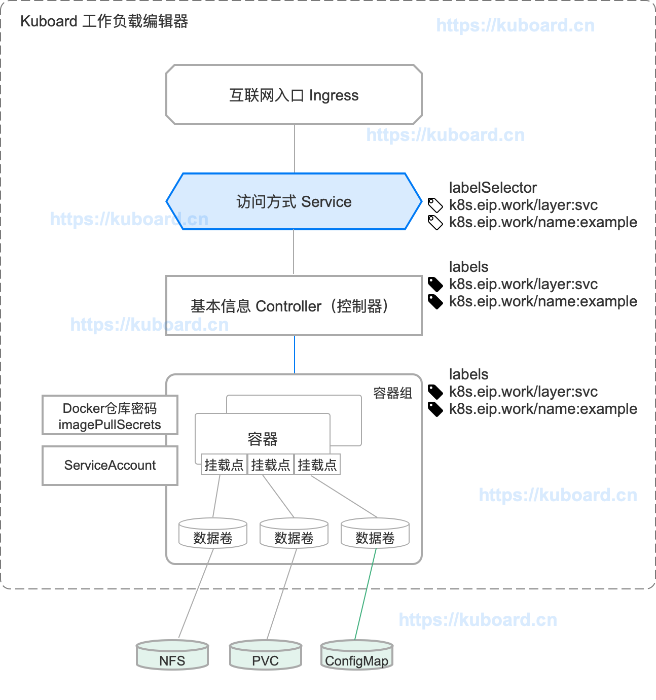
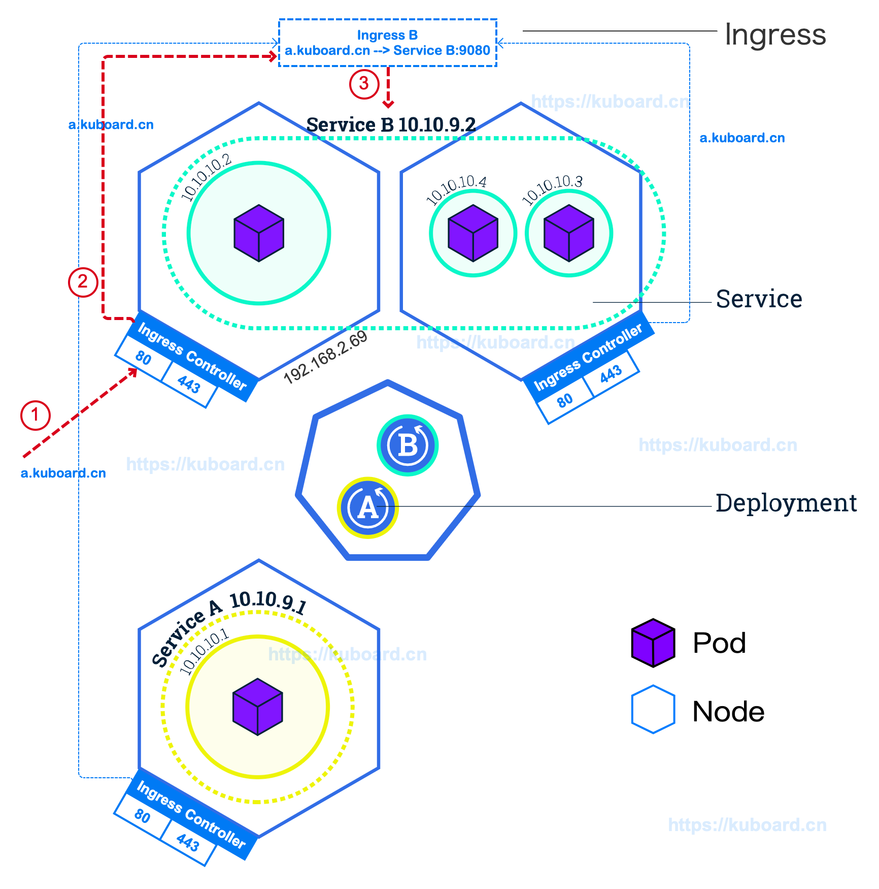
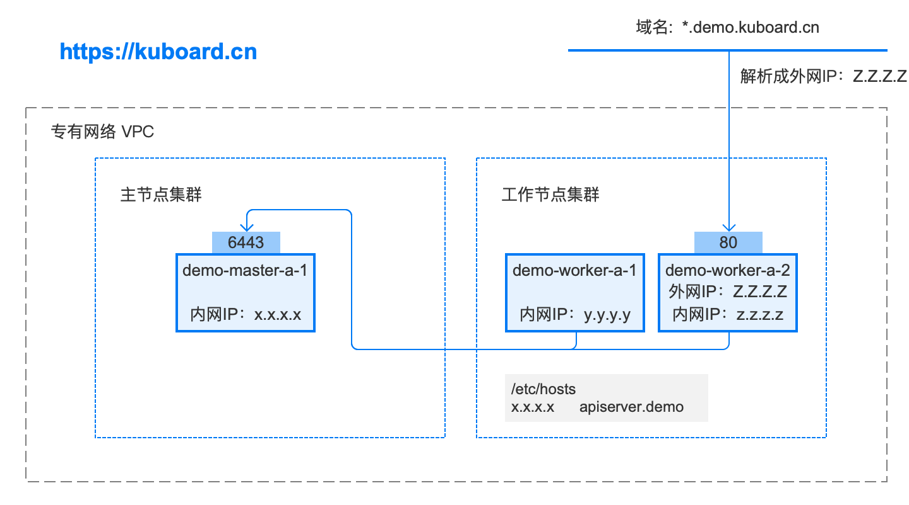
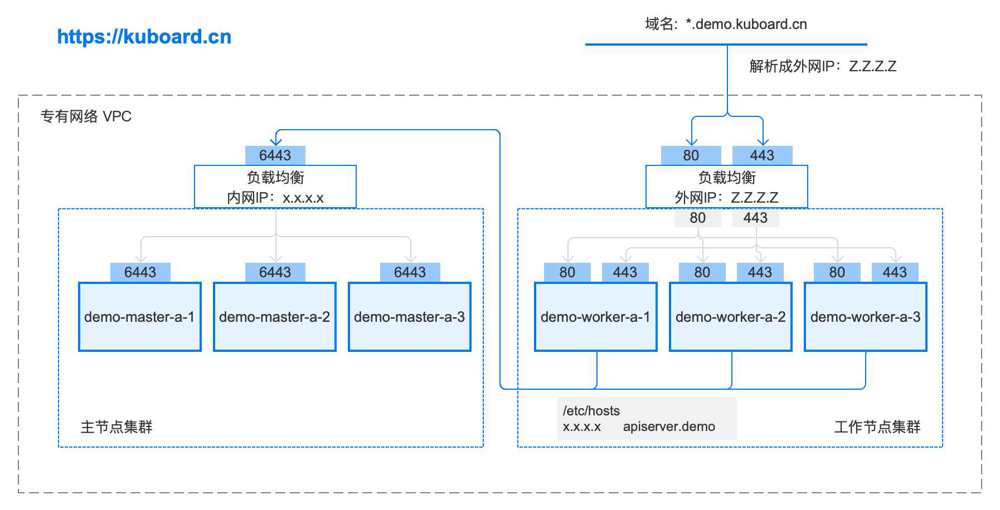

> 目录

[TOC]


推荐参考资料：

* [基于Docker和Kubernetes的最佳架构实践](http://dockone.io/article/3694)


# 1. Service概述


## 1.1. 为何需要 Service

Kubernetes 中 Pod 是随时可以消亡的（节点故障、容器内应用程序错误等原因）。如果使用 [Deployment](https://kuboard.cn/learning/k8s-intermediate/service/learning/k8s-intermediate/workload/wl-deployment/) 运行您的应用程序，Deployment 将会在 Pod 消亡后再创建一个新的 Pod 以维持所需要的副本数。每一个 Pod 有自己的 IP 地址，然而，对于 Deployment 而言，对应 Pod 集合是动态变化的。

这个现象导致了如下问题：

- 如果某些 Pod（假设是 'backends'）为另外一些 Pod（假设是 'frontends'）提供接口，在 'backends' 中的 Pod 集合不断变化（IP 地址也跟着变化）的情况下，'frontends' 中的 Pod 如何才能知道应该将请求发送到哪个 IP 地址？

Service 存在的意义，就是为了解决这个问题。


## 1.2 Kubernetes Service

Kubernetes 中 Service 是一个 API 对象，通过 kubectl + YAML ，定义一个 Service，可以将符合 Service 指定条件的 Pod 作为可通过网络访问的服务提供给服务调用者。

Service 是 Kubernetes 中的一种服务发现机制：

- Pod 有自己的 IP 地址
- Service 被赋予一个唯一的 dns name
- Service 通过 label selector 选定一组 Pod
- Service 实现负载均衡，可将请求均衡分发到选定这一组 Pod 中

例如，假设有一个无状态的图像处理后端程序运行了 3 个 Pod 副本。这些副本是相互可替代的（前端程序调用其中任何一个都可以）。在后端程序的副本集中的 Pod 经常变化（销毁、重建、扩容、缩容等）的情况下，前端程序不应该关注这些变化。

Kubernetes 通过引入 Service 的概念，将前端与后端解耦。


## 1.3 架构图

使用 Kubernetes 的最佳实践：

- Service 与 Controller 同名
- Service 与 Controller 使用相同的 label selector





# 2. Service详细描述


## 2.1 创建 Service

Kubernetes Servies 是一个 RESTFul 接口对象，可通过 yaml 文件创建。

> 例如，假设您有一组 Pod：

- 每个 Pod 都监听 9376 TCP 端口
- 每个 Pod 都有标签 app=MyApp

```yaml
apiVersion: v1
kind: Service
metadata:
  name: my-service
spec:
  selector:
    app: MyApp
  ports:
    - protocol: TCP
      # 这里可以定义name进行解耦
      port: 80  # service的端口
      targetPort: 9376 #pod的端口
```


> 上述 YAML 文件可用来创建一个 Service：

- 名字为 `my-service`
- 目标端口未 TCP 9376
- 选取所有包含标签 app=MyApp 的 Pod


>  关于 Service，您还需要了解：

- Kubernetes 将为该 Service 分配一个 IP 地址（ClusterIP 或 集群内 IP），供 Service Proxy 使用（参考[虚拟 IP 和 Service proxy](https://kuboard.cn/learning/k8s-intermediate/service/service-details.html#虚拟-ip-和-service-proxy)）
- Kubernetes 将不断扫描符合该 selector 的 Pod，并将最新的结果更新到与 Service 同名 `my-service` 的 Endpoint 对象中。
  - Service 从自己的 IP 地址和 `port` 端口接收请求，并将请求映射到符合条件的 Pod 的 `targetPort`。为了方便，默认 `targetPort`的取值 与 `port` 字段相同

- Pod 的定义中，Port 可能被赋予了一个名字，您可以在 Service 的 `targetPort` 字段引用这些名字，而不是直接写端口号。这种做法可以使得您在将来修改后端程序监听的端口号，而无需影响到前端程序。
- Service 的默认传输协议是 TCP，您也可以使用其他 [支持的传输协议](https://kuboard.cn/learning/k8s-intermediate/service/service-details.html#支持的传输协议)。
- Kubernetes Service 中，可以定义多个端口，不同的端口可以使用相同或不同的传输协议。


## 2.2 创建 Service（无 label selector）

主要为了指向外部的一个IP.

例如：

- 您想要在生产环境中使用一个 Kubernetes 外部的数据库集群，在测试环境中使用 Kubernetes 内部的 数据库
- 您想要将 Service 指向另一个名称空间中的 Service，或者另一个 Kubernetes 集群中的 Service
- 您正在将您的程序迁移到 Kubernetes，但是根据您的迁移路径，您只将一部分后端程序运行在 Kubernetes 中。其他的还运行在kubernetes以外

在上述这些情况下，您可以定义一个没有 Pod Selector 的 Service。例如：

```yaml
apiVersion: v1
kind: Service
metadata:
  name: my-service
spec:
  ports:
    - protocol: TCP
      port: 80
      targetPort: 9376
```

因为该 Service 没有 selector，相应的 Endpoint 对象就无法自动创建。您可以手动创建一个 Endpoint 对象，以便将该 Service 映射到后端服务真实的 IP 地址和端口：

```yaml
apiVersion: v1
kind: Endpoints
metadata:
  name: my-service
subsets:
  - addresses:
      - ip: 192.0.2.42
    ports:
      - port: 9376
```


> - Endpoint 中的 IP 地址不可以是 loopback（127.0.0.0/8 IPv4 或 ::1/128 IPv6），或 link-local（169.254.0.0/16 IPv4、224.0.0.0/24 IPv4 或 fe80::/64 IPv6）
> - Endpoint 中的 IP 地址不可以是集群中其他 Service 的 ClusterIP


对于 Service 的访问者来说，Service 是否有 label selector 都是一样的。在上述例子中，Service 将请求路由到 Endpoint 192.0.2.42:9376 (TCP)。

ExternalName Service 是一类特殊的没有 label selector 的 Service，该类 Service 使用 DNS 名字。参考 [ExternalName](https://kuboard.cn/learning/k8s-intermediate/service/service-details.html#externalname)


## 2.3 虚拟 IP 和服务代理

Kubernetes 集群中的每个节点都运行了一个 `kube-proxy`，负责为 Service（ExternalName 类型的除外）提供虚拟 IP 访问。


### 2.3.1 为何不使用 round-robin DNS

- 一直以来，DNS 软件都不确保严格检查 TTL（Time to live），并且在缓存的 dns 解析结果应该过期以后，仍然继续使用缓存中的记录
- 某些应用程序只做一次 DNS 解析，并一直使用缓存下来的解析结果
- 即使应用程序对 DNS 解析做了合适的处理，为 DNS 记录设置过短（或者 0）的 TTL 值，将给 DNS 服务器带来过大的负载


### 2.3.2 三种代理模式

Kubernetes 支持三种 proxy mode（代理模式），他们的版本兼容性如下：

| 代理模式              | Kubernetes 版本 | 是否默认 | 备注     |
| --------------------- | --------------- | -------- | -------- |
| User space proxy mode | v1.0 +          |          | 快废弃了 |
| Iptables proxy mode   | v1.1 +          | 默认     |          |
| Ipvs proxy mode       | v1.8 +          |          | 推荐使用 |


#### 2.3.2.1 IPVS 代理模式

**IPVS 模式的优点**

IPVS proxy mode 基于 netfilter 的 hook 功能，与 iptables 代理模式相似，但是 IPVS 代理模式使用 hash table 作为底层的数据结构，并在 kernel space 运作。这就意味着

- IPVS 代理模式可以比 iptables 代理模式有更低的网络延迟，在同步代理规则时，也有更高的效率
- 与 user space 代理模式 / iptables 代理模式相比，IPVS 模式可以支持更大的网络流量


> - 如果要使用 IPVS 模式，您必须在启动 kube-proxy 前为节点的 linux 启用 IPVS
> - kube-proxy 以 IPVS 模式启动时，如果发现节点的 linux 未启用 IPVS，则退回到 iptables 模式


### 2.3.3 代理模式总结

在所有的代理模式中，发送到 Service 的 IP:Port 的请求将被转发到一个合适的后端 Pod，而无需调用者知道任何关于 Kubernetes/Service/Pods 的细节。

Service 中额外字段的作用：

- ```
  service.spec.sessionAffinity
  ```

  - 默认值为 "None"
  - 如果设定为 "ClientIP"，则**同一个客户端的连接将始终被转发到同一个 Pod**

- ```
  service.spec.sessionAffinityConfig.clientIP.timeoutSeconds
  ```

  - 默认值为 10800 （3 小时）
  - 设定会话保持的持续时间


## 2.4 多端口的Service

Kubernetes 中，您可以在一个 Service 对象中定义多个端口，此时，您必须为每个端口定义一个名字。如下所示：

```yaml
apiVersion: v1
kind: Service
metadata:
  name: my-service
spec:
  selector:
    app: MyApp
  ports:
    - name: http
      protocol: TCP
      port: 80
      targetPort: 9376
    - name: https
      protocol: TCP
      port: 443
      targetPort: 9377
```

>端口的名字必须符合 Kubernetes 的命名规则，且，端口的名字只能包含小写字母、数字、`-`，并且必须以数字或字母作为开头及结尾。
>
>例如：
>
>合法的 Port 名称：`123-abc`、`web`
>
>非法的 Port 名称：`123_abc`、`-web`


## 2.5 使用自定义的 IP 地址

创建 Service 时，如果指定 `.spec.clusterIP` 字段，可以使用自定义的 Cluster IP 地址。该 IP 地址必须是 APIServer 中配置字段 `service-cluster-ip-range` CIDR 范围内的合法 IPv4 或 IPv6 地址，否则不能创建成功。

可能用到自定义 IP 地址的场景：

- 想要重用某个已经存在的 DNS 条目
- 遗留系统是通过 IP 地址寻址，且很难改造


## 2.6 服务发现

Kubernetes 支持两种主要的服务发现模式：

- 环境变量
- DNS


### 2.6.1 环境变量

kubelet 查找有效的 Service，并针对每一个 Service，向其所在节点上的 **Pod 注入一组环境变量**。支持的环境变量有：

- [Docker links 兼容](https://docs.docker.com/network/links/) 的环境变量
- {SVCNAME}_SERVICE_HOST 和 {SVCNAME}_SERVICE_PORT
  - Service name 被转换为大写
  - 小数点 `.` 被转换为下划线 `_`

例如，Service `redis-master` 暴露 TCP 端口 6379，其 Cluster IP 为 10.0.0.11，对应的环境变量如下所示：

```
REDIS_MASTER_SERVICE_HOST=10.0.0.11
REDIS_MASTER_SERVICE_PORT=6379
REDIS_MASTER_PORT=tcp://10.0.0.11:6379
REDIS_MASTER_PORT_6379_TCP=tcp://10.0.0.11:6379
REDIS_MASTER_PORT_6379_TCP_PROTO=tcp
REDIS_MASTER_PORT_6379_TCP_PORT=6379
REDIS_MASTER_PORT_6379_TCP_ADDR=10.0.0.11
```


**环境变量的局限**

>如果要在 Pod 中使用基于环境变量的服务发现方式，必须先创建 Service，再创建调用 Service 的 Pod。否则，Pod 中不会有该 Service 对应的环境变量。
>
>如果使用基于 DNS 的服务发现，您无需担心这个创建顺序的问题


### 2.6.2 DNS

如果按照 www.kuboard.cn 上的文档安装 Kubernetes，默认已经安装了 DNS 服务，[Core DNS](https://coredns.io/)。

CoreDNS 监听 Kubernetes API 上创建和删除 Service 的事件，并为每一个 Service 创建一条 DNS 记录。集群中所有的 Pod 都可以使用 DNS Name 解析到 Service 的 IP 地址。

例如，名称空间 `my-ns` 中的 Service `my-service`，将对应一条 DNS 记录 `my-service.my-ns`。 

名称空间 `my-ns` 中的Pod可以直接 `nslookup my-service` （`my-service.my-ns` 也可以）。

其他名称空间的 Pod 必须使用 `my-service.my-ns`。`my-service` 和 `my-service.my-ns` 都将被解析到 Service 的 Cluster IP。

Kubernetes 同样支持 DNS SRV（Service）记录，用于查找一个命名的端口。假设 `my-service.my-ns` Service 有一个 TCP 端口名为 `http`，则，您可以 `nslookup _http._tcp.my-service.my-ns` 以发现该Service 的 IP 地址及端口 `http`

对于 `ExternalName` 类型的 Service，只能通过 DNS 的方式进行服务发现。参考 [Service/Pod 的 DNS](https://kuboard.cn/learning/k8s-intermediate/service/dns.html)

```shell
# 本namespace
nslookup my-service

# 发现该Service 的 IP 地址及端口
nslookup _http._tcp.my-service.my-ns
```


## 2.7 无头Services

用于自己开发负载均衡策略


“Headless” Service 不提供负载均衡的特性，也没有自己的 IP 地址。创建 “headless” Service 时，只需要指定 `.spec.clusterIP` 为 "None"。


**“Headless” Service 可以用于对接其他形式的服务发现机制，而无需与 Kubernetes 的实现绑定。**

因为没有ClusterIP，kube-proxy 并不处理此类服务，因为没有load balancing或 proxy 代理设置，在访问服务的时候回返回后端的全部的Pods IP地址，**主要用于开发者自己根据pods进行负载均衡器的开发**(设置了selector)。


对于 “Headless” Service 而言：

- 没有 Cluster IP
- kube-proxy 不处理这类 Service
- Kubernetes不提供负载均衡或代理支持


DNS 的配置方式取决于该 Service 是否配置了 selector：

- 配置了 Selector

  Endpoints Controller 创建 `Endpoints` 记录，并修改 DNS 配置，使其直接返回指向 selector 选取的 Pod 的 IP 地址

- 没有配置 Selector

  Endpoints Controller 不创建 `Endpoints` 记录。DNS服务返回如下结果中的一种：

  - 对 ExternalName 类型的 Service，返回 CNAME 记录
  - 对于其他类型的 Service，返回与 Service 同名的 `Endpoints` 的 A 记录


## 2.8 虚拟 IP 的实现

如果只是想要正确使用 Service，不急于理解 Service 的实现细节，您无需阅读本章节。

### 2.8.1 避免冲突

Kubernetes 的一个设计哲学是：尽量避免非人为错误产生的可能性。就设计 Service 而言，Kubernetes 应该将您选择的端口号与其他人选择的端口号隔离开。为此，Kubernetes 为每一个 Service 分配一个该 Service 专属的 IP 地址。

为了确保每个 Service 都有一个唯一的 IP 地址，kubernetes 在创建 Service 之前，先更新 etcd 中的一个全局分配表，如果更新失败（例如 IP 地址已被其他 Service 占用），则 Service 不能成功创建。

Kubernetes 使用一个后台控制器检查该全局分配表中的 IP 地址的分配是否仍然有效，并且自动清理不再被 Service 使用的 IP 地址。

### 2.8.2 Service 的 IP 地址

Pod 的 IP 地址路由到一个确定的目标，然而 Service 的 IP 地址则不同，通常背后并不对应一个唯一的目标。 kube-proxy 使用 iptables （Linux 中的报文处理逻辑）来定义虚拟 IP 地址。当客户端连接到该虚拟 IP 地址时，它们的网络请求将自动发送到一个合适的 Endpoint。Service 对应的环境变量和 DNS 实际上反应的是 Service 的虚拟 IP 地址（和端口）。

> 有三种模式

* Userspace  不推荐
* iptables  默认，不是最好的
* IPVS   推荐

在一个大型集群中（例如，存在 10000 个 Service）iptables 的操作将显著变慢。IPVS 的设计是基于 in-kernel hash table 执行负载均衡。因此，使用 IPVS 的 kube-proxy 在 Service 数量较多的情况下仍然能够保持好的性能。同时，基于 IPVS 的 kube-proxy 可以使用更复杂的负载均衡算法（最少连接数、基于地址的、基于权重的等）


## 2.9 支持的传输协议

* TCP
  * 默认值。任何类型的 Service 都支持 TCP 协议。
* UDP
  * 大多数 Service 都支持 UDP 协议。对于 LoadBalancer 类型的 Service，是否支持 UDP 取决于云供应商是否支持该特性。
* HTTP
  * 如果您的云服务商支持，您可以使用 LoadBalancer 类型的 Service 设定一个 Kubernetes 外部的 HTTP/HTTPS 反向代理，将请求转发到 Service 的 Endpoints。
  * 需要使用`Ingress`
* Proxy Protocol 
  * 如果您的云服务上支持（例如 AWS），您可以使用 LoadBalancer 类型的 Service 设定一个 Kubernetes 外部的负载均衡器，并将连接已 PROXY 协议转发到 Service 的 Endpoints。
* SCTP
  * 尚处于 `alpha` 阶段，暂不推荐使用。


# 3. 发布Service的类型选择

Kubernetes Service 支持的不同访问方式。

Kubernetes 中可以通过不同方式发布 Service，通过 `ServiceType` 字段指定，该字段的默认值是 `ClusterIP`，可选值有：

- **ClusterIP**:  默认值。通过集群内部的一个 IP 地址暴露 Service，只在集群内部可以访问

- **NodePort**:  通过每一个节点上的的静态端口（NodePort）暴露 Service，同时自动创建 ClusterIP 类型的访问方式

  - 在集群内部通过 $(ClusterIP): $(Port) 访问
  - 在集群外部通过 $(NodeIP): $(NodePort) 访问

- **LoadBalancer**:  通过云服务供应商（AWS、Azure、GCE 等）的负载均衡器在集群外部暴露 Service，同时自动创建 NodePort 和 ClusterIP 类型的访问方式

  - 在集群内部通过 $(ClusterIP): $(Port) 访问
  - 在集群外部通过 $(NodeIP): $(NodePort) 访问
  - 在集群外部通过 $(LoadBalancerIP): $(Port) 访问

- **ExternalName**: Kuboard 暂不支持 将 Service 映射到 `externalName` 指定的地址（例如：foo.bar.example.com），返回值是一个 CNAME 记录。不使用任何代理机制。

  

## 3.1 ClusterIP

ClusterIP 是 ServiceType 的默认值。在 [Iptables 代理模式](https://kuboard.cn/learning/k8s-intermediate/service/service-details.html#iptables-代理模式) 中，详细讲述了 ClusterIP 类型 Service 的工作原理。


## 3.2 NodePort

> 基本功能

* 对于同一 Service，在每个节点上的节点端口都相同
  * 您可以通过 `nodePort` 字段指定节点端口号，但不能重复，也必须在范围内
* 该端口的范围 ,默认是：30000-32767
* 节点将该端口上的网络请求转发到对应的 Service 上。
* 在启动 kube-proxy 时使用参数 `--nodeport-address` 可指定阶段端口可以绑定的 IP 地址段。该参数接收以逗号分隔的 CIDR 作为参数值（例如：10.0.0.0/8,192.0.2.0/25），kube-proxy 将查找本机符合该 CIDR 的 IP 地址，并将节点端口绑定到符合的 IP 地址上。


> 使用 NodePort，您可以：

- 根据自己的需要配置负载均衡器
- 配置 Kubernetes / 非 Kubernetes 的混合环境
- 直接暴露一到多个节点的 IP 地址，以便客户端可访问 Kubernetes 中的 Service


> NodePort 类型的 Service 可通过如下方式访问：

- 在集群内部通过 $(ClusterIP): $(Port) 访问
- 在集群外部通过 $(NodeIP): $(NodePort) 访问


## 3.3 LoadBalancer

在支持外部负载均衡器的云环境中（例如 GCE、AWS、Azure 等），将 `.spec.type` 字段设置为 `LoadBalancer`，Kubernetes 将为该Service 自动创建一个负载均衡器。负载均衡器的创建操作异步完成，您可能要稍等片刻才能真正完成创建，负载均衡器的信息将被回写到 Service 的 `.status.loadBalancer` 字段。如下所示：

```yaml
apiVersion: v1
kind: Service
metadata:
  name: my-service
spec:
  selector:
    app: MyApp
  ports:
    - protocol: TCP
      port: 80
      targetPort: 9376
  clusterIP: 10.0.171.239
  loadBalancerIP: 78.11.24.19
  type: LoadBalancer
status:
  loadBalancer:
    ingress:
      - ip: 146.148.47.155
```

发送到外部负载均衡器的网络请求就像被转发到 Kubernetes 中的后端 Pod 上。负载均衡的实现细节由各云服务上确定。

关于更多 LoadBalancer Service 相关的描述，请参考 [Type LoadBalancer](https://kubernetes.io/docs/concepts/services-networking/service/#loadbalancer) 和您所使用的云供应商的文档


## 3.4 ExternalName

ExternalName 类型的 Service 映射到一个外部的 DNS name，而不是一个 pod label selector。可通过 `spec.externalName` 字段指定外部 DNS name。

下面的例子中，名称空间 `prod` 中的 Service `my-service` 将映射到 `my.database.example.com`：

```yaml
apiVersion: v1
kind: Service
metadata:
  name: my-service
  namespace: prod
spec:
  type: ExternalName
  externalName: my.database.example.com
```


测试一下，看看返回值

```shell
#集群的 DNS 服务将返回一个 CNAME 记录，其对应的值为 my.database.example.com
$ nslookup my-service.prod.svc.cluster.local
```


访问 `my-service` 与访问其他类型的 Service 相比，网络请求的转发发生在 DNS level，而不是使用 proxy。如果您在后续想要将 `my.database.example.com` 对应的数据库迁移到集群内部来，您可以按如下步骤进行：

1. 在 Kubernetes 中部署数据库（并启动数据库的 Pod）
2. 为 Service 添加合适的 selector 和 endpoint
3. 修改 Service 的类型

> 注意事项
>
> - ExternalName 可以接受一个 IPv4 地址型的字符串作为 `.spec.externalName` 的值，但是这个字符串将被认为是一个由数字组成的 DNS name，而不是一个 IP 地址。
> - 如果要 必须写 一个 IP 地址，请考虑使用 [headless Service](https://kuboard.cn/learning/k8s-intermediate/service/service-details.html#headless-services)


## 3.5 External IP

如果有外部 IP 路由到 Kubernetes 集群的一个或多个节点，Kubernetes Service 可以通过这些 `externalIPs` 进行访问。`externalIP` 需要由集群管理员在 Kubernetes 之外配置。

在 Service 的定义中， `externalIPs` 可以和任何类型的 `.spec.type` 一通使用。在下面的例子中，客户端可通过 `80.11.12.10:80`（externalIP:port） 访问`my-service`

```yaml
apiVersion: v1
kind: Service
metadata:
  name: my-service
spec:
  selector:
    app: MyApp
  ports:
    - name: http
      protocol: TCP
      port: 80
      targetPort: 9376
  externalIPs:
    - 80.11.12.10
```

注：自己的理解 `将一个外部地址，不指向外部了，指向内部的的pod`


#  4. Service/Pod的DNS

本文介绍了 Kubernetes 中的 DNS 分配方式

## 4.1 概述

集群中的每一个 Service（包括 DNS 服务本身）都将被分配一个 DNS name。例如：

> 假设名称空间 `bar` 中有一个 Service 名为 `foo`：

- 名称空间 `bar` 中的 Pod 可以通过 `nslookup foo` 查找到该 Service

- 名称空间 `quux` 中的 Pod 可以通过 `nslookup foo.bar` 查找到该 Service

  

参考此文档可以查看最新的规范 [Kubernetes DNS-Based Service Discovery](https://github.com/kubernetes/dns/blob/master/docs/specification.md)

## 4.2. Services

### 4.2.1 A 记录

- Service（headless Service 除外）将被分配一个 DNS A 记录，格式为 `my-svc.my-namespace.svc.cluster-domain.example`。该 DNS 记录解析到 Service 的 ClusterIP。
- Headless Service（没有 ClusterIP）也将被分配一个 DNS A 记录，格式为 `my-svc.my-namespace.svc.cluster-domain.exmaple`。该 DNS 记录解析到 Service 所选中的一组 Pod 的 IP 地址的集合。调用者应该使用该 IP 地址集合，或者按照轮询（round-robin）的方式从集合中选择一个 IP 地址使用。

### 4.2.2 SRV 记录

Service（含 headless Service）的命名端口（有 name 的端口）将被分配一个 SRV 记录，其格式为 `_my-port-name._my-port-protocol.my-svc.my-namespace.svc.cluster-domain.example`：

- 对于一个普通 Service（非 headless Service），该 SRV 记录解析到其端口号和域名 `my-svc.my-namespace.svc.cluster-domain.exmaple`
- 对于一个 Headless Service，该 SRV 记录解析到多个结果：每一个结果都对应该 Service 的一个后端 Pod，包含其端口号和 Pod 的域名 `auto-generated-pod-name.my-svc.my-namespace.svc.cluster-domain.exmaple`

## 4.3 Pods

### 4.3.1 设置 Pod 主机名

Pod 的 hostname / subdomain

* **hostname**

Kubernetes 在创建 Pod 时，将 Pod 定义中的 `metadata.name` 的值作为 Pod 实例的 hostname。

Pod 定义中有一个可选字段 `spec.hostname` 可用来直接指定 Pod 的 hostname。例如，某 Pod 的 `spec.hostname` 字段被设置为 `my-host`，则该 Pod 创建后 hostname 将被设为 `my-host`

* **域名类型的hostname**-subdomain

Pod 定义中还有一个可选字段 `spec.subdomain` 可用来指定 Pod 的 subdomain。例如，名称空间 `my-namespace` 中，某 Pod 的 hostname 为 `foo`，并且 subdomain 为 `bar`，则该 Pod 的完整域名（FQDN）为 `foo.bar.my-namespace.svc.cluster-domain.example`。


```yaml
apiVersion: v1
kind: Service
metadata:
  name: default-subdomain
spec:
  selector:
    name: busybox
  clusterIP: None
  ports:
  - name: foo # Actually, no port is needed.
    port: 1234
    targetPort: 1234
---
apiVersion: v1
kind: Pod
metadata:
  name: busybox1
  labels:
    name: busybox
spec:
  hostname: busybox-1
  subdomain: default-subdomain
  containers:
  - image: busybox:1.28
    command:
      - sleep
      - "3600"
    name: busybox
---
apiVersion: v1
kind: Pod
metadata:
  name: busybox2
  labels:
    name: busybox
spec:
  hostname: busybox-2
  subdomain: default-subdomain
  containers:
  - image: busybox:1.28
    command:
      - sleep
      - "3600"
    name: busybox
```

上面 yaml 文件中的 Pod `busybox1` 和 `busybox2` 都将有各自的 A 记录

> 备注
>
> - A 记录不是根据 Pod name 创建的，而是根据 hostname 创建的。如果一个 Pod 没有 hostname 只有 subdomain，则 Kubernetes 将只为其 headless Service 创建一个 A 记录 `default-subdomain.my-namespace.svc.cluster-domain.example`，该记录指向 Pod 的 IP 地址。
> - Pod 必须达到就绪状态才可以拥有 A 记录，除非 Service 的字段 `spec.publishNotReadyAddresses` 被设置为 `True`


### 4.3.2 Pod DNS设置规则

可以为每一个 Pod 设置其自己的 DNS Policy。Kubernetes 通过 Pod 定义中的 `spec.dnsPolicy` 字段设置 DNS Policy，可选的值有：

- **Default**： Pod 从其所在的节点继承域名解析配置。更多细节请参考 [Customizing DNS Service ](https://kubernetes.io/docs/tasks/administer-cluster/dns-custom-nameservers/#inheriting-dns-from-the-node)
- **ClusterFirst**：任何与集群域名后缀（例如 `www.kubernetes.io`）不匹配的 DNS 查询，都将被转发到 Pod 所在节点的上游 DNS 服务。集群管理员可能配置了额外的 stub-domain 及上游 DNS 服务，更多细节请参考 [Customizing DNS Service ](https://kubernetes.io/docs/tasks/administer-cluster/dns-custom-nameservers/#effects-on-pods)
- **ClusterFirstWithHostNet**： 对于运行在节点网络上的 Pod，其 dnsPolicy 必须指定为 `ClusterFirstWithHostNet`
- **None**： 允许 Pod 忽略 Kubernetes 环境中的 DNS 设置。此时，该 Pod 的 DNS 的所有设置必须通过 `spce.dnsConfig` 指定。 参考 [Pod 的 DNS 配置](https://kuboard.cn/learning/k8s-intermediate/service/dns.html#pod-的-dns-配置)


> dnsPolicy的默认值
>
> **“Default”** 并非是默认的 DNS Policy。如果 `spec.dnsPolicy` 字段未指定，则 **“ClusterFirst”** 将被默认使用


下面的例子中的 Pod，其 DNS Policy 必须设置为 **“ClusterFirstWithHostNet”**，因为它的 `hostNetwork` 字段为 `true`

```yaml
apiVersion: v1
kind: Pod
metadata:
  name: busybox
  namespace: default
spec:
  containers:
  - image: busybox:1.28
    command:
      - sleep
      - "3600"
    imagePullPolicy: IfNotPresent
    name: busybox
  restartPolicy: Always
  hostNetwork: true     # 必须设置成true,因为dnsPolicy被设置成ClusterFirstWithHostNet
  dnsPolicy: ClusterFirstWithHostNet # 对于运行在节点网络上的 Pod，其 dnsPolicy 必须指定为
```


### 4.3.3 配置Pod DNS 

在 Kubernetes 中，您可以直接配置 Pod 的 DNS 设置。

Pod 定义中的 `spec.dnsConfig` 是可选字段，且可以与任何类型的 `spec.dnsPolicy` 配合使用。如果 `spec.dnsPolicy` 被设置为 **“None”**，则 `spec.dnsConfig` 必须被指定。

`spec.dnsConfig` 中有如下字段可以配置：

- **nameservers**： Pod 的 DNS Server IP 地址列表。最多可以执行 3 个 IP 地址。当 `spec.dnsPolicy` 为 **“None”**，至少需要指定一个 IP 地址，其他情况下该字段是可选的。DNS Server 的 IP 地址列表将会与 DNS Policy 所产生的 DNS Server 地址列表合并（重复的条目被去除）。
- **searches**：Pod 中执行域名查询时搜索域的列表。该字段是可选的。如果指定了该字段，则指定的搜索域列表将与 DNS Policy 所产生的搜索域列表合并（重复的条目被去除）。合并后的列表最多不超过 6 个域。
- **options**：可选数组，其中每个元素由 **name** 字段（必填）和 **value** 字段（选填）组成。该列表中的内容将与 DNS Policy 所产生的 DNS 选项合并（重复的条目被去除）


```yaml
apiVersion: v1
kind: Pod
metadata:
  namespace: default
  name: dns-example
spec:
  containers:
    - name: test
      image: nginx
  dnsPolicy: "None"
  dnsConfig:
    nameservers:
      - 1.2.3.4
    searches:
      - ns1.svc.cluster-domain.example
      - my.dns.search.suffix
    options:
      - name: ndots
        value: "2"
      - name: edns0
```

上述 Pod 创建后，容器 `test` 的 `etc/resolv.conf` 文件如下所示（从 `spec.dnsConfig` 的配置产生），执行命令 `kubectl exec -it dns-example -- cat /etc/resolv.conf` 可查看该文件内容：

```
nameserver 1.2.3.4
search ns1.svc.cluster-domain.example my.dns.search.suffix
options ndots:2 edns0
```

如果集群使用的是 IPv6，执行命令 `kubectl exec -it dns-example -- cat /etc/resolv.conf` 的输出结果如下所示：

```
nameserver fd00:79:30::a
search default.svc.cluster-domain.example svc.cluster-domain.example cluster-domain.example
options ndots:5
```


# 5 Service应用例子


## 5.1 Kubernetes 的网络模型

> docker 局限

通常，Docker 使用一种 `host-private` 的联网方式，在此情况下，只有两个容器都在同一个节点（主机）上时，一个容器才可以通过网络连接另一个容器。为了使 Docker 容器可以跨节点通信，必须在宿主节点（主机）的 IP 地址上分配端口，并将该端口接收到的网络请求转发（或代理）到容器中。这意味着，用户必须非常小心地为容器分配宿主节点（主机）的端口号，或者端口号可以自动分配。


> kuberketes的优化

在一个集群中，多个开发者之间协调分配端口号是非常困难的。Kubernetes 认为集群中的两个 Pod 应该能够互相通信，无论他们各自在哪个节点上。每一个 Pod 都被分配自己的 **“cluster-private-IP”**，因此，您无需在 Pod 间建立连接，或者将容器的端口映射到宿主机的端口。因此：

- Pod 中的任意容器可以使用 localhost 直连同 Pod 中另一个容器的端口
- 集群中的任意 Pod 可以使用另一的 Pod 的 **cluster-private-IP** 直连对方的端口，（无需 NAT 映射）


本文档的后续章节使用了一个 nginx server 的例子，详细阐述了如何使用这种网络模型发布 Service。


## 5.2 创建 Pod


> * 创建文件 `run-my-nginx.yaml`，文件内容如下

请留意该 Pod 指定了一个 containerPort

```yaml
apiVersion: apps/v1
kind: Deployment
metadata:
  name: my-nginx
spec:
  selector:
    matchLabels:
      run: my-nginx
  replicas: 2
  template:
    metadata:
      labels:
        run: my-nginx
    spec:
      containers:
      - name: my-nginx
        image: nginx
        ports:
        - containerPort: 80
```


> - 执行以下命令，部署 Pod 并检查运行情况：


```shell
kubectl apply -f ./run-my-nginx.yaml
kubectl get pods -l run=my-nginx -o wide

#检查 Pod 的 IP 地址
kubectl get pods -l run=my-nginx -o yaml | grep podIP
# 输出结果如下：
# podIP: 10.244.3.4
# podIP: 10.244.2.5

# 在集群中的任意节点上,获得 nginx 的响应
curl 10.244.3.4
curl 10.244.2.5

```

在集群中的任意节点上，您可以执行 `curl 10.244.3.4` 或 `curl 10.244.2.5` 获得 nginx 的响应。此时：

- 容器并没有使用节点上的 80 端口
- 没有使用 NAT 规则对容器端口进行映射

这意味着，您可以

- 在同一节点上使用 80 端口运行多个 nginx Pod
- 在集群的任意节点/Pod 上使用 nginx Pod 的 clusterIP 访问 nginx 的 80 端口


> nodePort的概念
>
> 同 Docker 一样，Kubernets 中，仍然可以将 Pod 的端口映射到宿主节点的网络地址上（使用 nodePort），但是使用 Kubernetes 的网络模型时，这类需求已经大大减少了。
>
> 如果对该网络模型的实现细节感兴趣，请参考 [Cluster Networking](https://kubernetes.io/docs/concepts/cluster-administration/networking/)


## 5.3 创建 Service

Service 是为了解决pod增加删除后，ip地址变化的情况。

Kubernetes Service：

- 定义了集群中一组 Pod 的逻辑集合，该集合中的 Pod 提供了相同的功能
- 被创建后，获得一个唯一的 IP 地址（ClusterIP）。直到该 Service 被删除，此地址不会发生改变
- Pod 可以直接连接 Service IP 地址上的端口，且发送到该 IP 地址的网络请求被自动负载均衡分发到 Service 所选取的 Pod 集合中


#### 5.3.1 通过命令从Pod创建

```shell
#执行命令 kubectl expose deployment/my-nginx 可以为上面的两个 nginx Pod 创建 Service
kubectl expose deployment/my-nginx

#输出结果如下所示
#service/my-nginx exposed
```

该命令等价于 `kubectl apply -f nginx-svc.yaml`，其中 nginx-svc.yaml 文件的内容如下所示：


#### 5.3.2 通过yaml文件建立

nginx-svc.yaml 文件

```yaml
apiVersion: v1
kind: Service
metadata:
  name: my-nginx
  labels:
    run: my-nginx
spec:
  ports:
  - port: 80
    targetPort: 80
    protocol: TCP
  selector:
    run: my-nginx
```

该 yaml 文件将创建一个 Service：

- 该 Service 通过 label selector 选取包含 `run: my-nginx` 标签的 Pod 作为后端 Pod
- 该 Service 暴露一个端口 80（`spec.ports[*].port`）
- 该 Service 将 80 端口上接收到的网络请求转发到后端 Pod 的 80 （`spec.ports[*].targetPort`）端口上，支持负载均衡


#### 5.3.3 测试service

```shell
kubectl get svc my-nginx

# 查看详细，并注意Endpoints 中的 IP 地址与上面获得的 Pod 地址相同
kubectl describe svc my-nginx

# 得到ENDPOINTS
kubectl get ep my-nginx


```


> 执行命令 `kubectl get svc my-nginx`，输出结果如下所示：

```text
NAME       TYPE        CLUSTER-IP     EXTERNAL-IP   PORT(S)   AGE
my-nginx   ClusterIP   10.0.162.149   <none>        80/TCP    21s
```

Service 的后端 Pod 实际上通过 `Endpoints` 来暴露。Kubernetes 会持续检查 Service 的 label selector `spec.selector`，并将符合条件的 Pod 更新到与 Service 同名（my-nginx）的 Endpoints 对象。如果 Pod 终止了，该 Pod 将被自动从 Endpoints 中移除，新建的 Pod 将自动被添加到该 Endpoint。


> 执行命令 `kubectl describe svc my-nginx`，输出结果如下，请注意 Endpoints 中的 IP 地址与上面获得的 Pod 地址相同：

```text
Name:                my-nginx
Namespace:           default
Labels:              run=my-nginx
Annotations:         <none>
Selector:            run=my-nginx
Type:                ClusterIP
IP:                  10.0.162.149
Port:                <unset> 80/TCP
Endpoints:           10.244.2.5:80,10.244.3.4:80
Session Affinity:    None
Events:              <none>
```


>  执行命令 `kubectl get ep my-nginx`，输出结果如下：

```text
NAME       ENDPOINTS                     AGE
my-nginx   10.244.2.5:80,10.244.3.4:80   1m
```

此时，您可以在集群的任意节点上执行 `curl 10.0.162.149:80`，通过 Service 的 ClusterIP:Port 访问 nginx。


Service 的 IP 地址是虚拟地址。请参考 [2.8 虚拟 IP 的实现](#2.8 虚拟 IP 的实现)


## 5.4 访问 Service

Kubernetes 支持两种方式发现服务：

- 环境变量 参考 [2.6.1 环境变量](#2.6.1 环境变量)
- DNS 参考 [2.6.2 DNS](#2.6.2 DNS)


> 由于如下原因，您可能不想激活 Service 的环境变量发现机制：
>
> - 可能与应用程序的环境变量冲突
> - 太多的环境变量
> - 只想使用 DNS 等
>
> 您可以在 Pod 的定义中，将 `enableServiceLinks` 标记设置为 `false`


### 5.4.1 环境变量

**环境变量有一个缺点，就是如果先建立pos后建立service，那么无法引用**

下面演示一下

```shell
# PodName需要修改，看某个pod的环境变量，没有被正确设置
kubectl exec my-nginx-3800858182-jr4a2 -- printenv | grep SERVICE

# 删除 Pod
kubectl get pods -l run=my-nginx

# 查看新的Pod
kubectl get pods -l run=my-nginx -o wide

# PodName需要修改，再看环境变量，这时候环境变量被修改
kubectl exec my-nginx-3800858182-e9ihh -- printenv | grep SERVICE
```


示例：环境变量输出的结果

> 第一个次输出结果

```
KUBERNETES_SERVICE_HOST=10.0.0.1
KUBERNETES_SERVICE_PORT=443
KUBERNETES_SERVICE_PORT_HTTPS=443
```

> 第二个次输出结果

```
KUBERNETES_SERVICE_PORT=443
MY_NGINX_SERVICE_HOST=10.0.162.149
KUBERNETES_SERVICE_HOST=10.0.0.1
MY_NGINX_SERVICE_PORT=80
KUBERNETES_SERVICE_PORT_HTTPS=443
```


### 5.4.2 DNS

Kubernetes 提供了一个 DNS cluster addon，可自动为 Service 分配 DNS name。如果您参考 www.kuboard.cn 上的文档安装 Kubernetes 集群，则该 addon 已经默认安装。


> 查看是否安装了DNS cluster addon

```shell
kubectl get services kube-dns --namespace=kube-system
```

显示

```
NAME       TYPE        CLUSTER-IP   EXTERNAL-IP   PORT(S)         AGE
kube-dns   ClusterIP   10.0.0.10    <none>        53/UDP,53/TCP   8m
```


> 访问servie

此时，您可以从集群中任何 Pod 中按 Service 的名称访问该 Service。

```shell
# 获得一个临时终端，可以使用-rm 用完后，就删除
kubectl run curl --image=radial/busyboxplus:curl -i --tty

# DNS 查询
> nslookup my-nginx

#获得 Nginx 的响应
> curl my-nginx:80

#退出该容器的命令行
> exit

#删除刚才创建的 curl 测试容器
kubectl delete deployment curl
```


## 5.5 配置Service Https

> 在实践中，可以做一个统一的接口service，只用来做端口转发，这样简单点。


到目前为止，我们只是从集群内部访问了 nginx server。在将该 Service 公布到互联网时，您可能需要确保该通信渠道是安全的。为此，您必须：

- 准备 https 证书（购买，或者自签名）
- 将该 nginx 服务配置好，并使用该 https 证书
- 配置 Secret，以使得其他 Pod 可以使用该证书


### 5.5.1 准备 https 证书

```shell
# 创建密钥对
openssl req -x509 -nodes -days 365 -newkey rsa:2048 -keyout /d/tmp/nginx.key -out /d/tmp/nginx.crt -subj "/CN=my-nginx/O=my-nginx"

# 将密钥对转换为 base64 编码
cat /d/tmp/nginx.crt | base64
cat /d/tmp/nginx.key | base64

#创建一个如下格式的 nginxsecrets.yaml 文件，使用前面命令输出的 base64 编码替换其中的内容（base64编码内容不能换行）
vi nginxsecrets.yaml

#使用该文件创建 Secrets
# 创建 Secrets
kubectl apply -f nginxsecrets.yaml

# 查看 Secrets
kubectl get secrets
#输出结果为：
#NAME                  TYPE                                  DATA      AGE
#default-token-il9rc   kubernetes.io/service-account-token   1         1d
#nginxsecret           Opaque                                2         1m


```

> nginxsecrets.yaml 例子

```yaml
apiVersion: "v1"
kind: "Secret"
metadata:
  name: "nginxsecret"
  namespace: "default"
data:
  nginx.crt: "LS0tLS1CRUdJTi..."
  nginx.key: "LS0tLS1CRUdJTiBQUkl....."
```


### 5.5.2 修改 nginx 部署yaml文件

修改 nginx 部署，使 nginx 使用 Secrets 中的 https 证书，修改 Service，使其暴露 80 端口和 44额端口。nginx-secure-app.yaml 文件如下所示：

```yaml
apiVersion: v1
kind: Service
metadata:
  name: my-nginx
  labels:
    run: my-nginx
spec:
  type: NodePort
  ports:
  - port: 8080 # 修改
    targetPort: 80  # 修改
    protocol: TCP
    name: http
  - port: 443 # 修改
    protocol: TCP
    name: https
  selector:
    run: my-nginx
---
apiVersion: apps/v1
kind: Deployment
metadata:
  name: my-nginx
spec:
  selector:
    matchLabels:
      run: my-nginx
  replicas: 1
  template:
    metadata:
      labels:
        run: my-nginx
    spec:
      volumes:
      - name: secret-volume
        secret:
          secretName: nginxsecret # 修改
      containers:
      - name: nginxhttps
        image: bprashanth/nginxhttps:1.0
        ports:
        - containerPort: 443
        - containerPort: 80
        volumeMounts:
        - mountPath: /etc/nginx/ssl # 修改
          name: secret-volume       # 修改
```

> 关于 nginx-secure-app.yaml
>
> - 该文件同时包含了 Deployment 和 Service 的定义
> - nginx server 监听 HTTP 80 端口和 HTTPS 443 端口的请求， nginx Service 同时暴露了这两个端口
> - nginx 容器可以通过 `/etc/nginx/ssl` 访问到 https 证书，https 证书存放在 Secrets 中，且必须在 Pod 创建之前配置好。


### 5.5.3 执行创建命令

下面的命令，可以尝试使用service的name来访问

```shell
#执行命令使该文件生效：
kubectl delete deployments,svc my-nginx
kubectl create -f ./nginx-secure-app.yaml


```


### 5.5.4 让其他pod可以访问service

简单测试一下

```shell
#可以从任何节点访问该 nginx server
kubectl get pods -o yaml | grep -i podip
# 例如输出podIP: 10.244.3.5

# 登录某个pod  kubectl run curl --image=radial/busyboxplus:curl -i --tty
node $ curl -k https://10.244.3.5
```


> curl -k
>
> - 在 curl 命令中指定 —k 参数，是因为我们在生成 https 证书时，并不知道 Pod 的 IP 地址，因此，在执行 curl 命令时必须忽略 CName 不匹配的错误。
> - 通过创建 Service，我们将 https 证书的 CName 和 Service 的实际 DNS Name 联系起来，因此，我们可以尝试在另一个 Pod 中使用 https 证书的公钥访问 nginx Service。此时，curl 指令不在需要 -k 参数


#### 5.5.4.1 使用公钥访问 nginx Service

创建 curlpod.yaml 文件，内容如下：

```yaml
apiVersion: apps/v1
kind: Deployment
metadata:
  name: curl-deployment
spec:
  selector:
    matchLabels:
      app: curlpod
  replicas: 1
  template:
    metadata:
      labels:
        app: curlpod
    spec:
      volumes:
      - name: secret-volume
        secret:
          secretName: nginxsecret
      containers:
      - name: curlpod
        command:
        - sh
        - -c
        - while true; do sleep 1; done
        image: radial/busyboxplus:curl
        volumeMounts:
        - mountPath: /etc/nginx/ssl
          name: secret-volume
```


```shell
#执行命令，完成 curlpod 的部署
kubectl apply -f ./curlpod.yaml
kubectl get pods -l app=curlpod

# 执行命令，这里要替换掉 podNmae
kubectl exec curl-deployment-1515033274-1410r -- curl https://my-nginx --cacert /etc/nginx/ssl/nginx.crt

```


## 5.6 开放给外网-使用Ingress


### 5.6.1 基本概念


#### 5.6.1.1 Ingress

Ingress 是 Kubernetes 的一种 API 对象，将集群内部的 Service 通过 HTTP/HTTPS 方式暴露到集群外部，并通过规则定义 HTTP/HTTPS 的路由。

**Ingress 具备如下特性**：集群外部可访问的 URL、负载均衡、SSL Termination、按域名路由（name-based virtual hosting）。

**Ingress Controller** （通常需要负载均衡器配合）负责实现 Ingress API 对象所声明的能力。如下图所示：

1. Ingress Controller 监听所有 worker 节点上的 80/443 端口
2. Ingress Controller 将所有对域名为 a.kuboard.cn 的 HTTP/HTTPS 请求路由到 Service B 的 9080 端口
3. Service B 将请求进一步转发到其标签所选择的 Pod 容器组（通过 targetPort 指定容器组上的端口号）




该图中，**请求被转发的过程为**：

> 1. 假设您将 a.kuboard.cn 的 DNS 解析到了集群中的一个 worker 节点的 IP 地址 `192.168.2.69`。（如果您的 worker 节点有外网地址，请使用外网地址，这样您可以从外网访问您的服务）
> 2. 从客户端机器执行命令 `curl http://a.kuboard.cn/abc/`，该请求您将被转发到 `192.168.2.69` 这个地址的 80 端口，并被 Ingress Controller 接收
> 3. Ingress Controller 根据请求的域名 `a.kuboard.cn` 和路径 `abc` 匹配集群中所有的 Ingress 信息，并最终找到 `Ingress B` 中有这个配置，其对应的 Service 为 `Service B` 的 `9080` 端口
> 4. Ingress Controller 通过 kube-proxy 将请求转发到 `Service B` 对应的任意一个 Pod 上 与 `Service B` 的 `9080` 端口对应的容器端口上。（从 Ingress Controller 到 Pod 的负载均衡由 kube-proxy + Service 实现）


#### 5.6.2.2 Ingress Controller

如上所述，您必须在 Kubernetes 集群中安装了 Ingress Controller，您配置的 Ingress 才能生效。

> **划重点**
>
> Ingress 只是 Kubernetes 中的一种配置信息；Ingress Controller 才是监听 80/443 端口，并根据 Ingress 上配置的路由信息执行 HTTP 路由转发的组件。


Ingress Controller的实现方法，比较常用的有：

*  [Traefic](https://github.com/containous/traefik)

*  [Nginx Ingress Controller for Kubernetes](https://www.nginx.com/products/nginx/kubernetes-ingress-controller)

  

您应该已经完成了 [Nginx Ingress Controller for Kubernetes](https://www.nginx.com/products/nginx/kubernetes-ingress-controller) 在您 Kubernetes 集群中的安装。该 Ingress Controller 以 DaemonSet 的类型部署到 Kubernetes，且监听了 hostPort 80/443，YAML 片段如下所示：

```yaml
apiVersion: extensions/v1beta1
kind: DaemonSet  # 重点
metadata:
  name: nginx-ingress
  namespace: nginx-ingress
	# ...
spec:
  selector:
    matchLabels:
      app: nginx-ingress
  template:
    metadata:
      labels:
        app: nginx-ingress
    spec:
      serviceAccountName: nginx-ingress
      containers:
      - image: nginx/nginx-ingress:1.5.3
        name: nginx-ingress
        ports:
        - name: http
          containerPort: 80
          hostPort: 80 # 重点
        - name: https
          containerPort: 443
          hostPort: 443 # 重点
```

> 如果您打算使用其他 Ingress Controller，您可以 [卸载 Nginx Ingress Controller](https://kuboard.cn/install/install-k8s.html#安装-ingress-controller)；如果您尚未安装任何 Ingress Controller，请参考 [安装 Nginx Ingress Controller](https://kuboard.cn/install/install-k8s.html#安装-ingress-controller)，以便可以完成本教程的后续内容。


### 5.6.2 安装Nginx Ingress Controller

请参考 [安装 Nginx Ingress Controller](https://kuboard.cn/install/install-k8s.html#安装-ingress-controller)


### 5.6.3 暴漏给外网的两种方法

由于 Kubernetes Ingress 配置更便捷，推荐使用 Kubernetes Ingress 替代常规的互联网应用架构中的 Nginx 反向代理。那么，如何使部署在内网的 Kubernetes 集群上的 Ingress Controller 的 80/443 端口可以在外网访问到呢？

#### 5.6.3.1 暴露单worker节点

如下图所示，暴露单个 worker 节点的步骤如下：

- 为您 Kubernetes 集群中的某一个 worker 节点配置外网 IP 地址 Z.Z.Z.Z
- 将您在 Ingress 中使用到的域名（假设是`a.demo.kuboard.cn`）解析到该外网 IP 地址 Z.Z.Z.Z
- 设置合理的安全组规则（开放该外网 IP 地址 80/443 端口的入方向访问）

> 文档 [安装 Kubernetes 单Master节点](https://kuboard.cn/install/install-k8s.html) 中使用的就是这种拓扑结构。这种方式下，Ingress Controller 存在单点故障的可能性。



#### 5.6.3.2 暴露单worker节点

如下图所示，使用外部负载均衡器的步骤如下：

- 创建一个集群外部的负载均衡器，该负载均衡器拥有一个外网 IP 地址 Z.Z.Z.Z，并监听 80/443 端口的 TCP 协议
- 将负载均衡器在 80/443 端口上监听到的 TCP 请求转发到 Kubernetes 集群中所有（或某些）worker 节点的 80/443 端口，可开启按源IP地址的会话保持
- 将您在 Ingress 中使用到的域名（假设是`a.demo.kuboard.cn`）解析到该负载均衡器的外网 IP 地址 Z.Z.Z.Z

> 文档 [安装 Kubernetes 高可用](https://kuboard.cn/install/install-kubernetes.html) 中使用的就是这种拓扑结构。





### 5.6.4 具体案例


#### 5.6.4.1 创建Deployment文件

**nginx-deployment.yaml**

```yaml
apiVersion: apps/v1
kind: Deployment
metadata:
  name: nginx-deployment
  labels:
    app: nginx
spec:
  replicas: 1
  selector:
    matchLabels:
      app: nginx
  template:
    metadata:
      labels:
        app: nginx
    spec:
      containers:
      - name: nginx
        image: nginx:1.7.9
```


#### 5.6.4.2 创建Service文件

> 创建文件 nginx-service.yaml

```yaml
apiVersion: v1
kind: Service
metadata:
  name: nginx-service
  labels:
    app: nginx
spec:
  selector:
    app: nginx
  ports:
  - name: nginx-port
    protocol: TCP
    port: 80
    nodePort: 32600
    targetPort: 80
  type: NodePort
```


#### 5.6.4.3 创建ingress文件

创建文件 nginx-ingress.yaml

```yaml
apiVersion: networking.k8s.io/v1beta1
kind: Ingress
metadata:
  name: my-ingress-for-nginx  # Ingress 的名字，仅用于标识
spec:
  rules:                      # Ingress 中定义 L7 路由规则
  - host: a.demo.kuboard.cn   # 根据 virtual hostname 进行路由（请使用您自己的域名）
    http:
      paths:                  # 按路径进行路由
      - path: /
        backend:
          serviceName: nginx-service  # 指定后端的 Service 为之前创建的 nginx-service
          servicePort: 80
```


#### 5.6.4.4 执行命令

```shell
# 执行命令
kubectl apply -f nginx-deployment.yaml
kubectl apply -f nginx-service.yaml
kubectl apply -f nginx-ingress.yaml
# 检查执行结果:可查看到名称为 my-ingress-for-nginx 的 Ingress。
kubectl get ingress -o wide
```


#### 5.6.4.5 从互联网访问

选择一台机器来进行访问。

```shell
# 请使用您自己的域名
curl a.demo.kuboard.cn
```


## 5.7 网络插件的选择

本文转载自： [kubernetes网络插件对比分析（flannel、calico、weave）](https://www.toutiao.com/a6708893686517727748/)

本文将在介绍技术原理和相应术语的基础上，再集中探索与详细对比目前最流行的CNI插件：

- Flannel
- Calico
- Weave

以上了解一下就可以了。