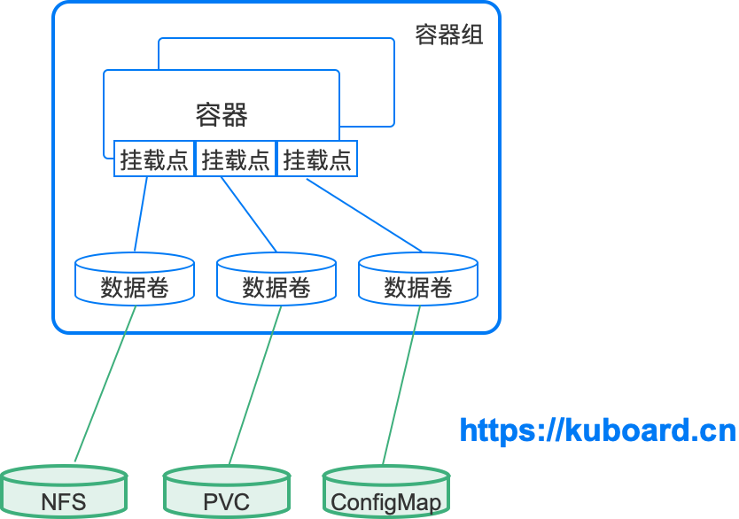
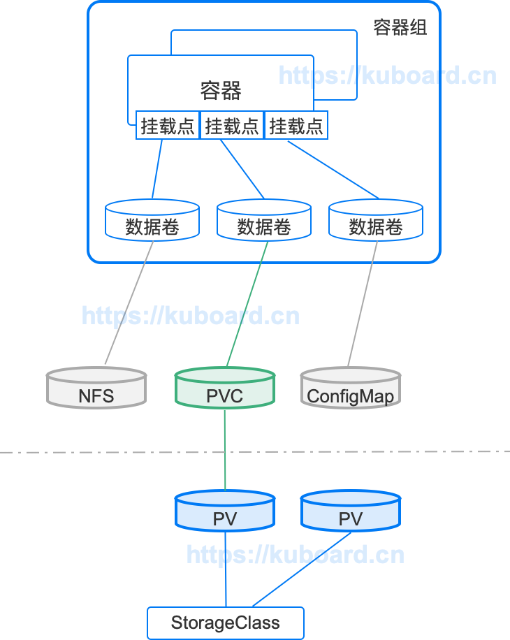

> 目录

[TOC]


# 1. 数据卷Volume


## 1.1 数据卷概述

> 数据卷主要解决了如下两方面问题：

* 数据持久性
  * 写入到容器文件系统的文件暂时性的，容器被删除后，就没有了。
* 数据共享
  * 同一个 Pod（容器组）中运行的容器之间


> k8s volume的特点

* 有生命周期
  * 与包含该数据卷的容器组相同
* 如果容器组退出了，根据Volume（数据卷）类型不同
  * 数据可能随数据卷的退出而删除
  * 也可能被真正持久化，并在下次容器组重启时仍然可以使用。
* 使用 Volume时，需要先在容器组中定义一个数据卷，并将其挂载到容器的挂载点上。
  * 同一个容器组中的不同容器各自独立地挂载数据卷
  * 即同一个容器组中的两个容器可以将同一个数据卷挂载到各自不同的路径上。


> 容器组、容器、挂载点、数据卷、存储介质（nfs、PVC、ConfigMap）等几个概念之间的关系：

- 一个容器组可以包含多个数据卷、多个容器
- 一个容器通过挂载点决定某一个数据卷被挂载到容器中的什么路径
- 不同类型的数据卷对应不同的存储介质（图中列出了 nfs、PVC、ConfigMap 三种存储介质，接下来将介绍更多）




## 1.2 数据卷的类型

Kubernetes 目前支持多达 28 种数据卷类型（其中大部分特定于具体的云环境如 GCE/AWS/Azure 等），如需查阅所有的数据卷类型，请查阅 Kubernetes 官方文档 [Volumes](https://kubernetes.io/docs/concepts/storage/volumes/)

本文针对自建 Kubernetes 时，经常使用的数据卷的类型描述如下：


### 1.2.1 emptyDir 

**描述**

* 该数据卷初始分配时，始终是一个空目录。

* 同一容器组中的不同容器都可以对该目录执行读写操作，并且共享其中的数据

* 当容器组被移除时，emptyDir数据卷中的数据将被永久删除

* 存储位置

  * 默认情况下，emptyDir 数据卷被存储在 node（节点）的存储介质（机械硬盘、SSD、或者网络存储）上

  * emptyDir.medium 字段为 "Memory"，此时 Kubernetes 将挂载一个 tmpfs（基于 RAM 的文件系统）

    * tmpfs 的读写速度非常快，但是与磁盘不一样，tmpfs 在节点重启后将被清空，且您向该 emptyDir 写入文件时，将消耗对应容器的内存限制。

    

> > *容器崩溃时，kubelet 并不会删除容器组，而仅仅是将容器重启，因此 emptyDir 中的数据在容器崩溃并重启后，仍然是存在的。*

思考：默认情况下，重启服务器后，这个数据卷还在吗？


**适用场景**

- 空白的初始空间，例如合并/排序算法中，临时将数据存在磁盘上

- 长时间计算中存储检查点（中间结果），以便容器崩溃时，可以从上一次存储的检查点（中间结果）继续进行，而不是从头开始

- 作为两个容器的共享存储，使得第一个内容管理的容器可以将生成的页面存入其中，同时由一个 webserver 容器对外提供这些页面

  


### 1.2.2 nfs

nfs 类型的数据卷可以加载 NFS（Network File System）到您的容器组/容器。

**描述**

- 可以在加载 NFS 数据卷前就在其中准备好数据；
- 可以在不同容器组之间共享数据；
- 可以被多个容器组加载并同时读写；
- 容器组被移除时，将仅仅 umount（卸载）NFS 数据卷，NFS 中的数据仍将被保留。


**适用场景**

- 存储日志文件
- MySQL的data目录（建议只在测试环境中）
- 用户上传的临时文件


### 1.2.3 cephfs

cephfs 数据卷使得您可以挂载一个外部 CephFS 卷到您的容器组中。

cephfs 与 nfs 的管理方式和行为完全相似，适用场景也相同。

不同的仅仅是背后的存储介质。


### 1.2.4 hostPath

**描述**

将**所在节点**的文件系统上某一个文件或文件夹挂载进容器组（容器）。

有两个属性，`path`与`type`可以指定。可选的 type 字段描述如下：

| Type字段取值          | 描述                                                         |
| --------------------- | ------------------------------------------------------------ |
|                       | 空字符串（default）用于向后兼容，此时，kubernetes 在挂载 hostPath 数据卷前不会执行任何检查 |
| **DirectoryOrCreate** | 如果指定的 hostPath 路径不存在，kubernetes 将在节点的该路径上创建一个空文件夹，权限设置为 0755，与 kubelet 进程具备相同的 group 和 ownership |
| **Directory**         | 指定 hostPath 路径必须存在，且是一个文件夹                   |
| **FileOrCreate**      | 如果指定的 hostPath 路径不存在，kubernetes 将在节点的该路径上创建一个空的文件，权限设置为 0644，与 kubelet 进程具备相同的 group 和 ownership |
| **File**              | 指定 hostPath 路径必须存在，且是一个文件                     |
| **Socket**            | 指定 hostPath 路径必须存在，且是一个 Unix Socket             |
| **CharDevice**        | 指定 hostPath 路径必须存在，且是一个 character device        |
| **BlockDevice**       | 指定 hostPath 路径必须存在，且是一个 block device            |

```
字符设备是指驱动发送/接受单个字符（例如字节）的设备。
块设备是指驱动发送/接受整块数据（例如512个字节为一个块）的设备。
常见的字符设备：串口，并口，声卡。
常见的块设备：硬盘（最小读取单位为扇区，而这些个扇区就是块），USB摄像头，U盘。
对于用户而言，设备是字符设备还是块设备不重要，但是对于驱动编写者而言，这却是必要信息。
```

> > 警告
> >
> > 使用 hostPath 数据卷时，必须十分小心，因为：
> >
> > - 不同节点上配置完全相同的容器组（例如同一个Deployment的容器组）可能执行结果不一样，因为不同节点上 hostPath 所对应的文件内容不同；
> > - Kubernetes 计划增加基于资源的调度，但这个特性将不会考虑对 hostPath 的支持
> > - hostPath 对应的文件/文件夹只有 root 可以写入。您要么在 [privileged Container](https://kubernetes.io/docs/user-guide/security-context) 以 root 身份运行您的进程，要么修改与 hostPath 数据卷对应的节点上的文件/文件夹的权限，


**适用场景**


绝大多数容器组并不需要使用 hostPath 数据卷，但是要监控宿主机的状态时，特别有用：

- 某容器需要访问 Docker，可使用 hostPath 挂载宿主节点的 /var/lib/docker

- 在容器中运行 cAdvisor，使用 hostPath 挂载宿主节点的 /sys

  

  *cAdvisor  [一个容器监控的程序](https://www.jianshu.com/p/91f9d9ec374f)*


### 1.2.5 configMap

**描述**

提供了一种向容器组注入配置信息的途径。ConfigMap 中的数据可以被 Pod（容器组）中的容器作为一个数据卷挂载。

- 您可以直接引用整个 ConfigMap 到数据卷，此时 ConfigMap 中的每一个 key 对应一个文件名，value 对应该文件的内容
- 您也可以只引用 ConfigMap 中的某一个名值对，此时可以将 key 映射成一个新的文件名


*将 ConfigMap 数据卷挂载到容器时，如果该挂载点指定了 **数据卷内子路径** （subPath），则该 ConfigMap 被改变后，该容器挂载的内容仍然不变。*


**适用场景**

* 替换nginx的配置文件
  * ConfigMap 中的某一 key 作为文件名，对应 value 作为文件内容


参考:[**【kubernetes/k8s概念】configMap配置管理**](https://blog.csdn.net/zhonglinzhang/article/details/81126117)


Kubernetes 官网描述了多种 ConfigMap 的创建方法，本文不再复述，请自行参考文档 [Configure a Pod to Use a ConfigMap](https://kubernetes.io/docs/tasks/configure-pod-container/configure-pod-configmap)


### 1.2.6 secret 

Kubernetes 官网文档 [Secrets](https://kubernetes.io/docs/concepts/configuration/secret/)

**描述**

* secret 数据卷可以用来注入敏感信息（例如密码）到容器组。
* 您可以将敏感信息存入 kubernetes secret 对象，并通过 Volume（数据卷）以文件的形式挂载到容器组（或容器）。
* secret 数据卷使用 tmpfs（基于 RAM 的文件系统）挂载。

*将 Secret 数据卷挂载到容器时，如果该挂载点指定了 **数据卷内子路径** （subPath），则该 Secret 被改变后，该容器挂载的内容仍然不变。*


**适用场景**

* 用来配置 nginx 的 HTTPS 证书
  * 将 HTTPS 证书存入 kubernets secret
  * 并挂载到 /etc/nginx/conf.d/myhost.crt、/etc/nginx/conf.d/myhost.pem 路径


### 1.2.7 persistentVolumeClaim

为用户提供了一种在无需关心具体所在云环境的情况下”声明“ 所需持久化存储的方式。

下一章，有详细介绍。


# 2. 存储卷PersistentVolume


## 2.1 概述


* PersistentVolumeClaim 
  * **关注应用程序如何使用存储？**
  * 必须定义在与应用程序相同的名称空间中
  * 通常由应用程序管理员或开发人员负责
  * 是一种特殊的 Volume（数据卷）
  * 可以请求特定大小/特定访问模式（只能被单节点读写/可被多节点只读/可被多节点读写）的存储资源。
* PersistentVolume
  *  **关注集群如何提供存储？**
  * 只能定义在集群层面
  * 通常由集群管理员或者运维人员负责
    * 或者由 Storage Class（存储类）自动管理。
  * 有自己的生命周期，该生命周期独立于任何使用它的容器组。
  * PersistentVolume（存储卷）描述了如何提供存储的细节信息（NFS、cephfs等存储的具体参数）


> 根据**应用程序的特点不同**，其所需要的存储资源也存在不同的要求，例如读写性能等。这样需要动态配置存储卷，所以引入了StorageClass（存储类）的概念


## 2.2 存储卷和存储卷声明的关系

- PersistentVolume
  -  是集群中的存储资源，通常由集群管理员创建和管理
- StorageClass 
  - 用于对 PersistentVolume 进行分类.
  - 如果正确配置，StorageClass 也可以根据 PersistentVolumeClaim 的请求动态创建 Persistent Volume
- PersistentVolumeClaim 
  - 是使用该资源的请求，
  - 通常由应用程序提出请求，并指定对应的 StorageClass 和需求的空间大小
  - 可以做为数据卷的一种，被挂载到容器组/容器中使用




`pv=*persistentVolume`*


## 2.3 管理过程描


### 2.3.1 提供

有两种方式为应用提供存储  : 静态、动态

* **静态提供 Static**

管理员提前定义好PersistentVolume，然后供集群中应用程序使用

* **动态提供 Dynamic**

在配置有合适的 StorageClass（存储类）且 PersistentVolumeClaim 关联了该 StorageClass 的情况下，kubernetes 集群可以为应用程序动态创建 PersistentVolume。


### 2.3.2 绑定

> 假设用户创建了一个 PersistentVolumeClaim 存储卷声明，并指定了需求的存储空间大小以及访问模式。

Kubernets master 将立刻为其匹配一个 PersistentVolume 存储卷，并将存储卷声明和存储卷绑定到一起。

一旦绑定，PersistentVolumeClaim 将拒绝其他 PersistentVolume 的绑定关系。PVC 与 PV 之间的绑定关系是一对一的映射。


> PersistentVolumeClaim 将始终停留在 ***未绑定 unbound*** 状态，直到有合适的 PersistentVolume 可用。

举个例子：集群中已经存在一个 50Gi 的 PersistentVolume，同时有一个 100Gi 的 PersistentVolumeClaim，在这种情况下，该 PVC 将一直处于 ***未绑定 unbound*** 状态，直到管理员向集群中添加了一个 100Gi 的 PersistentVolume。


### 2.3.3 使用

Kubernetes 集群将 PersistentVolumeClaim 所绑定的 PersistentVolume 挂载到容器组供其使用


### 2.3.4 保护使用中的数据

如果正在使用，那么PersistentVolumeClaim 以及其绑定的 PersistentVolume 不能被系统删除，以避免可能的数据丢失。

```
如果用户删除一个正在使用中的 PersistentVolumeClaim，则该 PVC 不会立即被移除掉，而是推迟到该 PVC 不在被任何容器组使用时才移除；同样的如果管理员删除了一个已经绑定到 PVC 的 PersistentVolume，则该 PV 也不会立刻被移除掉，而是推迟到其绑定的 PVC 被删除后才移除掉
```


### 2.3.5 回收 

当用户不在需要其数据卷时，可以删除掉其 PersistentVolumeClaim，此时其对应的 PersistentVolume 将被集群回收并再利用(Reclaiming)。

集群根据 PersistentVolume 中的 reclaim policy（回收策略）决定在其被回收时做对应的处理。当前支持的回收策略有：Retained（保留）、Recycled（重复利用）、Deleted（删除）

#### **保留 **

保留策略需要集群管理员手工回收该资源。

* 当绑定的 PersistentVolumeClaim 被删除后
  * PersistentVolume 仍然存在，并被认为是”已释放“
  * PersistentVolume仍然不能被其他 PersistentVolumeClaim 绑定

  

* 集群管理员可以通过如下步骤回收该 PersistentVolume：
  * 删除该 PersistentVolume。
    * PV 删除后，其数据仍然存在于对应的外部存储介质中（nfs、cefpfs、glusterfs 等）
  * 手工删除对应存储介质上的数据
  * 手工删除对应的存储介质，您也可以创建一个新的 PersistentVolume 并再次使用该存储介质

#### **删除 **

删除策略将从 kubernete 集群移除 PersistentVolume 以及其关联的外部存储介质（云环境中的 AWA EBS、GCE PD、Azure Disk 或 Cinder volume）。

#### **再利用 **

- 再利用策略将在 PersistentVolume 回收时，执行一个基本的清除操作（rm -rf /thevolume/*），并使其可以再次被新的 PersistentVolumeClaim 绑定。
- 集群管理员也可以自定义一个 recycler pod template，用于执行清除操作。请参考 [Recycle](https://kubernetes.io/docs/concepts/storage/persistent-volumes/#recycle)


```
动态提供的 PersistentVolume 将依从其对应的 StorageClass 继承回收策略的属性。
```


### 2.6 扩展 

`Expanding Persistent Volumes Claims`

Kubernetes 中，该特性处于 beta 状态,该特性只针对极少数的 PersistentVolume 类型有效。请参考 [Expanding Persistent Volumes Claims](https://kubernetes.io/docs/concepts/storage/persistent-volumes/#expanding-persistent-volumes-claims)


## 2.4 存储卷类型

Kubernetes 支持 20 种存储卷类型（可参考 [Types of Persistent Volumes](https://kubernetes.io/docs/concepts/storage/persistent-volumes/#types-of-persistent-volumes)），如下所示：

- 非持久性存储
  - emptyDir
  - HostPath (只在单节点集群上用做测试目的)
- 网络连接性存储
  - SAN：iSCSI、ScaleIO Volumes、FC (Fibre Channel)
  - NFS：nfs，cfs
- 分布式存储
  - Glusterfs
  - RBD (Ceph Block Device)
  - CephFS
  - Portworx Volumes
  - Quobyte Volumes
- 云端存储
  - GCEPersistentDisk
  - AWSElasticBlockStore
  - AzureFile
  - AzureDisk
  - Cinder (OpenStack block storage)
  - VsphereVolume
  - StorageOS
- 自定义存储
  - FlexVolume
- 不推荐
  - Flocker (最近更新2016年 https://github.com/ClusterHQ/flocker/)


*针对自建 Kubernetes 集群的情况，可以使用NFS.*


## 2.5 PersistentVolume声明

PersistentVolume 字段描述如下表所示：

| 字段名称         | 可选项/备注                                                  |
| ---------------- | ------------------------------------------------------------ |
| Capacity         | 容量 ，通常一个 PersistentVolume 具有一个固定的存储容量（capacity） |
| Volume Mode      | FEATURE STATE: Kubernetes v1.13 beta Kubernetes 1.9 之前的版本，所有的存储卷都被初始化一个文件系统。当前可选项有：block：使用一个 块设备（raw block device）filesystem（默认值）：使用一个文件系统 |
| Access Modes     | 可被单节点读写-ReadWriteOnce    可被多节点只读-ReadOnlyMany   可被多节点读写-ReadWriteMany |
| StorageClassName | 带有存储类 StorageClassName 属性的 PersistentVolume 只能绑定到请求该 StorageClass 存储类的 PersistentVolumeClaim。     没有 StorageClassName 属性的 PersistentVolume 只能绑定到无特定 StorageClass 存储类要求的 PVC。 |
| Reclaim Policy   | 保留 Retain – 手工回收再利用 Recycle – 清除后重新可用 (rm -rf /thevolume/*)删除 Delete – 删除 PV 及存储介质 |
| Mount Options    | 挂载选项用来在挂载时作为 mount 命令的参数                    |
| Phase            | Available – 可用的 PV，尚未绑定到 PVCBound       – 已经绑定到 PVCReleased   – PVC 已经被删除，但是资源还未被集群回收Failed – 自动回收失败 |


## 2.6 PersistentVolumeClaims声明


| 字段名称              | 可选项/备注                                                  |
| --------------------- | ------------------------------------------------------------ |
| 存储类                | 只有该 StorageClass 存储类的 PV 才可以绑定到此 PVC           |
| 读写模式 Access Modes | 可被单节点读写-ReadWriteOnce可被多节点只读-ReadOnlyMany可被多节点读写-ReadWriteMany |
| Volume Modes          | blockfilesystem - default                                    |
| 总量                  | 请求存储空间的大小                                           |


## 2.7 在数据卷中使用存储卷声明

Claims As Volumes，进行关联，详细看官方文档。


# 3. 存储类StorageClass


## 3.1 存储类概述

存储类用于描述集群中可以提供的存储的类型。不同的存储类可能对应着不同的：

- 服务等级（quality-of-service level）
- 备份策略
- 集群管理员自定义的策略


## 3.2 存储类的种类

Kubernetes 提供 19 种存储类 Provisioner，但是绝大多数与具体的云环境相关

常用的有：

* NFS 
* CephFS 


## 3.3 存储类关键配置


### 3.3.1 回收策略

由 StorageClass 动态创建的 PersistentVolume 将使用 StorageClass 中定义的回收策略。可选项有：

- 回收后删除 Delete
- 回收后保留 Retain


### 3.3.2 存储卷绑定模式

存储卷绑定模式的选项，确定何时执行 存储卷与存储卷声明的绑定、何时执行动态存储卷提供（动态创建存储卷）

可选项有：

- 即刻绑定 Immediate

  存储卷声明创建后，立刻动态创建存储卷并将其绑定到存储卷声明。

- 首次使用时绑定 WaitForFirstConsumer

  直到存储卷声明第一次被容器组使用时，才创建存储卷，并将其绑定到存储卷声明。


