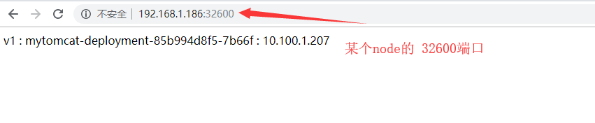
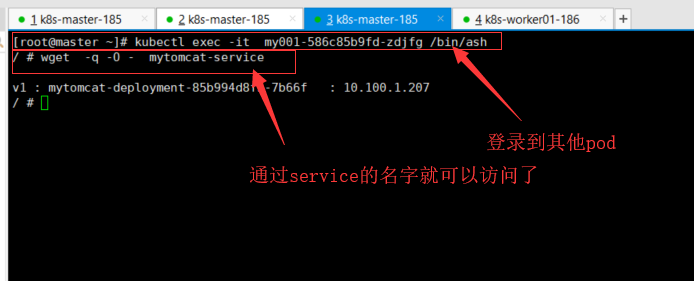
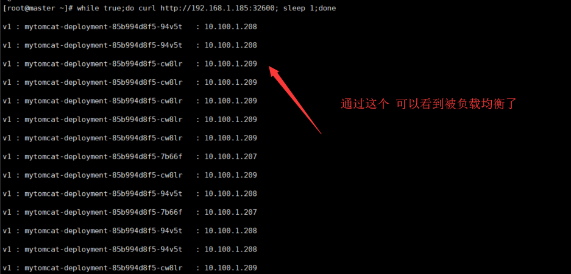

> 目录

[TOC]


# 1. 环境准备

需要

- k8s环境
- 用来测试的tomcat镜像
  - 这个镜像有3个版本，分别测试版本的更新。
  - 可以从[hub.docker](https://hub.docker.com/r/fanhualei/tomcat-alpine)下载


如果想了解这两步的详细过程，可以参考：

- [安装kubeadm 集群](kubernetes-kubeadm.md)
- [制作测试镜像](docker-tomcat.md)


# 2. Kubernetes 入门


> 查看一下环境

```shell
kubectl version
kubectl get nodes
kubectl cluster-info
#先使用这个命令，看看服务器正常不
kubectl get pod -n kube-system
```


## 2.1 部署第一个应用程序

部署tomcat deployment


### 创建 YAML 文件

创建文件 mytomcat-deployment.yaml，内容如下：

```yaml
#与k8s集群版本有关，使用 kubectl api-versions 即可查看当前集群支持的版本
apiVersion: apps/v1	
kind: Deployment	#该配置的类型，Deployment
metadata:	        #译名为元数据，即 Deployment 的一些基本属性和信息
  name: mytomcat-deployment	#Deployment 的名称
  labels:	    #标签，可以灵活定位一个或多个资源，其中key和value均可自定义，可以定义多组
    app: mytomcat #为该Deployment设置key为app，value为mytomcat的标签
spec:	        #这是关于该Deployment描述，可以理解为你期待该Deployment在k8s中如何使用
  replicas: 1	#使用该Deployment创建一个应用程序实例
  selector:	    #标签选择器，与上面的标签共同作用，目前不需要理解
    matchLabels: #选择包含标签app:nginx的资源
      app: mytomcat
  template:	    #这是选择或创建的Pod的模板
    metadata:	#Pod的元数据
      labels:	#Pod的标签，上面的selector即选择包含标签app:mytomcat的Pod
        app: mytomcat
    spec:	    #期望Pod实现的功能（即在pod中部署）
      containers:	#生成container，与docker中的container是同一种
      - name: mytomcat	#container的名称
        image: fanhualei/tomcat-alpine:v1	#使用镜像创建container，
        command: ['tomcat']
        args: ['run']
```


### 应用 YAML 文件

```shell
kubectl apply -f mytomcat-deployment.yaml
```

如果删除也可以使用

```shell
kubectl delete -f mytomcat-deployment.yaml
```


### 查看部署结果

```shell
# 查看 Deployment
kubectl get deployments -o wide

# 查看 Pod
kubectl get pods  -o wide
```


## 2.2 查看 Pods / Nodes

> 目标

- 了解Pods（容器组）
- 了解Nodes（节点）
  - 集群中的计算机，可以是虚拟机或物理机
  - 每个 Node（节点）都由 master 管理
  - 一个 Node（节点）可以有多个Pod（容器组）
  - master 会根据每个 Node（节点）上可用资源，自动调度 Pod（容器组）到最佳的 Node（节点）上。
- 排查故障


### 基本用法

**kubectl get** - 显示资源列表

```shell
# kubectl get 资源类型

#获取类型为Deployment的资源列表
kubectl get deployments -o wide

#获取类型为Pod的资源列表
kubectl get pods -o wide

#获取类型为Node的资源列表
kubectl get nodes -o wide
```


**kubectl describe** - 显示有关资源的详细信息

```shell
# kubectl describe 资源类型 资源名称

#查看Pod信息 名字要替换掉
kubectl describe pod mytomcat-deployment-85b994d8f5-7b66f	

#查看Deployment的信息
kubectl describe deployment mytomcat-deployment	
```


**kubectl logs** - 查看pod中的容器的打印日志（和命令docker logs 类似）

```shell
# kubectl logs Pod名称

kubectl logs mytomcat-deployment-85b994d8f5-7b66f
```


**kubectl exec** - 在pod中的容器环境内执行命令(和命令docker exec 类似)

kubectl exec -it mytomcat-deployment-85b994d8f5-7b66f /bin/ash


### 高级用法

`-o go-template --template` 控制显示的内容

`-l app=mytomcat` 过滤内容

```shell
kubectl get pods -o go-template --template '{{range.items}}{{.metadata.name}}{{"\n"}}{{end}}' -l app=mytomcat
```


## 2.3 公布应用程序

> 目的

- 了解 Service（服务）
- 了解 Labels（标签）和 LabelSelector（标签选择器）与 Service（服务）的关系
- 在集群中，通过 Service（服务）向外公布应用程序


### Service（服务）概述

Service是一个抽象层，它通过 LabelSelector 选择了一组 Pod（容器组），把这些 Pod 的指定端口公布到到集群外部，并支持负载均衡和服务发现。

在创建Service的时候，通过设置配置文件中的 spec.type 字段的值，可以以不同方式向外部暴露应用程序：

- **ClusterIP**（默认）

  在群集中的内部IP上公布服务，这种方式的 Service（服务）只在集群内部可以访问到

- **NodePort**

  使用 NAT 在集群中每个的同一端口上公布服务。这种方式下，可以通过访问集群中任意节点+端口号的方式访问服务 `<NodeIP>:<NodePort>`。此时 ClusterIP 的访问方式仍然可用。

- **LoadBalancer**

  在云环境中（需要云供应商可以支持）创建一个集群外部的负载均衡器，并为使用该负载均衡器的 IP 地址作为服务的访问地址。此时 ClusterIP 和 NodePort 的访问方式仍然可用。


### 创建文件 mytomcat-service.yaml

```yaml
apiVersion: v1
kind: Service
metadata:
  name: mytomcat-service	#Service 的名称
  labels:     	#Service 自己的标签
    app: mytomcat	#为该 Service 设置 key 为 app，value 为 mytomcat 的标签
spec:	    #这是关于该 Service 的定义，描述了 Service 如何选择 Pod，如何被访问
  selector:	    #标签选择器
    app: mytomcat	#选择包含标签 app:mytomcat 的 Pod
  ports:
  - name: mytomcat-port	#端口的名字
    protocol: TCP	    #协议类型 TCP/UDP
    port: 80	        #集群内的其他容器组可通过 80 端口访问 Service
    nodePort: 32600     #通过任意节点的 32600 端口访问 Service
    targetPort: 8080	#将请求转发到匹配 Pod 的 8080 端口
  type: NodePort	    #Serive的类型，ClusterIP/NodePort/LoaderBalancer
```


### 执行命令

```shell
kubectl apply -f mytomcat-service.yaml
```


### 检查执行结果

```shell
kubectl get services -o wide

# 也可以查看系统的组件
kubectl get services -n kube-system  -o wide
```


### 访问服务


> 在node层面上访问

```shell
# 任意节点的 IP 包含master
# curl <任意节点的 IP>:32600
curl 192.168.1.185:32600

```

如果您的集群在云上，您可能通过云服务商的安全组开放 32600 端口的访问



> 集群内部的其他pod，可以通过`servername:端口`来访问这个服务

登录到任意一个pod

```shell
# 登录到任意主机，可以过名字来访问
wget  -q -O -  mytomcat-service
```




## 2.4 伸缩应用程序

以前部署了一个mytomcat的pod，但是当流量来的时候，可以快速生成多个服务，并做成负载均衡。


### 修改 mytomcat-deployment.yaml 文件

```shell
# 将副本数修改成
replicas: 3
```


### 执行命令

```shell
kubectl apply -f mytomcat-deployment.yaml
```


### 查看结果

```
watch  kubectl get pods -o wide
```

> 查看负载均衡的结果

```
while true;do curl http://192.168.1.185:32600; sleep 1;done
```




## 2.5 执行滚动更新

`fanhualei/tomcat-alpine` 从`v1`更新到了`v2`，如何将生成的pod进行更新。 如果出现错误，如何回滚。如何只更新一半，如何分好几天分配的更新。


### 修改 mytomcat-deployment.yaml 文件

```shell
#使用镜像fanhualei/tomcat-alpine:v2替换原来的fanhualei/tomcat-alpine:v1
image: fanhualei/tomcat-alpine:v2   
```


### 执行命令

```shell
kubectl apply -f mytomcat-deployment.yaml
```


### 查看结果

```shell
# 循环输出
while true;do curl http://192.168.1.185:32600; sleep 1;done

# 查看当前状态：这行命令没有啥作用
watch kubectl rollout status deployment/mytomcat-deployment

# 查看历史
kubectl rollout history deployment/mytomcat-deployment

#回滚到上个版本，或指定版本
kubectl rollout undo deployment/mytomcat-deployment

# kubectl rollout undo deployment/demo --to-revision=2
```


## 2.6 回顾上面练习


### 什么是Kubernetes？

Kubernetes（k8s）是自动化容器操作的开源平台，这些操作包括部署，调度和节点集群间扩展。使用Kubernetes可以：

- 自动化容器的部署和复制
- 随时扩展或收缩容器规模
- 将容器组织成组，并且提供容器间的负载均衡
- 很容易地升级应用程序容器的新版本
- 提供容器弹性，如果容器失效就替换它，等等


### 集群

集群是一组节点，这些节点可以是物理服务器或者虚拟机，之上安装了Kubernetes平台。下图展示这样的集群。注意该图为了强调核心概念有所简化。这里可以看到一个典型的Kubernetes架构图。


#### Pod

[Pod](https://kubernetes.io/docs/concepts/workloads/pods/pod-overview/)（上图绿色方框）安排在节点上，包含一组容器和卷。

同一个Pod里的容器共享同一个网络命名空间，可以使用localhost互相通信。

Pod是短暂的，不是持续性实体。你可能会有这些问题：

- 如果Pod是短暂的，那么我怎么才能持久化容器数据使其能够跨重启而存在呢？
- 是否手动创建Pod，如果想要创建同一个容器的多份拷贝，需要一个个分别创建出来么？
- 如果Pod是短暂的，那么重启时IP地址可能会改变，那么怎么才能从前端容器正确可靠地指向后台容器呢？


#### Label

正如图所示，一些Pod有Label（![enter image description here](data:image/png;base64,iVBORw0KGgoAAAANSUhEUgAAACAAAAAhCAYAAAC4JqlRAAAKQWlDQ1BJQ0MgUHJvZmlsZQAASA2dlndUU9kWh8+9N73QEiIgJfQaegkg0jtIFQRRiUmAUAKGhCZ2RAVGFBEpVmRUwAFHhyJjRRQLg4Ji1wnyEFDGwVFEReXdjGsJ7601896a/cdZ39nnt9fZZ+9917oAUPyCBMJ0WAGANKFYFO7rwVwSE8vE9wIYEAEOWAHA4WZmBEf4RALU/L09mZmoSMaz9u4ugGS72yy/UCZz1v9/kSI3QyQGAApF1TY8fiYX5QKUU7PFGTL/BMr0lSkyhjEyFqEJoqwi48SvbPan5iu7yZiXJuShGlnOGbw0noy7UN6aJeGjjAShXJgl4GejfAdlvVRJmgDl9yjT0/icTAAwFJlfzOcmoWyJMkUUGe6J8gIACJTEObxyDov5OWieAHimZ+SKBIlJYqYR15hp5ejIZvrxs1P5YjErlMNN4Yh4TM/0tAyOMBeAr2+WRQElWW2ZaJHtrRzt7VnW5mj5v9nfHn5T/T3IevtV8Sbsz55BjJ5Z32zsrC+9FgD2JFqbHbO+lVUAtG0GQOXhrE/vIADyBQC03pzzHoZsXpLE4gwnC4vs7GxzAZ9rLivoN/ufgm/Kv4Y595nL7vtWO6YXP4EjSRUzZUXlpqemS0TMzAwOl89k/fcQ/+PAOWnNycMsnJ/AF/GF6FVR6JQJhIlou4U8gViQLmQKhH/V4X8YNicHGX6daxRodV8AfYU5ULhJB8hvPQBDIwMkbj96An3rWxAxCsi+vGitka9zjzJ6/uf6Hwtcim7hTEEiU+b2DI9kciWiLBmj34RswQISkAd0oAo0gS4wAixgDRyAM3AD3iAAhIBIEAOWAy5IAmlABLJBPtgACkEx2AF2g2pwANSBetAEToI2cAZcBFfADXALDIBHQAqGwUswAd6BaQiC8BAVokGqkBakD5lC1hAbWgh5Q0FQOBQDxUOJkBCSQPnQJqgYKoOqoUNQPfQjdBq6CF2D+qAH0CA0Bv0BfYQRmALTYQ3YALaA2bA7HAhHwsvgRHgVnAcXwNvhSrgWPg63whfhG/AALIVfwpMIQMgIA9FGWAgb8URCkFgkAREha5EipAKpRZqQDqQbuY1IkXHkAwaHoWGYGBbGGeOHWYzhYlZh1mJKMNWYY5hWTBfmNmYQM4H5gqVi1bGmWCesP3YJNhGbjS3EVmCPYFuwl7ED2GHsOxwOx8AZ4hxwfrgYXDJuNa4Etw/XjLuA68MN4SbxeLwq3hTvgg/Bc/BifCG+Cn8cfx7fjx/GvyeQCVoEa4IPIZYgJGwkVBAaCOcI/YQRwjRRgahPdCKGEHnEXGIpsY7YQbxJHCZOkxRJhiQXUiQpmbSBVElqIl0mPSa9IZPJOmRHchhZQF5PriSfIF8lD5I/UJQoJhRPShxFQtlOOUq5QHlAeUOlUg2obtRYqpi6nVpPvUR9Sn0vR5Mzl/OX48mtk6uRa5Xrl3slT5TXl3eXXy6fJ18hf0r+pvy4AlHBQMFTgaOwVqFG4bTCPYVJRZqilWKIYppiiWKD4jXFUSW8koGStxJPqUDpsNIlpSEaQtOledK4tE20Otpl2jAdRzek+9OT6cX0H+i99AllJWVb5SjlHOUa5bPKUgbCMGD4M1IZpYyTjLuMj/M05rnP48/bNq9pXv+8KZX5Km4qfJUilWaVAZWPqkxVb9UU1Z2qbapP1DBqJmphatlq+9Uuq43Pp893ns+dXzT/5PyH6rC6iXq4+mr1w+o96pMamhq+GhkaVRqXNMY1GZpumsma5ZrnNMe0aFoLtQRa5VrntV4wlZnuzFRmJbOLOaGtru2nLdE+pN2rPa1jqLNYZ6NOs84TXZIuWzdBt1y3U3dCT0svWC9fr1HvoT5Rn62fpL9Hv1t/ysDQINpgi0GbwaihiqG/YZ5ho+FjI6qRq9Eqo1qjO8Y4Y7ZxivE+41smsImdSZJJjclNU9jU3lRgus+0zwxr5mgmNKs1u8eisNxZWaxG1qA5wzzIfKN5m/krCz2LWIudFt0WXyztLFMt6ywfWSlZBVhttOqw+sPaxJprXWN9x4Zq42Ozzqbd5rWtqS3fdr/tfTuaXbDdFrtOu8/2DvYi+yb7MQc9h3iHvQ732HR2KLuEfdUR6+jhuM7xjOMHJ3snsdNJp9+dWc4pzg3OowsMF/AX1C0YctFx4bgccpEuZC6MX3hwodRV25XjWuv6zE3Xjed2xG3E3dg92f24+ysPSw+RR4vHlKeT5xrPC16Il69XkVevt5L3Yu9q76c+Oj6JPo0+E752vqt9L/hh/QL9dvrd89fw5/rX+08EOASsCegKpARGBFYHPgsyCRIFdQTDwQHBu4IfL9JfJFzUFgJC/EN2hTwJNQxdFfpzGC4sNKwm7Hm4VXh+eHcELWJFREPEu0iPyNLIR4uNFksWd0bJR8VF1UdNRXtFl0VLl1gsWbPkRoxajCCmPRYfGxV7JHZyqffS3UuH4+ziCuPuLjNclrPs2nK15anLz66QX8FZcSoeGx8d3xD/iRPCqeVMrvRfuXflBNeTu4f7kufGK+eN8V34ZfyRBJeEsoTRRJfEXYljSa5JFUnjAk9BteB1sl/ygeSplJCUoykzqdGpzWmEtPi000IlYYqwK10zPSe9L8M0ozBDuspp1e5VE6JA0ZFMKHNZZruYjv5M9UiMJJslg1kLs2qy3mdHZZ/KUcwR5vTkmuRuyx3J88n7fjVmNXd1Z752/ob8wTXuaw6thdauXNu5Tnddwbrh9b7rj20gbUjZ8MtGy41lG99uit7UUaBRsL5gaLPv5sZCuUJR4b0tzlsObMVsFWzt3WazrWrblyJe0fViy+KK4k8l3JLr31l9V/ndzPaE7b2l9qX7d+B2CHfc3em681iZYlle2dCu4F2t5czyovK3u1fsvlZhW3FgD2mPZI+0MqiyvUqvakfVp+qk6oEaj5rmvep7t+2d2sfb17/fbX/TAY0DxQc+HhQcvH/I91BrrUFtxWHc4azDz+ui6rq/Z39ff0TtSPGRz0eFR6XHwo911TvU1zeoN5Q2wo2SxrHjccdv/eD1Q3sTq+lQM6O5+AQ4ITnx4sf4H++eDDzZeYp9qukn/Z/2ttBailqh1tzWibakNml7THvf6YDTnR3OHS0/m/989Iz2mZqzymdLz5HOFZybOZ93fvJCxoXxi4kXhzpXdD66tOTSna6wrt7LgZevXvG5cqnbvfv8VZerZ645XTt9nX297Yb9jdYeu56WX+x+aem172296XCz/ZbjrY6+BX3n+l37L972un3ljv+dGwOLBvruLr57/17cPel93v3RB6kPXj/Mejj9aP1j7OOiJwpPKp6qP6391fjXZqm99Oyg12DPs4hnj4a4Qy//lfmvT8MFz6nPK0a0RupHrUfPjPmM3Xqx9MXwy4yX0+OFvyn+tveV0auffnf7vWdiycTwa9HrmT9K3qi+OfrW9m3nZOjk03dp76anit6rvj/2gf2h+2P0x5Hp7E/4T5WfjT93fAn88ngmbWbm3/eE8/syOll+AAAACXBIWXMAAAsTAAALEwEAmpwYAAAB1WlUWHRYTUw6Y29tLmFkb2JlLnhtcAAAAAAAPHg6eG1wbWV0YSB4bWxuczp4PSJhZG9iZTpuczptZXRhLyIgeDp4bXB0az0iWE1QIENvcmUgNS40LjAiPgogICA8cmRmOlJERiB4bWxuczpyZGY9Imh0dHA6Ly93d3cudzMub3JnLzE5OTkvMDIvMjItcmRmLXN5bnRheC1ucyMiPgogICAgICA8cmRmOkRlc2NyaXB0aW9uIHJkZjphYm91dD0iIgogICAgICAgICAgICB4bWxuczp0aWZmPSJodHRwOi8vbnMuYWRvYmUuY29tL3RpZmYvMS4wLyI+CiAgICAgICAgIDx0aWZmOkNvbXByZXNzaW9uPjE8L3RpZmY6Q29tcHJlc3Npb24+CiAgICAgICAgIDx0aWZmOlBob3RvbWV0cmljSW50ZXJwcmV0YXRpb24+MjwvdGlmZjpQaG90b21ldHJpY0ludGVycHJldGF0aW9uPgogICAgICAgICA8dGlmZjpPcmllbnRhdGlvbj4xPC90aWZmOk9yaWVudGF0aW9uPgogICAgICA8L3JkZjpEZXNjcmlwdGlvbj4KICAgPC9yZGY6UkRGPgo8L3g6eG1wbWV0YT4KOXS2agAAAWdJREFUWAntk91NhUAUhC8WYB92YQEWYQhWYLQKW4AnOrAA+7AGn3khAXeu+ZIJOfws8mAim9x7dmfnzAy7cLmc4zyB/34CxdwBtG172/f9+3R/HMfPsiyfhDdN8zoMw12aflVV9TLlblmHAeq6fi6K4m1NIAW59qcgI1ww1mv1JiIk84cIn2IYuynYlDu3DgM4WeL8HGeO4d4QqwEwWqq/CXFIAIXbGyJ8CZPYR9K8l3Du4CoIpH6wSOuwE0AcYzcFg+M1DNB13aOTcucYbgkRXoEMEck1dz4BXAsM3mwAEbyRhtyKoWuBSSu8AkycCJZbMXathOklv47FAGJ440/Lsf+LV+BWPIljW+Y8gPeDqX9zAJFdROu1gZH3gdGbFUBNLoZIVDFyPpjzswOo2UVdjDlGzgODQ90VQM0ujpgqRr4P5jzmuwNIwE20xshxMO1HY/UzjJrAXNzn0T7YWc8TOE/gz53AN34Bn5aWTdpfAAAAAElFTkSuQmCC)）。

你可能创建了一个"tier"和“app”标签，通过Label（**tier=frontend, app=myapp**）来标记前端Pod容器，使用Label（**tier=backend, app=myapp**）标记后台Pod。

然后可以使用 [Selectors](https://kubernetes.io/docs/concepts/overview/working-with-objects/labels/) 选择带有特定Label的Pod，并且将Service或者Replication Controller应用到上面。


#### Deployment(Controller)

> 当创建Deployment Controller时，需要指 定两个东西：

1. Pod模板：用来创建Pod副本的模板

2. Label：Deployment  Controller需要监控的Pod的标签。

   

现在已经创建了Pod的一些副本，那么在这些副本上如何均衡负载呢？我们需要的是Service。


####  Service

*如果Pods是短暂的，那么重启时IP地址可能会改变，怎么才能从前端容器正确可靠地指向后台容器呢？*

 [Service](https://kubernetes.io/docs/concepts/services-networking/service/) **抽象** 现在，假定有2个后台Pod，并且定义后台Service的名称为`backend-service`，lable选择器为（（**tier=backend, app=myapp**））。 的Service会完成如下两件重要的事情：

- 会为Service创建一个本地集群的DNS入口，因此前端Pod只需要DNS查找主机名为 `backend-service`，就能够解析出前端应用程序可用的IP地址。
- 现在前端已经得到了后台服务的IP地址，但是它应该访问2个后台Pod的哪一个呢？
  - Service在这2个后台Pod之间提供透明的负载均衡，会将请求分发给其中的任意一个，然后通过每个Node上运行的代理（kube-proxy）完成。


每个节点都运行如下Kubernetes关键组件：

- Kubelet：是主节点代理。
- Kube-proxy：Service使用其将链接路由到Pod，如上文所述。
- Docker或Rocket：Kubernetes使用的容器技术来创建容器。


# 3. Kubernetes 进阶


## 3.1 使用docker私有仓库

* [手把手教你搭建Docker Registry私服](https://segmentfault.com/a/1190000015108428)

私有仓库安装比较简单，就是下载一个docker镜像，并启动，这里多讲。这里只说一下可以应用的场景。

* 在公司内部用
  * 可以配置一个密码，有权限的用户才可以上传与修改镜像。
  * 也可以做一个web网站来使用，可以到github上搜索一下。WEB UI for Registry


## 3.2 Pod详解

[Pod详解](kubernetes-detail-pod.md)


## 3.3 控制器详解

[控制器详解](kubernetes-detail-controller.md)


## 3.4. 服务发现、负载均衡、网络

[service详解](kubernetes-detail-service.md)


# 参考文档

* [Kubernetes 免费中文教程--推荐](https://kuboard.cn/learning/)

* [Kubernetes中文社区 | 中文文档](http://docs.kubernetes.org.cn/)