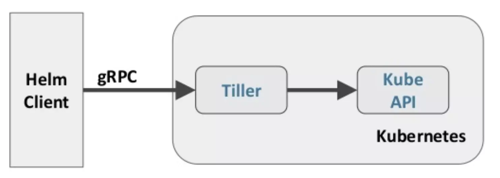

# Helm


# 1. 简介

我们可以将Helm看作Kubernetes下的apt-get/yum。

对于应用发布者而言，可以通过Helm打包应用，管理应用依赖关系，管理应用版本并发布应用到软件仓库。

对于使用者而言，使用Helm后不用需要了解Kubernetes的Yaml语法并编写应用部署文件，可以通过Helm下载并在kubernetes上安装需要的应用。除此以外，Helm还提供了kubernetes上的软件部署，删除，升级，回滚应用的强大功能。

> Helm工作原理




> 基本概念

| 名称       | 说明                                                         |
| ---------- | ------------------------------------------------------------ |
| Helm       | Helm 是一个命令行下的客户端工具。                            |
| Tiller     | Tiller 是 Helm 的服务端，部署在 Kubernetes 集群中。          |
| Chart      | Helm 的软件包，采用 TAR 格式。类似于 APT 的 DEB 包或者 YUM 的 RPM 包，其包含了一组定义 Kubernetes 资源相关的 YAML 文件。 |
| Repoistory | Helm 的软件仓库，是一个 Web 服务器，该服务器保存了一系列的 Chart 软件包以供用户下载。Helm 可以同时管理多个不同的 Repository。 |
| Release    | 使用 `helm install` 命令在 Kubernetes 集群中部署的 Chart 称为 Release。 |

*注：需要注意的是：Helm 中提到的 Release 和我们通常概念中的版本有所不同，这里的 Release 可以理解为 Helm 使用 Chart 包部署的一个应用实例。*


# 2. 安装


## 2.1 安装Helm

有无数个安装方法，这里只介绍一种我认为比较好的安装方法。

到[官方地址](https://github.com/helm/helm/releases)下载一个`Latest release`版本 

```shell
cd /opt
wget https://get.helm.sh/helm-v2.14.3-linux-amd64.tar.gz
tar -zxvf helm-v2.14.3-linux-amd64.tar.gz
mv linux-amd64/  helm-2.14.3
cd helm-2.14.3/
# 把 helm 指令放到bin目录下 ln -s [源文件] [目标文件]
ln -s /opt/helm-2.14.3/helm /usr/local/bin/helm
# 验证
helm help 
```

*注当前我使用的版本是[Helm v2.14.3](https://github.com/helm/helm/releases/tag/v2.14.3)*


## 2.2 安装Tiller

建议在master目录下安装，因为helm要使用到`/root/.kube`目录下的文件

安装的过程中，参考了：https://pdf.us/2019/04/22/3300.html


### ① 创建用户权限

```shell
vi tiller-service-account.yaml
```


```yaml
apiVersion: v1
kind: ServiceAccount
metadata:
  name: tiller
  namespace: kube-system
---
apiVersion: rbac.authorization.k8s.io/v1beta1
kind: ClusterRoleBinding
metadata:
  name: tiller
roleRef:
  apiGroup: rbac.authorization.k8s.io
  kind: ClusterRole
  name: cluster-admin
subjects:
  - kind: ServiceAccount
    name: tiller
    namespace: kube-system
```


```shell
kubectl apply -f tiller-service-account.yaml
```


### ② 初始化Tiller

```shell
# 查看当前版本
helm version

helm init --service-account tiller

#由于 Helm 默认会去 storage.googleapis.com 拉取镜像，如果你当前执行的机器不能访问该域名的话可以使用以下命令来安装：
helm init --upgrade -i registry.cn-hangzhou.aliyuncs.com/google_containers/tiller:v2.14.3--stable-repo-url https://kubernetes.oss-cn-hangzhou.aliyuncs.com/charts --service-account tiller

# 查看安装结果
kubectl get pods -n kube-system -l app=helm
```


```shell
# 可以把阿里的仓库添加进来

helm repo add incubator https://aliacs-app-catalog.oss-cn-hangzhou.aliyuncs.com/charts-incubator/

helm repo update
helm search
```


### ③ 检查安装结果

```shell


kubectl get pods -n kube-system -l app=helm
```


## 2.3 卸载

**卸载 Tiller 两种方法：**

> 方法 1 : 常用在安装不成功的情况下

```shell
kubectl delete deployment tiller-deploy -n kube-system

kubectl get deployments.apps -n kube-system tiller-deploy -o yaml --export
```

> 方法 2

```shell
helm reset
```


# 3. 快速入门

Helm官方仓库：https://kubernetes-charts.storage.googleapis.com
国内镜像：https://kubernetes.oss-cn-hangzhou.aliyuncs.com/charts

```shell
# 更新默认仓库 stable 元数据
helm repo update

# 列出stable仓库中所有Charts列表
helm search
helm search redis

# 显示指定Charts详情
helm inspect stable/redis

# 安装 Charts
helm install stable/redis
helm install stable/redis -n redis --dry-run   # -n 指定Release名称 --dry-run 执行安装测试
helm install --name my-release stable/redis
helm install --name my-release --set redisPassword=secretpassword stable/redis

# 查看已安装的Release
helm list

# 查看状态
helm status redis

# 删除Release
helm delete redis
#升级或回滚 helm upgrade、helm rollback、helm history
```


# 参考文档

* 学习文档
  * [kubernetes之helm简介、安装、配置、使用指南](https://blog.csdn.net/bbwangj/article/details/81087911)
  * [Helm 从入门到实践](https://www.jianshu.com/p/4bd853a8068b)
  * [对 Helm 的一些总结](https://www.jianshu.com/p/97e08dd411d2)
  * [Helm 入门指南](https://www.hi-linux.com/posts/21466.html)
  * [马哥kubernetes入门](https://pdf.us/2019/04/22/3300.html)
* 仓库
  * [官方仓库](https://hub.kubeapps.com/)

