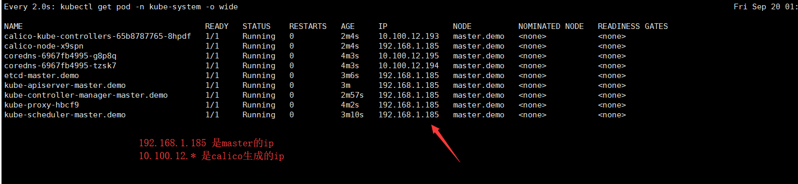
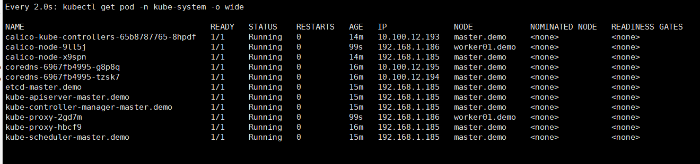
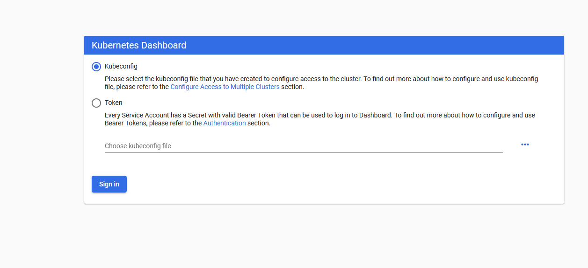
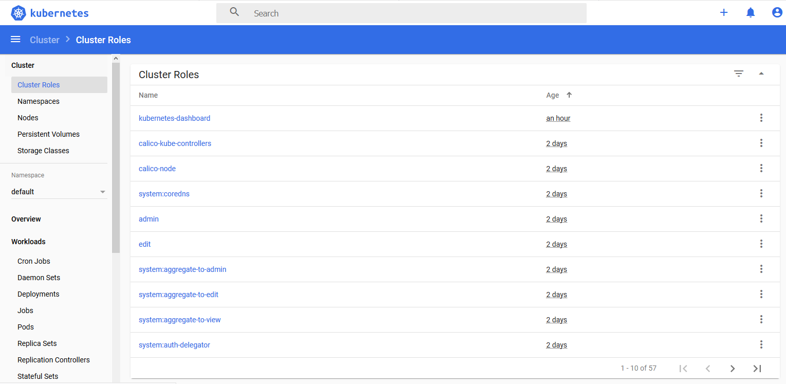

# **vkubeadm** 集群安装

参考网址

* https://github.com/eip-work/kuboard-press/blob/master/install/install-k8s.md


> 目录

[TOC]


# 第一步、检查配置


> 检查 centos / hostname

```shell
# 在 master 节点和 worker 节点都要执行
cat /etc/redhat-release

# 此处 hostname 的输出将会是该机器在 Kubernetes 集群中的节点名字
# 不能使用 localhost 作为节点的名字
hostname

# 请使用 lscpu 命令，核对 CPU 信息
# Architecture: x86_64    本安装文档不支持 arm 架构
# CPU(s):       2         CPU 内核数量不能低于 2
lscpu
```


> 操作系统兼容性

| CentOS 版本 | 本文档是否兼容 | 备注                                |
| ----------- | -------------- | ----------------------------------- |
| 7.6         | 😄              | 已验证                              |
| 7.5         | 😄              | 已验证                              |
| 7.4         | 🤔              | 待验证                              |
| 7.3         | 🤔              | 待验证                              |
| 7.2         | 😞              | 已证实会出现 kubelet 无法启动的问题 |


> 修改 hostname

 如果您需要修改 hostname，可执行如下指令：

```shell
# 修改 hostname
hostnamectl set-hostname your-new-host-name

# 查看修改结果
hostnamectl status

# 设置 hostname 解析
echo "127.0.0.1   $(hostname)" >> /etc/hosts
```


> 安装后的软件版本为

- Kubernetes v1.16.0
  - calico 3.8.2
  - nginx-ingress 1.5.5
- Docker 18.09.7


> 拟安装机器

| vbox             | hostname      | ip            |
| ---------------- | ------------- | ------------- |
| k8s-master-105   | master.demo   | 192.168.1.185 |
| k8s-worker01-107 | worker01.demo | 192.168.1.186 |
| k8s-worker02-108 | worker02.demo | 192.168.1.187 |


# 第二步、制作标准镜像

这一步单独做，主要的目的是用来备份镜像，下次不用重新安装了。


## 2.1、 步骤说明

**使用 root 身份在所有节点执行如下代码，以安装软件：**

- docker
- nfs-utils
- kubectl / kubeadm / kubelet


**步骤：**

* 第一步、安装 docker
* 第二步、安装 nfs-utils
* 第三步、K8S基本配置
  * 关闭 防火墙
  * 关闭 SeLinux
  * 关闭 swap
  * 修改 /etc/sysctl.conf
  * 配置K8S的yum源
*  第四步、安装kubelet、kubeadm、kubectl
* 第五步、docker设置优化
  * 修改docker Cgroup Driver为systemd
  * 设置 docker 镜像国内下载地址
* 第六步、启动设备


## 2.2、执行安装操作

可以执行快速安装命令，也可以手工一条一条执行


> 网友提供的快速安装

```
# 在 master 节点和 worker 节点都要执行

curl -sSL https://kuboard.cn/install-script/v1.16.0/install-kubelet.sh | sh
```

> 代码说明

[代码详细](shell/k8s-install-kubeadm/install-kubelet.sh) 或参考[原始代码]()

```sh
#!/bin/bash

# 在 master 节点和 worker 节点都要执行

# 安装 docker
# 参考文档如下
# https://docs.docker.com/install/linux/docker-ce/centos/ 
# https://docs.docker.com/install/linux/linux-postinstall/

# 卸载旧版本
yum remove -y docker \
docker-client \
docker-client-latest \
docker-common \
docker-latest \
docker-latest-logrotate \
docker-logrotate \
docker-selinux \
docker-engine-selinux \
docker-engine

# 设置 yum repository
yum install -y yum-utils \
device-mapper-persistent-data \
lvm2
yum-config-manager --add-repo http://mirrors.aliyun.com/docker-ce/linux/centos/docker-ce.repo

# 安装并启动 docker
yum install -y docker-ce-18.09.7 docker-ce-cli-18.09.7 containerd.io
systemctl enable docker
systemctl start docker

# 安装 nfs-utils
# 必须先安装 nfs-utils 才能挂载 nfs 网络存储
yum install -y nfs-utils

# 关闭 防火墙
systemctl stop firewalld
systemctl disable firewalld

# 关闭 SeLinux
setenforce 0
sed -i "s/SELINUX=enforcing/SELINUX=disabled/g" /etc/selinux/config

# 关闭 swap
swapoff -a
yes | cp /etc/fstab /etc/fstab_bak
cat /etc/fstab_bak |grep -v swap > /etc/fstab

# 修改 /etc/sysctl.conf
# 如果有配置，则修改
sed -i "s#^net.ipv4.ip_forward.*#net.ipv4.ip_forward=1#g"  /etc/sysctl.conf
sed -i "s#^net.bridge.bridge-nf-call-ip6tables.*#net.bridge.bridge-nf-call-ip6tables=1#g"  /etc/sysctl.conf
sed -i "s#^net.bridge.bridge-nf-call-iptables.*#net.bridge.bridge-nf-call-iptables=1#g"  /etc/sysctl.conf
# 可能没有，追加
echo "net.ipv4.ip_forward = 1" >> /etc/sysctl.conf
echo "net.bridge.bridge-nf-call-ip6tables = 1" >> /etc/sysctl.conf
echo "net.bridge.bridge-nf-call-iptables = 1" >> /etc/sysctl.conf
# 执行命令以应用
sysctl -p

# 配置K8S的yum源
cat <<EOF > /etc/yum.repos.d/kubernetes.repo
[kubernetes]
name=Kubernetes
baseurl=http://mirrors.aliyun.com/kubernetes/yum/repos/kubernetes-el7-x86_64
enabled=1
gpgcheck=0
repo_gpgcheck=0
gpgkey=http://mirrors.aliyun.com/kubernetes/yum/doc/yum-key.gpg
       http://mirrors.aliyun.com/kubernetes/yum/doc/rpm-package-key.gpg
EOF

# 卸载旧版本
yum remove -y kubelet kubeadm kubectl

# 安装kubelet、kubeadm、kubectl
yum install -y kubelet-1.15.3 kubeadm-1.15.3 kubectl-1.15.3

# 修改docker Cgroup Driver为systemd
# # 将/usr/lib/systemd/system/docker.service文件中的这一行 ExecStart=/usr/bin/dockerd -H fd:// --containerd=/run/containerd/containerd.sock
# # 修改为 ExecStart=/usr/bin/dockerd -H fd:// --containerd=/run/containerd/containerd.sock --exec-opt native.cgroupdriver=systemd
# 如果不修改，在添加 worker 节点时可能会碰到如下错误
# [WARNING IsDockerSystemdCheck]: detected "cgroupfs" as the Docker cgroup driver. The recommended driver is "systemd". 
# Please follow the guide at https://kubernetes.io/docs/setup/cri/
sed -i "s#^ExecStart=/usr/bin/dockerd.*#ExecStart=/usr/bin/dockerd -H fd:// --containerd=/run/containerd/containerd.sock --exec-opt native.cgroupdriver=systemd#g" /usr/lib/systemd/system/docker.service

# 设置 docker 镜像，提高 docker 镜像下载速度和稳定性
# 如果您访问 https://hub.docker.io 速度非常稳定，亦可以跳过这个步骤
curl -sSL https://get.daocloud.io/daotools/set_mirror.sh | sh -s http://91c0cc1e.m.daocloud.io

# 重启 docker，并启动 kubelet
systemctl daemon-reload
systemctl restart docker
systemctl enable kubelet && systemctl start kubelet

docker version
```


# 第三步、备份标准镜像

使用vbox做一个镜像，这样做worker就简单了


# 第四步、初始化 master 节点


## 4.1、步骤说明

- 以 root 身份在master 机器上执行
- 初始化 master 节点时，如果因为中间某些步骤的配置出错，想要重新初始化 master 节点，请先执行 `kubeadm reset`操作


> 具体步骤

* kubeadm init
* 配置kubectl
* 安装calico 网络插件


## 4.2、执行安装操作


> 前期准备

```shell
# 只在 master 节点执行
# 替换 x.x.x.x 为 master 节点实际 IP（请使用内网 IP）
# export 命令只在当前 shell 会话中有效，开启新的 shell 窗口后，请重新执行此处的 export 命令
export MASTER_IP=x.x.x.x

# 替换 apiserver.demo 为 您想要的 dnsName (不建议使用 master 的 hostname 作为 APISERVER_NAME)
export APISERVER_NAME=apiserver.demo

# Kubernetes 容器组所在的网段，该网段安装完成后，由 kubernetes 创建，事先并不存在于您的物理网络中
export POD_SUBNET=10.100.0.1/20

echo "${MASTER_IP}    ${APISERVER_NAME}" >> /etc/hosts

```


> 执行脚本

下面脚本是网友写的，也可以按照下面的内容手工执行

```shell
curl -sSL https://kuboard.cn/install-script/v1.16.0/init-master.sh | sh
```

> > 也可以手工执行脚本

```shell
#!/bin/bash

# 只在 master 节点执行

# 查看完整配置选项 https://godoc.org/k8s.io/kubernetes/cmd/kubeadm/app/apis/kubeadm/v1beta2
rm -f ./kubeadm-config.yaml

cat <<EOF > ./kubeadm-config.yaml
apiVersion: kubeadm.k8s.io/v1beta2
kind: ClusterConfiguration
kubernetesVersion: v1.15.3
imageRepository: registry.cn-hangzhou.aliyuncs.com/google_containers
controlPlaneEndpoint: "${APISERVER_NAME}:6443"
networking:
  serviceSubnet: "10.96.0.0/12"
  podSubnet: "${POD_SUBNET}"
  dnsDomain: "cluster.local"
EOF

# kubeadm init
# 根据您服务器网速的情况，您需要等候 3 - 10 分钟
kubeadm init --config=kubeadm-config.yaml --upload-certs

# 配置 kubectl
rm -rf /root/.kube/
mkdir /root/.kube/
cp -i /etc/kubernetes/admin.conf /root/.kube/config

# 安装 calico 网络插件
# 参考文档 https://docs.projectcalico.org/v3.8/getting-started/kubernetes/
rm -f calico.yaml
wget https://docs.projectcalico.org/v3.8/manifests/calico.yaml
sed -i "s#192\.168\.0\.0/16#${POD_SUBNET}#" calico.yaml
kubectl apply -f calico.yaml
```


## 4.3、检查 master 初始化结果


```shell
# 只在 master 节点执行

# 执行如下命令，等待 3-10 分钟，直到所有的容器组处于 Running 状态
watch kubectl get pod -n kube-system -o wide

# 查看 master 节点初始化结果
kubectl get nodes -o wide
```





```shell
export MASTER_IP=192.168.1.185
export APISERVER_NAME=apiserver.demo
export POD_SUBNET=10.100.0.1/20
echo "${MASTER_IP}    ${APISERVER_NAME}" >> /etc/hosts
curl -sSL https://kuboard.cn/install-script/v1.15.3/init-master.sh | sh
```

kubectl run net-test --image=alpine --replicas=2 sleep 3600

kubectl  delete deploy net-test 

kubectl run  -dit  net-test --image=alpine  ash

kubectl run    net-test --image=alpine  /bin/sh

kubectl get pod

kubectl get deploy 


# 第五步、初始化 worker节点


## 5.1 通过镜像生成虚拟机

启动虚拟机，并配置网络ifcfg-enp0s8，有两个地方要修改

- `vi /etc/sysconfig/network-scripts`
- IPADDR =192.168.1.***
- UUID 改成与其他不同就可以了


## 5.2 设置hosts与hostname


> 设置hostname

每个机器的名字**应该都不一样**，这样好管理

下面应该应该根据具体的情况，来修改**worker01.demo** 的名称

```shell
hostnamectl set-hostname worker01.demo 
hostname
```


> 设置hosts，可以找到主机

这里应该注意`192.168.1.185  apiserver.demo` 是 为了能找到master

```
echo "192.168.56.185  apiserver.demo" >> /etc/hosts
ping -c 2 apiserver.demo
```


## 5.3 获得 join命令参数

在 master 节点执行

```shell
# 只在 master 节点执行
kubeadm token create --print-join-command
```

会得到一个字符串


## 5.4 初始化worker

将从master上得到的字符串，复制过来，并执行

```shell
# 只在 worker 节点执行
kubeadm join apiserver.demo:6443 --token m09bzr.pstzjimrusxmzlw5     --discovery-token-ca-cert-hash sha256:faa9b062bad44f287fcfba8b039255fb60ee112b0d946d064a07b185a1279f5b
```


## 5.5 检查初始化结果

在 master 节点上执行

```shell
# 查看worker01 是否加入
kubectl get nodes
```


```shell
# 查看worker01 已经加入
watch kubectl get pod -n kube-system -o wide
```





## 5.6 移除节点(可选)

在准备移除的 worker 节点上执行

```shell
# 只在 worker 节点执行
kubeadm reset
```

在 master 节点 demo-master-a-1 上执行

```shell
# 只在 master 节点执行
kubectl delete node demo-worker-x-x
```

- 将 demo-worker-x-x 替换为要移除的 worker 节点的名字
- worker 节点的名字可以通过在节点 demo-master-a-1 上执行 kubectl get nodes 命令获得


# 第六步. 安装dashboard

* [部署dashboard](https://www.cnblogs.com/caibao666/p/11556034.html)
* [Kubernetes web界面kubernetes-dashboard安装](https://www.cnblogs.com/harlanzhang/p/10045975.html)
* [Kubernetes(一) 跟着官方文档从零搭建K8S](https://blog.piaoruiqing.com/blog/2019/09/17/%E6%90%AD%E5%BB%BAk8s/)


## 6.1 安装程序

前提条件：打开[官方说明地址](https://kubernetes.io/docs/tasks/access-application-cluster/web-ui-dashboard/) ，找到配置文件`recommended.yaml`，并下载，具体操作如下。

```shell
# 建立一个目录
mkdir dashboard
cd dashboard

# 下载文件，文件名需要根据官网的地址进行修改
wget https://raw.githubusercontent.com/kubernetes/dashboard/v2.0.0-beta4/aio/deploy/recommended.yaml

# 修改这个文件，让端口映射到master上
vi recommended.yaml

# 重新生成
kubectl apply -f kubernetes-dashboard.yaml

# 查看service
kubectl get svc -n kubernetes-dashboard
kubectl get pods -n kubernetes-dashboard


```


> 要修改的内容

```yaml
---

kind: Service
apiVersion: v1
metadata:
  labels:
    k8s-app: kubernetes-dashboard
  name: kubernetes-dashboard
  namespace: kubernetes-dashboard
spec:
  type: NodePort # 追加这个type
  ports:
    - port: 443
      targetPort: 8443
      nodePort: 30001  #追加这个端口
  selector:
    k8s-app: kubernetes-dashboard

---

```


## 6.2 创建用户

> admin-token.yaml

```yaml
apiVersion: v1
kind: ServiceAccount
metadata:
  name: admin
  namespace: kubernetes-dashboard
  labels:
    kubernetes.io/cluster-service: "true"
    addonmanager.kubernetes.io/mode: Reconcile
---
kind: ClusterRoleBinding
apiVersion: rbac.authorization.k8s.io/v1beta1
metadata:
  name: admin
  annotations:
    rbac.authorization.kubernetes.io/autoupdate: "true"
roleRef:
  kind: ClusterRole
  name: cluster-admin
  apiGroup: rbac.authorization.k8s.io
subjects:
- kind: ServiceAccount
  name: admin
  namespace: kubernetes-dashboard
```


> 执行命令，得到一个token

```shell
# 生成用户
kubectl apply -f admin-token.yaml

# 查看生成的secret
kubectl get secret -n kubernetes-dashboard

# 得到这个用户的token
kubectl -n kubernetes-dashboard  describe secret admin-token-g5prz
```


## 6.3 访问DashBoard

可以输入任意节点的IP：https://192.168.1.185:30001

> 输入Token



> 进入管理页面




## 6.5 优化配置


### 6.5.1 https访问的问题

chrome不支持没有证书的https访问，所以有两个思路解决这个问题。

* 得到证书
  * 申请一个免费的
  * 自己做一个证书
* 开放http协议（这样不安全）

#### 6.5.1.1 自己做证书


#### 6.5.1.2 开放http协议

**修改recommended.yaml文件**

- 1.容器组暴露9090端口 
- 2.增加9090端口的http探针检测 
- 3.Service暴露9090端口 
- 4.Service采用`NodePort`类型 

```yaml
# service处的核心配置
kind: Service
apiVersion: v1
metadata:
  labels:
    k8s-app: kubernetes-dashboard
  name: kubernetes-dashboard
  namespace: kubernetes-dashboard
spec:
  ports:
    - port: 443
      name: https
      targetPort: 8443
    - port: 9090  # 新追加
      name: http   # 新追加
      targetPort: 9090  # 新追加
  type: NodePort
  selector:
    k8s-app: kubernetes-dashboard

# deploy处的核心配置
      containers:
        - name: kubernetes-dashboard
          image: kubernetesui/dashboard:v2.0.0-beta4
          imagePullPolicy: Always
          ports:
            - containerPort: 8443 
              protocol: TCP
            - containerPort: 9090  # 新追加
              protocol: TCP         # 新追加

          livenessProbe:
            httpGet:
              scheme: HTTPS
              path: /
              port: 8443
            httpGet:           # 新追加
              scheme: HTTP     # 新追加
              port: 9090       # 新追加
            initialDelaySeconds: 30
            timeoutSeconds: 30
```


### 6.5.2 不是显示通知

因为没有权限

[根据这个文档来修改](https://blog.csdn.net/weichuangxxb/article/details/100627127)


# 第七步. 安装系统监控

K8s自己支持的监控是`metrics-server`，这个只支持`cpu`与`memory`，为了监控更多信息，引入了第三方监控`prometheus`，第三方监控可以将监控数据传递给k8s，也可以传递给图像界面。


* 资源指标-metrics-server
* 自定义指标-prometheus, k8s-prometheus-adapter


## 7.1 安装基本监控

安装metrics-server，然后使用`kubectl top node 或 pod`就可以产看状态了

参考了这篇文档：https://pdf.us/2019/04/17/3267.html


### ① 下载yaml

到这个目录下`https://github.com/kubernetes-incubator/metrics-server/tree/master/deploy`

执行下面的脚本就可以下载了

```shell
mkdir ~/metrics-server; cd ~/metrics-server;

# 要下载的目录
url='https://raw.githubusercontent.com/kubernetes-incubator/metrics-server/master/deploy/1.8%2B/'

# 要下载的文件
files='aggregated-metrics-reader.yaml auth-delegator.yaml auth-reader.yaml metrics-apiservice.yaml metrics-server-deployment.yaml metrics-server-service.yaml resource-reader.yaml'

#可以先看以下
#for file in $files ; do echo $url$file; done

#下载文件
for file in $files ; do wget $url$file; done
```


### ② 修改配置

由于不能从google上下载，那么只能修改下面的文件

`vi metrics-server-deployment.yaml`

```shell
      .......
      containers:
      - name: metrics-server
        image: mirrorgooglecontainers/metrics-server-amd64:v0.3.5 # 修改这行
        imagePullPolicy: Always
        volumeMounts:
        - name: tmp-dir
          mountPath: /tmp
        args:      # 追加这行
        - --kubelet-insecure-tls # 追加这行
        - --kubelet-preferred-address-types=InternalIP # 追加这行
```


### ③ 执行

```shell
kubectl apply -f .  

kubectl get -f . -o wide

# kubectl delete -f .
```


```shell

# 查看pod状态
kubectl get pods -n kube-system -l k8s-app=metrics-server

# 查看pod日志
mpods=$(kubectl get pods -n kube-system -l k8s-app=metrics-server --output=jsonpath='{.items[*].metadata.name}')
#echo $mpods

kubectl describe pod $mpods -n kube-system
kubectl logs $mpods -n kube-system

# 查看性能指标
kubectl top nodes

kubectl top pods --all-namespaces
```


## 7.2 安装扩展监控

主要是安装Prometheus，比较复杂，暂时不安装


# 第八步. 让Master可以安装Pod

测试可以，正式环境不行。

使用kubeadm初始化的集群，出于安全考虑Pod不会被调度到Master Node上，也就是说Master Node不参与工作负载。

## ① 开启

测试环境可以使用下面的命令使Master Node参与工作负载：

```shell
kubectl taint nodes --all node-role.kubernetes.io/master-
```


## ② 关闭

禁止master部署pod

```shell
kubectl taint nodes k8s node-role.kubernetes.io/master=true:NoSchedule
```


# 参考文档

* 安装相关
  * [Kubernetes的几种主流部署方式01-minikube部署](https://segmentfault.com/a/1190000018607114)
  * [最简单的kubernetes入门实验教程](https://www.jianshu.com/p/f4c2104ba90a)
    - 使用了kubeadm一步安装
  * [Kubernetes中文社区](http://docs.kubernetes.org.cn/)
  * [Kubernetes 安装文档推荐](https://www.kubernetes.org.cn/5650.html)
  * [10分钟搭建Kubernetes容器集群平台（kubeadm）](https://blog.51cto.com/lizhenliang/2296100?tdsourcetag=s_pcqq_aiomsg)
* 基础知识
  * [Kubernetes中文社区 | 中文文档](http://docs.kubernetes.org.cn/)
  * [使用 Docker Alpine 镜像安装 nginx](https://www.cnblogs.com/klvchen/p/11015267.html)
* 第三方知识
  * [从零搭建Prometheus监控报警系统](https://www.cnblogs.com/chenqionghe/p/10494868.html)

