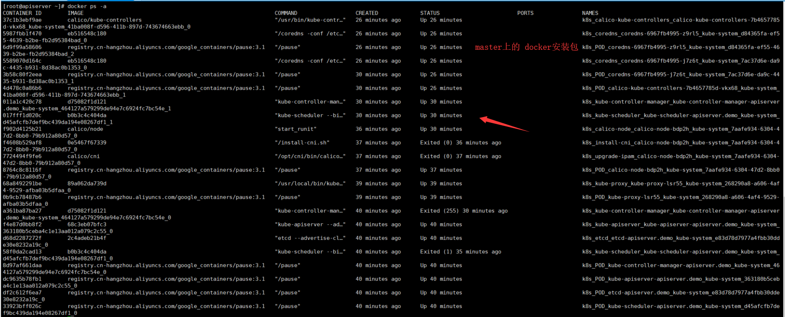

 

#  kubeadm 安装集群

[TOC]


## 1. 制作标准机镜像

标准机镜像中预装了如下内容：

- docker
- nfs-utils
- kubernetes images


### 1.1 安装docker

安装很简单，一行命令就能安装完毕了. 这里安装了docker 最新版本，kubernetes会给出一个警告

```shell
## 安装
$ curl -sSL https://get.daocloud.io/docker | sh
$ docker -v
Docker version 19.03.2, build 6a30dfc

##修改docker镜像地址，官方的镜像库连接太慢，这里转到daocloud镜像库。 
$ curl -sSL https://get.daocloud.io/daotools/set_mirror.sh | sh -s http://91c0cc1e.m.daocloud.io 

## 启动docker服务，并设置开机启动 
$ systemctl enable docker.service && service docker start
```


### 1.2 安装 nfs-utils

执行安装命令

```shell
# 在 master 节点和 worker 节点都要执行
yum install -y nfs-utils
```

必须先安装 nfs-utils 才能挂载 nfs 网络存储


### 1.3 K8S基本配置


#### 第一步、配置K8S的yum源

```shell
# 在 master 节点和 worker 节点都要执行
cat <<EOF > /etc/yum.repos.d/kubernetes.repo
[kubernetes]
name=Kubernetes
baseurl=http://mirrors.aliyun.com/kubernetes/yum/repos/kubernetes-el7-x86_64
enabled=1
gpgcheck=0
repo_gpgcheck=0
gpgkey=http://mirrors.aliyun.com/kubernetes/yum/doc/yum-key.gpg
       http://mirrors.aliyun.com/kubernetes/yum/doc/rpm-package-key.gpg
EOF
```


#### 第二步、关闭 防火墙、SeLinux、swap

```shell
# 在 master 节点和 worker 节点都要执行
systemctl stop firewalld
systemctl disable firewalld

setenforce 0
sed -i "s/SELINUX=enforcing/SELINUX=disabled/g" /etc/selinux/config

swapoff -a
yes | cp /etc/fstab /etc/fstab_bak
cat /etc/fstab_bak |grep -v swap > /etc/fstab
```


#### 第三步、修改 /etc/sysctl.conf

```shell
# 在 master 节点和 worker 节点都要执行
vi /etc/sysctl.conf
```

向其中添加

```
net.ipv4.ip_forward = 1
net.bridge.bridge-nf-call-ip6tables = 1
net.bridge.bridge-nf-call-iptables = 1
```

如下图所示


#### 第四步、使sysctl生效

```shell
# 在 master 节点和 worker 节点都要执行
sysctl -p
```


#### 第五步、安装kubelet、kubeadm、kubectl

```shell
# 在 master 节点和 worker 节点都要执行
yum install -y kubelet kubeadm kubectl
```


#### 第六步、修改docker Cgroup Driver为systemd

> 如果不修改，在添加 worker 节点时可能会碰到如下错误

```shell
[WARNING IsDockerSystemdCheck]: detected "cgroupfs" as the Docker cgroup driver. The recommended driver is "systemd". 
Please follow the guide at https://kubernetes.io/docs/setup/cri/
```

执行命令

```shell
# 在 master 节点和 worker 节点都要执行
vi /usr/lib/systemd/system/docker.service
```

向其中添加

```
--exec-opt native.cgroupdriver=systemd
```

如下图所示


第七步、重启 docker，并启动 kubelet

```shell
# 在 master 节点和 worker 节点都要执行
systemctl daemon-reload
systemctl restart docker
systemctl enable kubelet && systemctl start kubelet
```


#### 第八步、制作镜像

使用vbox做一个镜像，这样做worker就简单了


## 2. 初始化 master 节点

以 root 身份执行


### 2.1 配置 apiserver.demo 的域名

```
# 只在 master 节点执行
echo "x.x.x.x  apiserver.demo" >> /etc/hosts
```

请替换其中的 x.x.x.x 为您的  的实际 ip 地址

echo "192.168.56.107  apiserver.demo" >> /etc/hosts

### 2.2 创建 ./kubeadm-config.yaml

```shell
# 只在 master 节点执行
cat <<EOF > ./kubeadm-config.yaml
apiVersion: kubeadm.k8s.io/v1beta1
kind: ClusterConfiguration
kubernetesVersion: v1.15.1
imageRepository: registry.cn-hangzhou.aliyuncs.com/google_containers
controlPlaneEndpoint: "apiserver.demo:6443"
networking:
  podSubnet: "10.100.0.1/20"
EOF
```

podSubnet 所使用的网段不能与节点所在的**网段重叠**


### 2.3 初始化 apiserver

```shell
# 只在 master 节点执行
kubeadm init --config=kubeadm-config.yaml --upload-certs
```

根据您服务器网速的情况，您需要等候 1 – 10 分钟

> 输出结果

```
Your Kubernetes control-plane has initialized successfully!

To start using your cluster, you need to run the following as a regular user:

  mkdir -p $HOME/.kube
  sudo cp -i /etc/kubernetes/admin.conf $HOME/.kube/config
  sudo chown $(id -u):$(id -g) $HOME/.kube/config

You should now deploy a pod network to the cluster.
Run "kubectl apply -f [podnetwork].yaml" with one of the options listed at:
  https://kubernetes.io/docs/concepts/cluster-administration/addons/

You can now join any number of the control-plane node running the following command on each as root:

  kubeadm join apiserver.demo:6443 --token 0ktxl7.m1esoy8i2j8afv3z \
    --discovery-token-ca-cert-hash sha256:faa9b062bad44f287fcfba8b039255fb60ee112b0d946d064a07b185a1279f5b \
    --control-plane --certificate-key 362c077bb627b1d35418d76ddfabb650423a6f23d6a75ec0b628494a79d19a13

Please note that the certificate-key gives access to cluster sensitive data, keep it secret!
As a safeguard, uploaded-certs will be deleted in two hours; If necessary, you can use 
"kubeadm init phase upload-certs --upload-certs" to reload certs afterward.

Then you can join any number of worker nodes by running the following on each as root:

kubeadm join apiserver.demo:6443 --token 0ktxl7.m1esoy8i2j8afv3z \
    --discovery-token-ca-cert-hash sha256:faa9b062bad44f287fcfba8b039255fb60ee112b0d946d064a07b185a1279f5b 
```


### 2.4 初始化 root 用户的 kubectl 配置

```shell
# 只在 master 节点执行
rm -rf /root/.kube/
mkdir /root/.kube/
cp -i /etc/kubernetes/admin.conf /root/.kube/config
```


### 2.5 安装 calico

```shell
# 只在 master 节点执行
kubectl apply -f https://docs.projectcalico.org/v3.6/getting-started/kubernetes/installation/hosted/kubernetes-datastore/calico-networking/1.7/calico.yaml
```

> 安装calico， 请参考https://docs.projectcalico.org/v3.6/getting-started/kubernetes/

等待calico安装就绪：


### 2.6 查看容器启动状态

执行如下命令，等待 3-10 分钟，直到所有的容器组处于 Running 状态

```shell
# 只在 master 节点执行
watch kubectl get pod -n kube-system
```

中间不要使用ctrl+c来结束命令，可能要等待10分钟，系统会初始化完毕。


### 2.7 检查 master 初始化结果

在 master 节点 demo-master-a-1 上执行

```shell
# 只在 master 节点执行
kubectl get nodes
```


`docker ps -a` 查看安装的内容



`docker images`


## 3. 初始化 worker节点


### 3.1 通过镜像生成虚拟机


- 启动虚拟机，并配置网络ifcfg-enp0s8，有两个地方要修改

  - `vi /etc/sysconfig/network-scripts`
  - IPADDR =192.168.56.***
  - UUID 改成与其他不同就可以了

  

### 3.2 设置hosts与hostname


每个机器的名字**应该都不一样**，这样好管理

```shell
hostnamectl set-hostname worker01.demo 
hostname
```


针对所有的 worker 节点执行

```shell
# 只在 worker 节点执行
echo "x.x.x.x  apiserver.demo" >> /etc/hosts
```

- 将 x.x.x.x 替换为 demo-master-a-1 的实际 ip,例如

```
echo "192.168.56.105  apiserver.demo" >> /etc/hosts
ping -c 2 apiserver.demo
```


### 3.3 获得 join命令参数

在 master 节点执行

```shell
# 只在 master 节点执行
kubeadm token create --print-join-command
```

会得到一个字符串


### 3.4 初始化worker

将从master上得到的字符串，复制过来，并执行


```shell
# 只在 worker 节点执行
kubeadm join apiserver.demo:6443 --token m09bzr.pstzjimrusxmzlw5     --discovery-token-ca-cert-hash sha256:faa9b062bad44f287fcfba8b039255fb60ee112b0d946d064a07b185a1279f5b
```


### 3.5 检查初始化结果

在 master 节点上执行

```shell
# 只在 master 节点执行
kubectl get pod -n kube-system
kubectl get nodes
```


### 3.6 移除节点(可选)

在准备移除的 worker 节点上执行

```shell
# 只在 worker 节点执行
kubeadm reset
```

在 master 节点 demo-master-a-1 上执行

```shell
# 只在 master 节点执行
kubectl delete node demo-worker-x-x
```

- 将 demo-worker-x-x 替换为要移除的 worker 节点的名字
- worker 节点的名字可以通过在节点 demo-master-a-1 上执行 kubectl get nodes 命令获得


## 4. 安装dashboard

* [官方说明地址](https://kubernetes.io/docs/tasks/access-application-cluster/web-ui-dashboard/)
* [Kubernetes Dashboard的安装与坑](https://www.jianshu.com/p/c6d560d12d50)

```shell
kubectl apply -f https://raw.githubusercontent.com/kubernetes/dashboard/v2.0.0-beta4/aio/deploy/recommended.yaml
```


## 参考文档

* 安装相关
  * [Kubernetes的几种主流部署方式01-minikube部署](https://segmentfault.com/a/1190000018607114)
  * [最简单的kubernetes入门实验教程](https://www.jianshu.com/p/f4c2104ba90a)
    - 使用了kubeadm一步安装
  * [Kubernetes中文社区](http://docs.kubernetes.org.cn/)
  * [Kubernetes 安装文档推荐](https://www.kubernetes.org.cn/5650.html)
  * [10分钟搭建Kubernetes容器集群平台（kubeadm）](https://blog.51cto.com/lizhenliang/2296100?tdsourcetag=s_pcqq_aiomsg)
* 基础知识
  * [Kubernetes中文社区 | 中文文档](http://docs.kubernetes.org.cn/)
  * [使用 Docker Alpine 镜像安装 nginx](https://www.cnblogs.com/klvchen/p/11015267.html)

