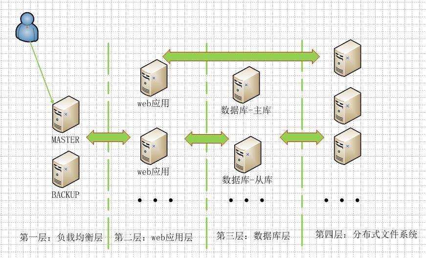

# Kubernetes应用场景


##  高可用弹性网站系统


> 系统架构图



假设第二层，web应用层有10台服务器，在日常的运行中会遇到很多问题：

```
1. 负载均衡+故障处理+可用性探测
   1. 1 如果其中一台web应用，断网了，负载均衡能不去访问吗？
   1. 2 如果其中一台正在启动，但是应用没有启动，怎么不去访问？
   1. 3 其中一台机器出现故障，怎么重新启动？
   1. 4 其中一台机器出现故障，怎么能重新给他装系统。
   1. 5 可用性探测：机器已经启动+服务启动，怎么处理？
2. 弹性部署：原有服务不停止情况下
   2. 1 如何快速增加10台web服务
   2. 2 如何快速减少5台web服务
   2. 3 如何自动根据访问的流量，自动增加或减少服务器。
3. 不间断性升级
   3. 1 如何分批的将10台web服务器的代码从1.0升级到2.0
   3. 2 发现错误后，如何从2.0回滚到1.0
4. 如何进行AB测试，10个web服务器中，5个版本是v1,另外5个是v2   
```


## pod管理


### pod控制器

* Deployment：
* DaemonSet：例如在某个节点安装一个后台的日志采集系统
* Job：只定时执行
* Cronjob：
* StatefulSet:
  * 单个节点宕机，要重新起来，例如定义redis ,mysql
  * 要自己写脚本，来进行特殊处理，例如mysql宕机了，在启动的时候，应备份并放在新的服务器上。
  * 这种模式运维的成本非常高。