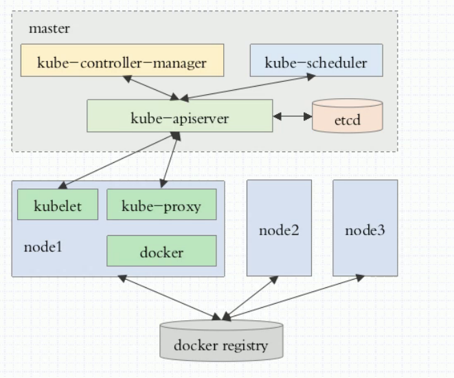
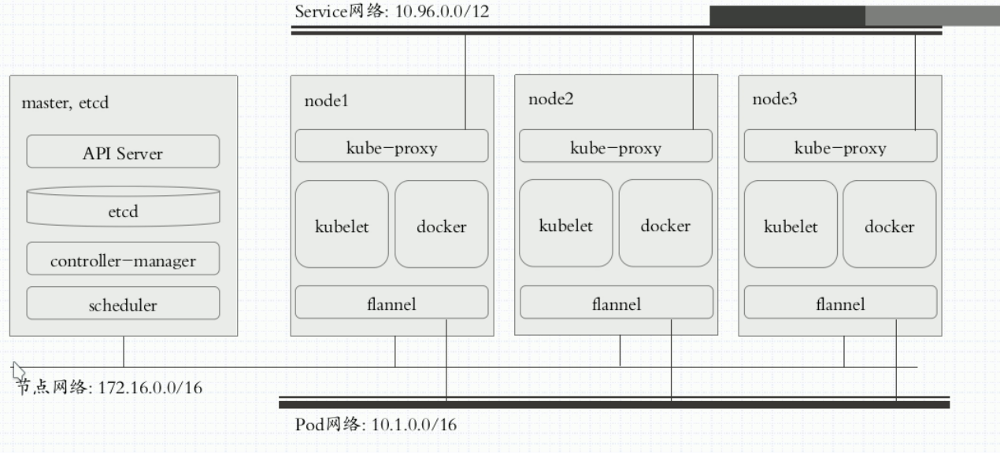
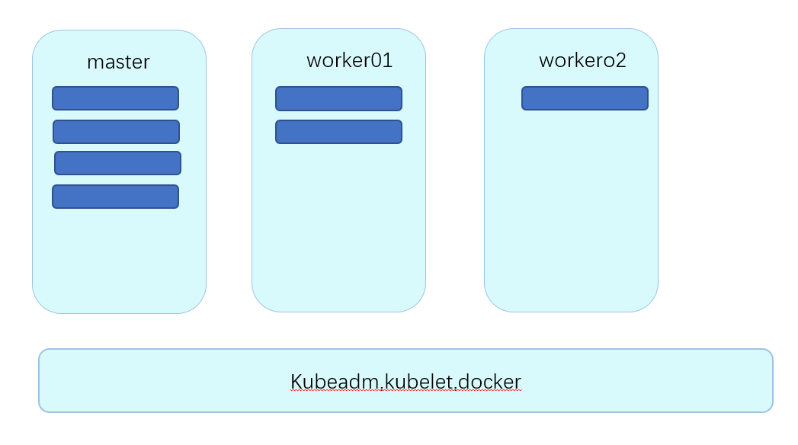

# Kubernetes

官网：https://kubernetes.io/zh

## 1. 介绍

### 背景

* 编排功能
  * docker swarm
  * kubernetes

* 应用程序架构
  * DevOps：自动交付
    * CI持续集成:提交到gitlab上后，自动编译。
    * CD持续交付
  * MicroServices
  * Blockchain
* kubernetes特性
  * 自动装箱
  * 自动修复
  * 自动实现水平扩展
  * 自动服务发现
  * 自动负载均衡
  * 自动发布与回滚
  * 密钥与配置管理（在配置中心配置每个容器的环境变量）
  * 存储编排
  * 批量处理执行

### 周边生态

- [docker](https://www.orchome.com/docker/index)
- [kubeadm](https://www.orchome.com/kubeadm/index)
- [kubeflow](https://www.orchome.com/kubeflow/index)
- [kompose](https://www.orchome.com/kompose/index)
- [istio](https://www.orchome.com/istio/index)

### 相关术语

* master/node
  * master:APIServier Scheduler Controller-Manger
  * node: kubelet，docker，
* Pod , Label,Label selector
  * Label:key=value格式
  * Label Selector:
* Pod
  * 自助式Pod
  * 控制器管理的Pod(推荐)
    * ReplicationController
    * ReplicaSet
    * Deployment(HPA自动水平扩展)
    * statefulSet
    * DaemonSet
    * Job.Ctonjob

## 2. 安装

我了解的有三种：

* minikube
  * 单机版用来测试的，先不用管。
* kubeadm
  * 将kubernetes的主要组件，以docker的形式来安装
* 二进制安装
  * 将kubernetes直接安装在linux的守护进行，不安装在docker上。

二进制安装很复杂，minikube有体现不了多服务器的功能。 所以选择kubeadm安装，安装还是需要一些步骤的，所以我单独写了一个[kubeadm安装指南](kubernetes-kubeadm.md)

## 3. 系统架构

> 系统架构图

> 部署设计图

以上二进制的部署，github上有自动脚本，可以进行部署。

kubelet运行pod的核心组件

> kubeadm部署架构图

1. master +nodes :安装kubelet kubeadm docker
2. master:kubeadm init
3. nodes:kubeadm jion

## 参考文档

* [Kubernetes的几种主流部署方式01-minikube部署](https://segmentfault.com/a/1190000018607114)
* [最简单的kubernetes入门实验教程](https://www.jianshu.com/p/f4c2104ba90a)
  * 使用了kubeadm一步安装
* [Kubernetes中文社区](http://docs.kubernetes.org.cn/)
* [Kubernetes 安装文档推荐](https://www.kubernetes.org.cn/5650.html)
* [10分钟搭建Kubernetes容器集群平台（kubeadm）](https://blog.51cto.com/lizhenliang/2296100?tdsourcetag=s_pcqq_aiomsg)

