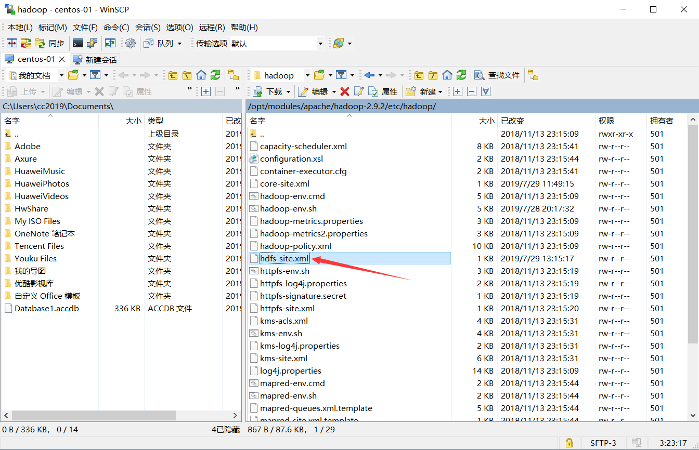
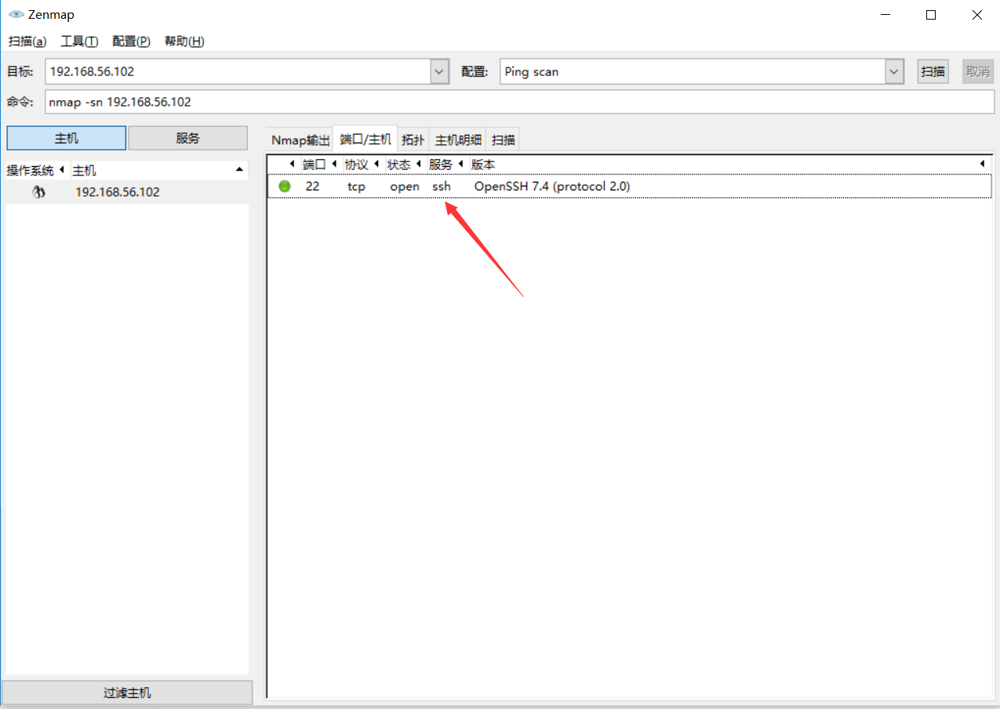
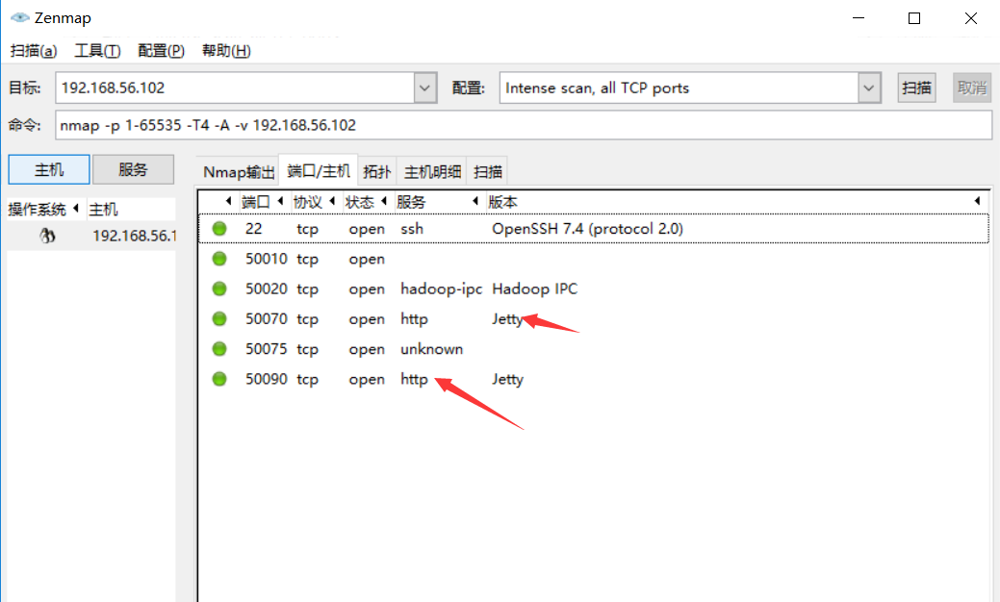

# linux 简化命令

linux版本是:centos7

着部分主要是为了操纵hadoop可能用到的命令做的一个总结。

> 目录


## 客户端工具

大部分时间会使用winows来登录linux，这个就需要下面三个大名鼎鼎的工具。

| 分类     | 名称   | 说明                                |
| -------- | ------ | ----------------------------------- |
| 登录工具 | puTTY  | linux登录工具                       |
| 文件工具 | winscp | 方便编辑配置文件，https://winscp.ne |
| 嗅探器   | nmap   | 嗅探器 https://nmap.org/            |

> winscp 可以方便编辑linux上的配置文件

双击文件，就可以方便的编辑服务器的配置文件了。




> nmap 一般可以看服务器开放了那些端口




##  防火墙

有时候启动了一个8080端口，或者hadoop-web的50070端口在外网是无法访问的。这时候需要配置放火墙。

`centos7`使用的是`firewalld`,`centos6`使用的是`iptables`。


```shell
# 查看防火墙的状态
$ firewall-cmd --state
# 如果上一步处于关闭状态，输入命令. 当然有的hadoop教程中说，可以关闭防火墙
$ systemctl start firewalld.service
# 查看当前端口
$ firewall-cmd --list-all
# 开放端口 50070
$ firewall-cmd --zone=public --add-port=50070/tcp --permanent
$ firewall-cmd --reload
# 查看当前端口
$ firewall-cmd --list-all
```


> 关于firewall命令的解释

```
让我们来解释一下上一个命令：
--zone=public：表示作用域为公共的；
--add-port=8080/tcp：添加tcp协议的端口8080；
--permanent：永久生效，如果没有此参数，则只能维持当前服务生命周期内，重新启动后失效；
```

> 参考文档

* [Centos7.3防火墙配置](https://www.cnblogs.com/xxoome/p/7115614.html)

为了查看机器的端口，可以关闭防火墙后，使用`nmap`进行查看。




## 网络管理


### 修改hostname

```shell
$ hostnamectl set-hostname ***
```


### 修改hosts

```shell
vi /etc/hosts
```


## 用户权限管理


### 新建管理用户

在实际的管理过程中，一般不使用root用户，会建立一个新用户。这样就会有几个问题

* 如何将一些root才可以操作的命令给新用户? 例如重启命令
  * 使用：`visudo` 命令进行配置
  * 实际使用了` /etc/sudoers`
* 如何切换到`root`用户或其他用户?
  * 使用：`su - 用户名`   来操作
  * 操作完毕后要`exit`退出，而不是su回去。
* 如何修改目录或者文件的权限？
  * `chmod 766 目录名或文件名`
  * chown与chgrp也可以使用