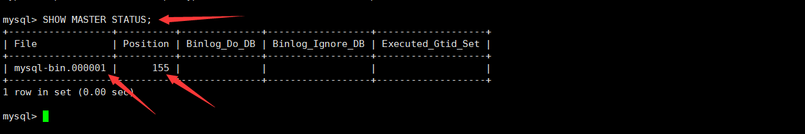
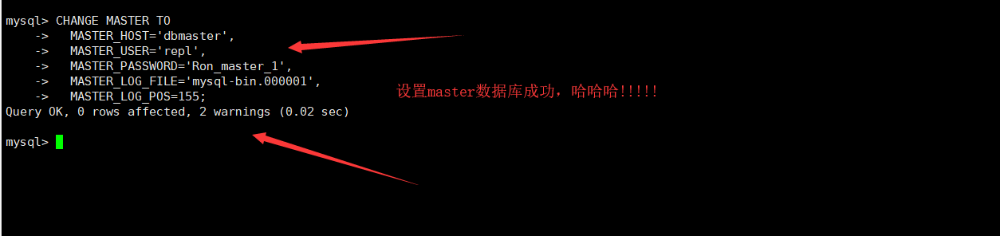
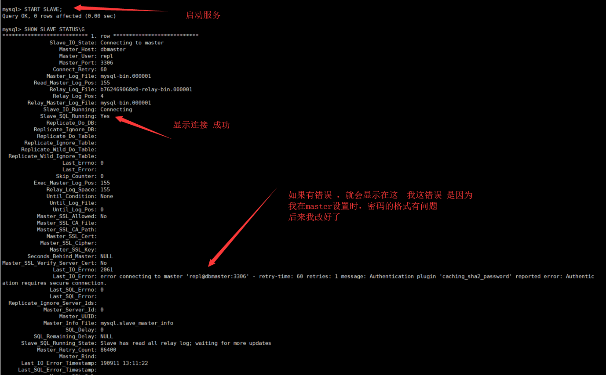
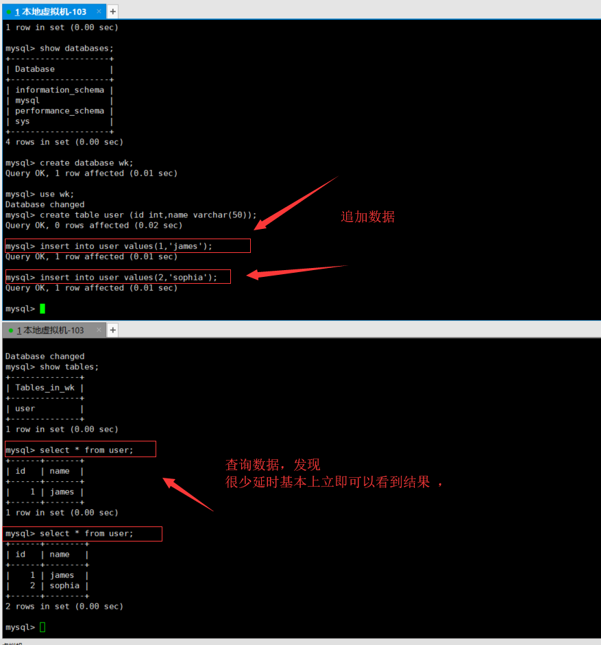
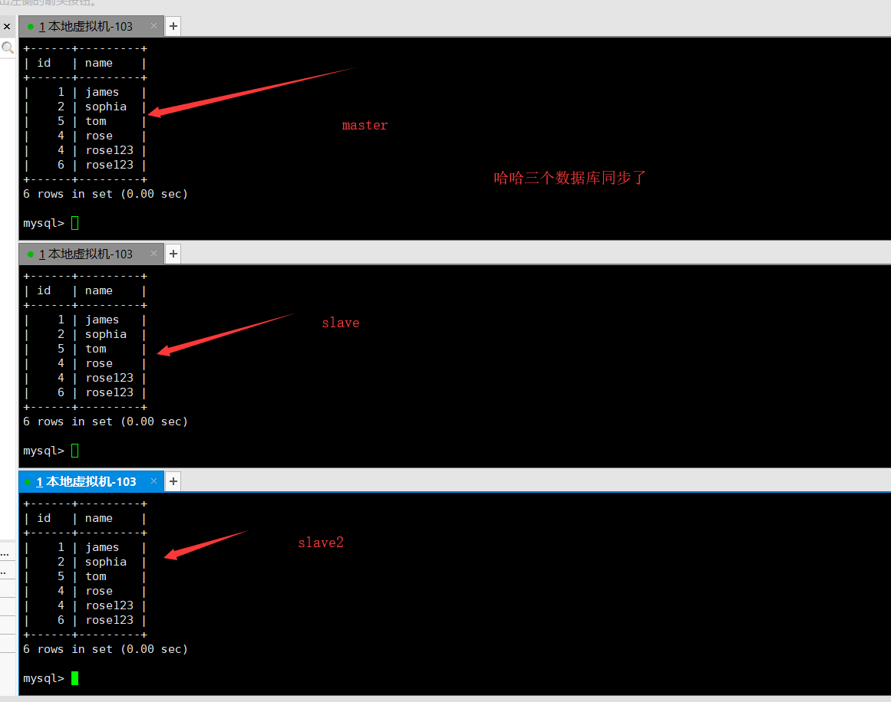

# mysql的主从设置

进行主从配置时，[看官方文档安心](https://dev.mysql.com/doc/refman/8.0/en/replication.html)，看百度搜索出来的文章糟心，按照网友的写法，好多都不好用。

当前使用的版本是

```
mysql  Ver 8.0.17 for Linux on x86_64 (MySQL Community Server - GPL)
```


## 二进制复制


参考文档：[MySQL——复制(Replication)](https://www.cnblogs.com/aaron911/p/11008057.html)


### 配置Master


#### 第一步、建立数据库

```shell
# 设置 默认密码 123456
docker run --name mysql-m  -v /container_data/mysql-m/data:/var/lib/mysql -v /container_data/mysql-m/conf:/etc/mysql/conf.d -e MYSQL_ROOT_PASSWORD=123456  -d  mysql


# 登录到容器的机器上
docker exec -it mysql-m  /bin/bash

# 登录成功后，可以
mysql -uroot -p123456

# 配置用户
msyql>CREATE USER 'repl' IDENTIFIED WITH mysql_native_password BY 'Ron_master_1';

msyql> GRANT REPLICATION SLAVE ON *.* TO 'repl'@'%';
msyql> flush privileges;
msyql> SHOW GRANTS FOR repl;
```

注：如果你没有启动


#### 第二步、修改配置文件

在`/etc/mysql/conf.d`中新建立一个配置文件`vi master.cnf`，并添加如下配置

```
[mysqld]
log-bin=mysql-bin
server-id=1
```


#### 第三步、重启mysql，并查看日志点

```shell
# 重启mysql-m
docker restart mysql-m

# 登录到容器的机器上
docker exec -it mysql-m  /bin/bash

# 登录成功后，可以
mysql -uroot -p123456

msyql> SHOW MASTER STATUS;
```





注释：一下内容要记下来：`mysql-bin.000001`与`155`


### 配置slave


#### 第一步、建立数据库

```shell
# 设置 默认密码 123456
docker run --name mysql-s --link mysql-m:dbmaster  -v /container_data/mysql-s/data:/var/lib/mysql -v /container_data/mysql-s/conf:/etc/mysql/conf.d -e MYSQL_ROOT_PASSWORD=123456  -d  mysql

```


#### 第二步、修改配置文件

在`/etc/mysql/conf.d`中新建立一个配置文件`vi slave.cnf`，并添加如下配置

```
[mysqld]
server-id=2

log_bin=mysql-bin
relay_log=mysql-relay-bin
log_slave_updates=1
read_only=1
```


#### 第三步、重启mysql

犯懒了，直接重启slave

```shell
# 重启mysql-m
docker restart mysql-s
```


#### 第四步、连接到slave


```
# 登录到容器的机器上
docker exec -it mysql-s  /bin/bash

# 登录成功后，可以
mysql -uroot -p123456

```


```sql
CHANGE MASTER TO
  MASTER_HOST='dbmaster',
  MASTER_USER='repl',
  MASTER_PASSWORD='Ron_master_1',
  MASTER_LOG_FILE='mysql-bin.000001',
  MASTER_LOG_POS=155;
```





#### 第五步、启动slave服务

```sql
mysql>START SLAVE;
mysql>SHOW SLAVE STATUS\G
```





### 测试效果


#### 第一步、编辑master数据

```shell
# 登录到容器的机器上
docker exec -it mysql-m  /bin/bash

# 登录成功后，可以
mysql -uroot -p123456
> show databases;
> create database wk;
> use wk;
> show tables;
> create table user (id int,name varchar(50));
> insert into user values(1,'james');
> insert into user values(2,'sophia');
> select * from user;
```


#### 第二步、查看slave数据

#### 

```shell
# 登录到容器的机器上
docker exec -it mysql-s  /bin/bash

# 登录成功后，可以
mysql -uroot -p123456
> use wk;
> select * from user;
```

没有网上说的同步间隔时间是一分钟的。




### 思考问题

1. 如何监控slave的状况，出现错误如何报警
2. 如何查看复制过程中的错误
3. 如何将slave设置成只读
4. 对master服务器设置时，以下参数的作用

```
The following options also have an impact on the replication master:

For the greatest possible durability and consistency in a replication setup using InnoDB with transactions, you should use innodb_flush_log_at_trx_commit=1 and sync_binlog=1 in the replication master's my.cnf file.

Ensure that the skip-networking option is not enabled on the replication master. If networking has been disabled, the slave cannot communicate with the master and replication fails.
```

5. 如何在slave中的数据在传递给下一个服务器`A -> B -> C`
6. 在进行数据切换时，如何让master服务器不能写入数据

```
mysql> FLUSH TABLES WITH READ LOCK;
mysql> UNLOCK TABLES;

让发出FLUSH TABLES语句的客户端保持 运行状态，以使读锁定保持有效。如果退出客户端，则会释放锁定。
```

7. 出现故障后，如果将从变成主服务


### 再添加一个slave

已经有一个slave,如果要添加一个，最秀的方案就是：

* 不停止master
* 停止slave，将slave复制一份。
* 然后启动两个slave


#### 第一步、停止第一个slave

```shell
# 登录到容器的机器上
docker exec -it mysql-s  /bin/bash

# 登录成功后，可以
mysql -uroot -p123456

# 关闭slave
mysql> STOP SLAVE;
mysql> SHOW SLAVE STATUS\G
mysql> exit

# 退到宿主机器
exit

# 关闭docker slave
docker stop mysql-s

```

注：这时候，可以在master中添加一个条数据`insert into user values(5,'tom');`


#### 第二步、复制第一个slave的数据

```shell
# 进入数据目录
cd /container_data

# 复制出来mysql的数据
cp -r mysql-s mysql-s2

# 删除自动生成的mysql的uuid，不然就跟第一个重复
cd mysql-s2/data
rm -f auto.cnf


# 进入配置目录
cd /container_datamysql-s2/conf

# 配置server-id=3
vi slave.cnf
```

修改`slave.cnf`总的`server-id`

```
server-id=3
```


#### 第三步、安装新的slave2

```shell
# 设置 默认密码 123456
docker run --name mysql-s2 --link mysql-m:dbmaster  -v /container_data/mysql-s2/data:/var/lib/mysql -v /container_data/mysql-s2/conf:/etc/mysql/conf.d -e MYSQL_ROOT_PASSWORD=123456  -d  mysql


# 登录到容器的机器上
docker exec -it mysql-s2  /bin/bash

# 登录成功后，可以do
mysql -uroot -p123456

# 查看同步状态
# 如果没有启动，那么启动：mysql>START SLAVE;
mysql>SHOW SLAVE STATUS\G
```


#### 第四步、启动第一个slave

```shell
docker start mysql-s
docker exec -it mysql-s  /bin/bash
# 登录成功后，可以do
mysql -uroot -p123456

# 查看同步状态
mysql>SHOW SLAVE STATUS\G
```


#### 第五步、测试

进入master ，添加两条数据，就发现可以同步到两个数据库中了。




### 如何使单点-->主从

有这么一种情况，以前单机使用了mysql好多年，突然想切换到主从，怎么做。

大概步骤如下：

* 停掉-master
* 配置master，参考【配置master】。
* 安装slave
  * 将master的数据文件复制出来，放到一个新的目录中。
  * 删除这个目录中的auto.cnf，不然会出现错误
  * 安装slave，将data目录设置到新的目录中
  * 同时配置slave文件，参考【配置slave】
* 启动-master
* 启动slave
* 测试一下


## 相关资料

复制有两种方法，在msyql8以前是用二进制复制的方法，在mysql8以后，推出了一种新的复制方法：【使用全局事务标识符进行复制】，这个的好处是：

- 极大地简化了任务，在启动新从站或故障转移到新主站时使用GTID来引用日志文件或这些文件中的位置是不必要的


[MySQL——复制(Replication)](https://www.cnblogs.com/aaron911/p/11008057.html)

[GTID主从 与 传统主从复制](https://www.cnblogs.com/Confession/p/7777577.html)

