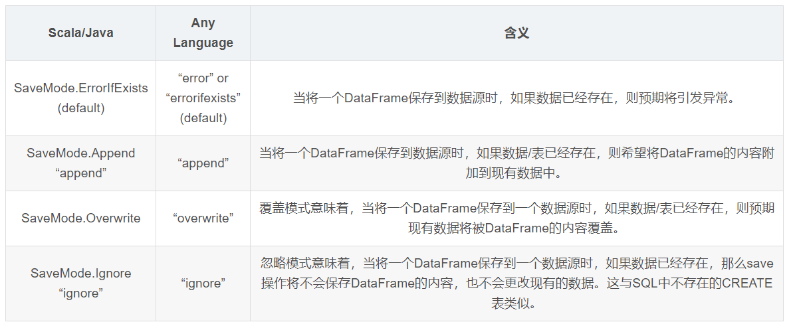
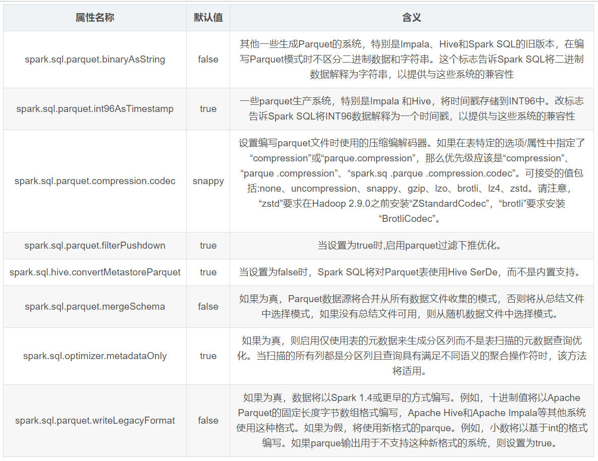
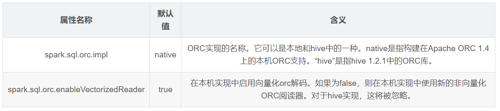
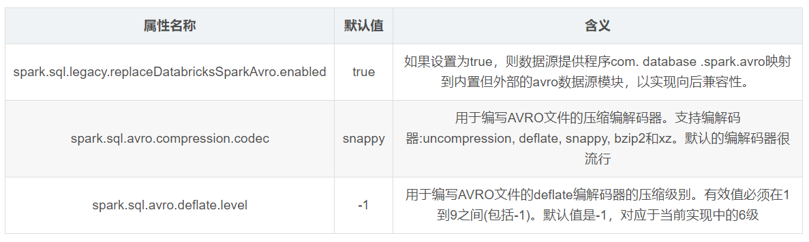

#  Spark Sql DateSet DateFrame编程指南


## 1. RDD DataFrame DataSet

- RDD 最原始的数据集，以一行为单位
- DataFrames 带有schema元数据
  - 知道每一列的名称与类型
- DataSet
  - 可以使用map，flatmap等函数进行转换
  - DataFrame是一个Dataset的特例，等价于Dataset[Row]; 
  - Dataset的操作分为transformation和action 两种，transformation用于创建新的Dataset，而action用于计算操作；
  - 它和RDD一样具有惰性，只有action操作被调用的时候才会进行计算；
  - DataSet创立需要一个显式的Encoder，把对象序列化为二进制

### 1.1 相同点

- RDD、DataFrame、Dataset全都是spark平台下的分布式弹性数据集
- 三者都有惰性机制，在进行创建、转换，如map方法时，不会立即执行。只有在执行action操作的时候，才会进行计算。


### 1.2. 不同点

> RDD和 DataFrame的比较

- 前者没有schema信息；后者有schema信息
- RDD无法得知所存的数据元素的具体内部结构，Spark Core只能在stage层面进行简单的优化；后者因为有schema信息，Sparl SQL的查询优化器就可以进行针对性的优化
- RDD通过函数式调用API，虽然简洁明了，但是需要创建新的对象，不容易重用旧的对象，给GC带来挑战；DataFrame是尽可能的重用对象


> DataFrame和 Dataset的比较

- DataFrame是带有类型的，即需要指定类型；但是DataSet无需指定类型。DataFrame是一个Dataset的特例，等价于Dataset[Row]
- DataFrame带有schema，而DataSet没有schema


### 1.3. 三者相互转换


#### 1.3.1 创建RDD

```scala
//创建rdd
val rdd=sc.makeRDD(List("Mina,19","Andy,30","Michael,29"))

```


#### 1.3.2 RDD与DataFrame互转


##### 1.3.2.1 使用toDF("fieldName1","fieldName2")函数

通过`.toDF("name","age")`

```
import spark.implicits._

//RDD转换成DataFrame
val　df=　rdd.map{x=>val par=x.split(",");(par(0),par(1).toInt)}.toDF("name","age")
df.show
```


##### 1.3.2.2 通过一个Java类转

```scala
case class Person(name:String,age:Int)
val df = rdd.map{x => val par = x.split(",");Person(par(0),par(1).toInt)}.toDF
df.show
```


##### 1.3.2.3. DataFrame转RDD

df.rdd 返回的是 RDD[Row] 如果需要获取Row中的数据，那么可以通过`getString(0)  getAs[String]("name")   `

```
df.rdd.map(x=>x.getAs[String]("name")).collect
```


#### 1.3.3 RDD与DataSet互转


##### 1.3.3.1. 使用calss类

将toDF换成toDS

```shell
val ds = rdd.map{x => val par = x.split(",");Person(par(0),par(1).trim().toInt)}.toDS
```


##### 1.3.3.2. DataSet转换成RDD

ds.rdd 返回的是 RDD[Person] 直接读取Person的属性即可

```shell
ds.rdd
ds.rdd.map(_.name).collect
```


#### 1.3.4 DataFrame与DataSet互转

##### 1.3.4.1 DataSet转换成DataFrame

```scala
val df =ds.toDF
```


####1.3.4.2 DataFrame转换成DataSet

df.as[Person] 注意 dataframe中的列名和列的数量应该和case class 一一对应

```shell
case class Person(name:String,age:Int) 
val ds=df.as[Person]
```


## 2. 开始


## 3. 数据源

Spark SQL通过DataFrame接口对各种数据源进行操作。

DataFrame可以使用`relational transformations `进行操作，也可以用于创建临时视图。通过临时视图可以运行SQL查询。

本节介绍使用Spark数据源加载和保存数据的一般方法，然后介绍可用于内置数据源的特定选项。

[官方文档](http://spark.apache.org/docs/latest/sql-data-sources.html)

### 3.1. 通用数据加载与保存函数

http://spark.apache.org/docs/latest/sql-data-sources-load-save-functions.html

#### 3.1.1 手动指定参数

可以支持的文件格式： (`json`, `parquet`, `jdbc`, `orc`, `libsvm`, `csv`, `text`)

例如：

```scala
val peopleDF = spark.read.format("json").load("examples/src/main/resources/people.json")
peopleDF.select("name", "age").write.format("parquet").save("namesAndAges.parquet")

val peopleDFCsv = spark.read.format("csv")
  .option("sep", ";")
  .option("inferSchema", "true")
  .option("header", "true")
  .load("examples/src/main/resources/people.csv")

usersDF.write.format("orc")
  .option("orc.bloom.filter.columns", "favorite_color")
  .option("orc.dictionary.key.threshold", "1.0")
  .save("users_with_options.orc")


```

也有另外一种写法

```scala
val df = spark.read.json(resourcePath+"/people.json")
```


#### 3.1.2 sql中指定要读取的文件

```scala
val sqlDF = spark.sql("SELECT * FROM parquet.`examples/src/main/resources/users.parquet`")
```


#### 3.1.3 保存的模式




#### 3.1.4 保存持久表中

DataFrames还可以使用saveAsTable命令作为持久化表保存到Hive metastore中。请注意，使用此功能不需要使用现有的Hive部署。Spark将为您创建一个默认的本地Hive metastore(使用Derby)。与createOrReplaceTempView命令不同，saveAsTable将实现DataFrame的内容，并创建一个指向Hive metastore中的数据的指针。
即使在Spark程序重新启动之后，只要您保持到相同转移服务器的连接，持久性表仍然存在。通过使用表名在SparkSession上调用表方法，可以为持久表创建一个DataFrame。
对于基于文件的数据源，如text, parquet, json等，可以通过path选项指定自定义表路径，如df.write.option(“path”, “/some/path”).saveAsTable(“t”)。删除表时，自定义表路径不会被删除，表数据仍然存在。如果没有指定自定义表路径，Spark将把数据写入仓库目录下的默认表路径。删除表时，默认的表路径也将被删除。
从Spark 2.1开始，持久数据源表在Hive metastore中存储了每个分区的元数据。这带来了几个好处:
由于metastore只能为查询返回必要的分区，因此不再需要在第一个查询中发现表中的所有分区。

Hive DDLs，比如ALTER TABLE PARTITION…SET LOCATION现在可用于使用数据源API创建的表。


#### 3.1.5 木桶，排序，分区

对于文件类型数据源，也可以对输出进行存储、排序或者分区。存储和排序仅适用于持久表。

```css
peopleDF.write.bucketBy(42, "name").sortBy("age").saveAsTable("people_bucketed")
```

可以使用DataSet API的 save和saveAsTable方法来进行分区操作

```css
usersDF.write.partitionBy("favorite_color").format("parquet").save("namesPartByColor.parquet")
```

对于单表，也可以同时使用分区和bucket操作

```css
usersDF
  .write
  .partitionBy("favorite_color")
  .bucketBy(42, "name")
  .saveAsTable("users_partitioned_bucketed")
```

partitionBy方法按照Partition Discovery中的描述来创建目录结构。因此，它对具有高基数的列的适用性有限制。相比之下，BucketBy方法可以在固定数量的buckets分配数据，并且可以在许多唯一值无限制时使用。


###3.2 Parquet Files

Parquet 是一种列式储存的格式，它受到许多其他数据处理系统的支持。Spark SQL支持读取和写入Parquet 文件，这些文件自动保存原始数据的模式。在编写Parquet 文件时，出于兼容性原因，所有列都自动转换为空。


##### 加载数据

```scala
// Encoders for most common types are automatically provided by importing spark.implicits._
import spark.implicits._

val peopleDF = spark.read.json("examples/src/main/resources/people.json")

// DataFrames can be saved as Parquet files, maintaining the schema information
peopleDF.write.parquet("people.parquet")

// Read in the parquet file created above
// Parquet files are self-describing so the schema is preserved
// The result of loading a Parquet file is also a DataFrame
val parquetFileDF = spark.read.parquet("people.parquet")

// Parquet files can also be used to create a temporary view and then used in SQL statements
parquetFileDF.createOrReplaceTempView("parquetFile")
val namesDF = spark.sql("SELECT name FROM parquetFile WHERE age BETWEEN 13 AND 19")
namesDF.map(attributes => "Name: " + attributes(0)).show()
// +------------+
// |       value|
// +------------+
// |Name: Justin|
// +------------+
```

"examples/src/main/scala/org/apache/spark/examples/sql/SQLDataSourceExample.scala"


##### 分区

表分区是Hive等系统中常用的优化方法。在分区表中，数据通常存储在不同的目录中，分区列值编码在每个分区目录的路径中。所有内置的文件源(包括文本/CSV/JSON/ORC/Parquet)都能够自动发现和推断分区信息。例如，我们可以使用以下目录结构将所有以前使用的人口数据存储到分区表中，其中两个额外的列，性别和国家作为分区列:

```
path
└── to
    └── table
        ├── gender=male
        │   ├── ...
        │   │
        │   ├── country=US
        │   │   └── data.parquet
        │   ├── country=CN
        │   │   └── data.parquet
        │   └── ...
        └── gender=female
            ├── ...
            │
            ├── country=US
            │   └── data.parquet
            ├── country=CN
            │   └── data.parquet
            └── ...
```

通过传递path/to/table到SparkSession.read.parquet 或 SparkSession.read.load。加载后，Spark SQL将自动从路径中提取分区信息。现在返回的DataFrame的模式变成:

```
root
|-- name: string (nullable = true)
|-- age: long (nullable = true)
|-- gender: string (nullable = true)
|-- country: string (nullable = true)
```

注意，分区列的数据类型是自动推断的。目前，支持数字数据类型、日期、时间戳和字符串类型。对于这些用例，你可以通过 spark.sql.sources.partitionColumnTypeInference.enabled方式配置自动类型推断, 默认为true。禁用类型推断时，分区列将使用string类型。

从Spark 1.6.0开始，默认情况下，分区发现只能在给定路径下找到分区。对于上面的例子，如果用户传递 path/to/table/gender=male 到SparkSession.read.parquet 或 SparkSession.read.load加载时，不会将性别视为分区列。如果用户需要指定分区发现应该开始的基本路径，他们可以在数据源选项中设置basePath。例如，当path/to/table/gender=male是数据的路径，用户将basePath设置为path/to/table/时，gender将是一个分区列。

##### 元数据合并(Schema Merging)

像Protocol Buffer、Avro和Thrift一样，Parquet也支持模式演化。用户可以从一个简单的模式开始，然后根据需要逐渐向该模式添加更多的列。这样，用户可能会得到多个具有不同但相互兼容的模式的Parquet文件。Parquet数据源现在能够自动检测这种情况并合并所有这些文件的模式。

由于模式合并是一个相对昂贵的操作，而且在大多数情况下不是必需的，因此Spark从1.5.0版本开始默认关闭它。你可以通过:
(1).读取parquet地板文件时，将数据源选项mergeSchema设置为true(如下面的示例所示);
(2).设置全局SQL选项spark.sql.parquet.mergeSchema为true。

```scala
// 这用于隐式地将RDD转换为DataFrame。
import spark.implicits._

// 创建一个简单的DataFrame，存储到分区目录中
val squaresDF = spark.sparkContext.makeRDD(1 to 5).map(i => (i, i * i)).toDF("value", "square")
squaresDF.write.parquet("data/test_table/key=1")

// 在新的分区目录中创建另一个DataFrame,添加新列并删除现有列
val cubesDF = spark.sparkContext.makeRDD(6 to 10).map(i => (i, i * i * i)).toDF("value", "cube")
cubesDF.write.parquet("data/test_table/key=2")

// 读取分区表
val mergedDF = spark.read.option("mergeSchema", "true").parquet("data/test_table")
mergedDF.printSchema()

// 最后的模式由parquet文件中的所有3列组成
// 分区列出现在分区目录路径中
// root
//  |-- value: int (nullable = true)
//  |-- square: int (nullable = true)
//  |-- cube: int (nullable = true)
//  |-- key: int (nullable = true)
```


##### Hive元数据Parquet表的转换

当从Hive元数据的Parquet 表读取和写入数据时，Spark SQL将尝试使用自己的Parquet 支持，而不是Hive SerDe，以获得更好的性能。这个行为由spark.sql.hive.convertMetastoreParquet配置，并在默认情况下打开。


##### 配置(Configuration)

可以使用SparkSession上的setConf方法或使用SQL运行SET key=value命令来配置Parquet 。




###3.3. ORC Files

从Spark 2.3开始，Spark支持一个矢量化的ORC阅读器，并为ORC文件提供一种新的ORC文件格式。为此，新添加了以下配置。当spark.sql.orc.impl被设置为native并且 spark.sql.orc.enableVectorizedReader 设置为true，向量化阅读器用于本机ORC表(例如，使用ORC子句创建的表)。对于Hive ORC serde表(例如，使用Hive选项(fileFormat ‘ORC’)创建的子句)，当spark.sq . Hive.convertMetastoreOrc也设置为true时矢量阅读器被使用。



###3.4. JSON Files

Spark SQL可以自动推断JSON数据集的模式，并将其加载为数据集[Row]。这个转换可以在数据集[String]或JSON文件上使用SparkSession.read.json()来完成。
注意，作为json文件提供的文件不是典型的json文件。每行必须包含一个单独的、自包含的有效JSON对象。有关更多信息，请参见JSON行文本格式，也称为以新行分隔的JSON。

对于常规的多行JSON文件，将多行选项设置为true。
Scala代码:

```scala
// 在创建数据集时，通过导入基本类型(Int、String等)和Product类型(样例类)编码器可以得到支持。
import spark.implicits._

// JSON数据集由路径指向。路径可以是单个文本文件，也可以是存储文本文件的目录.
val path = "examples/src/main/resources/people.json"
val peopleDF = spark.read.json(path)

// 可以使用printSchema()方法可视化推断出的模式
peopleDF.printSchema()
// root
//  |-- age: long (nullable = true)
//  |-- name: string (nullable = true)

// 使用DataFrame创建临时视图
peopleDF.createOrReplaceTempView("people")

// 可以使用spark提供的SQL方法运行SQL语句
val teenagerNamesDF = spark.sql("SELECT name FROM people WHERE age BETWEEN 13 AND 19")
teenagerNamesDF.show()
// +------+
// |  name|
// +------+
// |Justin|
// +------+

// 可以为JSON数据集创建一个DataFrame，该数据集由每个字符串存储一个JSON对象的数据集[String]表示
val otherPeopleDataset = spark.createDataset(
  """{"name":"Yin","address":{"city":"Columbus","state":"Ohio"}}""" :: Nil)
val otherPeople = spark.read.json(otherPeopleDataset)
otherPeople.show()
// +---------------+----+
// |        address|name|
// +---------------+----+
// |[Columbus,Ohio]| Yin|
// +---------------+----+
```


###3.5. Hive Tables

Spark SQL还支持读取和写入存储在Apache Hive中的数据。然而，由于Hive有大量的依赖项，这些依赖项并不包含在默认的Spark发行版中。如果可以在类路径中找到Hive依赖项，Spark将自动加载它们。请注意，这些Hive依赖项还必须出现在所有工作节点上，因为它们需要访问Hive序列化和反序列化库(SerDes)，以便访问存储在Hive中的数据。
Hive的配置是通过放置在Hive的conf/目录中的hive-site.xml, core-site.xml(用于安全配置)和HDFS -site.xml(用于HDFS配置)文件来完成。

在使用Hive时，必须使用Hive支持实例化SparkSession，包括连接到持久的Hive转移、支持Hive serdes和Hive用户定义的函数。没有现有Hive部署的用户仍然可以启用Hive支持。当没有配置hive-site.xml,上下文会在当前目录中自动创建metastore_db，并创建一个由spark.sql.warehouse.dir配置的目录，默认为启动Spark应用程序的当前目录中的目录Spark -warehouse。
注意: hive.metastore.warehouse.dir中的dir属性在Spark 2.0.0之后被弃用。相反,使用spark.sql.warehouse.dir指定数据库在仓库中的默认位置。您可能需要将写权限授予启动Spark应用程序的用户。

###3.6. jdbc其他数据源

Spark SQL还包括一个数据源，可以使用JDBC从其他数据库读取数据。与使用JdbcRDD相比，这种功能更可取。这是因为结果是以DataFrame的形式返回的，并且它们可以在Spark SQL中轻松处理或与其他数据源连接。JDBC数据源也更容易从Java或Python中使用，因为它不需要用户提供一个ClassTag。(请注意，这与Spark SQL JDBC服务器不同，后者允许其他应用程序使用Spark SQL运行查询)。
首先，你需要在spark类路径中包含特定数据库的JDBC驱动程序。例如，要从Spark Shell连接到postgres，需要运行以下命令:

```
bin/spark-shell --driver-class-path postgresql-9.4.1207.jar --jars postgresql-9.4.1207.jar
```


###3.7.Avro Files

自从Spark 2.4发布以来，Spark SQL为Apache Avro数据的读写提供了内置支持。
部署(Deploying)
spark-avro模块是外部的，默认情况下不包括在spark-submit或spark-shell中。
与任何Spark应用程序一样，Spark -submit用于启动应用程序。spark-avro_2.11及其依赖项可以使用——包直接添加到spark-submit中，例如:

```
./bin/spark-submit --packages org.apache.spark:spark-avro_2.12:2.4.3 ...
```

对于在spark-shell上进行试验，您还可以使用——包直接添加org.apache.spark:spark-avro_2.11及其依赖项:

```
./bin/spark-shell --packages org.apache.spark:spark-avro_2.12:2.4.3 ...
```

有关使用外部依赖项提交应用程序的详细信息，请参阅[应用程序提交指南](http://spark.apache.org/docs/latest/submitting-applications.html)。

##### to_avro() and from_avro()

Avro包提供函数to_avro以Avro格式将列编码为二进制，from_avro()将Avro二进制数据解码为列。这两个函数都将一列转换为另一列，输入/输出SQL数据类型可以是复杂类型或原语类型。
当从Kafka这样的流源读取或写入数据时，使用Avro记录作为列非常有用。每个Kafka键值记录都将添加一些元数据，例如Kafka中的摄入时间戳、Kafka中的偏移量等等。

如果包含数据的“value”字段位于Avro中，那么可以使用from_avro()来提取数据、丰富数据、清理数据，然后再将其向下推到Kafka或将其写入文件。to_avro()可用于将结构体转换为Avro记录。当您在向Kafka写入数据时希望将多个列重新编码为单个列时，此方法尤其有用。这两个函数目前只在Scala和Java中可用。

```scala
import org.apache.spark.sql.avro._

// ' from_avro '需要JSON字符串格式的Avro模式。
val jsonFormatSchema = new String(Files.readAllBytes(Paths.get("./examples/src/main/resources/user.avsc")))

val df = spark
  .readStream
  .format("kafka")
  .option("kafka.bootstrap.servers", "host1:port1,host2:port2")
  .option("subscribe", "topic1")
  .load()

// 1. 将Avro数据解码成结构;
// 2. 按列过滤' favorite_color ';
// 3. 将列“name”编码为Avro格式。
val output = df
  .select(from_avro('value, jsonFormatSchema) as 'user)
  .where("user.favorite_color == \"red\"")
  .select(to_avro($"user.name") as 'value)

val query = output
  .writeStream
  .format("kafka")
  .option("kafka.bootstrap.servers", "host1:port1,host2:port2")
  .option("topic", "topic2")
  .start()

```


##### Data Source Option

可以使用DataFrameReader或DataFrameWriter上的.option方法设置Avro的数据源选项。


##### 配置(Configuration)

可以使用SparkSession上的setConf方法或使用SQL运行SET key=value命令来配置Avro。




###3.8. 故障排除

JDBC驱动程序类必须对客户机会话和所有执行程序上的原始类装入器可见。这是因为Java的DriverManager类做了一个安全检查，当打开一个连接时，它会忽略所有原始类装入器不可见的驱动程序。一种方便的方法是修改所有工作节点上的compute_classpath.sh，以包含驱动程序jar。

有些数据库，如H2，将所有名称转换为大写。您需要使用大写字母来引用Spark SQL中的这些名称。

用户可以在数据源选项中指定特定于供应商的JDBC连接属性来进行特殊处理。例如:spark.read.format(“jdbc”).option(“url”, oracleJdbcUrl).option(“oracle.jdbc.mapDateToTimestamp”, “false”). oracle.jdbc.mapDateToTimestamp默认值为true，用户通常需要禁用此标志，以避免将Oracle日期解析为timestamp。


##4. 性能优化


###4.1. 使用缓存

Spark SQL可以通过调用sqlContext.cacheTable("tableName")或dataFrame.cache()构建一个内存中的列格式缓存。
使用sqlContext.uncacheTable("tableName")移除缓存

可以使用SQL `setConf`上的方法`SparkSession`或通过`SET key=value`使用SQL 运行 命令来完成内存中缓存的配置。

| Property Name                                  | Default | Meaning                                                      |
| :--------------------------------------------- | :------ | :----------------------------------------------------------- |
| `spark.sql.inMemoryColumnarStorage.compressed` | true    | 设置为true时，Spark SQL将根据数据统计信息自动为每列选择压缩编解码器。 |
| `spark.sql.inMemoryColumnarStorage.batchSize`  | 10000   | 控制柱状缓存的批次大小。较大的批处理大小可以提高内存利用率和压缩率，但在缓存数据时存在OOM风险。 |


###4.2. 其他配置选项

以下选项也可用于调整查询执行的性能。由于更多优化会自动执行，因此在将来的版本中可能会弃用这些选项。

| Property Name                          | Default            | Meaning                                                      |
| :------------------------------------- | :----------------- | :----------------------------------------------------------- |
| `spark.sql.files.maxPartitionBytes`    | 134217728 (128 MB) | The maximum number of bytes to pack into a single partition when reading files. |
| `spark.sql.files.openCostInBytes`      | 4194304 (4 MB)     | The estimated cost to open a file, measured by the number of bytes could be scanned in the same time. This is used when putting multiple files into a partition. It is better to over-estimated, then the partitions with small files will be faster than partitions with bigger files (which is scheduled first). |
| `spark.sql.broadcastTimeout`           | 300                | Timeout in seconds for the broadcast wait time in broadcast joins |
| `spark.sql.autoBroadcastJoinThreshold` | 10485760 (10 MB)   | Configures the maximum size in bytes for a table that will be broadcast to all worker nodes when performing a join. By setting this value to -1 broadcasting can be disabled. Note that currently statistics are only supported for Hive Metastore tables where the command `ANALYZE TABLE <tableName> COMPUTE STATISTICS noscan` has been run. |
| `spark.sql.shuffle.partitions`         | 200                | Configures the number of partitions to use when shuffling data for joins or aggregations. |


###4.3. SQL查询广播

参考spark的共享变量

```scala
import org.apache.spark.sql.functions.broadcast
broadcast(spark.table("src")).join(spark.table("records"), "key").show()
```


##5. 分布式SQL引擎

Spark SQL还可以使用其JDBC / ODBC或命令行界面充当分布式查询引擎。在此模式下，最终用户或应用程序可以直接与Spark SQL交互以运行SQL查询，而无需编写任何代码。

###5.1 运行Thrift JDBC / ODBC服务器

此处实现的Thrift JDBC / ODBC服务器对应[`HiveServer2`](https://cwiki.apache.org/confluence/display/Hive/Setting+Up+HiveServer2) 于Hive 1.2.1中的。您可以使用Spark或Hive 1.2.1附带的beeline脚本测试JDBC服务器。

###5.2 运行Spark SQL CLI

Spark SQL CLI是一种方便的工具，可以在本地模式下运行Hive Metastore服务，并执行从命令行输入的查询。请注意，Spark SQL CLI无法与Thrift JDBC服务器通信。

要启动Spark SQL CLI，请在Spark目录中运行以下命令：

```
./bin/spark-sql
```

蜂巢的结构是通过将您做`hive-site.xml`，`core-site.xml`和`hdfs-site.xml`文件`conf/`。您可以运行`./bin/spark-sql --help`所有可用选项的完整列表。


##6 python编写方法

详细参考官方网站


##7. 实际案例

- [Spark sql -- Spark sql中的窗口函数和对应的api](https://www.cnblogs.com/abc8023/p/10910741.html)
- [038 spark中使用sparksql对日志进行分析（属于小案例）](https://www.cnblogs.com/juncaoit/p/6764833.html)
- [spark sql 综合实例](https://www.jianshu.com/p/694f593862f6)
- [spark-sql的进阶案例](https://blog.51cto.com/14048416/2339298)
- [Spark案例分析——不同区域热点商品分析](https://blog.csdn.net/jin6872115/article/details/80215916)

可以将Hive的案例全部模拟一边。


##8. 参考文档：

- [Spark学习之路 （十八）SparkSQL简单使用](https://www.cnblogs.com/qingyunzong/p/8987579.html)
- [行与列存储的对比](https://my.oschina.net/u/3754001/blog/1811926)
- [官方英文文档](