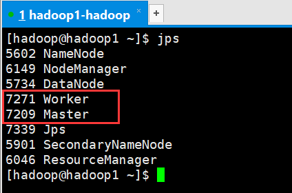
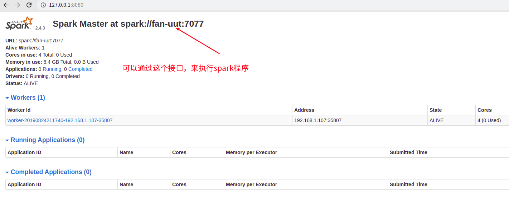
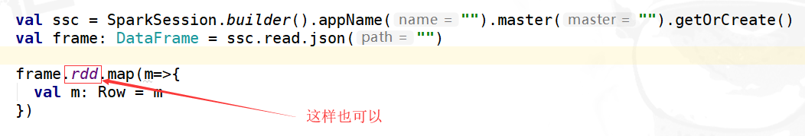

# spark

[TOC]


## 1. 基本概念


Spark2.4.3在Windows和类UNIX系统（例如Linux，Mac OS）上运行。在一台机器上本地运行很容易 - 您只需要`java`在系统上安装`PATH`，或者`JAVA_HOME`指向Java安装的环境变量。

Spark2.4.3运行在Java 8 +，Python 2.7 + / 3.4 +和R 3.1+上。对于Scala API，Spark 2.4.3使用Scala 2.12与Scala2.11。如果您下载的是官方编译好的版本，那个版本默认是使用的是Scala2.11.12(这个版本经常变)。

请注意，自Spark 2.2.0起，对2.6.5之前的Java 7，Python 2.6和旧Hadoop版本的支持已被删除。自2.3.0起，对Scala 2.10的支持被删除。自Spark 2.4.1起，对Scala 2.11的支持已被弃用，将在Spark 3.0中删除。


### 1.1. 运行模式

* 本地
* standalone
  * spark做了一个类似yarn的东西，不常用．
* yarn


### 1.2. 日志聚合 

spark会产生很多日志，那么日志保存在哪里？ 如何将这些日志聚合在一起。

* 配置参数开启日志
* 使用`sbin/start-history-server.sh`开启日志服务
* 可以通过http访问18080端口上的日志。


## 2. 快速入门

参考文档:[Spark学习之路 （五）Spark伪分布式安装](https://www.cnblogs.com/qingyunzong/p/8903714.html)

### 2.1. 安装必要软件


#### 2.1.1. 安装hadoop

我安装了的是`/opt/modules/apache/hadoop-2.9.2`,配置了伪分布式模式.

可以启动hdfs与yarn

具体安装步骤省略,可以参考上面的文档,或者看hadoop章节的文档.


#### 2.1.2. 安装scala


请安装用Scala11,因为当前用的spark-2.4.3默认的是[**scala11.12**](https://www.scala-lang.org/download/2.11.12.html)

```
最新版本是 Scala 2.13.0 不要用，也不要使用 Scala 2.12.x
```

具体安装步骤省略,可以参考上面的文档,


### 2.２ 安装spark

> 如何知道spark的默认scala的版本？

启动`bin/spark-shell` 看提示，例如：`scala11.12` 

如果spark版本与Idea开发的版本不一致,那么在提交到yarn时,会出现错误.


> 配置spark-env.sh

```shell
cd /opt/modules/apache/spark-2.4.3-bin-hadoop2.7
cd conf/
cp spark-env.sh.template spark-env.sh
vi spark-env.sh
```

> 具体内容

```
export JAVA_HOME=/opt/jdk1.8.0_161
export SCALA_HOME=/opt/modules/apache/scala-2.11.12
export HADOOP_HOME=/opt/modules/apache/hadoop-2.9.2
export HADOOP_CONF_DIR=/opt/modules/apache/hadoop-2.9.2/etc/hadoop
export SPARK_MASTER_IP=127.0.0.1
export SPARK_MASTER_PORT=7077
```


### 2.3. 使用spark-shell

假设hfds上上面的 input目录下,已经有了一个a.txt文件

spark-shell，可以不再启动spark的状态下使用．

```shell
# 进入shell命令区域
$ bin/spark-shell

# 读取hadoop上的一个文件
scala> val file = sc.textFile("input/a.txt")

# 查看文件的内容
scala> file.collect

# 查看第一行
scala> file.first

# 查看前2行
scala> file.take(2)

# 输出所有内容
scala> file.collect().foreach {println}

# 统计单词数量, 撰写下面的代码,并通过:paste复制到命令行
scala> :paste 

# 退出 spark shell
:quit
```

复制下面的脚本

```
file.flatMap(_.split(" "))
			.map((_,1))
			.reduceByKey(_+_)
			.sortBy(tuple => tuple._2,true)
			.foreach {println}
			
```


### 2.4. 使用yarn

在实际环境中常用这种模式，经常用这种形式.

下面执行spark自带的例子

```shell
./bin/spark-submit --class org.apache.spark.examples.SparkPi \
    --master yarn \
    --deploy-mode client \
    examples/jars/spark-examples*.jar \
    10
```


### 2.5. 使用spark-standalone

spark-standalone不常用，可以跳过这个章节


> 启动

进入spark根目录

```shell
sbin/start-all.sh 
jps
```




>  验证

理论上要将jar提交到这里，但是这个不常用，所有就不演示了．

输入:http://127.0.0.1:8080/  可以看到相关界面.




>  关闭

```shell
# 退回到spark home
$ sbin/stop-all.sh
```


## 3. 如何开发Spark程序？

可以使用IDEA开发Spark，具体见：[如何开发一个Spark程序](../examples/spark/readme.md)

* 代码开发
  * 在IDEA添加scala插件
  * 新建一个Maven的Java工程
  * 修改pom.xml，添加spark依赖
  * 在main目录中，建立scala目录，放scala文件
  * 撰写一个scala文件，并进行调试
* 打包
  * 注释掉本地调试代码
  * 修改maven中plugin，进行scala打包

* 执行
  * 通过spark命令，在yarn中执行．
  * 通过窗口或日志，查看执行结果．


## 4.  开发技巧


### 4.1. 构建sc

任何Spark程序的第一步都是先创建SparkSession。在Spark-Shell或者其他交互模式中，SparkSession已经预先被创建好了，但在正常编写的Spark程序中，我们必须手动创建SparkSession。

在一些遗留的Spark代码中，我们一般使用 **new SparkContext** 这种模式。但在新的Spark版本中，我们应该避免使用这种模式，尽量使用SparkSession，因为它可以更健壮地实例化Spark和SQL Contexts，并确保没有Context冲突。

> 下面是新版本的做法

如果在idea中本地执行，需要VM参数中设定：`-Dspark.master=local`

```scala
package wukong.spark
import org.apache.spark.sql.SparkSession
object SimpleApp {
  def main(args: Array[String]) {
    val logFile = "input/a.txt" // Should be some file on your system
    val spark = SparkSession.builder
      .appName("Simple Application")
      .getOrCreate()
    val logData = spark.read.textFile(logFile).cache()
    logData.collect().foreach(println)
    val numAs = logData.filter(line => line.contains("c")).count()
    val numBs = logData.filter(line => line.contains("d")).count()
    println(s"\nLines with c: $numAs, Lines with d: $numBs")
    spark.stop()
  }
}
```

在yarn中执行

```shell
./bin/spark-submit --class wukong.spark.SimpleApp \
    --master yarn \
    --deploy-mode client \
    /home/fan/001-db/wukong-bd/examples/spark/hello/target/hello-1.0.jar \
    
```


使用`SparkSession`发现经常提示错误，[解决Spark2.0之后，报错No implicits found for parameter evidence$6: Encoder](https://blog.csdn.net/dz77dz/article/details/88802577)



### 4.2. 累加器与共享变量

[Spark共享变量(广播变量、累加器)](https://www.cnblogs.com/itboys/p/10596497.html)


### 4.3. 依赖第三方Jar包

有两种做法，一个是在生成自己包时，直接把第三方包打入到jar文件中．　这样做，jar文件比较大．

还有一种是，将jar提前上传．

`bin/spark-shell --jars **** ` 

* [[Spark Core\] Spark 使用第三方 Jar 包的方式](https://www.cnblogs.com/share23/p/9768308.html)


也可以将数据提交到hdfs

* [spark-on-yarn作业提交缓慢优化之spark jar包处理](http://blog.itpub.net/29609890/viewspace-2214787/)

* http://spark.apache.org/docs/latest/sql-programming-guide.html)


## 5. Sql DataSet DataFrame编程指南

[详细资料](spark-sql.md)


## 6.  结构化数据流开发指南

* [Spark 2.3.0 Structured Streaming详解](https://blog.csdn.net/l_15156024189/article/details/81612860)
* [官方文档](http://spark.apache.org/docs/latest/structured-streaming-programming-guide.html#basic-operations---selection-projection-aggregation)


## 7.  Spark Streaming 编程

[详细内容](spark-streaming.md)


## 8. 性能优化

* [Spark性能优化指南——基础篇](https://www.cnblogs.com/blair-chen/p/6538741.html)
* [Spark性能优化指南——高级篇 (很详细)](https://blog.csdn.net/lukabruce/article/details/81504220)
* [Spark在美团的实践](https://tech.meituan.com/2016/03/31/spark-in-meituan.html)
* [java远程调用shell脚本](https://blog.csdn.net/qq_33689414/article/details/81812716)


> 参考文档

* [官方首页](http://spark.apache.org/)
  * [快速开始](http://spark.apache.org/docs/latest/quick-start.html)
* 网友文章
  * [Spark学习老铁](https://www.cnblogs.com/qingyunzong/category/1202252.html)
  * [Spark项目实践](https://www.cnblogs.com/qingyunzong/category/1219125.html)
  * 安装
    * [spark单机搭建](https://www.cnblogs.com/zixilonglong/p/9382343.html)
    * [Spark学习之路 （五）Spark伪分布式安装](https://www.cnblogs.com/qingyunzong/p/8903714.html)


