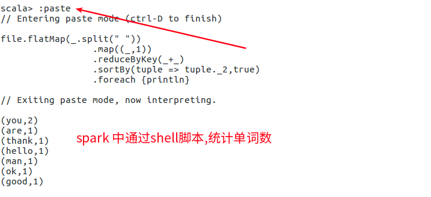

# spark


## 1. 快速入门

### 1.1. 安装模式

* 本地
* standalone
* yarn


### 1.2. 日志聚合 

spark会产生很多日志，那么日志保存在哪里？ 如何将这些日志聚合在一起。

* 配置参数开启日志
* 使用`sbin/start-history-server.sh`开启日志服务
* 可以通过http访问18080端口上的日志。


## 2. 安装

### 2.1. 伪分布模式

参考文档:[Spark学习之路 （五）Spark伪分布式安装](https://www.cnblogs.com/qingyunzong/p/8903714.html)

#### 2.1.1. 安装hadoop

我安装了的是`/opt/modules/apache/hadoop-2.9.2`,配置了伪分布式模式.

可以启动hdfs与yarn

具体安装步骤省略,可以参考上面的文档,或者看hadoop章节的文档.


#### 2.1.2. 安装scala

我安装了[Scala 2.13.0](https://www.scala-lang.org/download/2.13.0.html) ,这个版本需要`jdk1.8`支持

具体安装步骤省略,可以参考上面的文档


#### 2.1.3 安装spark


##### 2.1.3.1 配置

```shell
cd /opt/modules/apache/spark-2.4.3-bin-hadoop2.7
cd conf/
cp spark-env.sh.template spark-env.sh
vi spark-env.sh
```


```
export JAVA_HOME=/opt/jdk1.8.0_161
export SCALA_HOME=/opt/modules/apache/scala-2.13.0
export HADOOP_HOME=/opt/modules/apache/hadoop-2.9.2
export HADOOP_CONF_DIR=/opt/modules/apache/hadoop-2.9.2/etc/hadoop
export SPARK_MASTER_IP=127.0.0.1
export SPARK_MASTER_PORT=7077
```


##### 2.1.3.2. 启动

进入spark根目录

```shell
sbin/start-all.sh 
jps
```


##### 2.1.3.3. 验证

输入:http://127.0.0.1:8080/  可以看到相关界面.


##### 2.1.3.4. 测试例子

假设hfds上上面的 input目录下,已经有了一个a.txt文件

```shell
# 进入shell命令区域
$ bin/spark-shell

# 读取hadoop上的一个文件
scala> val file = sc.textFile("input/a.txt")

# 查看文件的内容
scala> file.collect

# 查看第一行
scala> file.first

# 查看前2行
scala> file.take(2)

# 输出所有内容
scala> file.collect().foreach {println}

# 统计单词数量, 撰写下面的代码,并通过:paste复制到命令行
scala> :paste 


```

复制下面的脚本

```
file.flatMap(_.split(" "))
			.map((_,1))
			.reduceByKey(_+_)
			.sortBy(tuple => tuple._2,true)
			.foreach {println}
			
```



##### 2.1.3.5. 关闭

```shell
# 退出 spark shell
:quit

# 退回到spark home
$ sbin/stop-all.sh
```


## 3. 配置IDEA

使用命令行,来撰写脚本很麻烦.

使用idea,可以通过代码提示,来得到spark的命令,这样就不用死记硬背了.


> 参考文档

* [官方首页](http://spark.apache.org/)
  * [快速开始](http://spark.apache.org/docs/latest/quick-start.html)
* 网友文章
  * [Spark学习老铁](https://www.cnblogs.com/qingyunzong/category/1202252.html)
  * [Spark项目实践](https://www.cnblogs.com/qingyunzong/category/1219125.html)
  * 安装
    * [spark单机搭建](https://www.cnblogs.com/zixilonglong/p/9382343.html)
    * [Spark学习之路 （五）Spark伪分布式安装](https://www.cnblogs.com/qingyunzong/p/8903714.html)


