# VirtualBox+Vagrant虚拟机安装

我是在win10机器上安装centos的。

> 目录


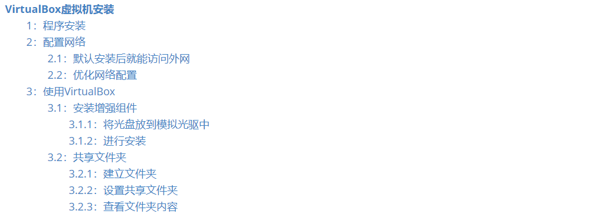


## 1：程序安装

`virtualbox`安装起来步复杂，建议安装到`d`盘。

`centos` 安装起来也不复杂，按照向导安装就可以了。


> 下载地址

* [VirtualBox下载地址](https://www.virtualbox.org/)
* [centos下载](https://www.centos.org/)


> 参考文档

* [win10安装oracle vm virtualbox，并安装centos7详细安装记录](https://blog.csdn.net/qq_37316272/article/details/87691835)


## 2：配置网络

目标是`虚拟机`可以访问网络，并且`主机`可以访问虚拟机。网上的教程写的太乱，实际很简单。


### 2.1：默认安装后就能访问外网

按照默认的安装，`虚拟机`可以访问外网，但是`主机`访问虚拟机很麻烦。


> centos01机器安装后，默认的就是：网络地址转换(NAT)

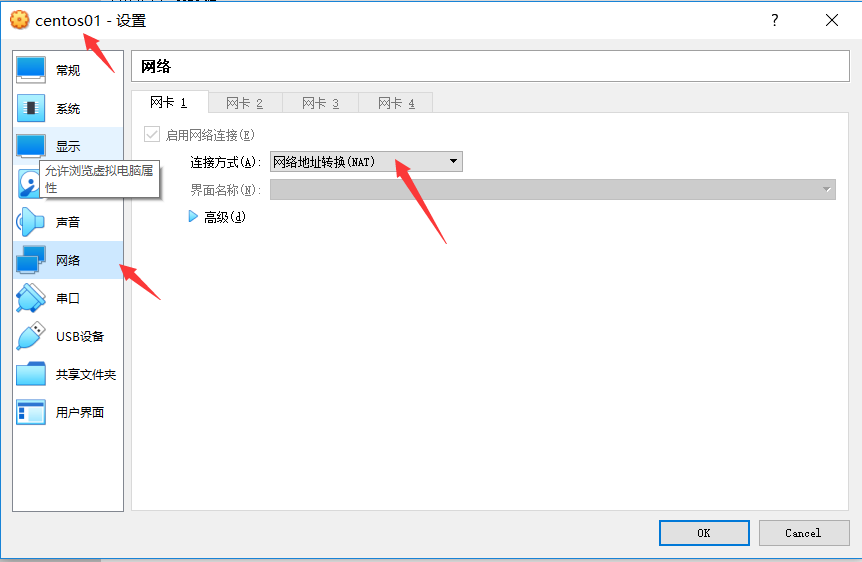


> 用虚拟机ping外网

ping 百度，ping 我自己的win10系统，都可以ping通。

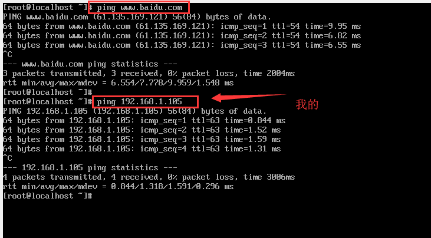


> 查看当前的网卡信息

使用ifconfig，如果找不到这个命令，网上搜如何安装ifconfig.

`yum install net-tools.x86_64`

cl这里生成两个网卡配置`enp0s3`与`lo`

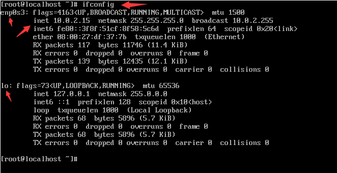


> 主机ping 不同虚拟机

ping 上面的ip是不行了。那么使用ssh登录页是不行的。

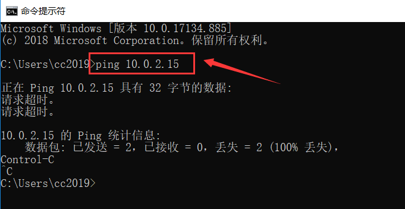


> 怎么使用ssh登录呢？

使用端口转发功能

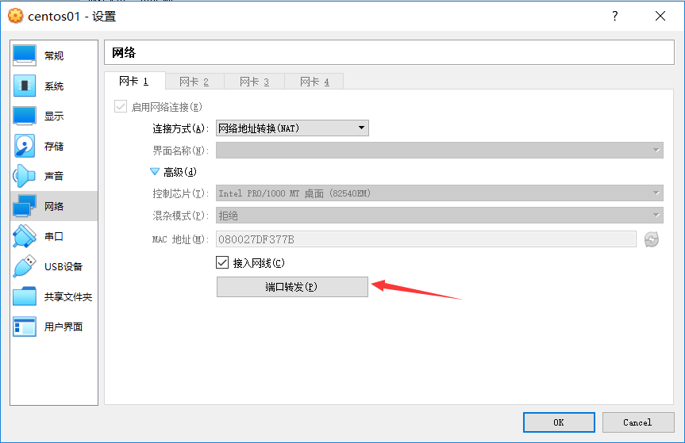


新追加一条规则，由于我里面只有一个虚拟机，所以只用转发一条就可以了。


使用putty来访问

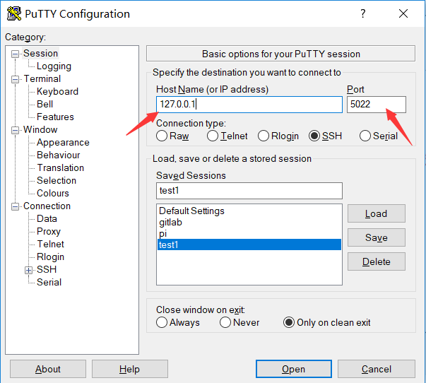


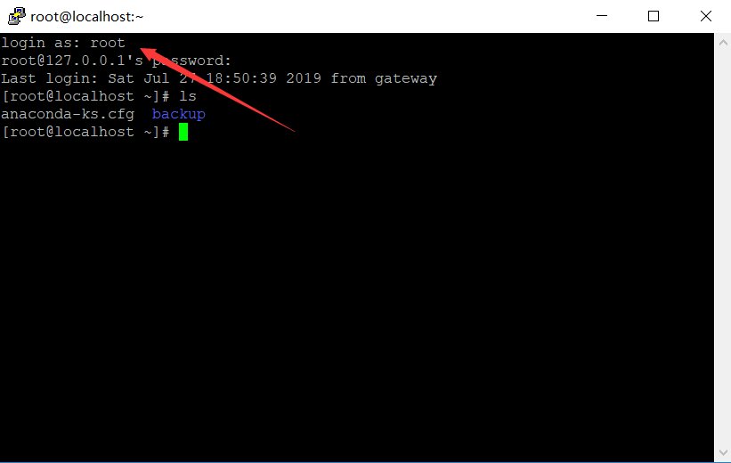


### 2.2：优化网络配置

如果你感觉转发不爽，也可以使用直连的方式，当然刚才的`ant`模式不能删除，不然访问不了外网。

一个服务器可以有多个网卡，当然也可以虚拟出来多个网卡。


> 设置host only 模式

选中起用第二个网卡

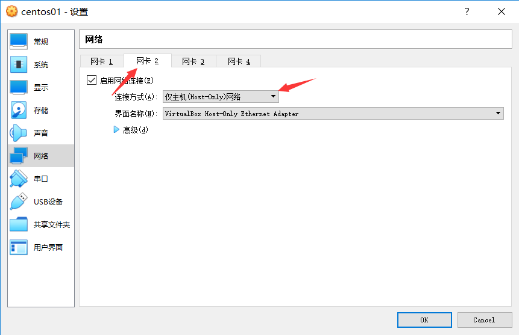


> 登录虚拟主机看看本地IP

这时候，看到多了一个网卡，`enp0s8`，这个就是刚才配出来的网卡

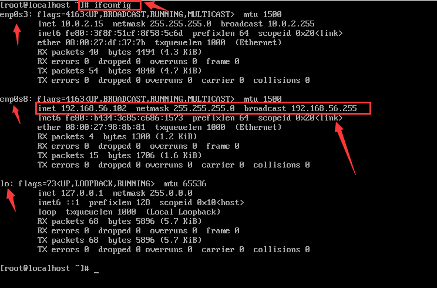


> 不用转发登录虚拟主机

在主机上`ping`虚拟主机，可以ping通，那么也可以通过`putty`来远程登录到虚拟主机

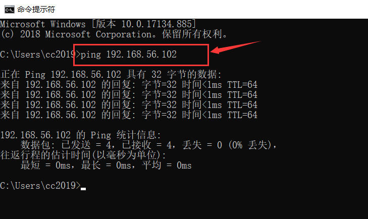


> 固定IP 

现在都是动态IP，有可能重启后，就找不到这个IP了，这样就不好登录了，所以可以将`192.168.56.102`这个IP固定了。 可以这么来设置

我发现没有找到那个网卡配置文件，所以就没有去配置，网上有人说新建立一个文件就行，我也没有新建立文件。

参考：[Centos系统如何设置固定IP](https://jingyan.baidu.com/article/6c67b1d65127692787bb1ef3.html)

无法配置

## 3：使用VirtualBox


### 3.1：安装增强组件

只有安装了增强组件后，才进行`文件共享等操作`

#### 3.1.1：将光盘放到模拟光驱中

点击`安装增强功能`，就能模拟这个功能。

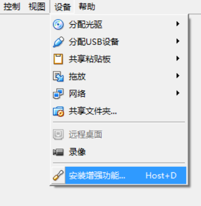


如果成功，就会显示已经将光盘放入光驱中了。

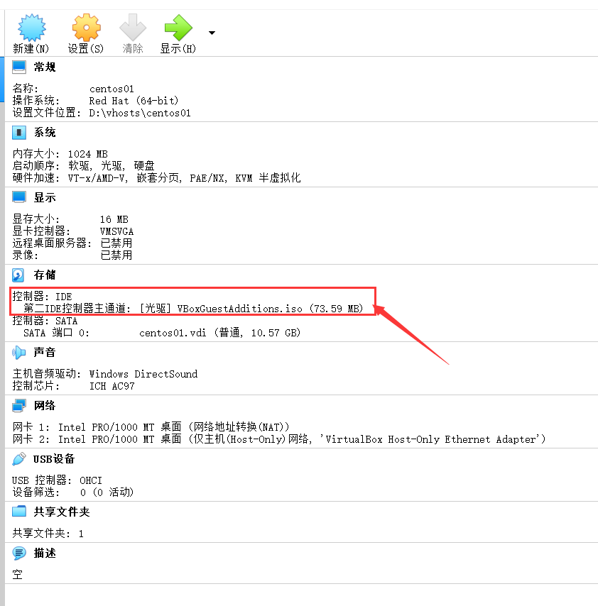


如果出现报错，很大的可能是因为光驱内有其他光盘，可以通过这个菜单来选择。

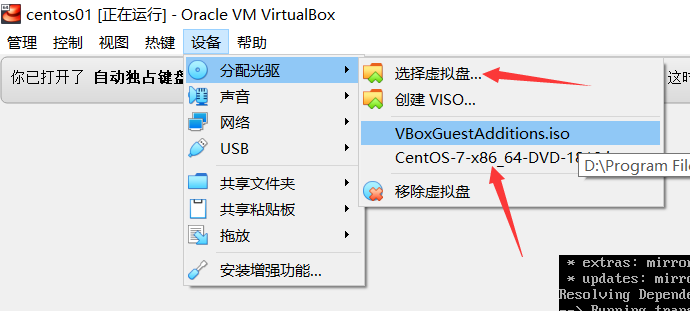


#### 3.1.2：进行安装

只要`3.1.1`上面显示已经将安装盘装载到光驱中了，就可以使用下面的命令了。

```shell
# 挂载光驱
$ mount /dev/cdrom /mnt
$ cd /mnt

# 在安装过程中，会使用到bzip2于kernel，建议提前安装，不然还会提示安装
$ yum install bzip2
$ yum install kernel # yum install kernel命令可以不用执行 ，但是不知道是否可行，下次实验一下
$ yum install gcc -y
$ yum install kernel-headers -y
$ yum install kernel-devel -y
$ sh ./VBoxLinuxAdditions.run install
$ reboot
```

> 参考文档

* [CentOS安装VirtualBox增强组件](https://jingyan.baidu.com/article/3c343ff7d291b30d3779630a.html)

* [VirtualBox安装CentOS实现鼠标自动切换和复制粘贴功能](https://www.zhangshengrong.com/p/zD1y0dpXrv/)


### 3.2：共享文件夹

进行文件共享，要安装增强组件。

#### 3.2.1：建立文件夹

找个地方，建立一个`share`的文件夹。例如：`d:\vhosts\share`

#### 3.2.2：设置共享文件夹

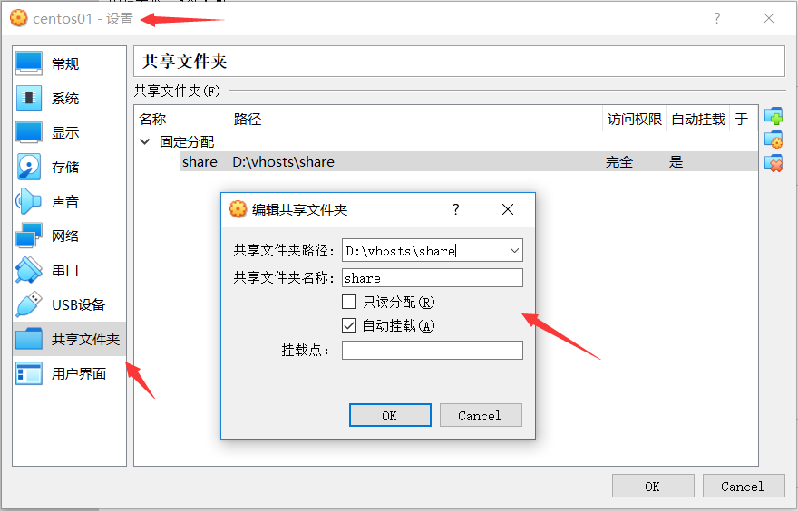


#### 3.2.3：查看文件夹内容

可以重启，或者不用，查看/mdia目录，可以看到共享的文件夹

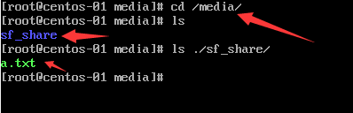


>  如果没有出现共享文件夹

那么就手工的执行命令，见下面的提示。

mount -t vboxsf share mount_point

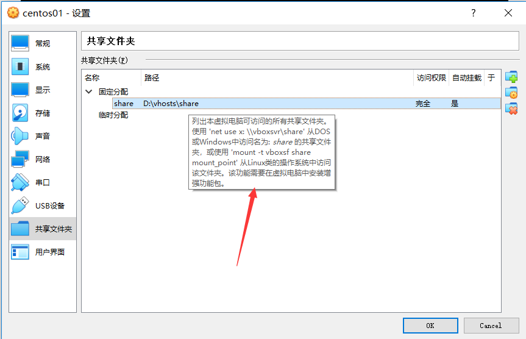


## 4: Vagrant

Vagrant是一个基于Ruby的工具，用于创建和部署虚拟化开发环境。它 使用Oracle的开源[VirtualBox](https://baike.baidu.com/item/VirtualBox)虚拟化系统，使用 Chef创建自动化虚拟环境。

