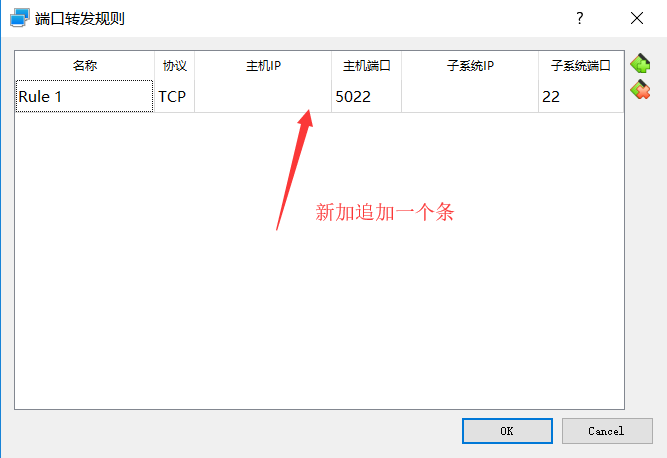

# VirtualBox+Vagrant虚拟机安装

我是在win10机器上安装centos的。

> 目录

[TOC]


## 1：程序安装


### 1.1：前提条件


> 下载地址

* [VirtualBox下载地址](https://www.virtualbox.org/)
* [centos下载](https://www.centos.org/)


> 参考文档（可以参考）

* [win10安装oracle vm virtualbox，并安装centos7详细安装记录](https://blog.csdn.net/qq_37316272/article/details/87691835)


### 1.2：安装VirtualBox

`virtualbox`安装起来步复杂，建议安装到`d`盘。`centos` 安装起来也不复杂，按照向导安装就可以了。


### 1.3：新建虚拟机

按照向导做就可以了，唯一注意的是，在没有安装centos之前一定要选择桥接网卡


### 1.4：安装Centos

按照向导做就可以。唯一要说的，一定要选择启用网络，上不了网会很麻烦的。


在这步也可以修改网络


### 1.5：配置静态IP地址

静态IP地址还是比较好用的。

```shell
cd /etc/sysconfig/network-scripts
#备份一份，以免访问不了网络后，用这个
cp ifcfg-enp0s3 ~/
vi ifcfg-enp0s3
# 重启网络
service network restart
```


下面是修改的内容，一定要设置`DNS1`，今后可以修改任意的虚拟机。

```
TYPE="Ethernet"
PROXY_METHOD="none"
BROWSER_ONLY="no"

BOOTPROTO="static"
IPADDR=192.168.1.180
NETMASK=255.255.255.0
GATEWAY=192.168.1.1
DNS1=192.168.1.1


DEFROUTE="yes"
IPV4_FAILURE_FATAL="no"
IPV6INIT="yes"
IPV6_AUTOCONF="yes"
IPV6_DEFROUTE="yes"
IPV6_FAILURE_FATAL="no"
IPV6_ADDR_GEN_MODE="stable-privacy"
NAME="enp0s3"
UUID="b0de9eb0-8c89-4630-9584-5ace85034541"
DEVICE="enp0s3"
ONBOOT="yes"

```


## 2：使用VirtualBox


### 2.1：安装增强组件

只有安装了增强组件后，才进行`文件共享等操作`

#### 2.1.1：将光盘放到模拟光驱中

点击`安装增强功能`，就能模拟这个功能。


如果成功，就会显示已经将光盘放入光驱中了。


如果出现报错，很大的可能是因为光驱内有其他光盘，可以通过这个菜单来选择。


#### 2.1.2：进行安装

只要`3.1.1`上面显示已经将安装盘装载到光驱中了，就可以使用下面的命令了。

```shell
# 挂载光驱
$ mount /dev/cdrom /mnt
$ cd /mnt

# 在安装过程中，会使用到bzip2于kernel，建议提前安装，不然还会提示安装
$ yum install bzip2
$ yum install kernel # yum install kernel命令可以不用执行 ，但是不知道是否可行，下次实验一下
$ yum install gcc -y
$ yum install kernel-headers -y
$ yum install kernel-devel -y
$ sh ./VBoxLinuxAdditions.run install
$ reboot
```

> 参考文档

* [CentOS安装VirtualBox增强组件](https://jingyan.baidu.com/article/3c343ff7d291b30d3779630a.html)

* [VirtualBox安装CentOS实现鼠标自动切换和复制粘贴功能](https://www.zhangshengrong.com/p/zD1y0dpXrv/)


### 2.2：共享文件夹

进行文件共享，要安装增强组件。

#### 2.2.1：建立文件夹

找个地方，建立一个`share`的文件夹。例如：`d:\vhosts\share`

#### 2.2.2：设置共享文件夹


#### 2.2.3：查看文件夹内容

可以重启，或者不用，查看/mdia目录，可以看到共享的文件夹


>  如果没有出现共享文件夹

那么就手工的执行命令，见下面的提示。

mount -t vboxsf share mount_point


## 3: Vagrant

Vagrant是一个基于Ruby的工具，用于创建和部署虚拟化开发环境。它 使用Oracle的开源[VirtualBox](https://baike.baidu.com/item/VirtualBox)虚拟化系统，使用 Chef创建自动化虚拟环境。


## 4：网络模式分析

### 

- （推荐）使用网桥模式
  - 好处是配置简单，网络是通的
  - 坏处是如果脱离局域网，可能出现不能上网，或者IP地址找不到的情况。
- 内部网络+host-only模式（没验证过）
  - 第一网卡使用内部网络
  - 使用内部网络，可以让虚拟机之间相互访问
  - 使用host-only模式，可以上网，并且主机服务器可以访问。
  - 坏处不能在局域网访问，跨宿主机不行
  - 在安装的过程中，第一网卡还是内部网络
- 网络地址转NAT+host-only模式（验证过）
  - 可以上网，宿主机可以访问虚拟
  - 坏处，组网后，k8s找到的各个节点的ip地址都一样。


> [VirtualBox的四种网络连接方式](https://www.cnblogs.com/jpfss/p/8616613.html)


## 5 选择其他模式（不成熟）

**这章节今后会删除**

安装centos时，要配置网络，不然访问不了外网。

如果忘记启动网络，需要进入命令行，启动网络`nmtui `。[如何为CentOS 7配置静态IP地址](https://www.linuxidc.com/Linux/2014-10/107789.htm)


说明：CentOS 7.0默认安装好之后是没有自动开启网络连接的！

```
cd  /etc/sysconfig/network-scripts/
vi  ifcfg-eno16777736
可以添加内容
service network restart   #重启网络
ping www.baidu.com  #测试网络是否正常
```


#### 5.1：默认安装后就能访问外网

按照默认的安装，`虚拟机`可以访问外网，但是`主机`访问虚拟机很麻烦。


> centos01机器安装后，默认的就是：网络地址转换(NAT)


> 用虚拟机ping外网

ping 百度，ping 我自己的win10系统，都可以ping通。


> 查看当前的网卡信息

使用ifconfig，如果找不到这个命令，网上搜如何安装ifconfig.

`yum install net-tools.x86_64`

cl这里生成两个网卡配置`enp0s3`与`lo`


> 主机ping 不同虚拟机

ping 上面的ip是不行了。那么使用ssh登录页是不行的。


> 怎么使用ssh登录呢？

使用端口转发功能


新追加一条规则，由于我里面只有一个虚拟机，所以只用转发一条就可以了。





使用putty来访问


#### 5.2：优化网络配置host-only

如果你感觉转发不爽，也可以使用直连的方式，当然刚才的`ant`模式不能删除，不然访问不了外网。

一个服务器可以有多个网卡，当然也可以虚拟出来多个网卡。


> 设置host only 模式

选中起用第二个网卡


> 登录虚拟主机看看本地IP

这时候，看到多了一个网卡，`enp0s8`，这个就是刚才配出来的网卡


> 不用转发登录虚拟主机

```shell
 #安装ifcconfig
 yum install net-tools.x86_64 
```


在主机上`ping`虚拟主机，可以ping通，那么也可以通过`putty`来远程登录到虚拟主机


##### 5.2.1 固定IP 

现在都是动态IP，有可能重启后，就找不到这个IP了，这样就不好登录了，所以可以将`192.168.56.102`这个IP固定了。 可以这么来设置

有网友这么说，来固定ip

[Virtualbox+Centos 7虚拟机设置host-only网卡的静态IP地址](https://blog.csdn.net/yongge1981/article/details/78903886)

我具体的操作如下：

```shell
cd /etc/sysconfig/network-scripts
cp ifcfg-enp0s3 ifcfg-enp0s8
vi ifcfg-enp0s8
service network restart
```


```
TYPE="Ethernet"
PROXY_METHOD="none"
BROWSER_ONLY="no"
BOOTPROTO="static"
DEFROUTE="yes"
IPV4_FAILURE_FATAL="no"
IPV6INIT="yes"
IPV6_AUTOCONF="yes"
IPV6_DEFROUTE="yes"
IPV6_FAILURE_FATAL="no"
IPV6_ADDR_GEN_MODE="stable-privacy"
NAME="enp0s8"
UUID="f33d60b5-4afe-6ff9-b20e-662e819e8739"
DEVICE="enp0s8"
ONBOOT="yes"


IPADDR=192.168.56.105
NETMASK=255.255.255.0
GATEWAY=192.168.56.1

```


##### 5.2.2 通过镜像复制虚拟机

假设已经安装了一台虚拟机centos02

- 关闭centos02
- 通过【导出虚拟电脑】，对centos02进行备份，中间啥都不用改。
- 通过【导入虚拟电脑】，中间将有centos02的地方修改成centos03
- 启动centos03，并配置网络ifcfg-enp0s8，有两个地方要修改
  - IPADDR =192.168.56.106
  - UUID 改成与其他不同就可以了
- 启动centos02
- 分别进行互ping，看看通不通


