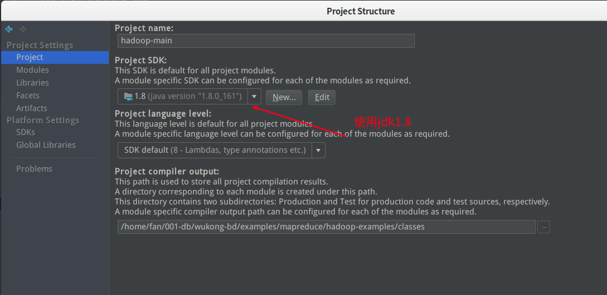
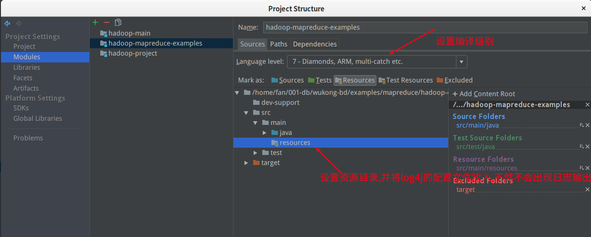
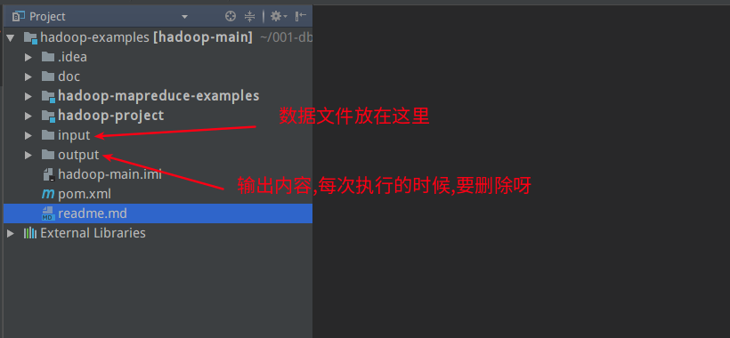
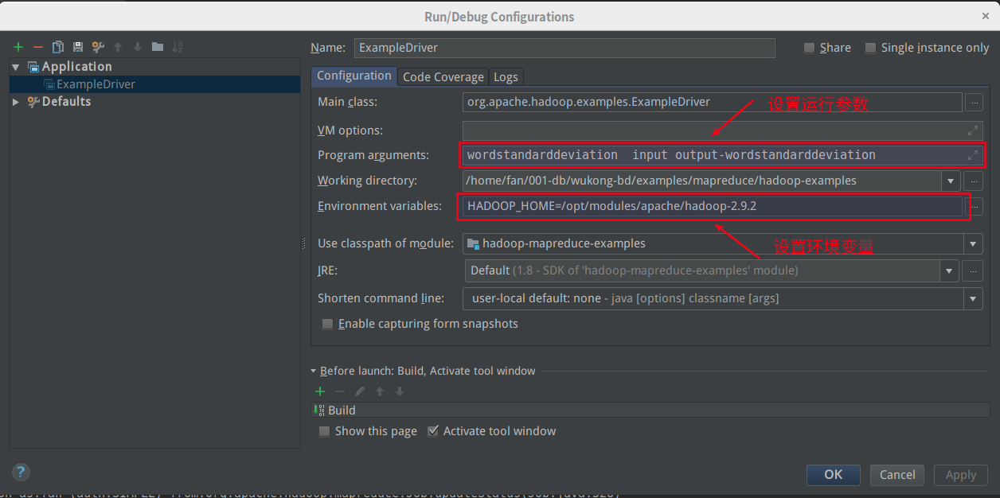

# hadoop官方的例子


## 编译

从hadoop2.9.2-src包中精简的代码.具体步骤如下:

```
1:新建一个目录hadoop-examples

2:将hadoop-src目录下的:pom.xml hadoop-project  hadoop-mapreduce-project/hadoop-mapreduce-examples,复制过来.

3:用idea打开并进行编译.
  3.1:在编译的过程中,要使用jdk1.8,因为hadoop-annotations2.9.2使用了这个包.
  具体在idea-file-project structre-project菜单中,选择jdk8
  
4:使用maven进行编译

5:配置输出日志

```


> 设置jdk





> 配置日志目录与编译环境




> 目录说明




## 本地运行

将数据文件放到`input`目录中,就可以执行了.

建议在本地运行就行了,这个代码不用传到服务器上了.




### 可运行的函数

####  input

```
a
bb
ccc
dddd
eeeee
ffffff
ggggggg
hhhhhhhh
```


####  output


#####  wordcount

  * A map/reduce program that counts the words in the input files.
  * 统计字数

```
a	1
bb	1
ccc	1
dddd	1
eeeee	1
ffffff	1
ggggggg	1
hhhhhhhh	1
```


#####  wordmean 

  * A map/reduce program that counts the average length of the words in the input files.
  * 统计单词个数,并且输出总长度

```
count	8
length	36
```


#####  wordmedian

  * A map/reduce program that counts the median length of the words in the input files.
  * 按照长度,统计每种长度的文字有几个

```
1	1
2	1
3	1
4	1
5	1
6	1
7	1
8	1
```


#####  wordstandarddeviation

  * A map/reduce program that counts the standard deviation of the length of the words in the input files.
  * 标准偏差进行计数

```
count	8
length	36
square	204
```

##### aggregatewordcount

An Aggregate based map/reduce program that counts the words in the input files.

这个执行不了,因为

```
HADOOP_HOME and hadoop.home.dir are unset.
```


##### aggregatewordhist

An Aggregate based map/reduce program that computes the histogram of the words in the input files.

这个执行不了,因为

```
HADOOP_HOME and hadoop.home.dir are unset.
```


##### grep

A map/reduce program that counts the matches of a regex in the input.

按照正则表达式查找某些数据


##### randomwriter

随机写入10GB的数据,为每个节点

A map/reduce program that writes 10GB of random data per node.

##### randomtextwriter

A map/reduce program that writes 10GB of random textual data per node.

随机写入10GB的数据,为每个节点

##### sort

A map/reduce program that sorts the data written by the random writer.

这个执行不了,因为

```
HADOOP_HOME and hadoop.home.dir are unset.
```


##### pi

A map/reduce program that estimates Pi using a quasi-Monte Carlo method.


##### bbp

A map/reduce program that uses Bailey-Borwein-Plouffe to compute exact digits of Pi.

##### distbbp

A map/reduce program that uses a BBP-type formula to compute exact bits of Pi.

##### pentomino

A map/reduce tile laying program to find solutions to pentomino problems.


##### secondarysort

An example defining a secondary sort to the reduce.


##### sudoku

A sudoku solver.


##### join

A job that effects a join over sorted, equally partitioned datasets


##### multifilewc

A job that counts words from several files.


##### dbcount

An example job that count the pageview counts from a database.


##### teragen

Generate data for the terasort


##### terasort

Run the terasort

##### teravalidate


Checking results of terasort


## 代码分析


## 参考文档

* [运行 MapReduce 样例](https://blog.csdn.net/chengqiuming/article/details/78826143)
