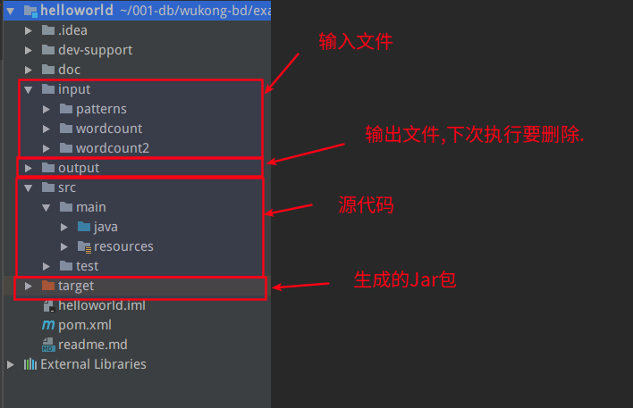
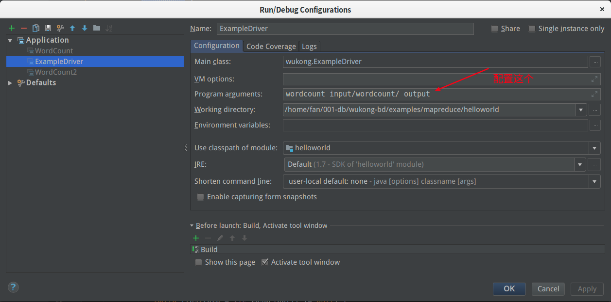
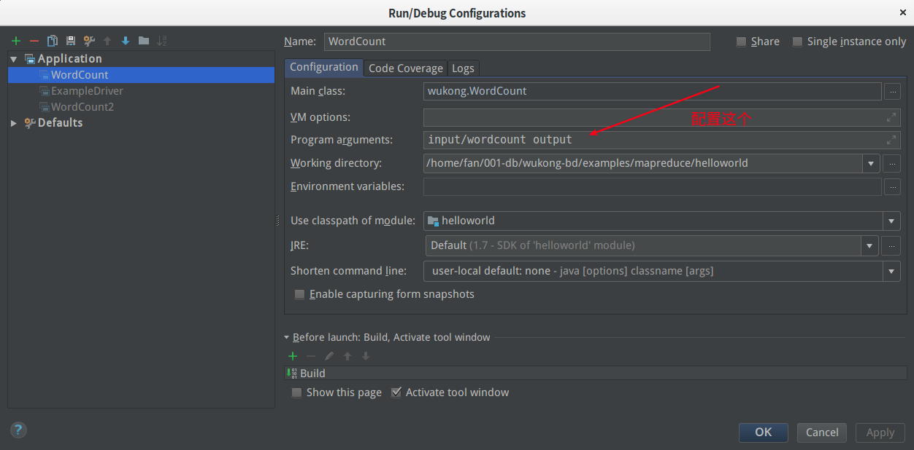
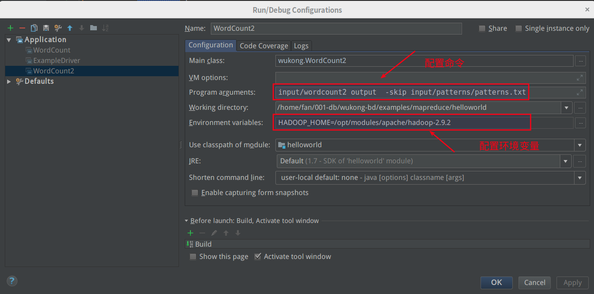
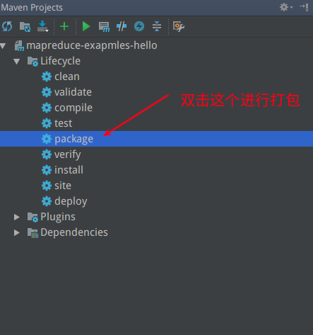

# Hello Hadoop

这个例子是参考了hadoop官网关于mapreduce介绍文档做出来的.

所有代码都在`ubuntu`上用`IDEA`调试通过,听说`windows`系统有很多小错误要处理.

[官网介绍的具体地址](http://hadoop.apache.org/docs/stable/hadoop-mapreduce-client/hadoop-mapreduce-client-core/MapReduceTutorial.html)


TODO: 代码比较简单,那天有空加上中文注释.


## 代码说明

一共有三个类

| 类名          | 说明                                                         | 执行方法                                                     |
| ------------- | ------------------------------------------------------------ | ------------------------------------------------------------ |
| ExampleDriver | 一个公共接口,可以调用下面两个类的方法.具体是加上方法名与后面的参数 | 例如: wordcount input/wordcount/ output                      |
| WordCount     | 一个特简单的单词统计方法                                     | 例如: input/wordcount output                                 |
| WordCount2    | 可以追加过滤器的方法                                         | 例如: input/wordcount2 output  -skip input/patterns/patterns.txt |





## 代码下载

从github上下载这个目录后,用IDEA打开这个目录,然后按照向导,让pom.xml生成idea工程目录.

> 注意事项:

* 请使用JDK1.7


## IDEA debug配置

在真实环境中很难调试,所以建议在idea中进行初步调试,然后再放到服务器上.

每次执行前要将output给删除了.


> ExampleDriver




> WordCount




> WordCount2

如果不配置环境变量`HADOOP_HOME`程序会提示错误.





### WordCount2 详细说明

按照官网的文档,这个函数有不同的执行方法,并且输出不同的结果.

#### 不加过滤特殊字符

> 参数

```
input/wordcount2 output  
```

> 结果

```
Bye	1
Goodbye	1
Hadoop,	1
Hello	2
World!	1
World,	1
hadoop.	1
to	1
```


#### 过滤掉特殊字符

过滤标点符号与特殊字符

> 参数

```
input/wordcount2 output  -skip input/patterns/patterns.txt
```

> 结果

```
Bye	1
Goodbye	1
Hadoop	1
Hello	2
World	2
hadoop	1
```


#### 变成小写后合并统计

都转换成小写了,并且进行了合并.

> 参数

```
-Dwordcount.case.sensitive=false input/wordcount2 output2  -skip input/patterns/patterns.txt
```

> 结果

```
bye	1
goodbye	1
hadoop	2
hello	2
world	2
```


## 如何打包




打包文件配置好了,唯一做的是,选择那个是主文件. 建议在实际过程中,可以使用ExampleDriver作为入口

```xml
            <plugin>
                <groupId>org.apache.maven.plugins</groupId>
                <artifactId>maven-jar-plugin</artifactId>
                <configuration>
                    <archive>
                        <manifest>
                            <mainClass>wukong.ExampleDriver</mainClass>
                        </manifest>
                    </archive>
                </configuration>
            </plugin>
```