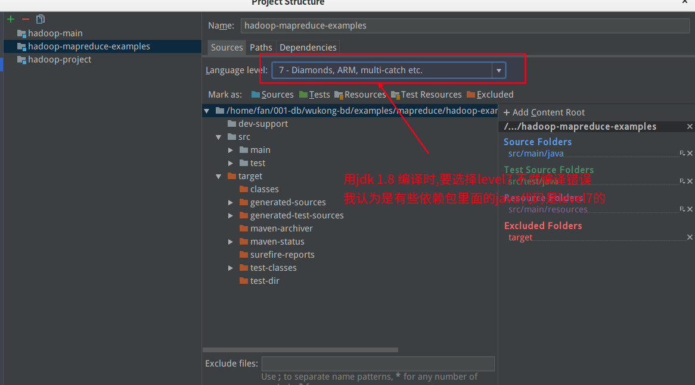

# MapReduce例子说明

为了MapReduce会被更先进的组件来代替,但是了解一些MapReduce的思想,对未来学习其他或许有帮助.

如果怕耽误时间,这部分可以简单看看.

| 工程名                                                  | 说明                                     |      |
| ------------------------------------------------------- | ---------------------------------------- | ---- |
| [helloworld](helloworld)                                | 一个简单的例子,用来说明如何编写MapReduce |      |
| [hadoop-examples](hadoop-examples/)                     | hadoop官方提供的例子                     |      |
| [wukong-mapreduce-examples](wukong-mapreduce-examples/) | 展示了mapreduce常用功能的例子            |      |

