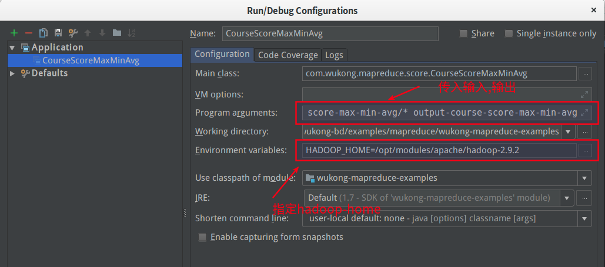

# 系列案例


## 例子概述


| 类名                 | 功能说明                                  | 备注 |
| -------------------- | ----------------------------------------- | ---- |
| CourseScoreMaxMinAvg | 求每个科目成绩的 最大值 最小值 平均值     |      |
| CourseScoreGrouping  | 统计科目中分数相同的人有多少,每个人的人名 |      |
| ScoreAverage         | 统计学生的平均成绩                        |      |
|                      |                                           |      |
|                      |                                           |      |
|                      |                                           |      |
|                      |                                           |      |
|                      |                                           |      |
|                      |                                           |      |
|                      |                                           |      |
|                      |                                           |      |
|                      |                                           |      |
|                      |                                           |      |
|                      |                                           |      |
|                      |                                           |      |
|                      |                                           |      |
|                      |                                           |      |
|                      |                                           |      |
|                      |                                           |      |


## 程序思虑


### 成绩统计


[参考网址](https://blog.csdn.net/jin6872115/article/details/79585755)

#### 数据

```
计算机,黄晓明,85
计算机,徐铮,54
英语,赵本山,57
英语,刘亦菲,85
英语,刘亦菲,76
语文,刘涛,85
语文,马云,42
语文,莫言,81
数学,黄晓明,85
数学,刘嘉玲,85
```

#### 目标

```
1、每一个course的最高分，最低分，平均分
	例子：计算机	max=99	min=48	avg=75

2、求该成绩表当中科目出现了相同分数（人数大于1）的，求分数，次数，以及该分数的人
	返回结果的格式：
	科目	分数	次数	该分数的人
	例子：
	计算机 85	3	莫言,刘嘉玲,黄晓明

3 求每个学生的平均成绩
	例子:黄磊	考试了4门科目,平均成绩:84.0
```


#### 解决思路


第一题思路：在map以course作为key值，其余部分作为value，在reduce中设置变量max，min，avg，通过累计求出，并设置格式.


第二题思路：求某科目中出现系统分数的人数以及分数，map以科目和分数作为key值，进行分组，在reduce中进行计数，当计数结果大于1时，输出分数，人数和人名


第三题思路：求每个学生的平均成绩 , map key=学生姓名  value=成绩. reduce中 设置变量`count`与`agv`来计算每个学生的平均成绩.


### 成绩统计增强版

[参考网址](https://blog.csdn.net/jin6872115/article/details/79587210)

#### 数据

```
计算机,黄晓明,85,86,41,75,93,42,85
计算机,徐铮,54,52,86,91,42
英语,黄晓明,96,85,42,96,38
英语,黄磊,85,85,42,96,38
英语,刘嘉玲,75,85,42,96,38
语文,马云,42,42,96,38
语文,莫言,81,42,96,38
数学,徐铮,54,42,96,38
数学,黄晓明,85,42,96,38
数学,刘嘉玲,85,42,96,38
```

>  数据解释

* 数据字段个数不固定：

* 第一个是课程名称

* 第二个是学生姓名，后面是每次考试的分数


#### 目标

>  统计需求

* 统计每门课程的参考人数和课程平均分
  * 例如:数学   7 62.285713
* 统计每门课程参考学生的平均分，并且按课程存入不同的结果文件，要求一门课程一个结果文件，并且按平均分从高到低排序，分数保留一位小数
* 求出每门课程参考学生平均分最高的学生的信息：课程，姓名和平均分


#### 解决思虑

第一题思路： 实际上是group by 课程, 统计人数,统计平均分.

```
数学	 7 62.285713
英语	 9 63.11111
计算机	 10 66.5
语文	 6 63.0
```


第二题思路： 实际上是group by 课程, 统计人数,统计平均分.


第三题思路： 实际上是group by 课程, 统计人数,统计平均分.


## 系统配置

> 注意事项

为每个要执行的类,指定参数




```
HADOOP_HOME /opt/modules/apache/hadoop-2.9.2
```


> 参考文档

* [MapReduce — 数据分类输出和小文件合并](https://blog.csdn.net/qq_41851454/article/details/79620347)
* [网友案例12篇](https://blog.csdn.net/jin6872115/article/category/7513962)

