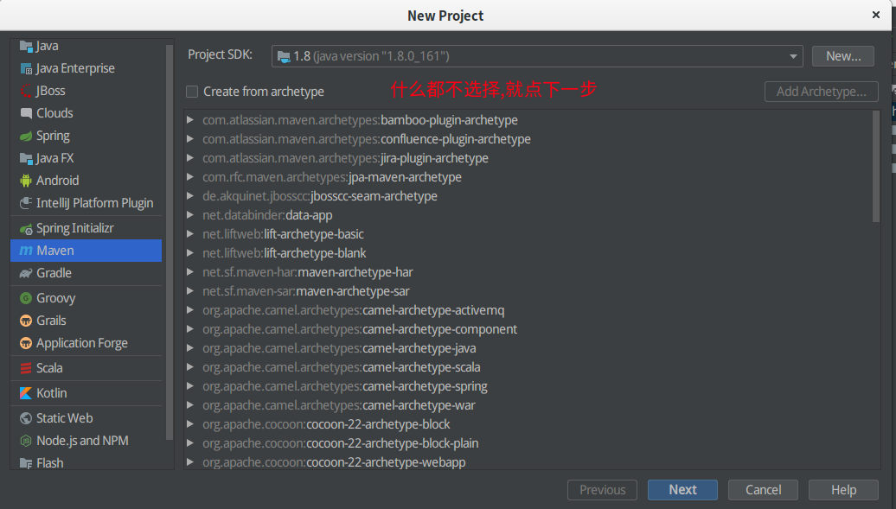
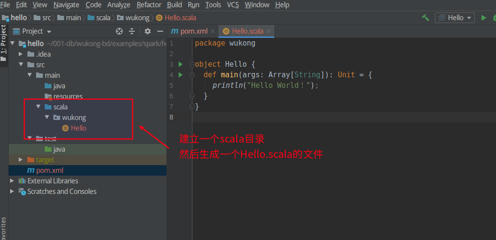
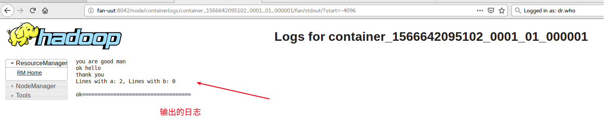
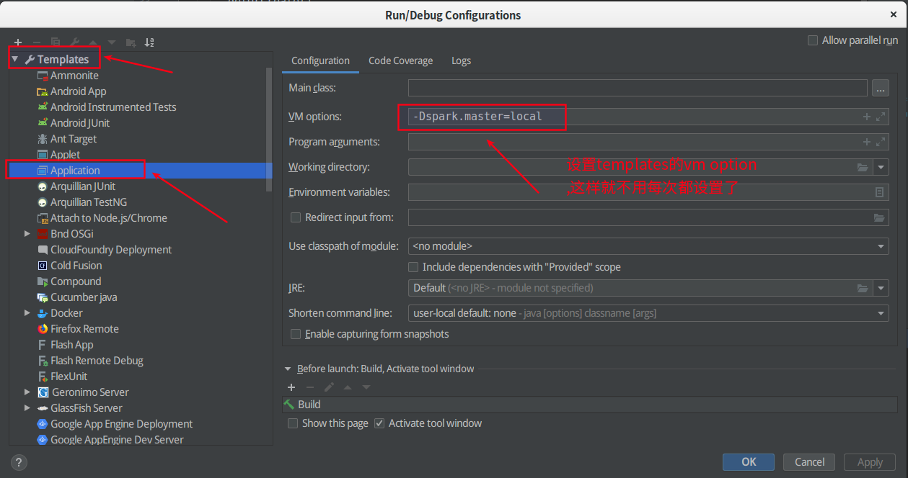
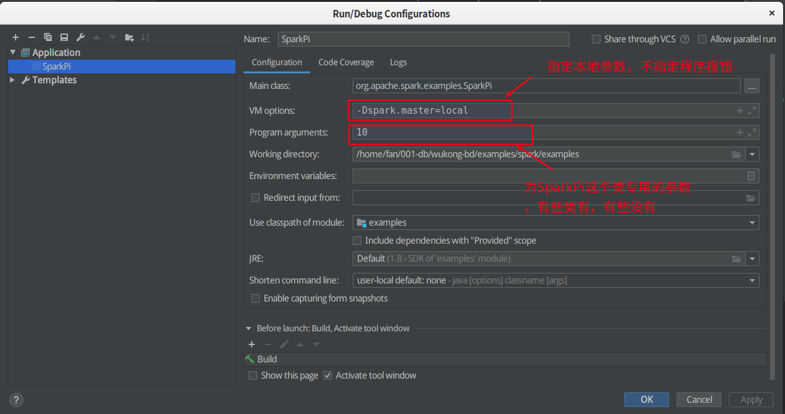

# spark 例子


| 工程名   | 功能说明                                                     |
| -------- | ------------------------------------------------------------ |
| hello    | 快速入门的例子，展示了如何创建一个工程，以及将工程发布到yarn的过程．例子很简单 |
| examples | 提供的例子，演示了所有的功能．                               |
|          |                                                              |


[TOC]


##  1. 快速入门-hello

撰写一个简单的spark代码

创建一个新的scala功能, 网上有很多教程,但是错误很多. 例如要通过maven来生成等,结果模板很旧.

我的具体步骤如下:

> 前提条件

idea中安装`scala`插件


### 1.1. scala开发


#### 1.1.1. 生成java工程

使用maven生成一个空的java工程




#### 1.1.2. 编写scala代码

* 在main下建立一个scala的目录
* 生成一个scala的object


```scala
package wukong

object Hello {
  def main(args: Array[String]): Unit = {
    println("Hello World！");
  }
}
```





#### 1.1.3. 运行程序

右键`Hello.scala`运行,然后显示hello world


#### 1.1.4. 添加Maven

不添加也行,主要是为了跟踪,看到scala的代码

```xml
    <properties>
        <scala.version>2.13.0</scala.version>
    </properties>

    <dependencies>
        <!-- 导入scala的依赖 -->
        <dependency>
            <groupId>org.scala-lang</groupId>
            <artifactId>scala-library</artifactId>
            <version>${scala.version}</version>
            <scope>compile</scope>
        </dependency>
    </dependencies>
```


### 1.2. spark开发


#### 1.2.1. 配置Maven

这里使用了 scala2.12.9版本

```xml
    <properties>
        <project.build.sourceEncoding>UTF-8</project.build.sourceEncoding>
        <scala.version>2.11.12</scala.version>
        <spark.scala.version>2.11</spark.scala.version>
        <spark.version>2.4.3</spark.version>
    </properties>

    <dependencies>
        <!-- 导入scala的依赖 -->
        <dependency>
            <groupId>org.scala-lang</groupId>
            <artifactId>scala-library</artifactId>
            <version>${scala.version}</version>
            <scope>compile</scope>
        </dependency>

        <dependency>
            <groupId>org.apache.spark</groupId>
            <artifactId>spark-core_${spark.scala.version}</artifactId>
            <version>${spark.version}</version>
        </dependency>

        <dependency>
            <groupId>org.apache.spark</groupId>
            <artifactId>spark-sql_${spark.scala.version}</artifactId>
            <version>${spark.version}</version>
        </dependency>

        <dependency>
            <groupId>org.apache.spark</groupId>
            <artifactId>spark-streaming_${spark.scala.version}</artifactId>
            <version>${spark.version}</version>
        </dependency>

    </dependencies>
```


#### 1.2.2. 代码开发

从本地文件中,统计单词的数量

```scala
package wukong.spark

import org.apache.spark.{SparkConf, SparkContext}

/**
 * 读取本地的一个文件,并且计算文件内容
 */
object Spark {

  def main(args: Array[String]): Unit = {

    val config = new SparkConf()
      .setAppName("WordCount")
      //在提交yarn的情况下要注释掉这行程序
      //.setMaster("local")

    val sc = new SparkContext(config)
    val filePath = "hdfs://127.0.0.1:9000/user/fan/input/a.txt"

    val fileRdd=sc.textFile(filePath)
    fileRdd.collect().foreach(println)

    val numAs = fileRdd.filter(line => line.contains("a")).count()
    val numBs = fileRdd.filter(line => line.contains("b")).count()

    println(s"Lines with a: $numAs, Lines with b: $numBs")

    println("\nok===================================\n")

  }

}
```


#### 1.2.3. 本地调试

 用idea的开发环境,就可以对新开发的程序进行调试.	


### 1.3. 打包

直接使用Maven进行打包就行,需要修改`pom.xml`

追加`<packaging>jar</packaging>`与`build`

```xml
<packaging>jar</packaging>

    <build>
        <plugins>
            <plugin>
                <!-- 这是个编译scala代码的 -->
                <groupId>net.alchim31.maven</groupId>
                <artifactId>scala-maven-plugin</artifactId>
                <version>4.1.1</version>
                <executions>
                    <execution>
                        <id>scala-compile-first</id>
                        <phase>process-resources</phase>
                        <goals>
                            <goal>add-source</goal>
                            <goal>compile</goal>
                        </goals>
                    </execution>
                </executions>
            </plugin>
        </plugins>
    </build>
```


### 1.4. Yarn中执行

[Spark on YARN-Cluster和YARN-Client的区别](https://blog.csdn.net/wjl7813/article/details/79968423)

#### 1.4.1. 启动相关服务


前提,要配置`yarn-site.xml`

```xml
    <property>
    		<name>yarn.nodemanager.pmem-check-enabled</name>
    		<value>false</value>
     </property>
     <property>
		<name>yarn.nodemanager.vmem-check-enabled</name>
    		<value>false</value>
     </property>
```


启动hadoop 与 yarn,可以不用启动`spark`

```shell
cd /opt/modules/apache/hadoop-2.9.2/
sbin/start-dfs.sh
sbin/start-yarn.sh
```

#### 1.4.2. 以Client的方式启动

```shell
./bin/spark-submit --class org.apache.spark.examples.SparkPi \
    --master yarn \
    --deploy-mode client \
    --driver-memory 4g \
    --executor-memory 2g \
    examples/jars/spark-examples*.jar \
    10

./bin/spark-submit --class org.apache.spark.examples.SparkPi \
    --master yarn \
    --deploy-mode client \
    examples/jars/spark-examples*.jar \
    10


# can also be`yarn-client` for client mode
bin/spark-submit \
--class wukong.spark.Spark \
--master yarn \
--deploy-mode client \
/home/fan/001-db/wukong-bd/examples/spark/hello/target/hello-1.0.jar

```


#### 1.4.3 以Cluster方式处理

```shell
# can also be`yarn-client` for client mode
bin/spark-submit \
--class wukong.spark.Spark \
--master yarn \
--deploy-mode cluster \
/home/fan/001-db/wukong-bd/examples/spark/hello/target/hello-1.0.jar
```

spark cluster 输出的结果在哪里看呢?

如果配置了history服务器,那么可以通过下面的命令来看

```shell
bin/yarn logs -applicationId application_1566647807545_0003	
```

如果没有配置,那么可以通过http://127.0.0.1:8088来看




##### 1.4.3.1. 开启Yarn的日志服务

如果master是local模式，那么在服务器上不记录输出的日志．

*　[spark on yarn (Job history)的配置，主要是yarn处跳转到历史聚合页面](https://my.oschina.net/sniperLi/blog/1543952)
*　[YARN集群-historyserver](https://blog.csdn.net/love__guo/article/details/84346727)

> 首先配置YARN日志

`yarn-site.xml`

```xml
<property>
	<name>yarn.log-aggregation-enable</name>
	<value>true</value>
</property>
 <property>
	<name>yarn.log-aggregation.retain-seconds</name>
	<value>2592000</value>
</property>
<property>
	<name>yarn.log.server.url</name>
	<value>http://127.0.0.1:19888/jobhistory/logs</value>
</property>
<property>
	<name>yarn.nodemanager.remote-app-log-dir</name>
	<value>hdfs://127.0.0.1:9000/yarn-logs/</value>
</property>
```

启动相关服务

```shell
sbin/start-all.sh
sbin/mr-jobhistory-daemon.sh start historyserver
```


> 然后整合Spark日志

见上面的文档．


#### 1.4.4 相关技巧


#### 1.4.5 常见错误处理


##### 1.4.5.1 scala 版本冲突

>  错误提示:

java.lang.NoSuchMethodError: scala.Predef$.refArrayOps([Ljava/lang/Object;)

原因是spark自带的版本与idea开始时用的maven依赖包不一致.

> 处理方法

版本一致就行.

[IDEA spark 中scala的编译版本问题解决NoSuchMethodError （jvm ）](https://www.jianshu.com/p/d4c109549f81)

##### 1.4.5.2. 内存不足

ERROR TransportClient: Failed to send RPC RPC 8072953585929920326 to /192.168.1.107:58682: java.nio.channels.ClosedChannelException


前提,要配置`yarn-site.xml`

```xml
    <property>
    		<name>yarn.nodemanager.pmem-check-enabled</name>
    		<value>false</value>
     </property>
     <property>
		<name>yarn.nodemanager.vmem-check-enabled</name>
    		<value>false</value>
     </property>
```


### 1.5. 常用网址

浏览`NameNode`web

http://localhost:50070/

SecondaryNamenode

http://localhost:50090/

yarn的webUI的端口号

http://localhost:8088/


50070：HDFSwebUI的端口号

8485:journalnode默认的端口号

9000：非高可用访问数rpc端口

8020：高可用访问数据rpc

8088：yarn的webUI的端口号

8080：master的webUI，Tomcat的端口号

7077：spark基于standalone的提交任务的端口号

8081：worker的webUI的端口号

18080：historyServer的webUI的端口号

4040：application的webUI的端口号

2181：zookeeper的rpc端口号

9083：hive的metastore的端口号

60010：Hbase的webUI的端口号

6379：Redis的端口号

8080：sparkwebUI的端口号

9092：kafka broker的端口


## 2. 官方例子-examples

### 2.1. IDEA环境搭建

#### 第一步：建立一个Mave工程

参考hello工程，让log4m.properties复制过来，避免在调试过程中，出现过多的info信息


####  第二步：将官方代码复制过来

官方代码在spark根目录下的:examples/src/main．这里面的代码很多，将所有的代码都复制到idea中．

打开`jar`里面可以看到有两个包，将`spark-examples_2.11-2.4.3.jar`打开后，查看里面的pom.xml可以看到里面依赖的包．


#### 第三步：修改pom.xml文件

添加依赖以及编译方法

```xml
<?xml version="1.0" encoding="UTF-8"?>
<project xmlns="http://maven.apache.org/POM/4.0.0"
         xmlns:xsi="http://www.w3.org/2001/XMLSchema-instance"
         xsi:schemaLocation="http://maven.apache.org/POM/4.0.0 http://maven.apache.org/xsd/maven-4.0.0.xsd">
    <modelVersion>4.0.0</modelVersion>

    <groupId>wukong</groupId>
    <artifactId>examples</artifactId>
    <version>1.0-SNAPSHOT</version>
    <packaging>jar</packaging>

    <properties>
        <project.build.sourceEncoding>UTF-8</project.build.sourceEncoding>
        <scala.version>2.11.12</scala.version>
        <spark.scala.version>2.11</spark.scala.version>
        <spark.version>2.4.3</spark.version>
    </properties>

    <dependencies>
        <!-- 导入scala的依赖 -->
        <dependency>
            <groupId>org.scala-lang</groupId>
            <artifactId>scala-library</artifactId>
            <version>${scala.version}</version>
            <scope>compile</scope>
        </dependency>

        <dependency>
            <groupId>org.apache.spark</groupId>
            <artifactId>spark-core_${spark.scala.version}</artifactId>
            <version>${spark.version}</version>
        </dependency>

        <dependency>
            <groupId>org.apache.spark</groupId>
            <artifactId>spark-streaming_${spark.scala.version}</artifactId>
            <version>${spark.version}</version>
        </dependency>

        <dependency>
            <groupId>org.apache.spark</groupId>
            <artifactId>spark-mllib_${spark.scala.version}</artifactId>
            <version>${spark.version}</version>
        </dependency>

        <dependency>
            <groupId>org.apache.spark</groupId>
            <artifactId>spark-hive_${spark.scala.version}</artifactId>
            <version>${spark.version}</version>
            <scope>provided</scope>
        </dependency>

        <dependency>
            <groupId>org.apache.spark</groupId>
            <artifactId>spark-graphx_${spark.scala.version}</artifactId>
            <version>${spark.version}</version>
            <scope>provided</scope>
        </dependency>

        <dependency>
            <groupId>org.apache.spark</groupId>
            <artifactId>spark-streaming-kafka-0-10_${spark.scala.version}</artifactId>
            <version>${spark.version}</version>
            <scope>provided</scope>
        </dependency>

        <dependency>
            <groupId>org.apache.spark</groupId>
            <artifactId>spark-sql-kafka-0-10_${spark.scala.version}</artifactId>
            <version>${spark.version}</version>
            <scope>provided</scope>
        </dependency>

        <dependency>
            <groupId>org.apache.spark</groupId>
            <artifactId>spark-sql_${spark.scala.version}</artifactId>
            <version>${spark.version}</version>
        </dependency>

        <dependency>
            <groupId>com.github.scopt</groupId>
            <artifactId>scopt_${spark.scala.version}</artifactId>
            <version>3.7.0</version>
        </dependency>
    </dependencies>

    <build>
        <plugins>
            <plugin>
                <groupId>org.apache.maven.plugins</groupId>
                <artifactId>maven-compiler-plugin</artifactId>
                <version>3.8.0</version>
                <configuration>
                    <source>1.8</source>
                    <target>1.8</target>
                </configuration>
            </plugin>
            <!-- 这是个编译scala代码的 -->
            <plugin>
                <groupId>net.alchim31.maven</groupId>
                <artifactId>scala-maven-plugin</artifactId>
                <version>4.1.1</version>
                <executions>
                    <execution>
                        <id>scala-compile-first</id>
                        <phase>process-resources</phase>
                        <goals>
                            <goal>add-source</goal>
                            <goal>compile</goal>
                        </goals>
                    </execution>
                </executions>
            </plugin>

        </plugins>
    </build>
</project>
```


#### 第四步：编译工程

使用`maven`中的`package`来编译工程．并生成Java包


#### 第五步：运行例子

> 设置vm options,指定本地运行

不指定这个参数会报错




>  找到类：SparkPi，右键点击run


> 也可以给这个类指定自由参数

PI计算会有一个切片参数，可以指定




## 参考文档


* [Spark On YARN](https://www.cnblogs.com/langfanyun/p/8040136.html)


